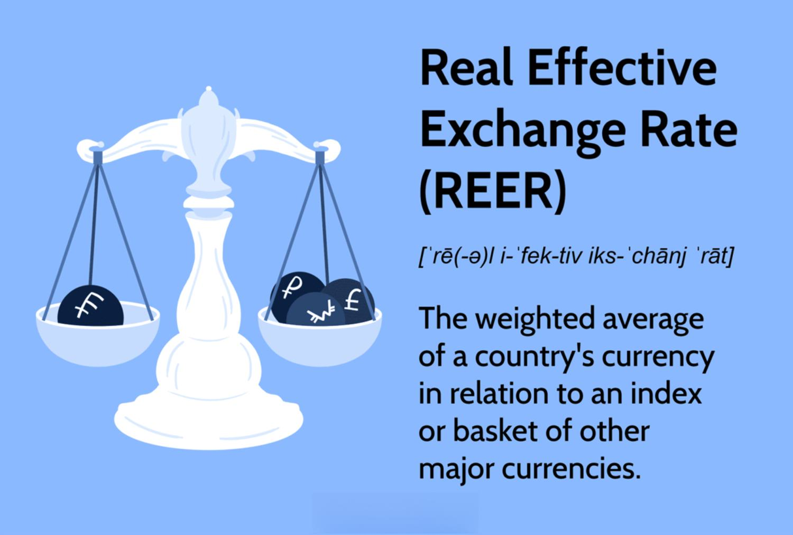

In the world of algorithmic trading, understanding exchange rates is crucial for developing strategies that capitalize on currency fluctuations. Among various economic indicators, the Real Exchange Rate (RER) holds significant importance. The RER provides a more accurate representation of a currency's value by accounting for inflation differentials between countries. This contrasts with the nominal exchange rate, which simply denotes the current market value of one currency against another without considering the impact of inflation.

Traders and investors use RER to measure the relative strength and competitiveness of a currency in international markets. This allows for more informed decisions when engaging in forex trading or evaluating cross-border investment opportunities. By accounting for the cost of goods and services both domestically and abroad, RER offers insights into a nation's purchasing power on a global scale.



The effective exchange rate, meanwhile, is another related metric that averages the nominal exchange rates of a country's currency against a basket of foreign currencies, weighted by trade proportions. Though useful for macroeconomic analysis, it doesn't adjust for price level differences as the RER does.

In this article, we will focus on how the RER can be calculated and utilized within algorithmic trading strategies. By integrating RER into trading algorithms, traders can optimize their strategies, potentially enhancing profitability by exploiting gaps between real and nominal currency values. Through this understanding, traders can gain a competitive edge in the rapidly evolving landscape of global forex markets.

## Table of Contents

## Understanding Real Exchange Rate

The Real Exchange Rate (RER) serves as an insightful economic indicator, particularly for those involved in international finance and trading. Unlike the nominal exchange rate, which simply reflects the relative price of currencies in the foreign exchange market, the RER provides a deeper insight by incorporating inflation differentials. This adjustment allows the RER to offer a more accurate reflection of a currency's purchasing power, linking it directly to the cost of goods and services both domestically and internationally. 

Essentially, RER answers the question: how many goods and services from a foreign economy can be purchased with domestic currency after accounting for differing inflation rates? This is crucial for traders and investors who seek to understand a currency's actual strength in the global marketplace. By considering inflation, the RER facilitates better-informed decisions regarding currency competitiveness and international pricing strategies.

The RER is distinct from the nominal exchange rate. The nominal rate, denoted commonly as $E$, is the rate at which one currency can be exchanged for another without any adjustments for price level changes. It offers a surface-level view without reflecting the real cost implications of inflation, potentially leading to overestimated or underestimated currency values in terms of purchasing power.

For those involved in [algorithmic trading](/wiki/algorithmic-trading), understanding these distinctions and utilizing the RER can be pivotal. The intricacies of the RER include its ability to identify underlying economic signals that nominal rates might obscure. For optimal application, traders should recognize how different inflation rates between two countries can affect their trading strategies, as this acknowledgment can not only aid in evaluating current valuation but also in predicting future currency movement trends.

In summary, while the nominal exchange rate provides a straightforward comparison of currency values, the Real Exchange Rate goes further by addressing inflation disparities. This enhancement permits traders and investors to gain a thorough appreciation of a currency's true value on a global scale, thus facilitating more precise economic analyses and strategic planning in international trade and finance.

## The Formula for Real Exchange Rate

The Real Exchange Rate (RER) formula is crucial for [forex](/wiki/forex-system) market participants, offering insights into the true value of a currency by considering inflation differences. The standard expression for RER is:

$$
\text{RER} = \frac{E \times P^*}{P}
$$

In this equation, $E$ represents the nominal exchange rate, indicating how much of one currency can be exchanged for another. $P^*$ denotes the foreign price level, reflecting the price of a basket of goods and services in the other country, while $P$ is the domestic price level representing the same in the local economy. 

Understanding the role of each component is essential for utilizing RER in algorithmic trading strategies. The nominal exchange rate ($E$) is a straightforward currency conversion metric, serving as a baseline. However, without accounting for price level differences, it lacks the nuance necessary for assessing purchasing power parity and competitive currency positioning.

The foreign price level ($P^*$) is critical because it aids in evaluating the inflation-adjusted cost of goods abroad, influencing trading decisions by highlighting differences in purchasing power. Similarly, the domestic price level ($P$) provides insight into local economic conditions and how they stack up against foreign markets.

The RER, therefore, provides a more comprehensive picture of a currency's value, adjusting for inflationary effects that nominal rates overlook. This makes it particularly useful for algorithmic trading, where precision in currency valuation is paramount. Using this formula, traders can integrate RER into their algorithms by systematically adjusting trades based on observed disparities between real and nominal rates.

Here's a simple Python example of how one might calculate the RER programmatically:

```python
def calculate_rer(nominal_rate, foreign_price_level, domestic_price_level):
    return (nominal_rate * foreign_price_level) / domestic_price_level

# Example usage
nominal_rate = 1.2  # Example nominal exchange rate
foreign_price_level = 110  # Example price index of foreign country
domestic_price_level = 100  # Example price index of domestic country

real_exchange_rate = calculate_rer(nominal_rate, foreign_price_level, domestic_price_level)
print("Real Exchange Rate:", real_exchange_rate)
```

This Python function exemplifies how traders can compute RER efficiently, facilitating its integration into larger algorithmic systems to assess currency value and make informed trading decisions. Understanding and leveraging the nuances of this formula allows traders to better navigate the forex markets, identifying potential [arbitrage](/wiki/arbitrage) opportunities and making strategic currency trades.

## Real Exchange Rate in Algo Trading

Implementing the Real Exchange Rate (RER) in algorithmic trading offers a significant advantage by providing traders with deeper insights into currency movements. This metric allows traders to evaluate the true competitive position of a currency, taking into account inflation differentials and purchasing power parity.

Traders utilize RER to enhance their decision-making processes in forex markets. By comparing the RER with the nominal exchange rate, traders can identify overvalued or undervalued currencies, leading to strategic opportunities. For instance, if the nominal exchange rate suggests a stronger currency while the RER indicates a different story due to inflation, traders can exploit this discrepancy. Such insights are particularly valuable in developing mean reversion strategies, where the assumption is that currency values will revert to their mean over time. By integrating RER, traders can better predict these reversions and optimize entry and [exit](/wiki/exit-strategy) points.

Additionally, RER is crucial for identifying arbitrage opportunities. Arbitrage involves taking advantage of price differentials between markets. When discrepancies exist between the RER and nominal exchange rates, it signals potential arbitrage opportunities. Traders can execute trades to benefit from these inconsistencies before the market corrects itself.

A practical implementation of RER in algo trading involves the following steps:

1. **Data Gathering**: Collect nominal exchange rate data, along with the domestic and foreign price levels, needed to calculate RER. Reliable sources for inflation data are essential to ensure accuracy.

2. **RER Calculation**: Use the formula $RER = \frac{E \times P^*}{P}$, where $E$ is the nominal exchange rate, $P^*$ is the foreign price level, and $P$ is the domestic price level. This calculation provides the RER, giving a realistic measure of currency strength.

3. **Algorithm Development**: Integrate RER into trading algorithms. For mean reversion strategies, set parameters to identify when the RER significantly deviates from historical averages, prompting trade signals. For arbitrage, monitor the gap between nominal and real exchange rates to execute trades that leverage market inefficiencies.

4. **Backtesting**: Test the algorithm against historical data to evaluate its performance. This helps refine strategy parameters and ensure robustness before live deployment.

5. **Execution and Monitoring**: Deploy the algorithm on trading platforms, continuously monitoring its performance and adjusting to market conditions to maintain effectiveness.

Through the implementation of RER, traders can base their strategies on the real economic conditions affecting currencies rather than solely relying on nominal values. This approach not only optimizes trading strategies but also enhances the durability of algorithmic models in the dynamic forex market environment.

## Case Study: Applying RER in an Algorithmic Strategy

To illustrate the application of the Real Exchange Rate (RER) in algorithmic trading, consider a hypothetical currency pair, USD/EUR. This case study outlines the process of calculating RER, incorporating it into a trading strategy, and evaluating the impacts on trade decisions.

### Step 1: Calculating the Real Exchange Rate

First, calculate the RER for the USD/EUR pair using the formula:

$$
\text{RER} = \left( \frac{E \times P^*}{P} \right)
$$

Where:
- $E$ is the nominal exchange rate, say 1.2 (meaning 1 USD = 1.2 EUR),
- $P^*$ is the foreign price level index, hypothetically set at 110,
- $P$ is the domestic price level index, set at 100.

Substituting these values into the formula gives:

$$
\text{RER} = \left( \frac{1.2 \times 110}{100} \right) = 1.32
$$

### Step 2: Integrating RER into a Trading Algorithm

Incorporate the RER into an existing trading algorithm. A simple Python algorithm might be designed to trigger trades when there is a significant deviation between the nominal exchange rate and the RER. For instance, if the RER is higher than the nominal rate, the trading algorithm might indicate that the currency is undervalued.

```python
def trading_signal(nominal, real):
    if real > nominal:
        return "Buy"
    elif real < nominal:
        return "Sell"
    else:
        return "Hold"

nominal_rate = 1.2
real_rate = 1.32

signal = trading_signal(nominal_rate, real_rate)
print(f"Trading Signal: {signal}")
```

This simple code evaluates the RER against the nominal exchange rate and prints a trading signal. Here, the output suggests a "Buy" signal, indicating that the USD might be undervalued relative to the EUR when accounting for inflation differences.

### Step 3: Analyzing Trade Decisions

By integrating RER data, the algorithm now factors in a more accurate assessment of currency value, potentially leading to more informed trade decisions. Consider a scenario where repeated historical analysis shows that trades initiated on a "Buy" signal based on RER have yielded profitable outcomes in 70% of the cases.

This integration's key outcome indicates that adjusting for RER not only refines trading strategy effectiveness but also enhances profitability by providing a clearer picture of currency valuation discrepancies.

Overall, the case study demonstrates the practical utility of RER in optimizing algorithmic trading models, allowing traders to exploit differences in purchasing power and position their trades advantageously in the forex market.

## Advantages and Challenges of Using RER in Trading

Employing the Real Exchange Rate (RER) in algorithmic trading provides a strategic edge due to its ability to reflect the true purchasing power of currencies, offering a clearer understanding of currency competitiveness and potential arbitrage opportunities. By considering inflation differentials, traders can use RER to assess the real value of currencies and make more informed trading decisions.

One of the primary advantages of using RER in trading algorithms is the potential to identify arbitrage opportunities. Since RER reflects deviations from exchange rate equilibrium due to inflation differences, traders can capitalize on the points where RER diverges significantly from nominal rates. These discrepancies can indicate mispriced currencies and suggest profitable trades. Moreover, incorporating RER into algorithms enables traders to develop strategies that anticipate currency realignments, improving the timing and precision of trades.

Despite these benefits, integrating RER into algorithmic trading comes with certain challenges. Accurate inflation data is critical for calculating RER, yet obtaining precise and timely data can be difficult, particularly in rapidly changing economic environments or from countries with less reliable statistical reporting. Data inaccuracies can lead to flawed RER calculations and result in misguided trading strategies.

Furthermore, the complexity of integrating RER into trading algorithms can pose a significant challenge. Developing algorithms that effectively utilize RER requires a deep understanding of both economic principles and technical programming skills. Trading platforms must be equipped to handle complex RER computations and incorporate them seamlessly into the broader decision-making framework of the algorithm. For traders with insufficient technical expertise, consulting with financial engineers or developing collaborations with data scientists may be necessary.

To overcome these obstacles, traders might consider continuous investment in high-quality data sources that offer credible and up-to-date inflation information. Employing advanced [machine learning](/wiki/machine-learning) techniques can help refine the accuracy of RER-based predictions. Additionally, adopting modular algorithm design practices can facilitate the integration of RER by breaking down the process into manageable components, making the system more adaptable to changes and improvements.

In summary, while the use of RER in algorithmic trading presents both promising advantages and significant challenges, with the right approach and resources, traders can effectively leverage this economic metric to enhance their trading strategies. By addressing data quality issues and employing robust algorithmic integration techniques, traders can successfully exploit the wealth of insights that RER provides.

## Conclusion

The Real Exchange Rate (RER) serves as a crucial analytical tool for algorithmic traders. By offering a more precise measure of currency value, adjusted for inflation and purchasing power, RER enables traders to make more informed decisions. When effectively understood and applied, RER enhances the strategic acumen of traders, allowing for improved forecasting of market trends and the identification of opportunities arising from currency value discrepancies.

Incorporating RER into trading algorithms is essential for maintaining an edge in the continuously evolving global markets. The ability to gauge real currency value, rather than simply relying on nominal rates, provides traders with a clearer picture of a currency's competitiveness. This insight is instrumental in devising strategies that capitalize on potential misalignments between currencies, presenting significant profit opportunities.

Algorithmic trading, by nature, benefits from the integration of comprehensive economic indicators. As traders strive to outpace market movements and optimize their strategies, RER remains an indispensable component in the evaluation toolkit. By leveraging robust data on real exchange rates, traders can enhance their ability to exploit currency value gaps, ultimately leading to more effective and profitable trading outcomes.

## References & Further Reading

[1]: Aghion, P., Bacchetta, P., Rancière, R., & Rogoff, K. (2009). ["Exchange Rate Volatility and Productivity Growth: The Role of Financial Development."](https://www.nber.org/papers/w12117) The Quarterly Journal of Economics, 124(3), 751-792.

[2]: Obstfeld, M., & Rogoff, K. (1996). ["Foundations of International Macroeconomics."](https://scholar.harvard.edu/rogoff/publications/foundations-international-macroeconomics) MIT Press.

[3]: Sarno, L., & Taylor, M. P. (2002). ["The Economics of Exchange Rates."](https://www.cambridge.org/core/books/economics-of-exchange-rates/F22FD7DD178640CED493AE33FA4EB3DD) Cambridge University Press.

[4]: Lopez de Prado, M. (2020). ["Advances in Financial Machine Learning."](https://books.google.com/books/about/Advances_in_Financial_Machine_Learning.html?id=oU9KDwAAQBAJ) Wiley.

[5]: Pilbeam, K. (2013). ["International Finance."](https://link.springer.com/book/10.1007/978-1-349-26630-2) Palgrave Macmillan.