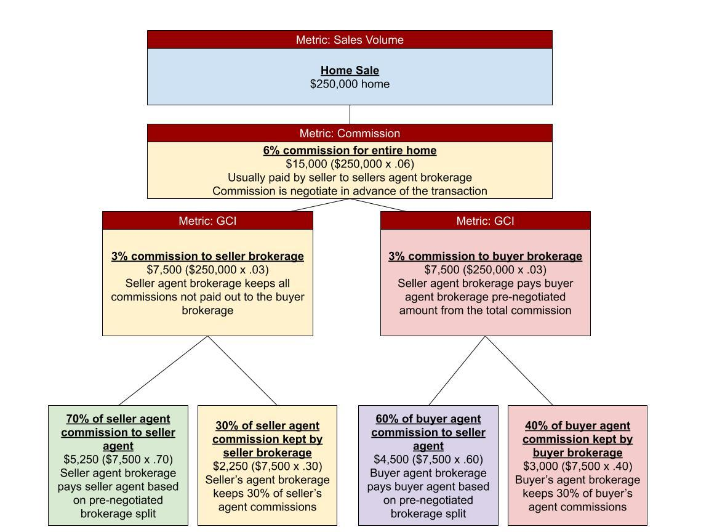

## Table of Contents

## What is a real estate agent?

A real estate agent is a person who helps people buy, sell, or rent homes and other properties. They know a lot about the houses and buildings in their area and can help you find the right place for you. They also help you understand the process of buying or selling a home, which can be very complicated.

Real estate agents work for a real estate company and are paid through commissions. This means they earn money when they help someone buy or sell a property. They do many things like showing houses to buyers, helping sellers set a good price for their home, and handling all the paperwork needed to complete a sale.

## What are the primary roles of a real estate agent?

A real estate agent's main job is to help people buy, sell, or rent homes and other properties. They work with buyers to find the right home by showing them different houses and giving them information about the area. They also help buyers understand the buying process, which can be hard to figure out on your own. Real estate agents know a lot about the local market, so they can tell buyers if a house is a good deal or not.

When it comes to selling, real estate [agents](/wiki/agents) help homeowners set a good price for their home. They use their knowledge of the local market to make sure the price is right. They also list the home on websites and in other places where people looking to buy a home can see it. Once a buyer is interested, the agent helps with all the paperwork and negotiations to make sure the sale goes smoothly. They work hard to make sure both buyers and sellers are happy with the deal.

## How does a real estate agent assist in buying a property?

A real estate agent helps a lot when you want to buy a home. They know a lot about the area where you want to live. They can show you different houses and tell you about the good and bad things about each one. They also know how much homes usually cost in that area, so they can help you find a good deal. When you find a house you like, the agent will help you make an offer to the seller.

Once your offer is accepted, the real estate agent does a lot of work to help you buy the home. They will help you with all the paperwork, which can be really confusing. They make sure everything is done right and on time. They also talk to the seller's agent to make sure everyone agrees on the price and other details. In the end, they help you get to the closing, where you finally get the keys to your new home.

## How does a real estate agent help in selling a property?

A real estate agent helps a lot when you want to sell your home. They start by helping you set a good price for your house. They know what other homes in your area are selling for, so they can make sure you don't ask for too much or too little. Once you agree on a price, the agent will list your home on websites and other places where people looking to buy a home can see it. They also take good photos and write a nice description to make your home look its best.

When people start coming to see your home, the real estate agent will be there to show it to them. They know how to make your home look nice and answer any questions buyers might have. If someone wants to buy your home, the agent will help you talk to them about the price and other details. They will make sure you get the best deal possible. They also handle all the paperwork, which can be really hard to do on your own. They make sure everything is done right and on time, so you can sell your home without any problems.

## What qualifications are needed to become a real estate agent?

To become a real estate agent, you need to meet certain qualifications. First, you need to be at least 18 years old and have a high school diploma or equivalent. Then, you have to take a pre-licensing [course](/wiki/best-algorithmic-trading-courses), which teaches you about real estate laws, contracts, and other important things. After finishing the course, you need to pass a real estate licensing exam. This exam tests what you learned in the course and makes sure you know enough to help people buy and sell homes.

Once you pass the exam, you need to find a real estate brokerage to work with. A brokerage is a company that employs real estate agents. They will help you get your license and start working. You also need to keep learning even after you get your license. Many places require you to take continuing education classes to stay up to date on real estate laws and practices. This helps you be the best agent you can be and keep helping people find their dream homes.

## What is the typical commission structure for real estate agents?

Real estate agents usually earn money through commissions. This means they get paid a percentage of the price of the home when it is sold. In the United States, the typical commission is around 5% to 6% of the home's sale price. This commission is often split between the agent who represents the seller and the agent who represents the buyer. So, if a home sells for $300,000 with a 6% commission, the total commission would be $18,000, and each agent might get around $9,000, though the exact split can vary.

The commission is usually paid by the seller at the time of closing. This means the seller pays the full commission, but it is often factored into the sale price of the home. Sometimes, the commission rate can be negotiated between the seller and their agent. If the commission is lower, it might make the home more attractive to buyers because it could mean a lower sale price. However, even with negotiations, the standard range of 5% to 6% is very common in the real estate industry.

## How do real estate agents negotiate deals?

Real estate agents are good at negotiating deals because they know how to talk to people and understand what they want. When they help someone buy a home, they talk to the seller's agent to find a price that works for everyone. They listen to what the buyer wants and try to get the best deal possible. They also know a lot about the local market, so they can tell if a price is fair or not. This helps them make good offers and get the home for a good price.

When they help someone sell a home, real estate agents talk to the buyer's agent to get the best price for the seller. They know how to make the home look good and explain why it's worth the price they're asking. They listen to what the buyer wants and try to find a price that everyone is happy with. They also handle all the back-and-forth talking, so the seller doesn't have to worry about it. In the end, their job is to make sure both the buyer and seller feel good about the deal.

## What are the differences between a real estate agent, a broker, and a Realtor?

A real estate agent is someone who helps people buy, sell, or rent homes. They need to pass a licensing exam and work for a real estate company. A real estate broker is someone who has more education and experience than an agent. They can own their own real estate company and hire agents to work for them. Brokers have more responsibility and can handle more complicated parts of real estate deals. Both agents and brokers need to keep learning to stay licensed.

A Realtor is a special kind of real estate agent or broker. They are members of the National Association of Realtors (NAR), which is a big group that has rules about how its members should act. Realtors follow a strict code of ethics, which means they have to be honest and fair to everyone they work with. Not all real estate agents or brokers are Realtors, but all Realtors are either agents or brokers. So, being a Realtor means you are part of a group that promises to do things the right way.

## How can a real estate agent maximize their earnings?

A real estate agent can make more money by working hard and being good at their job. They can do this by helping more people buy and sell homes. The more deals they close, the more commission they earn. They can also try to sell more expensive homes because the commission is a percentage of the sale price. So, a $500,000 home will earn them more money than a $200,000 home. They can also look for ways to get more clients, like using social media or going to community events to meet new people.

Another way to make more money is by being really good at negotiating. If they can help buyers get a lower price or help sellers get a higher price, they can earn more money. They can also learn about different areas and types of homes so they can help more people find what they need. Some agents also become brokers, which means they can own their own business and hire other agents to work for them. This can help them make even more money because they get a share of the commissions from the agents they hire.

## What are the legal and ethical responsibilities of a real estate agent?

Real estate agents have to follow the law when they help people buy and sell homes. They need to know all the rules about buying and selling property in their area. They also have to be honest and fair. This means they can't lie about a home or hide important information. They have to tell buyers and sellers everything they need to know to make good decisions. If they don't follow the law, they can get in big trouble and lose their license.

Besides following the law, real estate agents also have to act in an ethical way. This means they should always do what is best for their clients, even if it's not the easiest thing to do. They should treat everyone the same, no matter who they are. They also have to keep private information secret and not share it with others. Being ethical helps real estate agents build trust with their clients and keeps the real estate business fair for everyone.

## How do market conditions affect a real estate agent's role and compensation?

Market conditions can change how a real estate agent does their job and how much money they make. When the market is good and lots of people want to buy and sell homes, agents are very busy. They have more clients and can close more deals. This means they make more money because they earn a commission every time they help someone buy or sell a home. In a good market, homes sell quickly, so agents can help more people in a shorter time. They might also be able to help sellers get higher prices for their homes, which means more money for the agent too.

But when the market is not so good, it can be harder for real estate agents. Fewer people might want to buy or sell homes, so agents have fewer clients. Homes might take longer to sell, so agents don't close as many deals. This means they make less money because they earn less commission. In a slow market, agents might have to work harder to find clients and help them get good deals. They might also have to be very patient and help sellers lower their prices to attract buyers. So, market conditions can really change how busy an agent is and how much money they make.

## What advanced strategies can real estate agents use to enhance their service and increase their income?

Real estate agents can use advanced strategies to make their service better and earn more money. One way is by using technology to reach more people. They can use social media and websites to show off homes they are selling. They can also use special computer programs to help them find the right homes for buyers quickly. Another way is by learning more about different types of homes and neighborhoods. This helps them help more kinds of clients, like people who want to buy big houses or small apartments. They can also learn how to help clients who want to invest in real estate, which can lead to bigger deals and more money.

Another strategy is to build strong relationships with their clients. Real estate agents can do this by always being honest and helpful. They can also keep in touch with past clients to see if they want to buy or sell again. This can lead to more deals over time. Agents can also work with other professionals, like lawyers and home inspectors, to make the buying and selling process smoother. By teaming up with these experts, agents can offer a better service to their clients. This makes clients happier and more likely to tell their friends about the agent, which can bring in more business.

## References & Further Reading

[1]: National Association of Realtors (NAR). ["Code of Ethics & Standards of Practice."](https://www.nar.realtor/about-nar/governing-documents/code-of-ethics/2024-code-of-ethics-standards-of-practice)

[2]: Horan, S. M., Sanders, A. B., & Wood, S. F. (2001). ["The role of real estate agents in the home buying process."](https://www.researchgate.net/publication/232984061_Understanding_Emotional_Response_Theory_The_Role_of_Instructor_Power_and_Justice_Messages) Journal of Housing Research.

[3]: Bajari, P., & Benkard, C. L. (2005). ["Demand estimation with heterogeneous consumers and unobserved product characteristics: A hedonic approach."](https://www.nber.org/papers/w10278) The Review of Economic Studies.

[4]: Glaeser, E. L., & Kallal, H. D. (1997). ["Property transactions and information in the real estate market."](https://www.semanticscholar.org/paper/Growth-in-Cities-Glaeser-Kallal/60eb5b02285e89211554be2e89674e739c7dd537) Journal of Urban Economics.

[5]: Carr, N. G. (2003). ["IT doesn't matter."](https://hbr.org/2003/05/it-doesnt-matter) Harvard Business Review.