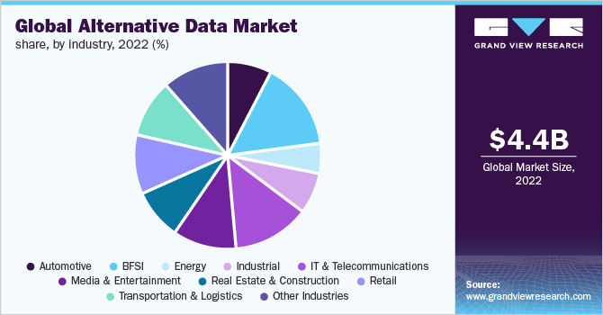

## Table of Contents

## What is alternative data in real estate?

Alternative data in real estate refers to information that is not typically found in traditional real estate reports or databases. This can include data from sources like satellite imagery, social media trends, credit card transactions, and mobile phone location data. By using alternative data, real estate professionals can gain new insights into property values, neighborhood trends, and market dynamics that are not visible through conventional data sources.

For example, satellite imagery can help track construction progress or changes in land use, which can be valuable for predicting future property values. Social media trends might reveal which neighborhoods are becoming popular or what amenities people are looking for in a home. This kind of data helps real estate investors and analysts make more informed decisions by providing a fuller picture of the market.

## How does alternative data differ from traditional real estate data?

Traditional real estate data usually comes from sources like government records, real estate listings, and market reports. This data includes things like home prices, sales records, property taxes, and demographic information. It's the kind of data that real estate agents and analysts have used for a long time to understand the market and make decisions.

Alternative data, on the other hand, comes from newer and often unexpected sources. This can include data from satellite images, social media posts, credit card spending, and even mobile phone locations. This type of data can show things like how often people visit a shopping center, what people are saying about a neighborhood online, or how construction projects are progressing. By using alternative data, real estate professionals can see trends and patterns that traditional data might miss, giving them a more complete picture of the market.

## What are some common sources of alternative data for real estate?

Alternative data for real estate comes from many different places. One common source is satellite imagery, which can show how buildings and neighborhoods are changing over time. This can help people see new construction or changes in how land is being used. Another source is social media, where people talk about their neighborhoods and what they like or don't like about them. This can give clues about which areas are becoming popular or what kinds of homes people want.

Credit card transactions are also a big source of alternative data. By looking at where people are spending their money, real estate professionals can learn about the health of local businesses and how much people are willing to spend in different areas. Mobile phone location data is another useful source. It can show how often people visit certain places, like shopping centers or parks, which can help predict how valuable a property might be.

These sources of alternative data give real estate professionals a lot of new information that they can't get from traditional data. By using this data, they can make better guesses about where the market is heading and what kinds of properties will be in demand.

## How can alternative data be used to predict real estate market trends?

Alternative data can help predict real estate market trends by giving us new information that traditional data doesn't show. For example, satellite images can show if new buildings are going up or if old ones are being torn down. This can tell us which areas are growing and might become more valuable in the future. Social media can also help by showing what people are saying about different neighborhoods. If a lot of people are talking about a new restaurant or park, it might mean that area is getting more popular, which could make property values go up.

Another way alternative data helps is by looking at credit card spending and mobile phone location data. If people are spending a lot of money in a certain area, it might mean that the local economy is doing well, which can make real estate more valuable. Mobile phone data can show how often people visit places like shopping centers or parks. If a lot of people are going to a certain area, it might become a hot spot for real estate. By using all this different kinds of data, real estate professionals can see patterns and trends that help them guess where the market is heading.

## What are the benefits of using alternative data in real estate investment?

Using alternative data in real estate investment can give investors a big advantage. It lets them see things that other investors might miss. For example, satellite images can show if a new shopping center is being built, which might make nearby homes more valuable. Social media can tell investors what people think about a neighborhood, like if it's becoming popular or if people are complaining about something. This information can help investors buy properties in areas that are about to get more valuable.

Another benefit is that alternative data can help investors understand the local economy better. By looking at credit card spending, investors can see if people in an area are spending a lot of money, which might mean the area is doing well. Mobile phone location data can show how often people visit certain places, like parks or shopping centers. If a lot of people are going to an area, it might be a good place to invest in real estate. By using all this different kinds of data, investors can make smarter choices and maybe make more money.

## What are the challenges and limitations of using alternative data in real estate?

Using alternative data in real estate can be tricky because it's not always easy to get and use. For example, getting satellite images or mobile phone data can be expensive and hard to understand. You might need special skills or tools to make sense of it all. Also, the laws about using this kind of data can be different in different places, so you have to be careful to follow the rules.

Another challenge is that alternative data can be messy and hard to trust. Sometimes the data might not be complete or accurate, which can make it hard to use for making decisions. For example, social media posts can be all over the place, and it's tough to know if they really show what people think about a neighborhood. Also, because alternative data is new, there isn't a lot of history to compare it with, so it's harder to know if the trends you see will last.

Even with these challenges, alternative data can still be very helpful. But it's important to use it along with traditional data, not instead of it. By combining both types of data, real estate investors can get a fuller picture of the market and make better choices.

## How can real estate professionals access and analyze alternative data?

Real estate professionals can access alternative data from different sources. Companies like satellite imagery providers, social media platforms, and data brokers sell this kind of data. Sometimes, real estate professionals can buy this data directly, or they might work with data analytics companies that collect and organize alternative data for them. These companies often have special tools and skills to help make sense of the data.

Analyzing alternative data can be tricky because it's different from the usual real estate data. Real estate professionals might need to learn new skills or use special software to understand it. They can look at satellite images to see new buildings or changes in neighborhoods. They can use social media to see what people are saying about different areas. And they can look at credit card spending and mobile phone data to see where people are going and spending money. By putting all this information together, real estate professionals can see new trends and make better decisions.

## What role does technology play in the utilization of alternative data in real estate?

Technology is really important for using alternative data in real estate. It helps real estate professionals get and understand data from places like satellite images, social media, and credit card spending. Special tools and software can take all this different data and put it together in a way that makes sense. This means real estate professionals can see new things about the market that they couldn't see before. Technology also helps make the data easier to use, so even people who aren't experts in data can still get valuable information from it.

For example, satellite imagery can be used to track construction progress or changes in land use, but it takes special software to turn those images into useful information. Social media data can be messy and hard to understand, but technology can sort through all the posts and find trends and patterns. Without technology, it would be really hard to use alternative data to make smart decisions about real estate. By using technology, real estate professionals can get a better picture of the market and make choices that might help them make more money.

## Can you provide examples of successful real estate investments driven by alternative data?

A real estate company used satellite images to see that a new shopping center was being built in a small town. They bought homes near the shopping center before it opened. When the shopping center started bringing in lots of people, the value of those homes went up a lot. The company made a good profit because they used the satellite data to see the future value of the area.

Another example is when an investor looked at social media to see what people were saying about a neighborhood. They saw that a lot of people were talking about how cool the new art district was becoming. The investor bought some old buildings in that area and turned them into apartments and shops. As the art district got more popular, the value of those buildings went up, and the investor made a lot of money.

## How do regulations impact the use of alternative data in real estate?

Regulations can make it hard to use alternative data in real estate. Different places have different rules about what kind of data you can use and how you can use it. For example, some countries have strict laws about using personal information from social media or credit card spending. Real estate professionals have to be careful to follow these rules, or they might get in trouble. This can make it harder to get the data they need or use it in the way they want.

Even with these challenges, regulations are important because they protect people's privacy and make sure data is used fairly. Real estate professionals need to stay up-to-date with the rules in the areas where they work. By doing this, they can use alternative data in a way that's both helpful and legal. This means they might need to work with lawyers or data experts to make sure they're doing everything right.

## What future trends can we expect in the use of alternative data for real estate?

In the future, we can expect to see more and more real estate professionals using alternative data to make decisions. As technology gets better, it will be easier to get and use this kind of data. For example, new tools might help us understand satellite images even better, so we can see small changes in neighborhoods that could affect property values. Also, social media platforms might give us more ways to look at what people are saying about different areas. This will help real estate investors see trends before other people do, so they can buy properties that will go up in value.

Another trend we might see is the use of artificial intelligence (AI) to make sense of alternative data. AI can look at a lot of data very quickly and find patterns that humans might miss. This could mean that real estate professionals will be able to predict market trends even better than they can now. But, as more people use alternative data, there will also be more rules about how to use it. This means real estate professionals will need to keep learning about new technologies and regulations to use alternative data in the best way possible.

## How can alternative data be integrated into existing real estate analysis models?

Alternative data can be added to the usual ways real estate professionals look at the market. They can use special tools and software to mix alternative data with the traditional data they already use. For example, they might add satellite images to see new buildings or changes in neighborhoods, or look at social media to see what people think about an area. By putting all this information together, real estate professionals can get a fuller picture of the market. They can see things that might not show up in the usual data, like new trends or changes in how people use an area.

To make this work well, real estate professionals need to learn how to use the new tools and understand the new kinds of data. They might need to work with data experts or use special software to make sense of it all. But once they get the hang of it, they can use alternative data to make better guesses about where the market is going. This can help them make smarter choices about buying and selling properties, and maybe make more money in the end.

## References & Further Reading

[1]: Pan, L., & Zhang, J. (2020). ["Using Alternative Data to Analyze the Economy: Opportunities and Challenges"](https://www.sciencedirect.com/science/article/pii/S0926580520310979). Research in International Business and Finance.

[2]: ["Satellite Imagery in Real Estate: Understanding Its Potential in Offering Competitive Insights"](https://zoom.earth/maps/satellite-hd/) by Nature Research.

[3]: ["Advances in Financial Machine Learning"](https://www.amazon.com/Advances-Financial-Machine-Learning-Marcos/dp/1119482089) by Marcos Lopez de Prado

[4]: Hendershott, T., & Riordan, R. (2013). ["Algorithmic Trading and Information"](https://www.jstor.org/stable/43303831). The Review of Financial Studies.

[5]: ["Sentiment Analysis for Financial Markets"](https://dl.acm.org/doi/abs/10.1145/3649451) edited by Gabriele Roventini and Mauro Gallegati.