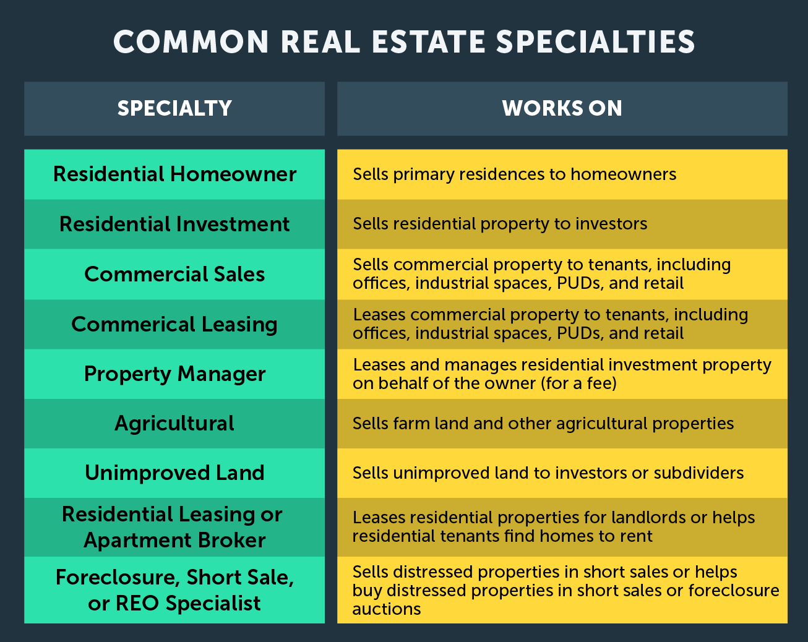

## Table of Contents

## What is a real estate consultant?

A real estate consultant is someone who helps people buy, sell, or rent properties. They know a lot about the real estate market and can give good advice to their clients. They work with people who want to find the right home, invest in property, or get the best price for their house.

Real estate consultants also do a lot of research to understand what is happening in the market. They look at things like how much houses cost, how fast they are selling, and what people want in a home. This helps them give the best advice to their clients. They also help with all the paperwork and legal stuff that comes with buying or selling a property, making the process easier and less stressful.

## How does a real estate consultant differ from a real estate agent?

A real estate consultant and a real estate agent both help people with buying, selling, or renting properties, but they have some key differences. A real estate agent usually works for a real estate company and focuses on the transaction part of the process. They help clients find properties, show them around, and handle the paperwork to close the deal. Agents often work on commission, which means they get paid when a sale is completed.

On the other hand, a real estate consultant often provides a more personalized and strategic service. They might work independently or with a firm, but their main job is to give expert advice and guidance. Consultants look at the big picture, helping clients with long-term goals like investment strategies or finding the perfect home that fits their lifestyle. They might charge a flat fee or an hourly rate, rather than just a commission.

In summary, while a real estate agent is more focused on the immediate transaction, a real estate consultant offers a broader, more tailored approach to help clients achieve their real estate goals over time. Both roles are important, but they serve different needs in the real estate market.

## What are the main types of real estate consultants?

There are several types of real estate consultants, each focusing on different areas of the real estate market. One type is the residential real estate consultant, who helps people buy, sell, or rent homes. They know a lot about neighborhoods, schools, and what people want in a home. Another type is the commercial real estate consultant, who works with businesses looking to buy, sell, or lease office spaces, retail locations, or warehouses. They understand things like zoning laws and what businesses need in a property.

Another important type is the investment real estate consultant, who helps people make money from real estate. They give advice on buying properties to rent out or flip for profit. They look at things like how much money a property can make and how much it will cost to maintain. There are also relocation consultants, who help people move to a new area. They know a lot about different cities and can help find a home that fits someone's needs in a new place.

Lastly, there are property management consultants, who help property owners take care of their investments. They can advise on how to keep tenants happy and how to make the most money from a property. Each type of consultant has special knowledge and skills that help clients in different ways.

## What qualifications are required to become a real estate consultant?

To become a real estate consultant, you usually need a real estate license. This means you have to take classes and pass a test to show you know about real estate laws and practices. Many states require you to be at least 18 years old and have a high school diploma or equivalent. After getting your license, it's a good idea to work as a real estate agent for a while to gain experience. This helps you learn how to handle transactions and understand what clients need.

Beyond the basic license, many real estate consultants get extra education and certifications. For example, you might take courses in investment strategies, property management, or commercial real estate. Some consultants also get certifications like the Certified Residential Specialist (CRS) or the Certified Commercial Investment Member (CCIM). These can make you stand out and show clients that you have special skills. Good communication and negotiation skills are also important, as you'll be working closely with clients to help them reach their goals.

## What services do real estate consultants typically offer?

Real estate consultants help people with many things related to buying, selling, or renting properties. They give advice on what kind of home or property is best for someone's needs and budget. They also help find the right property by looking at what's for sale or rent in different areas. Consultants know a lot about the market, so they can tell you if a price is fair and help you make a good deal.

They also help with the paperwork and legal stuff that comes with buying or selling a property. This can be hard to understand, so having a consultant makes it easier. They can also give advice on how to make money from real estate, like buying a property to rent out or fix up and sell for more money. Consultants can help with long-term plans, like where to invest or how to manage properties you already own.

## How do real estate consultants charge for their services?

Real estate consultants usually charge for their services in different ways. One common way is by taking a commission, which means they get a percentage of the sale price when a property is sold. This is often around 5-6% of the sale price, but it can be different depending on where you are and what kind of property it is. Another way consultants might charge is by the hour. They might ask for a certain amount of money for each hour they work, which can be good if you need help with something specific and don't want to pay a big commission.

Some real estate consultants also charge a flat fee for their services. This means they ask for a set amount of money no matter how long it takes to help you buy or sell a property. This can be good if you want to know exactly how much you'll have to pay. Sometimes, consultants might use a mix of these ways to charge, depending on what the client needs. Talking about how they charge upfront can help you understand what you'll have to pay and choose the best option for you.

## What are the benefits of hiring a real estate consultant over an agent?

Hiring a real estate consultant instead of an agent can give you more personalized help. Consultants look at your long-term goals and give you advice that fits your needs. They help you with things like investing in real estate or finding the perfect home that matches your lifestyle. They spend more time understanding what you want and less time just trying to sell you a property. This can make the whole process of buying or selling a home feel easier and more tailored to you.

Consultants also often have more knowledge about the market and can offer strategic advice. They look at trends and data to help you make smart choices. While [agents](/wiki/agents) focus on the transaction and getting a deal done, consultants think about the big picture. This means they can help you plan for the future, not just the immediate sale. Hiring a consultant might cost more upfront, but their deep understanding and personalized service can save you time and money in the long run.

## Can a real estate consultant help with both buying and selling properties?

Yes, a real estate consultant can help with both buying and selling properties. When you want to buy a home, a consultant can help you find the right property that fits your needs and budget. They know a lot about the market and can tell you if a price is fair. They also help with all the paperwork and legal stuff that comes with buying a home, making it easier for you.

When you want to sell your property, a real estate consultant can help you get the best price. They know how to make your home look good to buyers and can advise on the best time to sell. They handle the negotiations and all the steps needed to close the deal. So, whether you're buying or selling, a real estate consultant can make the process smoother and help you reach your goals.

## How does a real estate consultant assist in market analysis and property valuation?

A real estate consultant helps with market analysis by looking at a lot of information about the real estate market. They check things like how fast homes are selling, what prices are like, and what people want in a home. This helps them understand what's happening in the market right now and what might happen in the future. By knowing this, they can tell you if it's a good time to buy or sell and help you make smart choices.

When it comes to property valuation, a real estate consultant looks at a lot of details about your property. They think about things like how big the house is, what it looks like inside and out, and where it is located. They compare your property to others that have sold recently in the same area to figure out a fair price. This helps you know how much your home is worth if you want to sell it, or if you're buying, they can tell you if the price is right.

## What role does a real estate consultant play in investment strategies?

A real estate consultant helps people make smart choices about investing in properties. They look at what's happening in the market and use this information to suggest the best places and types of properties to invest in. They think about things like how much money a property can make from rent, how much it might go up in value, and what it will cost to keep the property in good shape. This helps people pick investments that fit their goals and how much risk they want to take.

Consultants also help plan for the long term. They can tell you when it might be a good time to buy or sell, and they help you understand how different investments might work together to grow your money over time. They can also give advice on managing your properties, like how to keep tenants happy and how to make the most money from your investments. By working with a consultant, you get personalized help that can make your investment strategy stronger and more successful.

## How can a real estate consultant help in navigating legal and regulatory issues?

A real estate consultant helps you understand the legal and regulatory stuff that comes with buying or selling a property. They know about the laws and rules in your area, so they can tell you what you need to do to follow them. For example, they can explain things like zoning laws, which say what you can do with a property, or how to handle paperwork like contracts and disclosures. This can make the process a lot easier because they help you avoid mistakes that could cause problems later.

Consultants also help you work with other people who are important in the process, like lawyers or inspectors. They can suggest good professionals to work with and help you understand what they are doing. This way, you know everything is being done right and you're protected. By having a consultant guide you through the legal and regulatory issues, you can feel more confident and less stressed about buying or selling a property.

## What are the advanced skills and technologies that top real estate consultants use?

Top real estate consultants use advanced skills like knowing a lot about the market and being good at talking to people. They can look at data and understand what it means for buying or selling properties. They also know how to negotiate well, which means they can help you get a good deal. They are good at planning and can help you make long-term investment strategies. They keep learning new things to stay ahead in their field, like taking courses or getting certifications.

These consultants also use technology to help them do their job better. They use special software to look at data and see what's happening in the market. They might use tools like geographic information systems (GIS) to understand more about different areas. They also use apps and websites to show properties to clients and help them make decisions. Some even use virtual reality to let clients see what a home might look like before it's built. By using these technologies, they can give better advice and make the process of buying or selling a property easier and faster.

## References & Further Reading

[1]: Lopez de Prado, M. (2018). ["Advances in Financial Machine Learning."](https://www.amazon.com/Advances-Financial-Machine-Learning-Marcos/dp/1119482089) Wiley.

[2]: Aronson, D. (2006). ["Evidence-Based Technical Analysis: Applying the Scientific Method and Statistical Inference to Trading Signals."](https://www.amazon.com/Evidence-Based-Technical-Analysis-Scientific-Statistical/dp/0470008741) Wiley.

[3]: Jansen, S. (2020). ["Machine Learning for Algorithmic Trading."](https://github.com/stefan-jansen/machine-learning-for-trading) Packt Publishing.

[4]: Chan, E. P. (2009). ["Quantitative Trading: How to Build Your Own Algorithmic Trading Business."](https://github.com/ftvision/quant_trading_echan_book) Wiley.

[5]: Bergstra, J., Bardenet, R., Bengio, Y., & Kégl, B. (2011). ["Algorithms for Hyper-Parameter Optimization."](https://dl.acm.org/doi/10.5555/2986459.2986743) Advances in Neural Information Processing Systems 24.