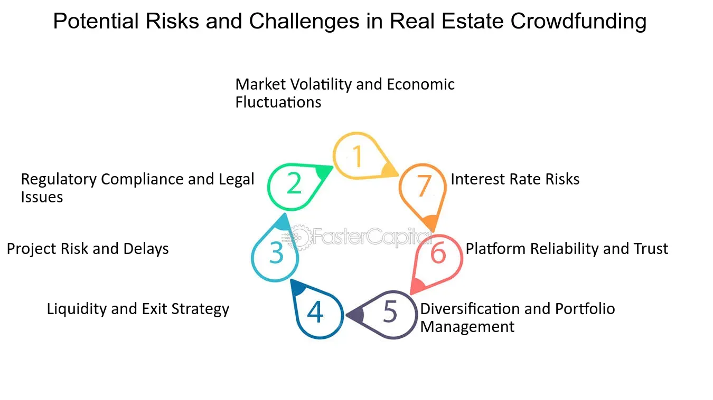

## Table of Contents

## What is real estate crowdfunding?

Real estate crowdfunding is a way for people to invest in property without having to buy a whole building by themselves. It works by pooling money from many investors to buy, develop, or manage real estate projects. This makes it possible for people who don't have a lot of money to still invest in real estate and possibly earn money from it.

There are different types of real estate crowdfunding. Some platforms let investors own a piece of a property, while others let investors lend money to real estate projects and earn interest. This can be a good way to diversify your investments, but it's important to understand the risks. Just like any investment, there's a chance you could lose money, so it's a good idea to do your research and maybe talk to a financial advisor before you start investing.

## How does real estate crowdfunding work?

Real estate crowdfunding works by bringing together a lot of people who want to invest in property. Instead of one person buying a whole building, many people can pool their money to buy it together. This means you can invest in real estate even if you don't have a lot of money. You can find a crowdfunding platform online, choose a project you like, and invest a small amount. The platform will handle the buying and managing of the property, and you'll own a piece of it based on how much you invested.

Once the property is bought, it can be rented out, sold for a profit, or developed further. If it's rented out, the rent money is shared among the investors. If the property is sold, the profit is also shared. Some platforms let you lend money to real estate projects instead of owning a piece of the property. In this case, you earn interest on your loan. Either way, real estate crowdfunding can be a way to make money from property without having to do all the work yourself. Just remember, like any investment, there are risks, so it's important to do your homework before you invest.

## What are the different types of real estate crowdfunding platforms?

Real estate crowdfunding platforms come in different types, mainly based on what they offer to investors. Some platforms focus on equity crowdfunding, where investors get to own a piece of the property. This means you're buying a share of the building, and if it does well, you get a part of the profits. These platforms are good if you want to be an owner and possibly make money from rent or selling the property later.

Other platforms specialize in debt crowdfunding, where investors lend money to real estate projects instead of owning them. In this case, you're more like a bank, giving a loan to the project and [earning](/wiki/earning-announcement) interest on it. This can be safer than equity crowdfunding because you get regular interest payments, but the returns might not be as high. Some platforms also offer a mix of both equity and debt options, giving investors more choices based on their goals and how much risk they're willing to take.

## What are the benefits of investing in real estate crowdfunding?

One big benefit of real estate crowdfunding is that it lets you invest in property without needing a lot of money. Instead of buying a whole building by yourself, you can join with other people to buy it together. This means you can own a piece of real estate even if you only have a little bit to invest. It's a good way to get started in real estate without having to save up a huge amount of money.

Another advantage is that real estate crowdfunding can help you spread out your investments. Instead of putting all your money into one thing, you can invest in different properties or projects. This can lower your risk because if one project doesn't do well, you still have other investments that might do better. Plus, you can choose from different types of real estate, like apartments, offices, or even land, which gives you more options to find something that fits your goals.

## What are the risks associated with real estate crowdfunding?

Real estate crowdfunding can be risky because there's a chance you might lose money. If the property doesn't do well, like if it can't find tenants or if its value goes down, you might not get back the money you invested. Also, real estate projects can take a long time to finish, so you might have to wait a while before you see any money from your investment. If the project fails, you could lose everything you put in.

Another risk is that real estate crowdfunding is still pretty new, so there are fewer rules to protect investors compared to other types of investments. This means you need to be careful about which platform you use and make sure they're trustworthy. Plus, because you're investing with other people, you don't have as much control over what happens with the property. If the people running the project make bad decisions, it can affect your investment, and there's not much you can do about it.

## How can someone start investing in real estate crowdfunding?

To start investing in real estate crowdfunding, you need to find a good platform online. There are many websites that let you invest in real estate, so take your time to look around and pick one that fits what you want. Once you've chosen a platform, you'll need to sign up and create an account. You might need to give some personal information and maybe even pass a quick background check, just to make sure everything is safe and legal.

After you're all set up, you can start looking at different real estate projects on the platform. Each project will have information about the property, how much money they need, and what kind of returns you might get. You can choose a project that looks good to you and decide how much money you want to invest. Once you've made your choice, you'll send the money through the platform, and they'll handle the rest. Just remember, it's a good idea to do your homework and maybe talk to a financial advisor before you start investing, so you understand the risks and rewards.

## What are the legal and regulatory considerations for real estate crowdfunding?

Real estate crowdfunding has some legal and regulatory considerations that you should know about. In the United States, the Securities and Exchange Commission (SEC) has rules to protect investors. One important rule is that crowdfunding platforms need to be registered with the SEC. This helps make sure the platforms are following the law and are safe to use. Another rule is that there are limits on how much you can invest in crowdfunding projects each year, depending on your income and how much money you have. This is to stop people from putting too much money into risky investments.

Also, different states might have their own rules about real estate crowdfunding. For example, some states require that the people running the crowdfunding projects be licensed real estate professionals. It's a good idea to check the rules in your state before you start investing. Plus, the tax rules for real estate crowdfunding can be complicated. You might have to pay taxes on any money you make from your investments, and the rules can change depending on whether you're investing in equity or debt crowdfunding. It's always smart to talk to a lawyer or a tax advisor to make sure you understand all the legal and tax stuff before you start investing.

## How does real estate crowdfunding compare to traditional real estate investing?

Real estate crowdfunding is different from traditional real estate investing because it lets you invest in property with less money. With traditional investing, you need a lot of money to buy a whole building by yourself. But with crowdfunding, you can join with other people to buy a property together. This means you can own a piece of real estate even if you don't have a lot to spend. Plus, crowdfunding platforms handle a lot of the work, like finding and managing the property, so you don't have to do everything yourself.

Another difference is that real estate crowdfunding can be riskier than traditional investing. When you buy a property yourself, you have more control over what happens to it. You can decide how to fix it up, who to rent it to, and when to sell it. But with crowdfunding, you're investing with other people, so you don't have as much say in what happens. Also, crowdfunding is still pretty new, so there are fewer rules to protect investors. This means you need to be careful and do your homework before you invest.

## What role does technology play in real estate crowdfunding?

Technology plays a big part in making real estate crowdfunding work. It helps bring together lots of people who want to invest in property but don't have enough money to buy a whole building themselves. Crowdfunding platforms use the internet to show off different real estate projects, so you can see all the details and decide which one you want to invest in. These platforms also use technology to handle all the money, making sure it gets from the investors to the project and back again if there are any profits. This makes the whole process easier and more open, so you can keep track of your investment without having to do everything yourself.

Another way technology helps is by making real estate crowdfunding more accessible. You can use your computer or phone to sign up for a platform, look at different projects, and invest money from anywhere. This means you don't need to live near the property or even in the same country to invest in it. Technology also helps with things like keeping records, making sure everything follows the rules, and letting you talk to other investors and the people running the project. All of this makes real estate crowdfunding a lot simpler and more convenient than traditional real estate investing.

## What are some successful case studies of real estate crowdfunding projects?

One successful real estate crowdfunding project was the development of the Roost Apartment Hotel in Washington, D.C. This project was listed on the crowdfunding platform Fundrise, and it attracted a lot of investors who wanted to own a piece of a unique property. The Roost combines short-term hotel stays with long-term apartment rentals, which made it a popular choice. Investors were able to see regular returns from the rent, and the property also went up in value over time. This showed that crowdfunding can be a good way to invest in innovative real estate projects and make money from them.

Another example is the St. Regis Residences in Chicago, which was crowdfunded through the platform RealtyMogul. This luxury residential building offered investors a chance to own a piece of a high-end property in a prime location. The project was a success because it attracted wealthy investors looking for a safe place to put their money. The St. Regis Residences not only provided good returns from rent but also increased in value, making it a profitable investment for those who took part. This case showed that even big, expensive projects can be funded through crowdfunding and still offer great rewards to investors.

## How can real estate crowdfunding impact local communities and economies?

Real estate crowdfunding can help local communities by bringing in money to fix up old buildings or build new ones. When people from different places invest in a project, it can help make the neighborhood nicer and more lively. For example, if a crowdfunded project turns an empty building into apartments or a hotel, it can bring in new people who will spend money at local stores and restaurants. This can make the whole area better and help local businesses grow.

Also, real estate crowdfunding can create jobs in the community. When a project gets started, it needs workers to build or fix up the property. This can mean more jobs for people who live nearby, which is good for the local economy. Plus, if the project does well, it can make the area more attractive to other businesses and investors. This can lead to more growth and development, making the community stronger and more prosperous over time.

## What are the future trends and potential developments in real estate crowdfunding?

The future of real estate crowdfunding looks bright, with more people likely to get involved as technology keeps getting better. One trend we might see is more use of blockchain and smart contracts. These can make investing safer and easier by keeping track of everything in a clear way that everyone can trust. Also, as more people learn about crowdfunding, we could see more types of projects being funded, like eco-friendly buildings or affordable housing. This would give investors more choices and help make a positive impact on communities.

Another trend could be more rules to protect investors. As real estate crowdfunding grows, governments might make new laws to make sure it's safe for everyone. This could help more people feel okay about investing in crowdfunding projects. Plus, we might see crowdfunding platforms working together with traditional real estate companies more often. This could lead to bigger and more diverse projects, making real estate crowdfunding an even bigger part of the real estate world.

## References & Further Reading

[1]: Geltner, D., Miller, N. G., Clayton, J., & Eichholtz, P. (2013). ["Commercial Real Estate Analysis and Investments"](https://www.researchgate.net/publication/245702364_Commercial_Real_Estate_Analysis_and_Investments) (3rd ed.). On the topic of real estate investments and analysis.

[2]: Mollick, E. (2014). ["The dynamics of crowdfunding: An exploratory study."](https://www.sciencedirect.com/science/article/pii/S088390261300058X) Journal of Business Venturing, 29(1), 1-16. Focuses on the principles and dynamics behind crowdfunding as an investment vehicle.

[3]: Lopez de Prado, M. (2018). ["Advances in Financial Machine Learning"](https://www.amazon.com/Advances-Financial-Machine-Learning-Marcos/dp/1119482089). Discusses algorithmic trading strategies and the role of machine learning in finance.

[4]: Chan, E. P. (2009). ["Quantitative Trading: How to Build Your Own Algorithmic Trading Business"](https://github.com/ftvision/quant_trading_echan_book). Provides insights into developing and managing algorithmic trading strategies.

[5]: Antonacci, G. (2014). ["Dual Momentum Investing: An Innovative Strategy for Higher Returns with Lower Risk"](https://www.amazon.com/Dual-Momentum-Investing-Innovative-Strategy/dp/0071849440). Offers insights into momentum trading strategies relevant to algorithmic approaches.