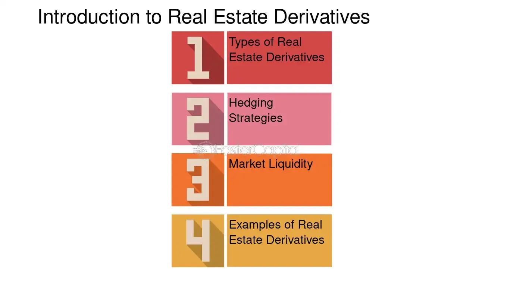

## Table of Contents

## What are real estate derivatives?

Real estate derivatives are financial instruments that allow investors to bet on the future movements of real estate prices without actually buying or selling physical properties. They work similarly to other derivatives, like stock options or futures, where the value of the derivative depends on an underlying asset—in this case, real estate. By using real estate derivatives, investors can hedge against potential declines in property values or speculate on future price increases, all without the need to manage actual properties.

These derivatives can be based on various real estate indices, such as the S&P/Case-Shiller Home Price Indices, which track changes in home prices across different regions. For example, an investor might buy a futures contract linked to a home price index, betting that home prices will rise. If the index goes up, the value of the futures contract increases, and the investor can sell it for a profit. Conversely, if the index falls, the investor could face losses. Real estate derivatives provide a way for investors to gain exposure to the real estate market with less capital than would be required to purchase actual properties, making them an attractive option for many.

## How do real estate derivatives differ from traditional real estate investments?

Real estate derivatives and traditional real estate investments are two different ways to get into the real estate market. With traditional investments, you buy actual properties like houses, apartments, or commercial buildings. You need a lot of money to start, and you have to take care of things like repairs, finding tenants, and paying property taxes. It's a hands-on way to invest, and you can earn money from rent or by selling the property for more than you paid.

Real estate derivatives are different because they let you bet on real estate prices without owning any buildings. You can use them to guess if prices will go up or down, and you don't need as much money to start. Instead of dealing with the daily work of managing a property, you're just trading contracts that are based on real estate price changes. This can be riskier, but it also gives you a chance to make money from the real estate market without the hassle of owning a physical property.

## What are the main types of real estate derivatives?

Real estate derivatives come in a few main types. The first type is real estate futures. These are contracts that let you bet on where real estate prices will be at a future date. If you think prices will go up, you can buy a futures contract, and if you're right, you can sell it later for a profit. The opposite is true if you think prices will go down.

Another type is real estate options. These give you the right, but not the obligation, to buy or sell a real estate index at a certain price before a specific date. There are two kinds: call options, which you buy if you think prices will go up, and put options, which you buy if you think prices will go down. Options can be less risky because you don't have to go through with the deal if it doesn't work out.

Lastly, there are real estate swaps. These are agreements between two parties to exchange cash flows based on real estate indices. For example, one party might agree to pay a fixed rate, while the other pays a rate based on how a real estate index performs. Swaps can be used to manage risk or to speculate on future price movements.

## How are real estate derivatives priced?

Real estate derivatives are priced based on the value of the real estate index they are linked to. This index could be something like the S&P/Case-Shiller Home Price Index, which tracks home prices in different areas. The price of the derivative will go up or down depending on what people think will happen to the index in the future. If lots of people think home prices will rise, the price of the derivative will go up because more people will want to buy it. If they think prices will fall, the price of the derivative will go down.

There are also other things that affect the price of real estate derivatives. These include how much time is left until the contract ends, how much the index might move up or down, and the cost of borrowing money. The more time left on the contract, the more the price can change because there's more time for the index to go up or down. If the index is expected to move a lot, the price of the derivative will be higher because it's riskier. And if it costs more to borrow money, that can also make the derivative more expensive.

## What are the basic mechanisms of trading real estate derivatives?

Trading real estate derivatives involves buying and selling contracts that are based on real estate price changes. These contracts can be futures, options, or swaps. When you trade these derivatives, you're not buying actual buildings or land. Instead, you're betting on whether the price of a real estate index, like the S&P/Case-Shiller Home Price Index, will go up or down. If you think prices will rise, you might buy a futures contract or a call option. If you think prices will fall, you might buy a put option or enter into a swap agreement.

The trading happens on special markets where people can buy and sell these contracts. These markets can be exchanges, like the Chicago Mercantile Exchange, or over-the-counter (OTC) markets, where deals are made directly between two parties. To trade, you need to have an account with a broker who can access these markets. When you make a trade, you agree on the price and the terms of the contract. If the real estate index moves in the direction you expected, you can sell the contract for a profit. If it moves the other way, you might lose money.

## What are the potential benefits of investing in real estate derivatives?

Investing in real estate derivatives can be a good way to make money from the real estate market without buying actual buildings. One big benefit is that you don't need a lot of money to start. Instead of spending a lot to buy a house or an apartment, you can trade contracts that are based on real estate prices. This means you can get into the market with less cash and still have a chance to make a profit if you guess right about where prices are going.

Another benefit is that real estate derivatives let you bet on the market without the hassle of managing properties. When you own a building, you have to deal with things like repairs, finding tenants, and paying taxes. With derivatives, you don't have to worry about any of that. You can focus on trying to predict where prices will go and make your trades based on that. This can be a lot simpler and less time-consuming than traditional real estate investing.

## What risks are associated with real estate derivatives?

Investing in real estate derivatives can be risky. One big risk is that you could lose money if the real estate prices don't move the way you expected. If you bet that prices will go up and they go down instead, you could lose the money you put into the contract. This kind of investing can be a bit like gambling because it's hard to predict what will happen to prices in the future.

Another risk is that real estate derivatives can be complicated. They are based on things like indices and contracts that can be hard to understand. If you don't know what you're doing, you might make mistakes that cost you money. Also, these derivatives are often traded on markets that can be affected by things like economic news or changes in interest rates, which can make prices move a lot and make your investment even riskier.

## How can real estate derivatives be used for hedging?

Real estate derivatives can be used for hedging to protect against the risk of falling real estate prices. If you own a property and you're worried that its value might go down, you can use derivatives to offset that risk. For example, you could buy a put option on a real estate index. If the index goes down, the value of your put option goes up, which can help cover any losses you might have on your property. This way, you're not just hoping that prices stay high; you're taking action to protect yourself if they fall.

Hedging with real estate derivatives can also be useful if you're a real estate developer or investor with a lot of money tied up in properties. By using futures or swaps, you can lock in current prices or exchange cash flows based on how real estate indices perform. This can help you manage your risk better and make your financial planning more predictable. It's like having insurance against big changes in the market, so you can feel more secure about your investments.

## What role do real estate derivatives play in portfolio diversification?

Real estate derivatives can help you spread out your investments, which is called diversification. When you invest in different things, you lower the risk that all your money will be lost if one type of investment does badly. Real estate derivatives let you add exposure to the real estate market without having to buy actual buildings. This means you can get into the real estate market without using a lot of money, and it can help balance out your other investments, like stocks or bonds. If the stock market goes down, maybe the real estate market will go up, and your derivatives can help protect your overall portfolio.

Adding real estate derivatives to your portfolio can also give you a chance to make money from different parts of the real estate market. For example, you could buy derivatives that are based on home prices in different cities or regions. This way, you're not just betting on one area; you're spreading your bets across many. This can help you manage risk better because if one area does poorly, another might do well. Overall, real estate derivatives can be a smart way to diversify your investments and potentially improve your returns while keeping your risk under control.

## How have real estate derivatives evolved historically?

Real estate derivatives started to become popular in the early 2000s. Before that, if you wanted to invest in real estate, you had to buy actual buildings or land. But then, people came up with the idea of trading contracts that were based on real estate prices instead. The first big real estate derivative was introduced by the Chicago Mercantile Exchange in 2006. It was called the S&P/Case-Shiller Home Price Futures, and it let people bet on where home prices would go in the future. This was a big deal because it gave investors a new way to get into the real estate market without having to own any property.

Over time, real estate derivatives have grown and changed. More types of derivatives, like options and swaps, were created to give investors even more ways to bet on real estate prices. These new tools helped people manage their risk better and made it easier to invest in real estate from anywhere in the world. But the 2008 financial crisis showed that real estate derivatives could also be very risky. After the crisis, there were more rules and regulations to try to make sure these derivatives were used safely. Today, real estate derivatives are still used by many investors, but people are more careful about how they use them.

## What regulatory considerations should be taken into account when trading real estate derivatives?

When trading real estate derivatives, you need to think about the rules that govern them. After the 2008 financial crisis, governments and financial watchdogs made new rules to make sure these derivatives are used safely. In the United States, the Dodd-Frank Act was passed to help control the risks of derivatives trading. This law says that some derivatives have to be traded on special exchanges and reported to regulators. This helps keep an eye on what's happening in the market and makes it harder for big problems to happen without anyone knowing.

Another thing to think about is that different countries have their own rules for real estate derivatives. If you're trading in more than one country, you need to know the rules in each place. For example, the European Union has its own set of rules called the European Market Infrastructure Regulation (EMIR). These rules can affect how you trade and what you need to report. It's important to understand these regulations so you can trade without breaking any laws and to protect yourself from big risks.

## What are the future trends and innovations expected in the real estate derivatives market?

In the future, the real estate derivatives market might see some cool new changes. One big trend could be using technology like blockchain to make trading easier and safer. Blockchain can help keep track of who owns what and make sure trades are done honestly. This could make it simpler for people all over the world to trade real estate derivatives without worrying as much about fraud. Also, more people might start using real-time data to make better guesses about where real estate prices are going. With more data, traders can make smarter decisions and maybe even make more money.

Another thing that might happen is that new types of real estate derivatives could be created. Right now, most derivatives are based on home price indices, but in the future, we might see derivatives that are based on other parts of the real estate market, like commercial properties or rental income. This would give investors more ways to bet on real estate prices and manage their risks. As more people learn about real estate derivatives and how to use them, the market could grow bigger and become a more important part of the overall real estate industry.

## References & Further Reading

[1]: Fabozzi, F. J., Shiller, R. J., & Tunaru, R. S. (2012). ["Real Estate Modelling and Forecasting"](http://aida.econ.yale.edu/~shiller/pubs/property-derivatives2010.pdf) by Franca P. analysis on the application of derivatives in real estate.

[2]: Geltner, D., Miller, N. G., Clayton, J., & Eichholtz, P. (2013). ["Commercial Real Estate Analysis and Investments"](https://www.researchgate.net/publication/245702364_Commercial_Real_Estate_Analysis_and_Investments) provides insights into real estate investment through detailed market analysis.

[3]: ["Algorithmic Trading: Winning Strategies and Their Rationale"](https://www.amazon.com/Algorithmic-Trading-Winning-Strategies-Rationale-ebook/dp/B00CY5HC0U) by Ernest P. Chan gives an in-depth understanding of algorithmic trading techniques.

[4]: Scherer, B. (2012). ["Algorithmic Trading and Quantitative Strategies"](https://api.pageplace.de/preview/DT0400.9781498737197_A39374186/preview-9781498737197_A39374186.pdf) focuses on strategies used in algorithmic trading and their real-world applications.

[5]: Anson, M. J. P. (2009). ["Handbook of Alternative Assets"](https://archive.org/details/handbookofaltern0000anso) provides a comprehensive overview of investment alternatives including derivatives.