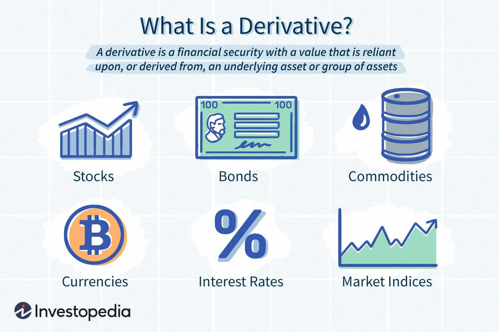

In the evolving landscape of financial markets, various tools and strategies have been introduced to optimize investment portfolios. Investors continually seek methods to maximize returns while managing risks, and innovative financial instruments and technologies have emerged to meet these demands. Among the prominent players in this arena are financial instruments such as real estate derivatives and the innovative approach of algorithmic trading, commonly known as 'algo trading'. These two elements illustrate the intersection of traditional market practices with technology-driven advancements, offering unique opportunities and efficiencies.

Real estate derivatives provide investors with the ability to gain exposure to the real estate market without the need for direct property ownership. This flexibility is particularly valuable for those looking to diversify their portfolios or manage specific risks related to real estate investments. On the other hand, algorithmic trading has revolutionized the execution of trades by leveraging complex algorithms and computerized systems, enabling trades to be executed with precision and speed, far beyond the capabilities of manual trading methods.



This article explores the synergy between these instruments and strategies and highlights their investment benefits. By analyzing how real estate derivatives and algorithmic trading function individually and together, we can see how they contribute to diversified and dynamic investment opportunities. The combination of these tools allows for more strategic asset allocation, risk management, and efficiency in execution, empowering investors to make informed decisions in an increasingly complex market environment.

Understanding their mechanisms and advantages can empower investors to make informed decisions. As the financial markets continue to evolve, mastery of such instruments can provide a competitive edge. Whether optimizing an existing portfolio or exploring new market avenues, leveraging real estate derivatives and algorithmic trading can significantly enhance strategic capabilities, suggesting a future filled with innovative investment paradigms.

## Table of Contents

## Understanding Financial Instruments and Real Estate Derivatives

Financial instruments are essential components of contemporary investment strategies, enabling access to various asset classes that cater to diverse investor needs. Among these instruments, real estate derivatives have emerged as a valuable tool, providing exposure to real estate markets without the necessity of direct property ownership. These derivatives are linked to real estate return indices, such as the National Property Index (NPI) and the National Association of Real Estate Investment Trusts (NAREIT), which serve as benchmarks for market performance. 

Real estate derivatives offer a flexible and liquid alternative to traditional real estate investments. By eliminating the need for physical property transactions, investors can achieve the same market performance benefits associated with real estate while enjoying increased liquidity and flexibility. This feature allows investors to enter and exit positions more swiftly, adapting to shifting market conditions without the constraints of property sales or acquisitions.

These derivatives provide a strategic framework for managing capital more effectively, particularly for those seeking to balance their portfolios with real estate exposure. By mitigating the sizable capital commitments typical of direct real estate investment, derivatives enable investors to allocate resources more efficiently. This strategic approach allows for precise risk management and portfolio diversification.

Furthermore, real estate derivatives facilitate nuanced risk management strategies. By aligning with indices like NPI and NAREIT, investors can hedge against specific market exposures or capitalize on anticipated market movements. This instrument's ability to mirror real estate market performance without direct involvement in property ownership empowers investors with greater control over their financial strategies.

In summary, real estate derivatives extend significant advantages to investors, offering exposure to the real estate market with enhanced [liquidity](/wiki/liquidity-risk-premium), flexibility, and capital efficiency. As integral components of modern financial instruments, they play a crucial role in broadening investment opportunities and optimizing portfolio performance.

## Investment Benefits of Real Estate Derivatives

Real estate derivatives offer substantial benefits, particularly in managing risk and diversifying investment portfolios. These financial instruments provide investors with a mechanism to hedge against real estate market fluctuations, thereby mitigating downside risks. By using real estate derivatives, investors can effectively shield their portfolios from adverse market movements, enhancing overall portfolio stability.

A distinct advantage of real estate derivatives is their low correlation with traditional asset classes like stocks and bonds. This characteristic helps investors achieve more balanced and diversified portfolios. By incorporating real estate derivatives, investors can reduce portfolio [volatility](/wiki/volatility-trading-strategies) and potentially enhance returns through improved diversification.

The liquidity of real estate derivatives sets them apart from direct property investments. These derivatives facilitate swift allocation adjustments in response to changing market conditions, providing flexibility that direct real estate ownership cannot match. Investors can enter or [exit](/wiki/exit-strategy) positions with greater ease and speed, allowing them to react promptly to market dynamics.

Moreover, real estate derivatives significantly lower the capital requirements typically associated with direct property investments. Investors are not obligated to engage in large capital outlays or manage physical properties, which can involve substantial maintenance and operational costs. This makes real estate derivatives an attractive alternative for those seeking real estate exposure without the complexities and financial burdens of direct ownership.

By leveraging these instruments, investors can gain strategic real estate market exposure while optimizing capital efficiency and portfolio resilience.

## The Rise of Algorithmic Trading

Algorithmic trading represents a significant evolution in the execution of trades within financial markets, primarily due to its speed and precision. Utilizing advanced algorithms, traders are able to analyze vast quantities of market data and execute trades automatically based on set conditions. This automation is particularly advantageous in high-frequency trading environments such as stocks, foreign exchange ([forex](/wiki/forex-system)), and [cryptocurrency](/wiki/cryptocurrency) markets, where milliseconds can impact profitability.

At its core, [algorithmic trading](/wiki/algorithmic-trading) relies on algorithms capable of processing complex data sets, identifying trends, and making trading decisions without human intervention. These algorithms can incorporate diverse data sources, including historical market data, real-time news feeds, and technical indicators, to generate buy or sell signals. For example, a simple moving average crossover strategy could be implemented in Python as follows:

```python
import pandas as pd

def moving_average_strategy(data, short_window=40, long_window=100):
    data['Short_MA'] = data['Close'].rolling(window=short_window, min_periods=1).mean()
    data['Long_MA'] = data['Close'].rolling(window=long_window, min_periods=1).mean()
    data['Signal'] = 0
    data['Signal'][short_window:] = np.where(data['Short_MA'][short_window:] > data['Long_MA'][short_window:], 1, 0)
    data['Position'] = data['Signal'].diff()

    return data

# Assuming 'data' is a DataFrame containing the stock prices with a 'Close' column
# result = moving_average_strategy(data)
```

This integration of computational algorithms into trading processes ensures that transactions are conducted at optimal times based on real-time market conditions, reducing the chances of human-induced errors and emotional biases. Consequently, algorithmic trading often results in more consistent and reliable trading outcomes.

Additionally, the ability to backtest strategies on historical data is another substantial benefit brought by algorithmic trading. Traders can use [backtesting](/wiki/backtesting) to validate their trading strategies by simulating how they would have performed in past market conditions. This process not only refines trading algorithms but also provides confidence in their effectiveness under various market scenarios.

Algorithmic trading also enhances investment efficiency by automating routine tasks, thus allowing traders and investors to focus on strategy development and market analysis rather than execution logistics. As algorithmic trading continues to evolve with technological advancements, its role in financial markets is anticipated to expand, offering even more sophisticated and efficient trading solutions.

## Advantages of Integrating Algo Trading with Real Estate Derivatives

The integration of algorithmic trading with real estate derivatives combines the best of both worlds for superior investment strategies. This distinctive blend allows for a seamless execution of trades by leveraging technology to process real-time data, thereby enhancing decision-making and strategic execution.

Algorithmic trading, often referred to as "algo trading," is capable of executing trades swiftly in real estate derivatives, effectively responding to real-time market trends. The automation of trading processes in this manner enables investors to operate at speeds unachievable by human traders alone. By employing sophisticated algorithms, trades can be executed based on specific criteria such as price movements, economic indicators, or even complex mathematical models, thereby capturing optimal market conditions.

This integration is particularly beneficial in exploiting market inefficiencies and identifying [arbitrage](/wiki/arbitrage) opportunities within the real estate sector. For instance, an algorithm can detect discrepancies between the prices of a real estate derivative and its underlying asset, allowing traders to buy low and sell high, thus profiting from price differences. By automating these trades, investors can swiftly capitalize on fleeting opportunities that might otherwise be missed by manual trading efforts.

Investors also benefit from reduced trading costs and increased market engagement when deploying algorithmic strategies. Automation minimizes human intervention, reducing the likelihood of errors and emotional biases that can adversely affect trading outcomes. Moreover, the ability to execute trades around-the-clock ensures that investors remain active participants in the market, regardless of time zone constraints.

The data-driven approach inherent in algo trading provides investors with the tools to make informed decisions, thereby optimizing returns while effectively managing risks. Algorithms can analyze vast amounts of data, identify patterns, and predict future trends with a level of accuracy and speed that humans cannot match. This level of analysis not only helps in optimizing portfolio returns but also in mitigating potential risks associated with market volatility.

Incorporating algorithmic trading with real estate derivatives ultimately offers a powerful strategic advantage for sophisticated investors looking to enhance their portfolios. It leverages cutting-edge technology to deliver granular insights and execute strategies with precision, paving the way for more dynamic and responsive investment activities.

## Conclusion

Both real estate derivatives and algorithmic trading are powerful tools for investors aiming to navigate and capitalize on the complexities of modern financial markets. These instruments offer unique advantages, enabling the construction of more dynamic and resilient investment portfolios that can withstand various market conditions.

Real estate derivatives provide an opportunity to gain exposure to the real estate market without the need for direct property ownership. This flexibility allows for significant portfolio diversification and risk management. Coupled with algorithmic trading, which allows for the swift execution of trades and the optimization of strategies based on real-time data, investors can significantly enhance their decision-making processes and strategic prowess.

The continuous advancements in financial technology promise even more potential for these instruments in shaping the future of investment practices. Algorithmic trading, powered by [machine learning](/wiki/machine-learning) and [artificial intelligence](/wiki/ai-artificial-intelligence), can unearth patterns and insights that were previously inaccessible, thus opening new avenues for investment innovation and efficiency.

Despite their complexity, these financial tools are highly rewarding for those who possess the requisite knowledge and skills. Sophisticated investors who can navigate the intricacies of real estate derivatives and algorithmic trading stand to gain substantial benefits. Embracing these tools not only optimizes investment portfolios but also positions investors at the forefront of evolving market trends, enabling them to capitalize on emerging opportunities effectively.

## References & Further Reading

[1]: Fabozzi, F. J., Shiller, R. J., & Tunaru, R. S. (2012). ["Real Estate Modelling and Forecasting"](http://aida.econ.yale.edu/~shiller/pubs/property-derivatives2010.pdf) by Franca P. analysis on the application of derivatives in real estate.

[2]: Geltner, D., Miller, N. G., Clayton, J., & Eichholtz, P. (2013). ["Commercial Real Estate Analysis and Investments"](https://www.researchgate.net/publication/245702364_Commercial_Real_Estate_Analysis_and_Investments) provides insights into real estate investment through detailed market analysis.

[3]: ["Algorithmic Trading: Winning Strategies and Their Rationale"](https://www.amazon.com/Algorithmic-Trading-Winning-Strategies-Rationale-ebook/dp/B00CY5HC0U) by Ernest P. Chan gives an in-depth understanding of algorithmic trading techniques.

[4]: Scherer, B. (2012). ["Algorithmic Trading and Quantitative Strategies"](https://api.pageplace.de/preview/DT0400.9781498737197_A39374186/preview-9781498737197_A39374186.pdf) focuses on strategies used in algorithmic trading and their real-world applications.

[5]: Anson, M. J. P. (2009). ["Handbook of Alternative Assets"](https://archive.org/details/handbookofaltern0000anso) provides a comprehensive overview of investment alternatives including derivatives.