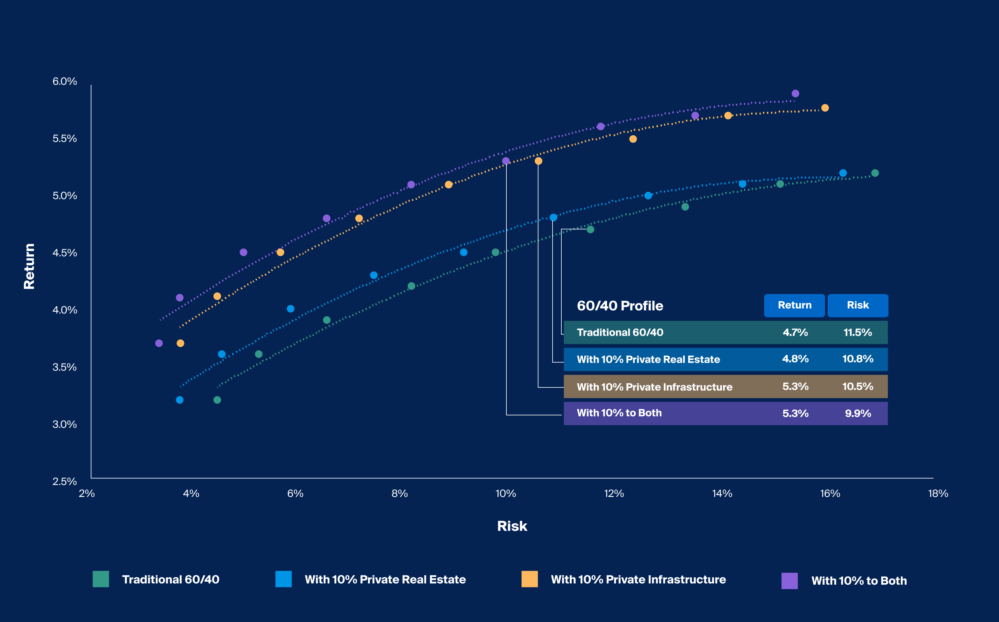

In a rapidly changing investments landscape, diversification, real estate, infrastructure, and algorithmic trading play pivotal roles. This article explores how integrating these elements can optimize investment portfolios, offering a comprehensive strategy that enhances returns and manages risks effectively.

Real estate and infrastructure have long been considered cornerstones of a stable investment portfolio. These assets provide not only stable income but also potential capital appreciation. They often complement each other by offering a hedge against market volatility and inflation, essential in today's unpredictable economic environment. Real estate, including residential, commercial, and industrial properties, delivers tangible value and diversity, edging out traditional stocks and bonds when market conditions fluctuate. Infrastructure investments, such as those in transportation, communications, and utility networks, offer consistent returns over the long term, further stabilizing an investor's income stream.



On the other hand, algorithmic trading introduces a modern twist to investment strategies by leveraging technology and data. This approach allows investors to execute trades with precision and efficiency, taking advantage of market trends identified through advanced analytics. The capacity for rapid adaptation to market changes positions algorithmic trading as a significant tool for optimizing strategies in real estate and infrastructure investments. The blend of technological acumen with traditional investment avenues, such as real estate and infrastructure, creates a robust framework that adeptly combines stability and innovation.

The fusion of these diverse elements—real estate, infrastructure, and algorithmic trading—not only diversifies risk but also enhances the potential for greater returns. By integrating different asset classes and leveraging cutting-edge technology, investors can achieve a more balanced approach that aligns with modern financial goals. As the financial landscape continues to evolve, the collective potential of these strategies ensures adaptability and resilience, vital for navigating both current and future market conditions.

Through this exploration, the article aims to provide insights into the strategic integration of these investment avenues, highlighting their complementary strengths and how they collectively form a resilient investment framework.

## Table of Contents

## The Role of Real Estate in Investment Diversification

Real estate serves as a cornerstone in investment diversification, offering both stable income and the potential for capital appreciation. This asset class encompasses various property types, including residential, commercial, and industrial, each providing unique advantages that distinguish it from traditional stocks and bonds.

Investments in residential properties, which involve single-family homes, multi-family apartments, and condominiums, typically yield rental income and can appreciate over the long term. Commercial properties, such as office buildings, retail spaces, and warehouses, often generate higher income due to long-term leases with businesses. Industrial real estate, comprising factories, logistics centers, and distribution facilities, is increasingly in demand due to the rise of e-commerce and global supply chain evolution.

One of the distinct benefits of real estate is its ability to perform well in volatile markets. Unlike stocks and bonds, which can fluctuate sharply due to market sentiments, real estate is generally less volatile and offers a tangible asset that can appreciate over time. This is particularly beneficial during economic downturns when traditional investments may underperform.

Real Estate Investment Trusts (REITs) present a viable option for investors aiming to access real estate without the complexities of direct property ownership. REITs are companies that own, operate, or finance income-generating real estate. These entities pool resources from numerous investors, allowing for large-scale investment in diversified property portfolios.

REITs offer several advantages. They provide [liquidity](/wiki/liquidity-risk-premium), as their shares are traded on major exchanges similarly to stocks, allowing investors to buy and sell with relative ease. Furthermore, REITs are mandated to distribute at least 90% of their taxable income as dividends, making them an attractive choice for income-focused investors. By investing in REITs, individuals gain exposure to a broad range of properties, thus enhancing portfolio diversification without the need for substantial capital or direct property management.

In summary, real estate plays a critical role in diversifying investment portfolios. With its inherent stability and income-generating capabilities, coupled with the accessibility of REITs, real estate can effectively complement traditional investment vehicles, mitigating risks and enhancing potential returns in a balanced portfolio.

## Infrastructure Investments: Adding Stability and Income

Infrastructure investments encompass essential public services such as transportation, communication, and utility networks, which are critical components of a robust economy. These investments are characterized by their long-term nature, often providing stable returns and acting as a hedge against inflation. The essential and non-cyclical nature of infrastructure services ensures continuous demand, thereby offering reliable income streams to investors.

### Key Characteristics and Benefits

1. **Stability and Longevity**: Infrastructure assets are typically long-duration investments. This means they have the potential to yield returns over extended periods, aligning with long-term financial goals. For instance, toll roads, airports, and energy distribution networks generate consistent revenue from user charges, making them less vulnerable to economic downturns.

2. **Inflation Hedging**: Infrastructure investments often include contracts that link revenue to inflation indices. This relationship with inflation provides a level of income protection against rising prices, enhancing the investment's real return.

3. **Interest Rate Sensitivity**: In environments with rising interest rates, infrastructure investments stand out. They often possess regulated return frameworks or long-term contracts that provide predictable cash flows, thus maintaining attractiveness even as rates increase.

4. **Portfolio Diversification**: The stable and conservative nature of infrastructure investments contributes significantly to portfolio diversification strategies. They have a low correlation with traditional asset classes, such as equities and bonds, which can reduce portfolio risk.

5. **Institutional Appeal**: Due to their risk-return profile, infrastructure investments are particularly attractive to institutional investors, like pension funds and insurance companies, seeking conservative yet lucrative avenues. Large-scale infrastructure projects often have high barriers to entry, which can protect returns from competitive erosion.

### Economic and Social Implications

Infrastructure projects also [carry](/wiki/carry-trading) significant economic and social benefits, providing essential services that foster economic growth and improve quality of life. These projects can stimulate job creation, facilitate trade, and enhance connectivity, which in turn can spur additional economic activities and tax revenues.

### Investment Vehicles

Investors can access infrastructure investments through various vehicles, such as direct investment in infrastructure projects, listed infrastructure companies, and infrastructure funds. Each option offers different levels of liquidity, control, and exposure to potential returns.

In conclusion, infrastructure investments are crucial for building a diversified, income-generating portfolio. Their ability to provide stable and inflation-protected returns makes them a strategic choice for investors seeking long-term growth amidst economic fluctuations.

## Algorithmic Trading: Enhancing Precision and Efficiency

Algorithmic trading employs programmed systems to execute trades based on data-driven strategies, offering substantial benefits in speed, accuracy, and the capacity to process voluminous market data, resulting in more informed decisions. This method enhances investment strategies by optimizing entries and exits through the rapid analysis of market conditions, trends, and anomalies that would be otherwise impossible for manual trading to detect in real-time.

The key advantage of [algorithmic trading](/wiki/algorithmic-trading) lies in its ability to facilitate precision and efficacy in decision-making. Algorithms can scrutinize numerous market variables simultaneously, parsing data from vast sources such as financial reports, historical trends, and market forecasts. Algorithmic traders leverage predictive analytics, using statistical models and historical data, to forecast market movements and refine trading strategies. This advantage becomes especially potent when applied to asset classes like real estate and infrastructure, where data patterns can significantly influence investment returns.

Consider a simple Python script using the NumPy library to execute a basic algorithmic trading strategy. This trading algorithm can illustrate how an algorithm might automate the process of investment decisions based on moving averages:

```python
import numpy as np

def simple_moving_average(data, window):
    weights = np.repeat(1.0, window)/window
    sma = np.convolve(data, weights, 'valid')
    return sma

# Example market data
market_data = np.array([20, 21, 22, 23, 22, 21, 21, 23, 25, 26, 24])
short_window = 3
long_window = 5

short_sma = simple_moving_average(market_data, short_window)
long_sma = simple_moving_average(market_data, long_window)

signals = np.where(short_sma > long_sma[-len(short_sma):], 1, 0)  # 1 for buy signal, 0 for sell signal

print(f'Short SMA: {short_sma}')
print(f'Long SMA: {long_sma}')
print(f'Signals: {signals}')
```

This code calculates two simple moving averages (SMAs) with different time windows. The algorithm generates a buy signal when the short-term SMA crosses above the long-term SMA, indicating a potential upward market trend.

Algorithmic trading also introduces several challenges. A notable issue is the necessity for technical expertise to develop and manage these algorithms effectively. Programmers and traders need to construct algorithms that are robust, adaptable, and capable of functioning under various market conditions. Furthermore, there is an inherent risk of systemic errors in algorithmic systems. These errors can arise from flaws in the software, unexpected market conditions, or discrepancies in the underlying data input, potentially leading to significant financial losses if not properly managed.

In conclusion, while algorithmic trading enhances precision and efficiency, it requires a blend of technological skill and strategic insight to harness its full potential. Investors must remain vigilant, continuously refining their algorithms to mitigate risks and adapt to the ever-evolving financial landscape.

## Synthesizing Real Estate, Infrastructure, and Algorithmic Trading

The integration of real estate, infrastructure, and algorithmic trading represents a strategic advancement in enhancing investment portfolios. By leveraging the stable income generated from real estate and infrastructure assets, investors can ensure a foundation of consistent returns. Real estate investments, particularly through vehicles such as Real Estate Investment Trusts (REITs), and infrastructure holdings like transportation and utility networks offer long-term stability. These assets inherently mitigate [volatility](/wiki/volatility-trading-strategies), providing a counterbalance to the unpredictable nature of equity markets.

Algorithmic trading further augments this stability with precision and efficiency. Utilizing programmed systems, algorithmic trading employs data-driven strategies to execute trades swiftly and accurately. For example, Python algorithms can analyze market trends and historical data to predict future movements. Here's a simple Python script that mimics the logic of moving average crossovers, a common method used in algorithmic trading:

```python
import numpy as np
import pandas as pd

def moving_average(data, window_size):
    """Calculates moving average using sliding window method."""
    return data.rolling(window=window_size).mean()

# Sample data: hypothetical real estate index values
data = pd.Series([100, 102, 105, 107, 110, 115, 117, 120])

# Short and long moving windows
short_window = 3
long_window = 5

signals = pd.DataFrame(index=data.index)
signals['price'] = data
signals['short_mavg'] = moving_average(data, short_window)
signals['long_mavg'] = moving_average(data, long_window)

# Generate signals for buying and selling
signals['signal'] = 0.0
signals['signal'][short_window:] = np.where(signals['short_mavg'][short_window:] 
                                            > signals['long_mavg'][short_window:], 1.0, 0.0)
signals['positions'] = signals['signal'].diff()

print(signals)
```

This script demonstrates how a crossover of short-term and long-term moving averages can signal buy or sell conditions, allowing traders to optimize portfolios by entering or exiting positions at favorable times.

In the integration of these three elements, the algorithms not only enhance the decision-making process but also provide dynamic portfolio adjustments. This is achieved by continuously assessing market conditions and adjusting holdings accordingly, which reduces risk and aligns with financial objectives. AI and [machine learning](/wiki/machine-learning) further extend these capabilities, introducing tools that can identify nuanced patterns and trends that traditional methods might overlook. These technologies enable more sophisticated analyses and predictions, thereby opening new pathways for optimizing investment portfolios.

The synthesis of real estate, infrastructure, and algorithmic trading represents a comprehensive approach to modern investment strategy, blending stability with innovation to achieve superior portfolio performance. Emerging technologies can further amplify these benefits, ensuring that investors are equipped to navigate the complexities of today's financial landscape effectively.

## Conclusion

Integrating real estate, infrastructure, and algorithmic trading allows investors to create portfolios that are not only robust but also flexible enough to withstand the ebbs and flows of the financial markets. This approach maintains a balance between stability and income, provided by tangible assets such as real estate and infrastructure, and the technological innovation offered by algorithmic trading. This balance is essential in maximizing returns while minimizing risks.

Adapting to changing market conditions necessitates both strategic planning and the use of dynamic tools. Investors must stay vigilant and ready to adjust their strategies as new opportunities and challenges arise. This requires continuous evaluation of market trends and economic indicators, along with the ability to leverage advancements in algorithmic trading, such as predictive analytics and [artificial intelligence](/wiki/ai-artificial-intelligence).

For optimal performance, investors must consistently assess and modify their portfolio strategies to take full advantage of these diverse sectors. The synergy between real estate, infrastructure, and algorithmic trading facilitates a comprehensive investment strategy that is both resilient and diversified.

In conclusion, the future of investment is bright for those who effectively combine diverse yet complementary assets. The seamless fusion of traditional investments, like real estate and infrastructure, with advanced technologies in trading positions investors well to navigate the complex and dynamic landscape of financial markets. This integrated approach offers a pathway to sustainable growth and long-term financial success.

## References & Further Reading

[1]: NAREIT. ["What is a REIT?"](https://www.reit.com/what-reit/reit-basics) National Association of Real Estate Investment Trusts.

[2]: Bitsch, F., Buchner, A., & Kaserer, C. (2010). ["Risk, Return and Cash Flow Characteristics of Infrastructure Fund Investments."](https://www.econstor.eu/bitstream/10419/45366/1/657029866.pdf) The Journal of Alternative Investments.

[3]: Menkveld, A. J. (2013). ["High Frequency Trading and The New Market Makers."](https://www.sciencedirect.com/science/article/pii/S1386418113000281) Review of Financial Studies, 27(8), 2299-2356.

[4]: Newell, G., & Peng, H. W. (2008). ["The Role of U.S. Infrastructure in Investment Portfolios."](https://researchers.westernsydney.edu.au/en/publications/the-role-of-us-infrastructure-in-investment-portfolios) Journal of Real Estate Portfolio Management, 14(1), 21-34.

[5]: Mizrach, B. (2012). ["Analysis of Algorithmic Traders in Futures Markets: A Simulation Approach."](https://scholar.google.com/citations?user=FmnNysoAAAAJ&hl=en) Journal of Futures Markets, 32(3), 248-270.