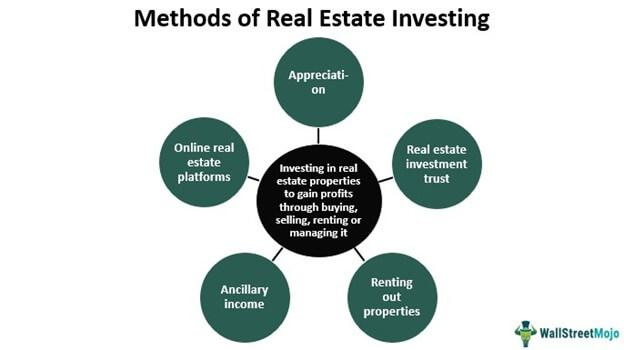

Real estate investing is recognized as a profitable avenue for diversifying an investment portfolio, offering the potential for both passive income and capital gains. As an asset class, real estate presents opportunities unique from traditional securities, providing tangible benefits such as regular rental earnings and long-term value appreciation. However, the complexities of real estate markets necessitate thorough research and strategic decision-making to maximize these investment benefits.

In recent years, algorithmic trading has emerged as a transformative tool across various investment sectors, including real estate. This sophisticated approach employs automated systems for executing trades, capitalizing on data-driven insights to optimize investment outcomes. By leveraging algorithms, investors can assess real estate market conditions more accurately and swiftly, thereby enhancing their investment strategies and potentially improving returns.



This guide is crafted to assist beginners in navigating the intricate world of real estate investing, with a particular focus on the integration of algorithmic trading techniques. It aims to equip novice investors with the necessary knowledge to understand different types of real estate investments and the significance of algorithmic trading in this context. The guide covers foundational aspects of real estate, such as the benefits and risks involved, and explores innovative strategies for initiating a successful investment journey using advanced trading algorithms.

Readers will gain insights into the benefits and potential risks associated with real estate investments and learn strategic approaches to embark on their investment endeavors, utilizing the advantages of algorithmic technology. This holistic approach not only enhances understanding but also prepares investors to make informed and confident decisions in the dynamic real estate market.

## Table of Contents

## Understanding Real Estate Investing

Real estate investing involves purchasing properties with the primary objective of generating income rather than occupying them as a main residence. This investment avenue offers diverse opportunities, including rental properties, commercial real estate, and Real Estate Investment Trusts (REITs).

Rental properties are residential or commercial spaces leased to tenants, providing investors with regular rental income. Commercial real estate encompasses properties used for business purposes, such as offices, retail spaces, and warehouses. REITs are companies that own or finance income-producing real estate across various sectors, offering a way for investors to earn dividends without directly managing properties.

Investing in real estate presents several advantages. It can provide tax benefits through deductions on mortgage interest, property taxes, and depreciation for certain property types. Additionally, investors benefit from potential long-term property appreciation and consistent rental income, making real estate a lucrative addition to any investment portfolio.

Choosing the right type of real estate investment hinges on understanding one's financial objectives and risk tolerance. Evaluating these factors helps investors determine whether their focus should be on regular income, long-term capital gains, or a combination of both. Real estate investments can vary significantly in terms of yield, growth potential, and risk exposure, requiring a tailored approach.

Informed investment decisions require thorough research and analysis of market trends, location benefits, and economic factors that could affect property values. For instance, the choice of location can significantly impact rental yields and appreciation potential, as infrastructure developments, job growth, and population density often influence demand. Economic indicators such as interest rates and inflation also play a crucial role in shaping real estate market dynamics.

To assess these variables effectively, investors might utilize various analytical tools and techniques. Statistical methods, such as regression analysis, can help forecast property value trends based on historical data. Geographic Information Systems (GIS) technology can provide insights into location-based advantages by visualizing demographic and economic data.

In summary, successful real estate investing demands a strategic approach that considers financial goals, property types, market conditions, and risk management, enabling investors to capitalize on the potential returns offered by the real estate sector.

## Algorithmic Trading in Real Estate

Algorithmic trading employs automated systems that execute transactions at optimal prices and speeds based on pre-defined criteria. This approach, traditionally used in stock and [forex](/wiki/forex-system) markets, is gradually gaining traction in real estate, offering innovative ways to assess market conditions and property values. By integrating data analytics and [machine learning](/wiki/machine-learning) algorithms, investors are enabled to make informed, data-driven decisions that align closely with market dynamics.

In real estate, algorithms analyze vast datasets that include property prices, historical sales data, economic indicators, and even social media sentiment to predict market trends. This analytical power helps identify investment opportunities that might be missed by conventional analysis methods. For instance, machine learning models like neural networks can learn complex patterns from historical data, offering insights into future property value fluctuations.

Algorithms can also be tailored to manage portfolio risks more effectively. Risk management models can be programmed to continuously monitor market [volatility](/wiki/volatility-trading-strategies) and other risk factors, automatically triggering adjustments in investment portfolios to maintain desired risk levels. Techniques such as Monte Carlo simulations can be employed to assess potential risks by simulating various scenarios and evaluating possible outcomes.

The advent of proptech (property technology) has further facilitated the adoption of algorithmic strategies in real estate. Platforms combining real estate data and technology offer tools that are now more accessible to investors, allowing them to benefit from advanced analytics previously available only to large institutional investors. For instance, blockchain technology can enhance the transparency and speed of transactions, while [artificial intelligence](/wiki/ai-artificial-intelligence) can refine the accuracy of these investments.

For beginners, [algorithmic trading](/wiki/algorithmic-trading) provides a competitive advantage by enabling smarter and quicker decision-making. User-friendly platforms and educational resources have democratized access to these technologies, allowing novice investors to harness sophisticated strategies with minimal technical expertise. Python, due to its extensive libraries like NumPy, Pandas, and Scikit-learn, is an ideal programming language for developing such algorithmic trading systems. Below is a simple example of how one might use Python to analyze real estate data:

```python
import pandas as pd
from sklearn.linear_model import LinearRegression

# Load historical property data
data = pd.read_csv('property_data.csv')

# Feature extraction
X = data[['location', 'area', 'bedrooms']]
y = data['price']

# Model instantiation and fitting
model = LinearRegression()
model.fit(X, y)

# Make predictions
predicted_prices = model.predict([[2, 1200, 3]])  # location index, area in sq ft, number of bedrooms
print(f"Predicted price for a 3-bedroom property with 1200 sq ft in location index 2: {predicted_prices[0]}")
```

This simple linear regression model could be expanded with more sophisticated techniques and datasets to enhance predictive accuracy and investment strategies. As the integration of technology continues to reshape real estate, those who embrace algorithmic trading systems are likely to enjoy a strategic advantage.

## Benefits of Real Estate Investing

Real estate investing presents compelling advantages for those seeking a stable and substantial return on investment. One of the primary benefits is the generation of income through rental properties. Rather than relying solely on appreciation, rental properties produce consistent cash flow, which can enhance the financial stability of an investor’s portfolio. The rental income generally covers expenses such as mortgage payments, property management fees, and maintenance, with the likelihood of excess funds contributing to net positive returns.

Moreover, real estate serves as a robust hedge against inflation. As inflation rises, property values and rental income typically increase, preserving the purchasing power of the investor’s capital. This attribute of real estate investments protects the investor from the eroding effects of inflation that often impact cash reserves or fixed-income investments.

Diversification is another critical advantage, as real estate exhibits a low correlation with other asset classes such as stocks and bonds. This characteristic reduces portfolio volatility; when markets fluctuate, real estate values do not necessarily follow the same patterns as traditional equity investments. \[ \text{Correlation Coefficient} = \frac{\text{Cov}(X,Y)}{\sigma_X \sigma_Y} \] where $\text{Cov}(X,Y)$ denotes the covariance between real estate (X) and another asset (Y), and $\sigma$ represents their respective standard deviations.

Property values, historically, exhibit a tendency to appreciate over time, even though short-term fluctuations can occur. This appreciation, coupled with rental income, contributes significantly to an investor's wealth accumulation. Proper management plays a pivotal role in ensuring properties are maintained, tenant relations are positive, and market trends are leveraged to optimize selling or buying decisions.

In recent years, the integration of algorithmic trading strategies within real estate investing has offered significant enhancements. Algorithms leverage vast data sets to offer precise market insights, allowing for informed purchase or sale decisions. Automated systems execute transactions with greater accuracy and speed than traditional methods, minimizing human error and optimizing return potentials.

Together, these benefits render real estate investing an appealing option for investors seeking both income and growth opportunities. When complemented with algorithmic proficiency, investors can harness technology to amplify the inherent advantages of real estate, crafting a comprehensive and effective investment strategy.

## Risks and Challenges

Real estate investing, despite its potential for returns and diversification, carries inherent risks that must be carefully managed. Market volatility is a primary concern, as fluctuations in real estate prices can impact the value of investments. Factors such as changes in interest rates, economic cycles, and shifts in demand can lead to property value declines. For example, an economic downturn may reduce household incomes, leading to lower demand for rental properties and, subsequently, falling rental income and property values.

Property management issues represent another significant challenge. Owning real estate requires ongoing maintenance and management, which can be both time-consuming and costly. Unexpected repairs or tenant-related issues can arise, affecting cash flow and overall returns. Investors must be prepared to handle such challenges either personally or through hiring professional management services.

Liquidity risk is another critical aspect in real estate investing. Unlike stocks and bonds, real estate properties are not easily liquidated, and selling a property can take considerable time and resources. This illiquidity means that investors may not be able to quickly respond to market changes or the need for cash. Therefore, it's crucial for investors to maintain a balanced portfolio that can withstand periods of limited [liquidity](/wiki/liquidity-risk-premium).

Incorporating algorithmic trading into real estate investments involves its own set of risks. While algorithms can offer data-driven insights and efficient trade executions, they require a level of technical expertise to implement and manage. Technical issues, such as errors in coding or disruptions in market data feeds, can lead to substantial financial losses. It is vital for investors to ensure their algorithms are thoroughly tested and monitored to minimize such risks.

To effectively navigate these risks, beginners should prioritize extensive research and seek guidance from experienced financial advisors, particularly those with expertise in algorithmic trading. A well-informed approach can significantly mitigate the potential downsides of real estate investing. Through due diligence, investors can develop sound strategies that balance risk and reward, optimizing their portfolios for both stability and growth.

## Starting Your Real Estate Investment Journey

To embark on your real estate investment journey, it's essential to start with well-defined investment goals. These goals should clearly outline whether you are aiming for consistent rental income or long-term capital appreciation. This initial step will guide your subsequent decisions and the type of properties you choose to invest in.

1. **Research Different Types of Real Estate Investments:**
   Exploring a variety of real estate investment vehicles is crucial. Options include purchasing physical properties such as residential or commercial real estate, investing in Real Estate Investment Trusts (REITs), or utilizing crowdfunding platforms. Each option offers unique risks and benefits. For instance, REITs allow investors to buy shares in a portfolio of properties, providing a diversified and often more liquid investment option compared to direct ownership.

2. **Potential of Algorithmic Trading:**
   Algorithmic trading can be a powerful tool in real estate investing. It involves using computer algorithms to analyze real estate market data, identify lucrative property investments, and execute buying or selling decisions quickly. Algorithms can evaluate numerous variables such as property location, market trends, and economic indicators, providing data-driven insights. Investors can use these insights to make informed decisions that align with their investment goals.

3. **Starting Small with REITs or Crowdfunding:**
   For beginners, starting with smaller investments such as REITs or real estate crowdfunding platforms can be advantageous. These options require less capital upfront and offer exposure to real estate market dynamics. Crowdfunding platforms enable investors to pool their resources for larger projects, often with lower entry points, and these platforms typically provide detailed market analysis and forecasts, aiding in decision-making.

4. **Educate Yourself on Property Valuation and Market Analysis:**
   Understanding property valuation techniques and market analysis is critical. Tools like discounted cash flow analysis, comparable property analysis, and property condition assessments can help determine a property's potential profitability. Continuous learning about economic factors that impact real estate, such as interest rates and local market conditions, will further inform your investment choices.

5. **Regularly Update Your Strategy:**
   The real estate market is dynamic, with conditions that can change due to economic shifts, property laws, and market trends. Regularly updating your investment strategy is essential to staying profitable. Incorporating new market data and using advanced algorithmic trading insights will allow you to adapt to market changes effectively. By leveraging technology, you can ensure your investment strategy remains aligned with your financial objectives and responsive to emerging opportunities and risks.

These steps provide a foundation for new investors to approach real estate investing with clarity and confidence. By setting clear goals, utilizing technology, and committing to continuous education, you can navigate the complexities of the real estate market successfully.

## Conclusion

Real estate investing, combined with algorithmic trading, presents a promising avenue for optimizing returns on investment. This integration of traditional real estate investment methods with advanced technology facilitates a robust framework for investors. Algorithmic trading enhances decision-making by providing timely data-driven insights, allowing investors to capitalize on market trends with precision and speed. While conventional strategies continue to hold significance, the inclusion of algorithms offers a modern, dynamic approach that can yield superior results.

For novice investors, this guide serves as a vital resource to strategically navigate the complexities of the real estate market. By understanding and applying the principles outlined, beginners can make informed decisions that balance risk and opportunity. It is critical to approach real estate investing with due diligence, committing to continuous learning and methodical planning. This commitment aids in identifying viable investment opportunities and foreseeing potential pitfalls.

In conclusion, real estate investing remains a formidable option for wealth creation, particularly when bolstered by algorithmic trading strategies. These strategies not only refine investment processes but also maximize potential returns by adapting to market fluctuations efficiently. The strategic application of technology in real estate thus offers a pathway to achieving substantial financial growth.

## References & Further Reading

[1]: Bergstra, J., Bardenet, R., Bengio, Y., & Kégl, B. (2011). ["Algorithms for Hyper-Parameter Optimization."](https://papers.nips.cc/paper/4443-algorithms-for-hyper-parameter-optimization) Advances in Neural Information Processing Systems 24.

[2]: ["Advances in Financial Machine Learning"](https://www.amazon.com/Advances-Financial-Machine-Learning-Marcos/dp/1119482089) by Marcos Lopez de Prado

[3]: ["Evidence-Based Technical Analysis: Applying the Scientific Method and Statistical Inference to Trading Signals"](https://www.semanticscholar.org/paper/Evidence-Based-Technical-Analysis%3A-Applying-the-and-Aronson/3b33df8737f1772e9e14d66a08c9696f140a2ee1) by David Aronson

[4]: ["Machine Learning for Algorithmic Trading"](https://github.com/stefan-jansen/machine-learning-for-trading) by Stefan Jansen

[5]: ["Quantitative Trading: How to Build Your Own Algorithmic Trading Business"](https://www.amazon.com/Quantitative-Trading-Build-Algorithmic-Business/dp/1119800064) by Ernest P. Chan