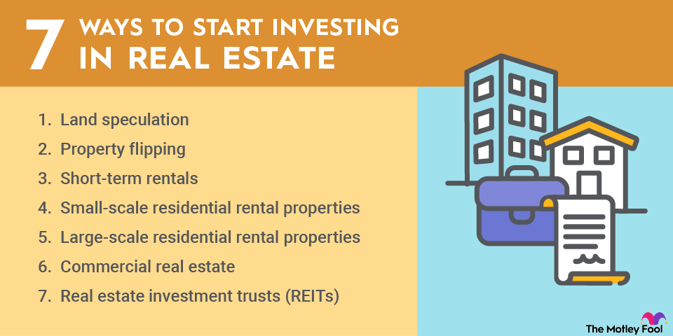

## Table of Contents

## What is real estate investing and why should beginners consider it?

Real estate investing is when you buy property, like houses or buildings, to make money. You can make money by renting the property to others or by selling it later for a higher price. It's different from other types of investing, like stocks, because you can see and touch what you're investing in. It's also different because you can use the property while you own it, like living in a house you're renting out part of.

Beginners should consider real estate investing because it can be a good way to build wealth over time. Even if you start with a small property, you can earn money from rent and maybe see the value of the property go up. Plus, there are ways to invest in real estate with less money upfront, like buying with a partner or using a loan. It's also a good way to learn about managing money and property, which can help in other areas of life.

## What are the different types of real estate investments available to beginners?

For beginners, there are several types of real estate investments to consider. One common type is buying a single-family home to rent out. This means you buy a house and then rent it to someone else who lives there. You can make money from the rent they pay you each month. Another option is buying a multi-family home, like a duplex or a triplex. With this, you can live in one part of the building and rent out the other parts, which can help cover your own living costs.

Another type of investment is real estate investment trusts (REITs). REITs are companies that own or finance income-generating real estate. When you invest in a REIT, you're buying shares in the company, and you can earn money from dividends, which are like a share of the profits. This is a good option if you don't want to manage a property yourself. Lastly, there's house flipping, where you buy a home, fix it up, and then sell it for a profit. This can be riskier and requires more work, but it can also be rewarding if done right.

## How much money do you need to start investing in real estate?

The amount of money you need to start investing in real estate can vary a lot depending on what type of investment you choose. If you want to buy a single-family home to rent out, you'll need enough money for a down payment, which is usually at least 20% of the home's price. For example, if a house costs $200,000, you might need $40,000 just for the down payment. You'll also need money for closing costs, repairs, and to cover any time when the house might be empty and not [earning](/wiki/earning-announcement) rent.

Another option is investing in a real estate investment trust (REIT). This is easier to get started with because you can buy shares with less money. You might be able to start with as little as a few hundred dollars, depending on the price of the shares. This is a good choice if you don't have a lot of money to start with and don't want to manage a property yourself. So, the amount you need can range from a few hundred dollars for REITs to tens of thousands of dollars for buying a rental property.

## What are the basic steps to buying your first investment property?

The first step to buying your first investment property is to set a clear goal for what you want to achieve. Decide if you want to rent out the property for steady income or if you plan to fix it up and sell it for a profit. Once you know your goal, start saving money for a down payment, which is usually at least 20% of the home's price. You'll also need money for closing costs and any repairs the property might need. While saving, it's a good idea to improve your credit score because a better score can help you get a lower [interest rate](/wiki/interest-rate-trading-strategies) on your loan.

Next, research the real estate market in the area where you want to buy. Look for neighborhoods that are growing and where property values are likely to go up. Once you find a property you like, get it inspected to make sure there are no big problems. After the inspection, you can make an offer on the property. If your offer is accepted, you'll need to get a mortgage loan to pay for the rest of the property. Work with a lender to find the best loan for you. After you get the loan, you'll go through the closing process, where you'll sign all the paperwork and officially become the owner of the property. Then, if you're renting it out, you'll need to find good tenants and manage the property.

## How can beginners finance their real estate investments?

Beginners can finance their real estate investments in a few different ways. One common way is to get a mortgage loan from a bank or a lender. To do this, you'll need to save up for a down payment, usually at least 20% of the home's price. You'll also need a good credit score to get a better interest rate on the loan. The bank will lend you the rest of the money you need to buy the property, and you'll pay it back over time with interest.

Another way to finance your investment is by partnering with someone else. This means you and another person or group of people can pool your money together to buy a property. This can help if you don't have enough money for a down payment on your own. You'll share the costs and the profits, but you'll also need to agree on how to manage the property. Lastly, you can invest in real estate investment trusts (REITs), which let you buy shares in a company that owns or finances real estate. This requires less money upfront and can be a good way to start if you're new to real estate investing.

## What are the key factors to consider when choosing a real estate market to invest in?

When choosing a real estate market to invest in, one of the key factors to consider is the local economy. You want to look for areas where jobs are growing and people are moving in. This can make it easier to find good tenants or buyers for your property. Another important [factor](/wiki/factor-investing) is the neighborhood's growth potential. Look for places where new businesses, schools, or public transport are being built. These can increase the value of your property over time.

Another thing to think about is the price of properties in the area. You want to find a market where the prices are reasonable and fit your budget. Also, consider the rental demand in the area. If a lot of people want to rent, it can be easier to find tenants and keep your property occupied. Finally, it's good to look at the crime rate and the quality of schools in the area. These can affect how much people are willing to pay for a home and can influence your property's value.

## How do you evaluate a property's potential for investment?

When you're thinking about investing in a property, one of the first things to look at is its location. A good location can make a big difference in how much money you can make from the property. You want to find a place where people want to live or work. Check if the area is growing, if there are good schools nearby, and if it's safe. Also, think about how easy it is to get to shops, restaurants, and public transport. All these things can make your property more valuable and easier to rent out or sell.

Another important thing to look at is the property's condition and what it might cost to fix it up. If the property needs a lot of repairs, you'll need to spend more money upfront, but fixing it up could increase its value. Get a professional inspection to find out about any big problems like a bad roof or old plumbing. You should also think about how much rent you can charge or how much you could sell the property for after you fix it up. Compare these numbers to see if the investment makes sense. Remember, the goal is to make more money than you spend, so take your time to do your research and make a smart choice.

## What are the common pitfalls that beginners should avoid in real estate investing?

One common mistake beginners make in real estate investing is not doing enough research. It's really important to learn about the local market, the neighborhood, and the property itself before you buy. If you don't, you might end up buying a property in an area that's not growing or one that needs a lot of expensive repairs. Also, beginners sometimes don't think about all the costs involved, like taxes, insurance, and maintenance. These can add up quickly and eat into your profits if you're not prepared.

Another pitfall is getting too excited and buying a property without a clear plan. You need to know if you're going to rent it out, flip it, or hold onto it for a long time. Without a plan, you might make choices that don't help you reach your goals. Also, some beginners use too much debt to buy properties. While loans can help you get started, too much debt can be risky if you can't pay it back or if the property doesn't make as much money as you expected. It's important to be careful and think through your decisions carefully.

## How can beginners manage and maintain their investment properties effectively?

Managing and maintaining an investment property can seem hard at first, but it gets easier with time. One important thing is to keep the property in good shape. This means fixing things when they break and doing regular checks to make sure everything is working well. You should also have enough money saved up for repairs and unexpected costs. It's a good idea to set aside some of the rent money each month for this. If you can't do the repairs yourself, you might want to hire a good handyman or a property management company to help you.

Another key part of managing a property is dealing with tenants. You need to find good tenants who will pay rent on time and take care of the place. To do this, you can check their background and ask for references. Once you have tenants, it's important to talk to them regularly and respond quickly if they have any problems. This helps keep them happy and more likely to stay longer. If you're not sure how to handle things like leases or legal issues, it might be helpful to get advice from a lawyer or a property manager.

## What are the tax implications of real estate investing for beginners?

When you invest in real estate, you need to know about the taxes you might have to pay. One big tax is property tax, which you pay every year based on how much your property is worth. This can change depending on where your property is and how much its value goes up. Another tax to think about is income tax on the money you make from renting out your property. You can subtract some costs, like repairs and interest on your loan, from your rental income to lower your taxes. But, if you sell your property for more than you paid for it, you might have to pay capital gains tax on the profit.

It's also good to know about something called depreciation. This lets you deduct the cost of your property over time, which can help lower your taxes. But, when you sell the property, you might have to pay back some of the money you saved from depreciation. There are also special tax rules, like the 1031 exchange, which lets you swap one property for another without paying taxes right away. It's a good idea to talk to a tax professional to make sure you understand all the rules and how they apply to your situation. They can help you save money and avoid any surprises when it's time to pay your taxes.

## How can real estate investing be used as part of a broader investment strategy?

Real estate investing can be a big part of your overall plan to grow your money. It's different from other investments like stocks or bonds because you can see and touch what you're investing in. Real estate can give you a steady income from rent and might go up in value over time. This can help balance out other investments that might go up and down a lot. For example, if the stock market has a bad year, the rent you get from your property can help keep your income steady. You can also use real estate to spread out your money across different types of investments, which can make your overall plan safer.

Another way to use real estate in your investment strategy is through real estate investment trusts (REITs). These let you invest in real estate without having to buy and manage a property yourself. You can buy shares in a REIT, and it's like owning a small piece of a big group of properties. This can be a good way to get into real estate with less money and less work. Plus, REITs often pay out dividends, which can give you regular income. By mixing real estate with other investments like stocks, bonds, and savings, you can build a plan that fits your goals and helps you grow your money over time.

## What advanced strategies can experienced beginners use to scale their real estate investments?

Experienced beginners can use a few advanced strategies to grow their real estate investments. One way is to use something called "house hacking." This means buying a multi-family home, like a duplex or a triplex, and living in one part while renting out the other parts. The rent from the other units can help pay your mortgage, making it easier to save money for more investments. Another strategy is to use a 1031 exchange, which lets you sell one property and buy another without paying taxes right away on the profit. This can help you keep more money to buy bigger or more properties.

Another good strategy is to use leverage, which means borrowing money to buy more properties. If you have one property that's doing well, you can use the money it makes to help pay for another one. This can help you grow your investments faster, but it's important to be careful because more debt can also be riskier. Finally, experienced beginners can think about investing in different types of real estate, like commercial properties or vacation rentals. These can give you different ways to make money and help spread out your risk. By using these strategies wisely, you can build a bigger and more successful real estate portfolio.

## References & Further Reading

[1]: Bergstra, J., Bardenet, R., Bengio, Y., & Kégl, B. (2011). ["Algorithms for Hyper-Parameter Optimization."](https://papers.nips.cc/paper/4443-algorithms-for-hyper-parameter-optimization) Advances in Neural Information Processing Systems 24.

[2]: ["Advances in Financial Machine Learning"](https://www.amazon.com/Advances-Financial-Machine-Learning-Marcos/dp/1119482089) by Marcos Lopez de Prado

[3]: ["Evidence-Based Technical Analysis: Applying the Scientific Method and Statistical Inference to Trading Signals"](https://www.semanticscholar.org/paper/Evidence-Based-Technical-Analysis%3A-Applying-the-and-Aronson/3b33df8737f1772e9e14d66a08c9696f140a2ee1) by David Aronson

[4]: ["Machine Learning for Algorithmic Trading"](https://github.com/stefan-jansen/machine-learning-for-trading) by Stefan Jansen

[5]: ["Quantitative Trading: How to Build Your Own Algorithmic Trading Business"](https://www.amazon.com/Quantitative-Trading-Build-Algorithmic-Business/dp/1119800064) by Ernest P. Chan