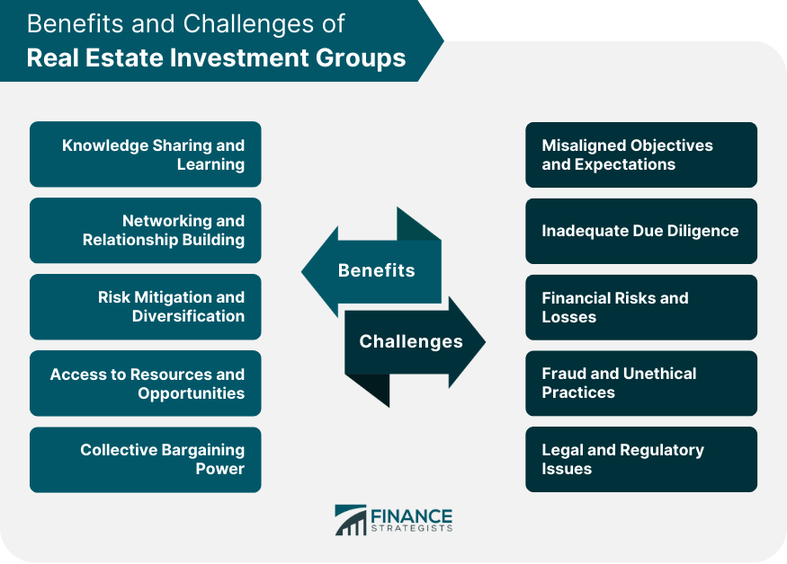

## Table of Contents

## What is a Real Estate Investment Group (REIG)?

A Real Estate Investment Group (REIG) is a group of investors who pool their money together to buy properties. These properties are usually apartments or similar types of housing. The group hires a company to manage the properties, so the investors don't have to do it themselves. This makes it easier for people who want to invest in real estate but don't want to deal with the day-to-day management.

When you join a REIG, you buy shares in the group, which gives you a part of the ownership in the properties they own. The money you get from renting out the properties is split among the shareholders. This can be a good way to earn money without having to buy and manage a whole property by yourself. It's also a way to spread out the risk because you're investing in many properties instead of just one.

## How does a Real Estate Investment Group work?

A Real Estate Investment Group (REIG) is like a club where people come together to buy properties, usually apartments. Everyone in the group puts their money together to buy these properties. They then hire a company to take care of the properties, like fixing things when they break and finding people to rent them. This means the people who invested don't have to do the hard work of managing the properties themselves.

When someone joins a REIG, they buy a part of the group, called shares. These shares mean they own a piece of all the properties the group has. The money that comes in from renting out the properties is shared among everyone who owns shares. This way, even if you don't have enough money to buy a whole property by yourself, you can still make money from real estate. Plus, it's safer because you're investing in many properties, not just one.

## What are the benefits of investing in a Real Estate Investment Group?

One big benefit of investing in a Real Estate Investment Group is that it lets you own part of a property without having to buy the whole thing yourself. This means you can start investing in real estate even if you don't have a lot of money. Plus, you don't have to worry about fixing things or finding renters because the group hires a company to do all that work for you. This makes it a lot easier and less stressful than owning a property all by yourself.

Another benefit is that it spreads out your risk. When you invest in a REIG, your money goes into many different properties, not just one. If one property doesn't do well, it's okay because the others might still be doing great. This can make your investment safer. Also, you can get regular money from the rent that the properties bring in, which can be a nice steady income for you.

## What are the risks associated with Real Estate Investment Groups?

Investing in a Real Estate Investment Group (REIG) can have some risks. One big risk is that you might not have much control over what the group does with the money. Since you're just one of many investors, you can't decide which properties to buy or how to manage them. If the group makes bad choices, it could affect your investment.

Another risk is that the value of the properties might go down. If the real estate market has a downturn, the properties the group owns could lose value. This means you might not get as much money back as you hoped when you want to sell your shares. Also, if the properties don't get rented out, the group might not have enough money to pay you the regular income you were expecting.

Lastly, there's the risk of the management company not doing a good job. If they don't take care of the properties well or can't find good renters, it could hurt the group's profits. This could mean less money for you and the other investors. So, it's important to check out the management company and the group's track record before you invest.

## How can someone get started with investing in a Real Estate Investment Group?

To get started with investing in a Real Estate Investment Group, you first need to find a group that you like. You can do this by searching online or asking people you know if they know of any good groups. Once you find a group, you should learn about them. Look at their website, read about the properties they own, and see how well they've done in the past. It's also a good idea to talk to someone from the group to ask any questions you have.

After you've picked a group, you need to decide how much money you want to invest. Most groups will tell you the minimum amount you need to buy shares. Once you've figured out how much you want to invest, you can buy your shares. This usually means filling out some forms and sending in your money. After that, you'll start getting a part of the rent money that comes in from the properties the group owns. Just remember to keep an eye on how the group is doing and make sure you're happy with your investment.

## What types of properties do Real Estate Investment Groups typically invest in?

Real Estate Investment Groups usually invest in properties that can bring in regular rent money. Most often, these are apartments or other types of multi-family housing, like townhouses or condos. These properties are good for REIGs because they can be split up into many rental units, which means more rent money coming in every month. Also, having lots of tenants can make the investment safer because if one tenant moves out, there are still others paying rent.

Sometimes, REIGs might also invest in other types of properties, like commercial buildings or even single-family homes. Commercial buildings, like office spaces or shopping centers, can be good because businesses often sign long leases, which means steady rent money. Single-family homes can be good too, especially in areas where people want to live and are willing to pay more for rent. But, REIGs usually stick to multi-family housing because it fits well with their goal of [earning](/wiki/earning-announcement) regular income from lots of different tenants.

## How do Real Estate Investment Groups manage their properties?

Real Estate Investment Groups hire a management company to take care of their properties. This company does all the work that comes with owning rental properties, like fixing things when they break, making sure the buildings are clean, and handling any problems that come up. They also find people to rent the apartments or houses and make sure they pay their rent on time. This way, the people who invested in the group don't have to do any of this work themselves.

The management company also keeps track of the money coming in from rent and the money going out for things like repairs and taxes. They make sure everything is paid for and that there's enough money left over to give to the investors. This is important because it helps the group keep running smoothly and makes sure the investors get their share of the profits. By hiring a management company, the Real Estate Investment Group can focus on buying more properties and growing their business, while leaving the day-to-day work to the experts.

## What is the role of a property manager in a Real Estate Investment Group?

In a Real Estate Investment Group, the property manager's job is to take care of all the properties the group owns. They make sure the buildings are in good shape by fixing things that break and keeping everything clean. They also find people to rent the apartments or houses and make sure these tenants pay their rent on time. If there are any problems, like a tenant not following the rules, the property manager deals with it. This means the investors in the group don't have to worry about the day-to-day work of owning rental properties.

The property manager also handles the money part of things. They collect the rent from tenants and use that money to pay for repairs, taxes, and other costs. They keep track of all the money coming in and going out, making sure there's enough left over to give to the investors as their share of the profits. By doing all this work, the property manager helps the Real Estate Investment Group run smoothly and grow, while letting the investors focus on other things.

## How are profits and losses distributed in a Real Estate Investment Group?

In a Real Estate Investment Group, the profits and losses are shared among the investors based on how many shares they own. If you own more shares, you get a bigger part of the profits. The money from rent goes to pay for things like repairs and taxes first. After those costs are covered, whatever money is left over is given to the investors. This is usually done every month or every quarter, so investors can get a regular income from their investment.

If the group has losses, those are also shared among the investors according to their shares. For example, if the properties need a lot of repairs or if they can't find enough tenants to rent them, the group might not make enough money to cover all the costs. In this case, the investors might not get any money that month, or they might even have to pay more money into the group to cover the losses. This is why it's important for investors to understand that while they can make money from a REIG, there's also a risk of losing money.

## What should one look for in a reputable Real Estate Investment Group?

When you're looking for a good Real Estate Investment Group, you should first check their track record. See how long they've been around and how well they've done in the past. A group that has been successful for a long time is usually a safer bet. Also, look at the properties they own. Are they in good areas? Do they make money from rent? This can tell you a lot about how smart their investments are.

It's also important to know about the people running the group. Find out about the management company they use. Are they good at their job? Do they take care of the properties well and find good tenants? You should also read the group's rules and agreements carefully. Make sure you understand how the profits and losses are shared and what your rights are as an investor. Talking to current investors can give you a good idea of what it's like to be part of the group.

## How do tax implications affect investments in Real Estate Investment Groups?

When you invest in a Real Estate Investment Group, you need to think about taxes. The money you get from the rent can be taxed as regular income. But, you might also get to take some tax deductions. These can include things like repairs, property taxes, and mortgage interest that the group pays. These deductions can lower the amount of taxes you have to pay. It's a good idea to talk to a tax expert to understand how this works for your situation.

Also, if the group sells a property and makes a profit, you might have to pay capital gains tax on your share of that profit. The tax rate for this can be different from your regular income tax rate. Sometimes, you can use losses from the group to lower your taxes, but there are rules about how much you can deduct. Because tax laws can be complicated, it's really helpful to get advice from someone who knows about taxes to make sure you're doing everything right and taking advantage of all the tax benefits you can.

## What advanced strategies can experienced investors use within Real Estate Investment Groups?

Experienced investors in Real Estate Investment Groups can use a strategy called "value-add investing." This means they look for properties that need some work, like fixing up old apartments. They invest money to make these properties better, hoping to raise the rent and make more money. By doing this, they can increase the value of the property and get a bigger return on their investment. It's a bit riskier because it costs money to fix things up, but if it works out, the rewards can be big.

Another strategy is called "syndication," where experienced investors might team up with others to buy bigger or more expensive properties. They can pool their money together to invest in things like large apartment complexes or commercial buildings that one person might not be able to afford alone. This can spread out the risk and also give them a chance to make more money. It's important for these investors to have a good plan and work well with their partners to make sure everyone benefits from the investment.

Lastly, some experienced investors might focus on "geographic diversification." This means they invest in properties in different areas, not just one place. By doing this, they can protect themselves if the real estate market in one area goes down. If one area isn't doing well, the properties in other areas might still be making money. This can help keep their investment stable and reduce the risk of losing money.

## References & Further Reading

[1]: Bergstra, J., Bardenet, R., Bengio, Y., & Kégl, B. (2011). ["Algorithms for Hyper-Parameter Optimization."](https://dl.acm.org/doi/10.5555/2986459.2986743) Advances in Neural Information Processing Systems 24.

[2]: ["Advances in Financial Machine Learning"](https://www.amazon.com/Advances-Financial-Machine-Learning-Marcos/dp/1119482089) by Marcos Lopez de Prado

[3]: ["Evidence-Based Technical Analysis: Applying the Scientific Method and Statistical Inference to Trading Signals"](https://books.google.com/books/about/Evidence_Based_Technical_Analysis.html?id=jbD47VkOHAEC) by David Aronson

[4]: ["Machine Learning for Algorithmic Trading"](https://github.com/stefan-jansen/machine-learning-for-trading) by Stefan Jansen

[5]: ["Quantitative Trading: How to Build Your Own Algorithmic Trading Business"](https://www.amazon.com/Quantitative-Trading-Build-Algorithmic-Business/dp/1119800064) by Ernest P. Chan