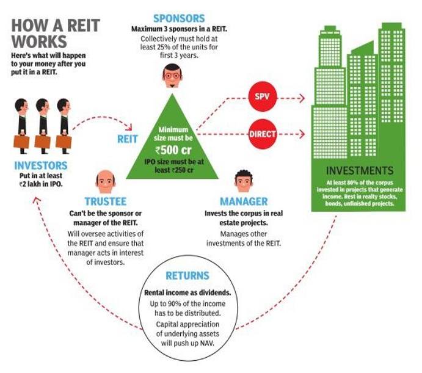

## Table of Contents

## What is a Real Estate Investment Trust (REIT)?

A Real Estate Investment Trust, or REIT, is a company that owns, operates, or finances income-generating real estate. It's like a mutual fund for real estate, where many people can invest in properties together without having to buy them directly. REITs can include shopping malls, apartments, offices, and hotels. By investing in a REIT, you can earn a share of the income produced through real estate ownership, without having to manage the properties yourself.

REITs are required by law to pay out at least 90% of their taxable income as dividends to their shareholders. This makes them attractive to investors looking for regular income. Additionally, REITs are traded on major stock exchanges, which means you can buy and sell shares easily, just like stocks. This provides a level of liquidity that direct real estate investments typically do not offer.

## How does a REIT work and what are its main features?

A REIT works by pooling money from many investors to buy, operate, or finance real estate. The real estate can be anything from apartments and shopping centers to office buildings and hotels. The REIT then earns money from rent, leases, or by selling properties. This income is shared with the investors as dividends. To be a REIT, the company must pay out at least 90% of its taxable income to shareholders every year. This rule helps make REITs a good choice for people looking for regular income.

REITs have some key features that make them different from other investments. First, they are easy to buy and sell because they are traded on major stock exchanges, just like stocks. This means you can get your money out quickly if you need to. Second, REITs offer a way to invest in real estate without having to buy and manage properties yourself. This can be less work and less risk than owning real estate directly. Finally, because REITs must pay out most of their income, they can offer high dividend yields, which is good if you want steady income from your investments.

## What are the different types of REITs available for investment?

There are three main types of REITs: Equity REITs, Mortgage REITs, and Hybrid REITs. Equity REITs own and operate income-generating real estate. They make money by renting out properties like apartments, shopping centers, and office buildings. Most of the time, Equity REITs pay out their rental income to investors as dividends. Mortgage REITs, on the other hand, don't own properties directly. Instead, they invest in mortgages or mortgage-backed securities. They earn money from the interest on these loans and then share that income with their investors.

Hybrid REITs combine the features of both Equity and Mortgage REITs. They own properties and also invest in mortgages. This mix allows them to earn income from both rental payments and interest on loans. Each type of REIT has its own risks and rewards, so investors can choose the one that fits their investment goals best.

## What are the benefits of investing in REITs?

Investing in REITs can be a good way to make money from real estate without having to buy and manage properties yourself. When you invest in a REIT, you get to share in the income that the properties make, like rent from apartments or shopping centers. This can give you a regular income because REITs are required to pay out at least 90% of their income to investors. Plus, REITs are easy to buy and sell because they trade on stock exchanges, just like regular stocks. This means you can get your money out quickly if you need to.

Another benefit of REITs is that they let you spread your money across many different properties and types of real estate. This can help lower your risk because if one property doesn't do well, you still have income from the others. Also, REITs can be a good way to grow your money over time. The value of the properties they own can go up, which can make the price of the REIT go up too. This means you could make money not just from the income but also from selling your shares at a higher price later on.

## What are the risks associated with REIT investments?

Investing in REITs can have some risks. One big risk is that the value of the properties the REIT owns might go down. If the real estate market isn't doing well, the value of the REIT can drop too. This means if you need to sell your shares, you might get less money than you paid for them. Also, REITs can be affected by things like higher interest rates. When interest rates go up, it can cost the REIT more to borrow money, which can hurt their profits and the dividends they pay to investors.

Another risk is that REITs can be sensitive to the economy. If people are losing jobs or the economy is slowing down, fewer people might rent apartments or shop at malls owned by the REIT. This can lead to lower income for the REIT, which means less money for you as an investor. Additionally, some REITs might focus on one type of property or one area. If something bad happens to that type of property or that area, it can really hurt the REIT's performance. So, it's important to think about how spread out the REIT's investments are before you invest.

## How can someone start investing in REITs?

To start investing in REITs, you first need to decide what kind of REIT you want to invest in. There are three main types: Equity REITs that own properties, Mortgage REITs that invest in mortgages, and Hybrid REITs that do both. Think about what fits your investment goals best. Once you've decided, you can buy shares of a REIT just like you would buy stocks. You can do this through a brokerage account, which you can set up with a bank or an online broker. Many online platforms make it easy to buy and sell REITs, so you can start with just a little bit of money.

After you've set up your brokerage account, you can search for REITs that interest you. Look at their past performance, the types of properties they own, and how much they pay in dividends. It's a good idea to spread your money across different REITs to lower your risk. Once you've chosen the REITs you want to invest in, you can place an order to buy shares. Keep an eye on your investments and remember that the value of REITs can go up and down, just like any other investment. If you're not sure, talking to a financial advisor can help you make the best choices for your money.

## What should investors consider before investing in a REIT?

Before investing in a REIT, it's important to think about what you want from your investment. Are you looking for regular income, or are you hoping to see your money grow over time? REITs can be good for both, but some are better at one than the other. Also, consider how much risk you're okay with. REITs can be affected by things like the economy, interest rates, and the real estate market. If these things change a lot, it can impact your investment. So, make sure you understand these risks and how they might affect your money.

Another thing to think about is the type of REIT you want to invest in. There are Equity REITs that own properties, Mortgage REITs that invest in loans, and Hybrid REITs that do a bit of both. Each type has its own way of making money and its own risks. Also, look at how the REIT is doing right now and how it has done in the past. Check if it pays good dividends and if those dividends are likely to stay the same or grow. Finally, think about how easy it would be to sell your shares if you need to. REITs are traded on stock exchanges, but some might be easier to buy and sell than others.

## How do REITs generate income and what are the tax implications?

REITs make money in a few different ways, depending on the type of REIT. Equity REITs own buildings like apartments, shopping centers, and offices. They make money by renting these buildings out to people or businesses. The rent they collect is their main source of income. Mortgage REITs, on the other hand, don't own buildings. Instead, they invest in loans that help people buy or build properties. They earn money from the interest on these loans. Hybrid REITs do a bit of both, owning properties and investing in loans. No matter the type, REITs have to pay out at least 90% of their taxable income to investors as dividends. This is a big reason why people invest in REITs, to get regular income.

When it comes to taxes, things can get a bit tricky with REITs. Usually, the dividends you get from a REIT are taxed as regular income, not as the lower rate that applies to most stock dividends. This is because REITs don't pay corporate income tax on the money they make, as long as they pay out most of it to shareholders. So, the tax responsibility moves to the investors. But, there's a small part of the dividends called a return of capital, which isn't taxed right away. Instead, it lowers your cost basis in the REIT, which can affect your taxes when you sell your shares. It's a good idea to talk to a tax advisor to understand how REITs will affect your taxes, because everyone's situation is different.

## What are some advanced strategies for investing in REITs?

One advanced strategy for investing in REITs is to focus on diversification. Instead of putting all your money into one REIT, you can spread it across different types of REITs, like Equity, Mortgage, and Hybrid REITs. This can help lower your risk because if one type of REIT doesn't do well, the others might still be doing okay. You can also look at REITs that own different kinds of properties, like apartments, shopping centers, and office buildings, or even REITs that focus on different parts of the country. This way, you're not betting all your money on one type of real estate or one area.

Another strategy is to pay attention to interest rates. REITs can be sensitive to changes in interest rates. When rates go up, it can cost REITs more to borrow money, which might hurt their profits and the dividends they pay out. So, you might want to invest more in REITs when interest rates are low and expected to stay that way. Also, think about the timing of your investments. If you believe the real estate market is going to do well, it might be a good time to buy more REITs. But if you think the market might go down, you might want to hold off or sell some of your shares.

Lastly, consider using a dividend reinvestment plan (DRIP) with your REIT investments. A DRIP lets you automatically use your dividends to buy more shares of the REIT, which can help your investment grow over time. This can be a smart way to increase your holdings without having to put in more money out of pocket. Also, keep an eye on the management team of the REITs you're investing in. A good management team can make a big difference in how well the REIT does, so it's worth doing some research on their track record and how they run the company.

## How do REITs perform in different economic cycles?

REITs can do well or not so well depending on what's happening in the economy. When the economy is growing and people have jobs, REITs that own things like shopping centers and apartments usually do better. More people are renting and shopping, so the REITs make more money from rent and can pay out bigger dividends to investors. But when the economy slows down or goes into a recession, it can be tough for REITs. People might lose their jobs and not be able to pay rent or shop as much, which means less money for the REITs. Also, if interest rates go up during a slowdown, it can cost REITs more to borrow money, which can hurt their profits.

Even though REITs can be affected by the economy, some types of REITs might do better than others during different times. For example, REITs that own healthcare properties or warehouses might not be as affected by a slowdown because people still need medical care and companies still need places to store things. On the other hand, REITs that own hotels or shopping malls might struggle more because people travel less and shop less during tough economic times. So, it's a good idea to think about what kind of REIT you're investing in and how it might do in different economic situations.

## What role does leverage play in REIT investments?

Leverage is when REITs use borrowed money to buy more properties or invest in more mortgages. It's like using a loan to buy a house instead of paying all cash. By using leverage, REITs can own more real estate than they could if they only used their own money. This can help them make more money because they can collect rent or interest from more properties. But, leverage can also be risky. If the value of the properties goes down or if they can't pay back the loans, it can hurt the REIT's profits and the money they pay out to investors.

Leverage can affect how well a REIT does, especially when interest rates change. When interest rates are low, it's cheaper for REITs to borrow money, which can be good for their profits. But when interest rates go up, it costs more to borrow, and this can cut into the REIT's earnings. Investors need to keep an eye on how much debt a REIT has and what the interest rates are doing. If a REIT is using a lot of leverage and interest rates go up, it could mean less money for investors. So, understanding how a REIT uses leverage is important for making smart investment choices.

## How can investors evaluate the performance and value of a REIT?

To evaluate the performance and value of a REIT, investors should first look at the dividends the REIT pays out. Since REITs have to pay out at least 90% of their taxable income as dividends, the dividend yield is a good way to see how much income you might get from your investment. A high dividend yield can be good, but make sure it's not too high because it might mean the REIT is having trouble and the dividend might not last. Also, look at the dividend history to see if the REIT has been able to keep paying or even increasing its dividends over time.

Another important thing to check is the funds from operations (FFO). FFO is a measure of how much cash a REIT is making from its properties, and it's a better way to see how well the REIT is doing than just looking at its net income. You can find the FFO per share and compare it to the price per share to get the price-to-FFO ratio. A lower ratio might mean the REIT is a good value. Also, think about how much debt the REIT has. Too much debt can be risky, especially if interest rates go up. By looking at these things, you can get a better idea of how well a REIT is doing and if it's a good investment for you.

## References & Further Reading

[1]: Case, B., & Wachter, S. (2011). ["Real Estate Investment Trusts (REITs)"](https://papers.ssrn.com/sol3/papers.cfm?abstract_id=1966058) in The Oxford Handbook of Urban Economics and Planning. 

[2]: Geltner, D., Miller, N.G., Clayton, J., & Eichholtz, P. (2013). ["Commercial Real Estate Analysis and Investments"](https://www.researchgate.net/publication/245702364_Commercial_Real_Estate_Analysis_and_Investments). South-Western Educational Publishing.

[3]: Ang, A. (2014). ["Asset Management: A Systematic Approach to Factor Investing"](https://academic.oup.com/book/3342). Oxford University Press.

[4]: Tsatsaronis, K., & Zhu, H. (2004). ["What drives housing price dynamics: cross-country evidence"](https://www.bis.org/publ/qtrpdf/r_qt0403f.pdf). BIS Quarterly Review.

[5]: Chan, E. (2008). ["Quantitative Trading: How to Build Your Own Algorithmic Trading Business"](https://github.com/ftvision/quant_trading_echan_book). Wiley. 

[6]: Lopez de Prado, M. (2018). ["Advances in Financial Machine Learning"](https://www.amazon.com/Advances-Financial-Machine-Learning-Marcos/dp/1119482089). John Wiley & Sons.

[7]: Kotecha, K., & Kotecha, K. (2020). ["Algorithmic Trading Using Deep Reinforcement Learning"](https://orcid.org/0000-0003-2653-3780) in Machine Learning for Optimal Systems.

