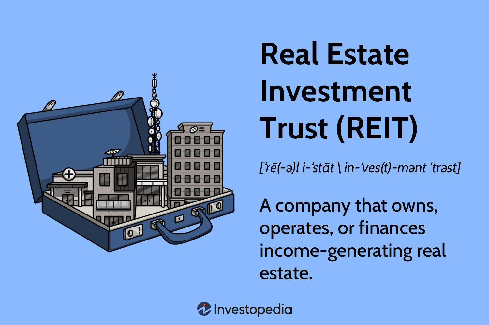

## Table of Contents

## What is a Real Estate Investment Trust (REIT)?

A Real Estate Investment Trust, or REIT, is a company that owns, operates, or finances income-generating real estate. It's like a mutual fund for real estate, where many people can invest in properties without buying them directly. REITs can include various types of properties, such as apartments, shopping centers, offices, and hotels. By investing in a REIT, people can earn dividends from the rental income these properties generate.

REITs are required by law to pay out at least 90% of their taxable income as dividends to shareholders. This makes them attractive to investors looking for regular income. Additionally, REITs are traded on major stock exchanges, making it easy for investors to buy and sell shares. This provides a level of liquidity that direct real estate investment does not offer. Overall, REITs offer a way for individuals to invest in large-scale, income-producing real estate with less capital and more flexibility.

## How does a REIT work?

A Real Estate Investment Trust, or REIT, is a company that owns and manages different types of properties like apartments, shopping centers, and offices. People can buy shares in a REIT, which is like buying a small piece of many properties at once. This is easier than buying a whole building by yourself. When people rent these properties, the money they pay goes to the REIT, and then the REIT shares this money with the people who own its shares. This money is called a dividend.

REITs have to follow special rules. One big rule is that they must give at least 90% of their income to shareholders as dividends. This is why many people like investing in REITs, because they can get regular payments. Also, shares of REITs are traded on big stock markets, so it's easy to buy and sell them. This makes it more flexible than owning a property directly, where it can be hard to sell quickly.

## What are the different types of REITs?

There are three main types of REITs: equity REITs, mortgage REITs, and hybrid REITs. Equity REITs own and manage properties like apartments, shopping centers, and offices. They make money by renting these properties to people and businesses. Most of the money they make is given back to the people who own shares in the REIT.

Mortgage REITs, on the other hand, don't own properties. Instead, they lend money to people who want to buy properties or invest in mortgages. They make money from the interest on these loans. Hybrid REITs are a mix of both equity and mortgage REITs. They own some properties and also invest in mortgages. This way, they can make money from renting properties and from loan interest.

## What are the benefits of investing in REITs?

Investing in REITs can be a good choice because they let you own a piece of many different properties without buying them all yourself. This means you can invest in big, expensive buildings like shopping centers or office towers with less money. Also, REITs are easy to buy and sell because they are traded on big stock markets. This is different from buying a house or building, where it can take a long time to sell.

Another big benefit of REITs is that they have to give most of their money to people who own shares. This means you can get regular payments, called dividends, which can be a good way to earn money. This is especially nice for people who want to get money regularly, like retirees. Plus, because REITs own many different types of properties, it can help spread out the risk. If one property doesn't do well, the others might still be okay.

## What are the risks associated with REITs?

Investing in REITs can have some risks. One big risk is that the value of the properties the REIT owns can go down. If people stop renting or buying properties, the REIT might not make as much money. This can make the price of the REIT's shares go down, and you could lose money if you need to sell your shares at that time. Also, if the economy is not doing well, it can be harder for REITs to borrow money or get good deals on properties, which can hurt their profits.

Another risk is that REITs have to pay out most of their money as dividends. This means they might not have enough money left to grow their business or buy new properties. If they can't grow, their value might not go up as much as other investments. Also, because REITs are traded on stock markets, their prices can go up and down a lot, which can be risky if you need to sell your shares quickly.

Lastly, there are specific risks depending on the type of REIT. For example, mortgage REITs can be affected by changes in interest rates. If interest rates go up, the cost of borrowing money goes up, and this can lower the profits of mortgage REITs. Equity REITs, on the other hand, can be affected by things like changes in the real estate market or problems with specific properties they own. So, it's important to understand the type of REIT you are investing in and the risks that come with it.

## How can someone start investing in REITs?

To start investing in REITs, first, you need to open a brokerage account. A brokerage account is like a special bank account where you can buy and sell investments like stocks and REITs. You can open one online with a company like E*TRADE, Fidelity, or Charles Schwab. Once your account is set up, you can search for REITs on the brokerage's website. Look for REITs that interest you, and read about them to see if they are a good fit for your investment goals.

After you've picked a REIT, you can buy shares of it through your brokerage account, just like buying a stock. You can decide how many shares you want to buy based on how much money you want to invest. Once you own the shares, you will start receiving dividends, which are payments from the REIT's rental income. Remember to keep an eye on your investment and the real estate market to make sure your REIT is doing well. If you ever want to sell your shares, you can do that easily through your brokerage account too.

## What are the tax implications of investing in REITs?

When you invest in REITs, you need to know about the taxes. The dividends you get from REITs are usually taxed as regular income, not as the lower tax rate for qualified dividends from stocks. This means you might pay more in taxes on the money you get from REITs. Also, if you sell your REIT shares for more money than you paid for them, you will have to pay capital gains tax on the profit.

There are some special tax rules for REITs too. If you get dividends from a REIT, part of that money might be considered a return of capital. This part isn't taxed right away but instead reduces the cost basis of your investment. When you sell your shares, this can affect how much capital gains tax you owe. It's a good idea to talk to a tax advisor to understand all the tax rules and how they apply to your situation.

## How do REITs compare to other real estate investments like direct property ownership?

Investing in REITs is different from owning a property directly. When you buy a property, you need a lot of money upfront, and it can be hard to sell quickly. With REITs, you can invest with less money because you're buying shares, not the whole property. Also, you can easily buy and sell REIT shares on the stock market, which gives you more flexibility. REITs also give you dividends regularly, which is like getting rent money without having to manage the property yourself.

On the other hand, when you own a property directly, you have more control. You can decide how to manage it, who to rent it to, and when to sell it. You might also benefit from the property going up in value over time. But with REITs, you don't get to make these decisions; the REIT managers do. Also, while REITs can spread your risk across many properties, owning one property directly means all your investment is tied to that one place. So, it's important to think about what you want from your investment when choosing between REITs and direct property ownership.

## What factors should be considered when selecting a REIT to invest in?

When [picking](/wiki/asset-class-picking) a REIT to invest in, it's important to look at the type of properties it owns. Some REITs own apartments, others own shopping centers or office buildings. Each type can be affected differently by the economy. For example, if people are moving a lot, apartment REITs might do well. But if people are buying less stuff, shopping center REITs might struggle. Also, think about where the properties are located. Properties in growing cities might be a better investment than those in places where people are moving away.

Another thing to consider is how well the REIT is doing financially. Look at how much money it makes and how much it pays out in dividends. A good REIT should have a strong history of paying dividends and growing its business. Check the dividend yield, which is how much money you get back compared to the price of the share. But be careful, a very high yield might mean the REIT is risky. Also, look at the management team. Good managers can make a big difference in how well the REIT performs.

Lastly, think about the overall market and interest rates. When interest rates go up, it can be harder for REITs to borrow money, which might hurt their profits. Also, REITs can be affected by the stock market, so keep an eye on what's happening there. It's a good idea to spread your investments across different types of REITs to lower your risk. Talking to a financial advisor can help you make a smart choice about which REITs to invest in.

## How do REITs perform during different economic cycles?

REITs can do well or badly depending on what's happening in the economy. When the economy is growing and people are buying and renting more, REITs usually do well. This is because more people renting means more money coming in for the REITs. Also, when it's easy to borrow money and interest rates are low, REITs can buy more properties and grow their business. But if the economy slows down and people lose jobs, they might not be able to pay rent or buy homes, which can hurt REITs. During these times, REITs might have to lower their rents or have empty properties, which means less money for dividends.

Different types of REITs can also be affected differently by the economy. For example, when the economy is doing well, retail and office REITs might do better because more people are shopping and working. But if the economy is bad, people might shop less and companies might not need as much office space, which can hurt these REITs. On the other hand, REITs that own apartments or healthcare facilities might be more stable because people always need a place to live and medical care. So, it's important to think about what kind of REIT you're investing in and how it might do during different economic times.

## What is the role of REITs in portfolio diversification?

REITs can help you spread out your investments, which is called diversification. When you invest in different things, it can lower your risk. If one investment goes down, the others might still be okay. REITs are a good way to do this because they let you invest in real estate without buying a whole property. This means you can own a little bit of many different properties, like apartments, shopping centers, and offices, all at once.

Adding REITs to your portfolio can also give you regular income. REITs have to pay out most of their money as dividends, so you can get payments regularly. This can be helpful if you want to get money from your investments without selling them. Plus, because REITs are traded on the stock market, you can easily buy and sell them. This makes them different from owning a house or building, where it can take a long time to sell. So, REITs can help you have a mix of investments that can grow and give you income at the same time.

## What advanced strategies can be used to maximize returns from REIT investments?

To get the most out of your REIT investments, you can use a strategy called dividend reinvestment. This means taking the money you get from dividends and using it to buy more shares of the REIT. Over time, this can help your investment grow bigger because you'll own more shares and get even more dividends. Another strategy is to look for REITs that are undervalued. This means finding REITs that are selling for less than they're really worth. If you buy these REITs and their value goes up, you can make a lot of money when you sell them.

Another way to maximize returns is by diversifying your REIT investments across different types of properties and locations. This can help lower your risk because if one type of property or area doesn't do well, the others might still be okay. You can also pay attention to interest rates. When interest rates are low, it's a good time to buy REITs because they can borrow money more easily and grow their business. But if you think interest rates are going to go up, you might want to sell some of your REITs because higher rates can make it harder for them to make money.

## How can REIT value be evaluated using Net Asset Value (NAV)?

Net Asset Value (NAV) serves as a fundamental metric for evaluating the intrinsic value of a Real Estate Investment Trust (REIT). It provides a snapshot of a REIT's financial strength by subtracting total liabilities from total assets. Mathematically, NAV can be expressed as:

$$
\text{NAV} = \frac{\text{Total Assets} - \text{Total Liabilities}}{\text{Number of Shares Outstanding}}
$$

This calculation aids investors in determining whether a REIT's stock is overvalued or undervalued in relation to its market price. When the market price of a REIT's shares is lower than the NAV per share, the REIT may be undervalued, presenting potential buying opportunities. Conversely, if the market price exceeds the NAV per share, it could indicate an overvaluation, suggesting a potential sell-off.

Investors often go beyond basic NAV calculation to employ Adjusted NAV, which considers anticipated future financial events or conditions impacting the REIT. Adjusted NAV adjusts for factors such as potential capital expenditures, projected rent increases, or property sales, refining the valuation and providing a more precise picture of a REIT's potential performance.

Understanding and utilizing NAV is pivotal in making informed investment decisions regarding REITs. This metric enables investors to objectively assess the financial health and intrinsic value of a REIT, thereby influencing portfolio allocations appropriately. By integrating NAV calculations with broader market analysis and financial metrics, investors can enhance their strategy, ensuring alignment with their long-term investment objectives.

## References & Further Reading

[1]: Geltner, D., Miller, N., Clayton, J., & Eichholtz, P. (2013). ["Commercial Real Estate Analysis and Investments."](https://www.researchgate.net/publication/245702364_Commercial_Real_Estate_Analysis_and_Investments) South-Western Educational Publishing.

[2]: Chan, E. P. (2009). ["Quantitative Trading: How to Build Your Own Algorithmic Trading Business."](https://github.com/ftvision/quant_trading_echan_book) Wiley.

[3]: Lopez de Prado, M. (2018). ["Advances in Financial Machine Learning."](https://www.amazon.com/Advances-Financial-Machine-Learning-Marcos/dp/1119482089) Wiley.

[4]: Brueggeman, W. B., & Fisher, J. D. (2010). ["Real Estate Finance and Investments."](https://www.semanticscholar.org/paper/Real-Estate-Finance-and-Investments-Brueggeman-Fisher/e2edab62457a6b506c551ee095bc9510c266193c) McGraw-Hill Education.

[5]: Jansen, S. (2020). ["Machine Learning for Algorithmic Trading: Second Edition."](https://www.amazon.com/Machine-Learning-Algorithmic-Trading-alternative/dp/1839217715) Packt Publishing.