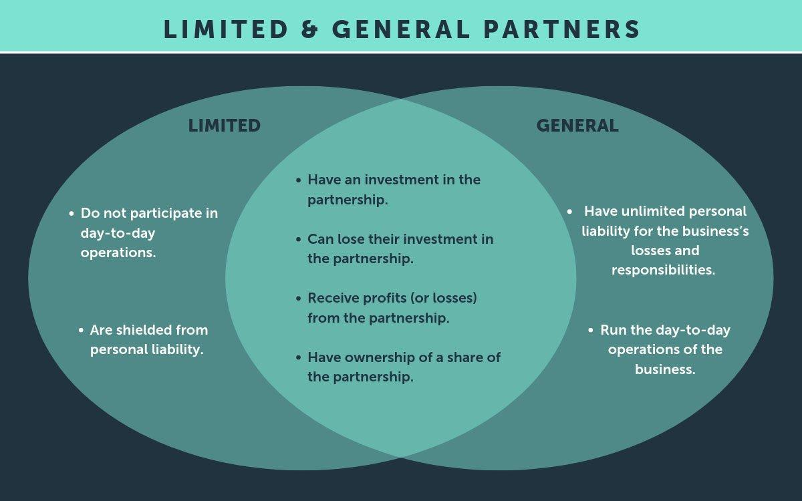

## Table of Contents

## What is a Real Estate Limited Partnership (RELP)?

A Real Estate Limited Partnership (RELP) is a type of investment where people come together to buy and manage properties. In a RELP, there are two types of partners: general partners and limited partners. General partners are in charge of running the business and making decisions about the properties. Limited partners, on the other hand, invest money but don't have a say in how things are run. They just get a share of the profits.

RELP can be a good way for people to invest in real estate without having to buy and manage properties on their own. It allows them to pool their money with others to buy bigger and potentially more profitable properties. However, there are risks involved. Limited partners have to trust the general partners to make good decisions, and if the properties don't do well, they could lose their investment. It's important for anyone thinking about joining a RELP to understand both the potential rewards and the risks.

## How does a Real Estate Limited Partnership work?

A Real Estate Limited Partnership (RELP) is a way for people to invest in real estate together. In a RELP, there are two types of people involved: general partners and limited partners. General partners are the ones who run the show. They find the properties, buy them, and take care of them. They make all the big decisions. Limited partners, on the other hand, are just investors. They put in money to help buy the properties, but they don't get to decide what happens with them. They just sit back and hope the properties make money so they can get some of the profits.

The way it works is that the general partners use the money from the limited partners to buy real estate, like apartments, shopping centers, or office buildings. The goal is to make money from these properties, either by renting them out or selling them for more than they paid. If the properties do well, the limited partners get a share of the profits. But if things go badly, the limited partners could lose their money. The general partners usually get paid a fee for managing everything, and they might also get a bigger share of the profits if the properties do really well. So, it's important for limited partners to trust that the general partners know what they're doing.

## What are the benefits of investing in a RELP?

One of the main benefits of investing in a Real Estate Limited Partnership (RELP) is that it lets you invest in real estate without having to buy and manage properties yourself. It can be a lot of work to find, buy, and take care of real estate. With a RELP, you can just put in your money and let someone else do all the hard work. This is great if you want to invest in real estate but don't have the time or know-how to do it on your own.

Another benefit is that you can pool your money with other investors to buy bigger and better properties. Big properties like shopping centers or apartment buildings can make a lot of money, but they cost a lot to buy. By joining a RELP, you can be part of owning these big properties without having to come up with all the money yourself. This can lead to bigger profits than if you were just buying smaller properties on your own.

## What are the risks associated with RELPs?

One of the main risks with Real Estate Limited Partnerships (RELP) is that you could lose your money. If the properties the RELP buys don't do well, they might not make any money or could even lose value. Since you're a limited partner, you don't get to make decisions about what properties to buy or how to manage them. You have to trust the general partners to make good choices. If they don't, and the properties don't make money, you could lose what you invested.

Another risk is that RELPs can be hard to get out of. If you decide you want your money back, it's not always easy to sell your share in the partnership. You might have to wait until the properties are sold, which could take a long time. Also, because you're not in charge, you have to rely on the general partners to be honest and good at their jobs. If they're not, it could be a big problem for you as a limited partner.

## Who can invest in a Real Estate Limited Partnership?

Anyone can invest in a Real Estate Limited Partnership (RELP) as long as they have the money to do so. You don't need to be rich or have special skills. All you need is the cash to buy into the partnership. But, it's important to understand that RELPs are usually for people who can handle the risk of losing their money. They're not for everyone, especially not for people who need their money back quickly or can't afford to lose it.

Some RELPs might have rules about who can invest. For example, they might only let people in who have a certain amount of money or who are considered "accredited investors." An accredited investor is someone who the government thinks is smart enough about money to handle the risks of certain investments. But even if you meet these rules, you should still think carefully about whether a RELP is right for you. It's a good idea to talk to a financial advisor to make sure you understand all the risks and benefits before you decide to invest.

## How is a RELP structured legally?

A Real Estate Limited Partnership (RELP) is set up under the law as a partnership, but it has special rules. There are two types of partners: general partners and limited partners. General partners run the business and make all the decisions. They are also responsible for any debts the partnership might have. Limited partners just put in money and get a share of any profits, but they don't make decisions and they aren't responsible for debts beyond what they invested.

The legal structure of a RELP is written down in a document called the partnership agreement. This agreement says who the general and limited partners are, how much money each limited partner puts in, and how profits and losses are shared. It also explains what happens if the partnership wants to buy new properties or sell old ones, and how limited partners can get their money back if they want to leave the partnership. This agreement is important because it keeps everything clear and fair for everyone involved.

## What is the role of the general partner in a RELP?

The general partner in a Real Estate Limited Partnership (RELP) is in charge of running the whole show. They find the properties to buy, take care of them, and make all the big decisions. This includes deciding when to buy or sell properties, how to manage them, and how to make money from them. The general partner also deals with any problems that come up, like fixing things that break or finding new tenants if someone moves out. They have a lot of responsibility because they're the ones who make sure the partnership runs smoothly.

Because the general partner is in charge, they also have to deal with any debts the partnership might have. If the partnership can't pay its bills, the general partner could be on the hook for the money. In return for all this work and risk, the general partner usually gets paid a fee for managing the partnership. They might also get a bigger share of the profits if the properties do really well. So, it's important for the general partner to be good at their job and make smart choices to keep everyone happy and make money for the partnership.

## What is the role of the limited partners in a RELP?

The role of limited partners in a Real Estate Limited Partnership (RELP) is to invest money into the partnership. They put in cash to help buy properties, but they don't get to make decisions about what to buy or how to run things. Their job is just to provide the money that the general partner uses to find and buy real estate.

In return for their investment, limited partners get a share of any profits the properties make. If the properties do well, they can earn money without having to do any of the work. But there's a risk too. If the properties don't do well, limited partners could lose the money they put in. They have to trust the general partner to make good choices, because they don't have any say in how things are run.

## How does taxation work in a Real Estate Limited Partnership?

In a Real Estate Limited Partnership (RELP), the way taxes work is pretty straightforward. The partnership itself doesn't pay taxes. Instead, any money the partnership makes or loses is passed on to the partners. This means that both the general partners and the limited partners have to report their share of the partnership's income or losses on their own tax returns. They pay taxes based on their personal tax situation, which can be different for each person.

This can be good or bad depending on how much money the partnership makes. If the partnership makes a lot of money, the partners might have to pay more in taxes. But if the partnership loses money, the partners can sometimes use those losses to reduce the taxes they have to pay on other income. It's important for partners to keep good records and maybe talk to a tax advisor to make sure they're doing everything right and taking advantage of any tax benefits they can.

## What are the key considerations before investing in a RELP?

Before you put your money into a Real Estate Limited Partnership (RELP), you should think about a few important things. First, understand that you're trusting the general partners to make good choices about buying and managing properties. You won't have a say in these decisions, so you need to be sure they know what they're doing. Also, think about how much money you can afford to lose. RELPs can be risky, and if the properties don't do well, you could lose your investment. It's not a good idea to put money into a RELP if you might need it back soon or if losing it would be a big problem for you.

Another thing to consider is how long you're willing to keep your money tied up. It can be hard to get your money out of a RELP because you might have to wait until the properties are sold. You should also look at the fees and how profits are shared. General partners usually get paid a fee for managing the partnership, and they might get a bigger share of the profits if things go well. Make sure you understand all these details and how they might affect your returns. Talking to a financial advisor can help you figure out if a RELP is right for you and if you're ready for the risks and rewards that come with it.

## How do RELPs compare to other real estate investment options like REITs?

Real Estate Limited Partnerships (RELP) and Real Estate Investment Trusts (REITs) are both ways to invest in real estate, but they work differently. In a RELP, you invest money as a limited partner and the general partners run the show. They buy and manage properties, and you get a share of the profits. RELPs can be riskier because you might lose your money if the properties don't do well, and it can be hard to get your money back out. On the other hand, REITs are companies that own or finance real estate and you can buy shares in them like you would with any other stock. REITs are usually easier to buy and sell because they trade on stock exchanges, and they have to pay out most of their income as dividends to shareholders.

Another big difference is how they're taxed. In a RELP, the partnership itself doesn't pay taxes. Instead, the income or losses are passed on to the partners, who report it on their own tax returns. This can be good if the partnership loses money because you might be able to use those losses to lower your taxes. REITs, on the other hand, don't have to pay corporate income tax as long as they pay out at least 90% of their taxable income as dividends. This means you'll get regular dividend payments, but you'll have to pay taxes on them as part of your personal income. So, RELPs might be better if you're okay with more risk and want to use losses to lower your taxes, while REITs might be better if you want something easier to buy and sell and get regular income.

## What are some case studies or examples of successful Real Estate Limited Partnerships?

One example of a successful Real Estate Limited Partnership is the Boston Properties Limited Partnership. They started in the 1970s and have grown into a big company that owns and manages a lot of office buildings and other properties in big cities like Boston, New York, and San Francisco. They've done well by [picking](/wiki/asset-class-picking) good locations and taking care of their buildings. This has made money for their limited partners over the years. Boston Properties is a good example of how a RELP can grow and make money if the general partners make smart choices.

Another example is the JPI Apartment Partnership, which focuses on building and managing apartments. They started in the 1980s and have built a lot of apartment buildings in places where people want to live, like Texas and California. They've been successful because they understand what people are looking for in a place to live and they build apartments that meet those needs. This has helped them make money for their limited partners. JPI shows that a RELP can do well if it focuses on a specific type of property and knows its market.

## References & Further Reading

[1]: ["Advances in Financial Machine Learning"](https://www.amazon.com/Advances-Financial-Machine-Learning-Marcos/dp/1119482089) by Marcos Lopez de Prado

[2]: ["Evidence-Based Technical Analysis: Applying the Scientific Method and Statistical Inference to Trading Signals"](https://www.amazon.com/Evidence-Based-Technical-Analysis-Scientific-Statistical/dp/0470008741) by David Aronson

[3]: ["Machine Learning for Algorithmic Trading"](https://github.com/stefan-jansen/machine-learning-for-trading) by Stefan Jansen

[4]: ["Quantitative Trading: How to Build Your Own Algorithmic Trading Business"](https://www.amazon.com/Quantitative-Trading-Build-Algorithmic-Business/dp/1119800064) by Ernest P. Chan

[5]: Bergstra, J., Bardenet, R., Bengio, Y., & Kégl, B. (2011). ["Algorithms for Hyper-Parameter Optimization."](https://dl.acm.org/doi/10.5555/2986459.2986743) Advances in Neural Information Processing Systems 24.