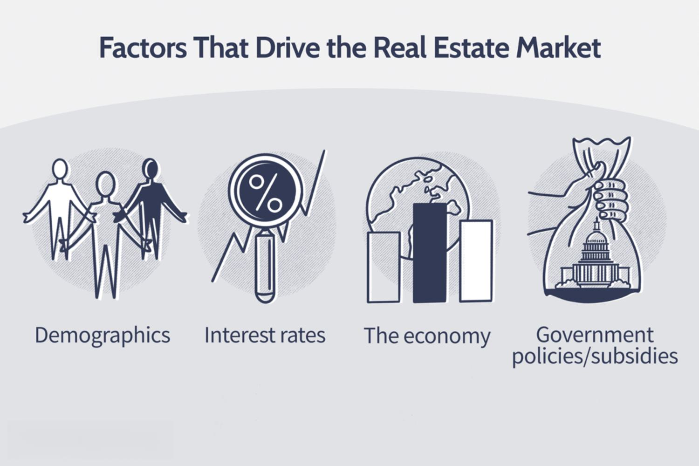

The intersection of real estate and financial technology has become a dynamic area of exploration and innovation, offering new opportunities and challenges for industry stakeholders. In recent years, the integration of financial technologies has transformed traditional practices in the real estate sector, leading to the emergence of new paradigms such as property classification systems, market tier analysis, and algorithmic trading. These components play significant roles in defining market dynamics and influencing investment strategies.

Property classification, for instance, provides a structured approach to categorizing real estate assets based on characteristics such as usage, location, and valuation. By employing robust classification systems, investors and developers can better assess asset performance, identify opportunities, and mitigate risks. Market tiers help in understanding the relative attractiveness and risk profiles of different geographic markets based on factors like liquidity, growth potential, and price stability.

Algorithmic trading, a concept initially popularized in equity and forex markets, is beginning to find applications within real estate. The adoption of algorithmic strategies allows for more efficient transaction processes, leveraging real-time data for swift decision-making. As these algorithmic techniques gain traction, they promise to enhance market efficiency and provide competitive advantages to stakeholders capable of harnessing their potential.

In the era of big data, data-driven decision-making is increasingly vital. Real estate investments require extensive analysis, and the capability to synthesize a multitude of data inputs enables more informed decisions. Financial analysts, developers, and investors who utilize cutting-edge technologies to interpret and react to market signals are better positioned to maximize returns and adapt to changing conditions. These developments underscore the growing importance of integrating technology-driven strategies in the real estate sector, encouraging a continuous evolution of methodologies and practices. Embracing these advancements is crucial for stakeholders aiming to strengthen their roles within the industry, ensuring that they remain competitive in a landscape reshaped by innovation.

## Table of Contents

## Understanding Real Estate Property Classification

Real estate property classification represents a systematic approach to categorizing properties based on various characteristics and intended use. This classification significantly influences market dynamics, investment strategies, and property valuation. Understanding these classifications is crucial for investors, developers, and financial analysts to make informed decisions.

Properties are primarily classified into four categories: residential, commercial, industrial, and mixed-use. Each classification serves distinct purposes and carries different risk profiles and market opportunities.

**Residential Properties** are used for housing purposes. This category includes single-family homes, apartments, condominiums, and co-operatives. Residential properties are typically valued based on factors such as location, size, amenities, and market demand. Investors in this category focus on factors like rental income potential and market appreciation.

**Commercial Properties** encompass buildings or land intended for business activities. This includes office spaces, retail centers, hotels, and medical facilities. The valuation of commercial properties often considers the income-generating potential of the property, typically evaluated through metrics such as the capitalization rate (cap rate), calculated as:

$$
\text{Cap Rate} = \frac{\text{Net Operating Income (NOI)}}{\text{Current Market Value}}
$$

Commercial properties are generally evaluated for their return on investment (ROI), lease agreements, and the creditworthiness of tenants.

**Industrial Properties** are used for manufacturing, distribution, and storage. This category includes factories, warehouses, and research and development facilities. Factors influencing industrial property value include logistical considerations, accessibility to transportation networks, and zoning laws. Investors are interested in long-term leases and the property's adaptability to technological changes and industry shifts.

**Mixed-use Properties** are developments that combine residential, commercial, and sometimes industrial uses within a single complex or area. These properties aim to create self-sustaining environments where individuals can live, work, and play. Valuation and investment strategies for mixed-use properties consider the integration and synergy between the uses, the locality's economic environment, and urban planning regulations.

The criteria for property classification typically involve the property's usage, the zoning laws governing the location, and market demand. These classifications have profound implications on market valuation. For instance, commercial properties in urban centers typically command higher prices due to demand and income potential compared to similar-sized residential properties.

Furthermore, property classification affects investment strategies. Residential investments are often considered safer and less volatile compared to commercial or industrial investments, which may offer higher returns but come with greater risks. Mixed-use properties provide diversification benefits within the same investment.

In summary, real estate property classification is pivotal in understanding market trends and developing investment strategies. It provides a structured framework that helps predict property performance, analyze market risks, and formulate investment decisions. As real estate markets grow and evolve, the criteria and significance of these classifications may also change, requiring continuous market analysis and adjustment of investment approaches.

## Market Tiers in Real Estate

Market tiers play a critical role in shaping real estate investment strategies by categorizing regions based on their economic and developmental status. Understanding these tiers helps investors assess risk, predict price trends, and forecast growth potential.

### Differences between Primary, Secondary, and Tertiary Markets

1. **Primary Markets**: These are major metropolitan areas characterized by high population density, robust infrastructure, and vibrant economic activity. Examples include New York, Los Angeles, and Chicago. Primary markets are generally more stable, offering secure long-term investments due to high demand and liquidity. However, they often come with lower capitalization rates and higher entry costs. Investors in primary markets can expect steady cash flow and the potential for long-term appreciation.

2. **Secondary Markets**: These are mid-sized cities or growing metropolitan areas that show strong economic signals such as employment growth and population increase but are smaller than primary markets. Cities like Denver, Austin, and Charlotte fall into this category. Secondary markets typically present higher capitalization rates compared to primary markets, indicating higher potential returns. They offer a balance of moderate risk and growth potential, making them attractive for investors seeking both income and appreciation.

3. **Tertiary Markets**: These regions are smaller and less populous with fewer economic activities than primary and secondary markets. Examples include Boise, Chattanooga, and Des Moines. Tertiary markets often present higher risks due to economic volatility but offer potentially higher returns. They are suitable for risk-tolerant investors looking for opportunities in underdeveloped areas with the possibility of significant appreciation and income through rental properties.

### Impact of Market Tiers on Investment Risk, Price Trends, and Growth Potential

Market tiers influence investment risk, price trends, and growth potential significantly:

- **Investment Risk**: Primary markets offer lower risk due to their size, economic diversity, and liquidity. The downside is that competitive market conditions can lower yields. Secondary markets embody a moderate risk profile, balancing risk and rewards effectively. Tertiary markets are riskier owing to limited economic drivers and higher susceptibility to economic downturns.

- **Price Trends**: Primary markets generally exhibit stable or slowly appreciating property prices owing to high demand and less volatility. In secondary markets, price appreciation can be more pronounced due to factors like population influx and economic development. Tertiary market prices can be volatile, influenced by economic shifts or infrastructure developments.

- **Growth Potential**: Primary markets offer limited but steady growth, reflecting mature economic conditions. Growth in secondary markets can be substantial as these regions benefit from spillover effects of primary markets, infrastructure improvements, and demographic trends. Tertiary markets potentially offer the most significant growth opportunities, particularly if they become more accessible or develop new economic drivers.

Understanding these distinctions allows investors to tailor their strategies according to risk tolerance, income goals, and long-term growth ambitions. Decisions on market selection impact not only the nature of property investments but also the approach to portfolio diversification within the real estate sector.

 to Algorithmic Trading in Real Estate

Algorithmic trading, often referred to as algo trading, entails utilizing computer algorithms to execute trades at high speed and [volume](/wiki/volume-trading-strategy), based on pre-defined criteria. Originating in the finance sector, [algorithmic trading](/wiki/algorithmic-trading) gained prominence with advancements in software, computational power, and data processing capabilities in the late 20th century. It emerged as a pivotal innovation on major stock exchanges by enhancing trading efficiency and accuracy, reducing human error, and capitalizing on momentary market inefficiencies.

In recent years, the principles of algorithmic trading have been increasingly applied to the real estate market. Although real estate transactions are inherently different from securities due to their complexity and lower [liquidity](/wiki/liquidity-risk-premium), the growing digitization of real estate data has enabled algorithmic applications. These algorithms are specially designed to analyze large datasets, such as property values, market trends, and economic indicators, to make informed investment decisions and automate the buying or selling of properties.

An instance of this application is the use of algorithms to predict property price movements and determine optimal buying or selling points, which mirrors the approach used in stock markets. Algorithms may also assess rental yields and forecast demand in various markets to guide investment strategies. These systems can leverage [machine learning](/wiki/machine-learning) techniques to improve predictions over time by analyzing historical data and adjusting to new information.

Examples of algorithmic trading strategies in real estate include:

1. **Price Arbitrage Strategy**: Similar to arbitrage opportunities in financial markets where the price of an asset is different in two markets, real estate algorithms can exploit price differences between geographical locations or property types. For instance, an algorithm may identify a property undervalued in a particular region compared to similar properties elsewhere.

2. **Trend Following Strategy**: Algorithms can be programmed to follow market trends by analyzing historical price data of properties. For example, if a city's real estate market has shown consistent appreciation over a certain period, an algorithm might trigger a buy signal based on set criteria indicative of an upward trend.

3. **Mean Reversion Strategy**: This strategy operates on the assumption that asset prices will revert to their historical mean over time. In real estate, algorithms might identify properties priced significantly below their historical average, flagging them as potential investment opportunities for eventual price correction.

By adopting these algorithmic approaches, real estate investors can achieve a level of precision and speed previously unattainable through manual analysis. Furthermore, as technology evolves, the implementation of more sophisticated algorithms capable of interpreting vast amounts of real estate data continues to transform investment methodologies in the property sector.

## The Role of Technology in Transforming Real Estate Investments

The integration of technology into real estate investments has significantly reshaped the industry, leading to enhanced efficiency, accuracy, and strategic decision-making. The adoption of big data, [artificial intelligence](/wiki/ai-artificial-intelligence) (AI), and machine learning has provided stakeholders with deeper insights, transforming how properties are classified, analyzed, and traded.

Digital transformation in real estate is largely characterized by the advent of big data. Brokers, investors, and analysts have unprecedented access to vast amounts of data, ranging from historical property prices to intricate market trends. This data enables comprehensive market analysis, allowing for more informed decision-making. For example, predictive analytics can forecast property values by analyzing historical pricing trends, economic indicators, and demographic data. This data-driven approach to market analysis minimizes uncertainties and enhances investment strategies.

AI and machine learning further enhance property classification by automating the assessment of property characteristics. Machine learning algorithms can dynamically classify properties by analyzing diverse datasets, such as structural features, location attributes, and market dynamics. This automation not only accelerates the classification process but also ensures a higher level of accuracy. For instance, a machine learning model trained to recognize features indicative of high-value residential properties can assess and classify new listings, aiding investors in identifying lucrative opportunities quickly.

Technological advancements have also contributed to strategic decision-making through the development of sophisticated simulation and modeling tools. These tools analyze various scenarios and project potential outcomes based on current market conditions and historical data. Such models enable investors to evaluate risk and return profiles effectively, optimizing their portfolios.

Furthermore, blockchain technology is emerging as a transformative force in real estate transactions, offering transparent and immutable records. This technology reduces transactional friction and the potential for fraud, streamlining processes such as property transfers and title verifications.

In summary, technological advancements are at the forefront of transforming real estate investments. The marriage of big data, AI, and machine learning with property classification and market analysis offers unparalleled insights and efficiency. These innovations empower stakeholders to make data-driven decisions, ultimately leading to more strategic and successful investments in the real estate sector.

## Benefits and Challenges of Real Estate Algo Trading

Algorithmic trading in real estate refers to the use of computer algorithms to automate trading decisions based on predefined criteria. This approach offers several advantages that can significantly enhance investment strategies. 

### Advantages

One primary advantage of algorithmic trading in real estate is its speed. Algorithms can process vast amounts of data and execute trades within milliseconds, far surpassing human capabilities. This swiftness enables investors to capitalize on short-lived market opportunities that would otherwise be missed.

Precision is another benefit. Algorithms operate without the emotional biases that often affect human traders, ensuring that decisions are based strictly on data and predetermined strategies. This accuracy minimizes the risk of manual errors, leading to more reliable outcomes.

Algorithmic trading can also handle complex calculations and data analysis that would be time-consuming and challenging for human analysts. For example, algorithms can integrate various data sources, such as interest rates, housing trends, and demographic information, to generate insights that inform investment decisions.

### Challenges

Despite these advantages, implementing algorithmic trading in real estate comes with challenges. One significant risk is the reliance on historical data. Algorithms are typically trained using past data, which may not always predict future market conditions accurately. This dependence can lead to errors if the market behaves unpredictably.

Market liquidity is another concern. Real estate markets are generally less liquid than stock markets, meaning there are fewer buyers and sellers at any given time. This lack of liquidity can lead to increased [volatility](/wiki/volatility-trading-strategies) and potentially significant impacts on pricing when algorithms execute large trades.

Technical failures can also pose risks. Algorithms rely on technological infrastructure to function correctly. Any disruptions, such as software bugs or data feed issues, can lead to incorrect trading decisions and financial losses.

### Real-world Examples

Several real-world examples illustrate both the benefits and challenges of real estate algorithmic trading. For instance, some real estate investment trust (REIT) firms have successfully implemented algorithmic trading strategies to optimize their investment portfolios. These algorithms analyze market trends and tenant behaviors to predict property value changes, enhancing investment returns.

Conversely, there have been instances where algorithmic trading led to substantial losses due to unforeseen market conditions. In such cases, rapid price fluctuations and lack of liquidity exacerbated the situation, highlighting the importance of robust risk management measures.

In summary, while algorithmic trading presents significant opportunities for enhancing real estate investments through speed and precision, it also requires careful consideration of potential challenges, particularly those related to data reliability, market liquidity, and technical infrastructure.

## Future Trends and Predictions

The convergence of real estate and financial technologies is fostering transformative changes, with emerging trends poised to redefine property classification, market tiers, and algorithmic trading. One notable trend is the increasing integration of artificial intelligence (AI) and machine learning (ML) to enhance data-driven decision-making in real estate investments. As AI technologies evolve, they offer sophisticated tools for analyzing massive datasets, enabling more precise property classification and valuation.

In terms of market tiers, there is an expectation that AI will enhance understanding of primary, secondary, and tertiary markets. By offering insights into historical data and current trends, AI can assist in predicting market movements, identifying high-potential investments, and tailoring strategies to different tiers. Moreover, ML algorithms can dynamically adjust investment strategies to reflect changes in market conditions, presenting a more flexible approach to real estate investment.

Algorithmic trading in real estate is anticipated to advance significantly. As algorithmic methods mature, they become adept at processing real estate market data efficiently and executing trades with increased speed and accuracy. These developments can lead to more liquidity in real estate markets, as well as enhanced risk management.

Macroeconomic factors and technological innovation also play crucial roles in shaping the future of real estate investments. Fluctuations in interest rates, inflation, and economic growth influence investment opportunities and returns. As economic conditions change, technological solutions can provide real-time analysis and forecasts, allowing investors to adjust their portfolios appropriately.

The evolution of property classification is expected to incorporate environmental, social, and governance ([ESG](/wiki/esg-investing)) criteria more deeply. The growing emphasis on sustainability and ethical investment practices necessitates incorporating ESG metrics into property classifications, affecting both valuations and investor interest.

Overall, technological advancements promise to enhance transparency and efficiency in the real estate sector. Investors and developers who leverage these tools are likely to gain competitive advantages, aligning their strategies with emerging trends and evolving macroeconomic contexts. As the landscape continues to shift, staying informed and adaptable remains crucial for success in the increasingly data-driven real estate market.

## Conclusion

In summary, this article has explored the integral components shaping the intersection between real estate and financial technology, focusing on property classification, market tiers, and algorithmic trading. Real estate property classification serves as a foundational tool for categorizing assets into distinct types such as residential, commercial, industrial, and mixed-use properties. This classification system not only enhances market understanding but also informs investment strategies by enabling accurate market valuation and strategic positioning.

The concept of market tiers further nuances the investment landscape. Primary, secondary, and tertiary markets offer varying degrees of risk, price trends, and growth potential. Recognizing these differences is crucial for investors seeking to optimize returns while managing potential risks effectively.

Algorithmic trading represents a significant technological advancement, increasingly applied within the real estate market. Originating from traditional finance, algorithmic trading leverages systematic decision-making, underpinned by complex mathematical models and vast data pools, to execute trades with speed and precision. The application of such strategies in real estate has brought automation and enhanced analytical capability to the forefront of investment strategies, although it also introduces challenges such as technological dependency and market volatility.

The importance of staying informed about technology trends and market dynamics cannot be overstated. The digital transformation of the real estate sector, spurred by big data, artificial intelligence, and machine learning, is driving unprecedented changes in property classification and market analysis. As these technologies advance, embracing innovation becomes imperative for investors, developers, and analysts aiming to maintain a competitive edge.

In conclusion, the fusion of real estate with fintech is reshaping the industry landscape. By harnessing the power of data-driven decision-making and technological innovation, stakeholders can navigate complexities with greater agility and foresight. Remaining adaptable and informed is vital to capitalizing on the evolving opportunities within this dynamic sector.

## References & Further Reading

[1]: Rosenthal, R. (2018). ["The Real Estate Wholesaling Bible: The Fastest, Easiest Way to Get Started in Real Estate Investing."](https://www.amazon.com/Real-Estate-Wholesaling-Bible-Investing-ebook/dp/B00JJVLIPC) John Wiley & Sons.

[2]: Molino, J.B. (2020). ["Real Estate Market Analysis: Methods and Case Studies, Second Edition."](https://books.google.com/books/about/Real_Estate_Market_Analysis.html?id=ouWBrgEACAAJ) Urban Land Institute.

[3]: Brueggeman, W. B., & Fisher, J. D. (2015). ["Real Estate Finance and Investments."](https://www.semanticscholar.org/paper/Real-Estate-Finance-and-Investments-Brueggeman-Fisher/e2edab62457a6b506c551ee095bc9510c266193c) McGraw-Hill Education.

[4]: Fabozzi, F. J., & Shiller, R. J. (2011). ["The Subprime Solution: How Today's Global Financial Crisis Happened, and What to Do about It."](https://www.jstor.org/stable/j.cttq94jd) Princeton University Press.

[5]: Parker, D. (2016). ["Algorithmic Trading and Quantitative Strategies."](https://api.pageplace.de/preview/DT0400.9781498737197_A39374186/preview-9781498737197_A39374186.pdf) Springer.

[6]: Tsatsaronis, K., & Zhu, H. (2004). ["What drives housing price dynamics: cross-country evidence."](https://www.bis.org/publ/qtrpdf/r_qt0403f.pdf) Bank for International Settlements. 

[7]: Mills, T. C., & Patterson, K. (Eds.). (2009). ["Palgrave Handbook of Econometrics: Volume 2: Applied Econometrics."](https://link.springer.com/book/10.1057/9780230244405) Palgrave Macmillan.