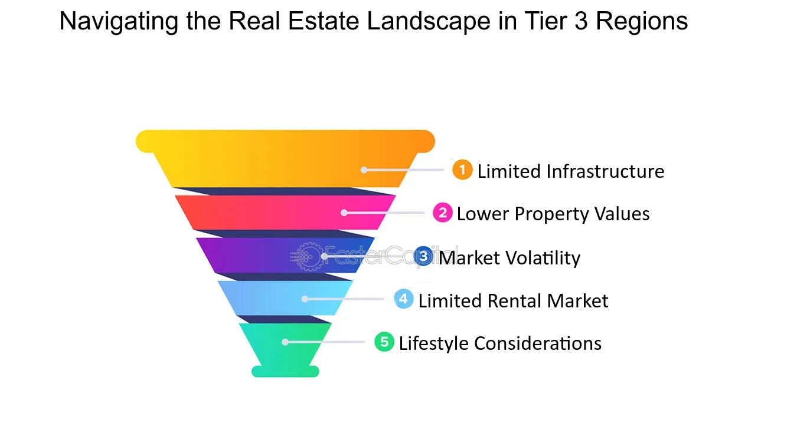

## Table of Contents

## What are real estate market tiers?

Real estate market tiers are a way to group properties based on their price and quality. There are usually three tiers: luxury, mid-tier, and affordable. Luxury properties are the most expensive and often have the best features and locations. Mid-tier properties are in the middle, offering a good balance between price and quality. Affordable properties are the least expensive and might not have as many features or be in the best locations.

These tiers help people understand the different levels of the real estate market. For example, if someone is looking to buy a home, knowing the tiers can help them decide what they can afford and what kind of property they might get for their money. Real estate agents and developers also use these tiers to target their marketing and plan new projects. By understanding the tiers, everyone involved in the real estate market can make better decisions.

## How many tiers are typically recognized in the real estate market?

In the real estate market, there are usually three tiers that people talk about. These are called luxury, mid-tier, and affordable. Luxury properties are the most expensive and often have the best features and are in the best locations. Mid-tier properties are in the middle, offering a good balance between price and quality. Affordable properties are the least expensive and might not have as many features or be in the best locations.

These tiers help everyone understand the different levels of the real estate market. If someone wants to buy a home, knowing the tiers can help them figure out what they can afford and what kind of property they might get. Real estate agents and developers also use these tiers to decide how to market their properties and plan new projects. By understanding the tiers, everyone can make better choices in the real estate market.

## What factors determine the tier of a real estate market?

The tier of a real estate market is determined by a few key factors. The first factor is price. Luxury properties are the most expensive, mid-tier properties are in the middle, and affordable properties are the cheapest. The price often reflects the quality and location of the property. For example, a luxury home might be in a fancy neighborhood with lots of amenities, while an affordable home might be in a less desirable area with fewer features.

Another important factor is the quality of the property. Luxury homes usually have the best materials and finishes, like marble countertops and hardwood floors. Mid-tier homes might have good quality but not as fancy as luxury homes. Affordable homes might use cheaper materials and have simpler designs. The quality can also affect how much people are willing to pay for a property.

Location is also a big factor. Luxury properties are often in the best locations, like near the beach or in the city center. Mid-tier properties might be in good but not the best areas. Affordable properties are often in less desirable locations, like far from the city or in areas with fewer amenities. The location can make a big difference in the price and the tier of a property.

## What is the difference between a Tier 1 and a Tier 2 real estate market?

A Tier 1 real estate market is usually the top level, where you find the most expensive and luxurious properties. These are often in the best locations, like right by the beach or in the heart of the city. The homes in a Tier 1 market have the best features, like fancy kitchens with marble countertops and big yards with pools. People who can afford to buy in a Tier 1 market are usually wealthy and looking for the best of the best.

A Tier 2 real estate market is a step down from Tier 1. The properties here are not as expensive as Tier 1, but they are still nice and can offer a good balance between price and quality. These homes might be in good neighborhoods but not the best ones. They might have good features, like nice kitchens and decent yards, but not as fancy as what you'd find in Tier 1. People who buy in a Tier 2 market are often looking for a good home that they can afford without spending as much as they would in a Tier 1 market.

## How does the location impact the tier classification of a real estate market?

Location is a big reason why a property is in one tier or another in the real estate market. If a home is in a fancy neighborhood, like right by the beach or in the middle of the city, it's usually in the luxury tier. These places are popular and people want to live there, so the homes cost more. On the other hand, if a home is far away from the city or in a less popular area, it might be in the affordable tier. People might not want to live there as much, so the homes cost less.

The middle tier, or mid-tier, is for homes that are in good but not the best locations. These homes might be in a nice neighborhood but not as fancy as the luxury tier. They are a good choice for people who want a nice home without paying the high prices of the luxury tier. So, the location can make a big difference in which tier a home fits into, and it's a key factor that people think about when buying a home.

## Can the tier of a real estate market change over time? If so, how?

Yes, the tier of a real estate market can change over time. This can happen because of changes in the area. For example, if a new mall or a good school is built in a neighborhood, more people might want to live there. This can make the prices go up and move the area from an affordable tier to a mid-tier or even a luxury tier.

Also, the economy can affect the tiers. If the economy gets better, people might have more money to spend on homes. This can push up the prices of homes in all tiers. On the other hand, if the economy gets worse, people might not be able to afford expensive homes, and prices might go down. This can move homes from a higher tier to a lower tier. So, the tier of a real estate market can change based on what's happening in the area and the economy.

## What are the investment risks and rewards associated with different tiers?

Investing in the luxury tier of the real estate market can bring big rewards but also comes with big risks. The reward is that luxury properties often go up in value a lot over time. This means you could sell the property for a lot more money later. But the risk is that luxury properties cost a lot to buy and keep up. If the economy gets bad, fewer people might be able to afford these expensive homes, and the value could go down. So, you need to be ready to spend a lot of money and wait for the right time to sell.

The mid-tier market is a bit safer but still has its own risks and rewards. The reward is that mid-tier properties can offer a good balance between price and potential profit. They might not go up in value as much as luxury homes, but they also don't cost as much to buy. The risk is that if the area doesn't get better over time, the value might not go up much. But if the area does improve, you could see a nice profit when you sell.

Investing in the affordable tier can be the least risky but also might not bring as big of rewards. The reward is that these properties are cheaper to buy, so you don't need as much money to start. They can be good for renting out because more people can afford to live in them. The risk is that affordable properties might not go up in value as much as luxury or mid-tier homes. If the area stays the same or gets worse, you might not make much money when you sell. But if the area improves, you could still see a good profit.

## How do economic factors influence the tier status of a real estate market?

Economic factors can really change the tier status of a real estate market. When the economy is doing well, people have more money to spend on homes. This can push up the prices of homes in all tiers. Luxury homes might become even more expensive because more people can afford them. Mid-tier homes might move up to the luxury tier if the area gets better and prices go up. Even affordable homes can see their prices rise if the economy is strong and more people want to buy them.

On the other hand, if the economy gets bad, it can make home prices go down. Fewer people might be able to afford luxury homes, so their prices could drop, moving them down to a lower tier. Mid-tier homes might stay the same or move down to the affordable tier if prices fall a lot. Affordable homes might not change much in price, but they could become even more popular because they are cheaper. So, the economy can make a big difference in which tier a home fits into.

## What are some examples of cities or regions classified in each tier?

Some cities known for their luxury real estate markets include New York City, where neighborhoods like the Upper East Side and Tribeca have very expensive homes, and Beverly Hills in Los Angeles, famous for its fancy houses and celebrity residents. In Europe, cities like London, with areas like Mayfair and Kensington, and Monaco, known for its high-end properties along the Mediterranean, also fall into the luxury tier. These places have the most expensive homes because they are in popular and fancy locations.

Mid-tier markets can be found in cities like Austin, Texas, where neighborhoods like Hyde Park offer good homes at more reasonable prices, and Denver, Colorado, where places like Capitol Hill provide a nice balance between cost and quality. In Europe, cities like Berlin, with areas like Prenzlauer Berg, and Amsterdam, with neighborhoods like De Pijp, are considered mid-tier. These cities have homes that are not as expensive as luxury markets but still offer good quality and nice locations.

Affordable real estate markets are often found in smaller cities or less popular areas. In the U.S., cities like Detroit, Michigan, and Buffalo, New York, have neighborhoods where homes are cheaper. In Europe, cities like Sofia in Bulgaria and Lisbon in Portugal have affordable areas. These places have lower home prices because they are not as popular or fancy as luxury or mid-tier markets, making them more affordable for people looking to buy a home.

## How can real estate professionals leverage understanding of market tiers for better decision-making?

Real estate professionals can use their knowledge of market tiers to make better choices about buying, selling, and developing properties. If they know which tier a property is in, they can set the right price. For example, a luxury home should be priced higher than a mid-tier or affordable home. They can also target their marketing better. If they are selling a luxury home, they might want to advertise in fancy magazines or online sites that rich people use. Knowing the tiers helps them understand who their customers are and what those customers want.

Understanding market tiers also helps real estate professionals plan for the future. They can see trends in the market, like if a mid-tier area is getting better and might soon be considered luxury. This can help them decide where to buy land for new projects or where to invest their money. By keeping an eye on how the economy affects the tiers, they can make smart choices about when to buy or sell properties. This way, they can help their clients make good decisions too and be more successful in the real estate market.

## What advanced metrics should be used to accurately assess the tier of a real estate market?

To accurately assess the tier of a real estate market, real estate professionals should look at several advanced metrics. One important metric is the average price per square foot. This helps compare the value of homes in different areas. Another useful metric is the price-to-income ratio, which shows how affordable homes are for people in that area. If the ratio is high, it might mean the area is in a higher tier because homes are expensive compared to what people earn. Also, looking at the median home price can give a good idea of the overall cost of homes in the area. If the median price is very high, it might mean the area is in the luxury tier.

Another set of metrics to consider includes the rate of appreciation, which shows how fast home prices are going up, and the vacancy rate, which tells how many homes are empty. A high rate of appreciation might mean the area is moving up to a higher tier because home values are increasing quickly. A low vacancy rate can also indicate a higher tier because it means more people want to live there. Lastly, looking at the quality of local amenities, like schools and parks, can help assess the tier. Areas with better amenities often fall into higher tiers because they are more attractive to buyers. By using these metrics, real estate professionals can get a clearer picture of where a market stands in terms of tiers.

## How do global economic trends affect the dynamics of real estate market tiers?

Global economic trends can change the way real estate market tiers work. When the world economy is doing well, more people have money to spend on homes. This can make prices go up in all tiers. Luxury homes might get even more expensive because more people can afford them. Mid-tier homes might move up to the luxury tier if the area gets better and prices rise. Even affordable homes can see their prices go up if the economy is strong and more people want to buy them. But if the world economy gets bad, fewer people might be able to afford homes, and prices can go down. This might push luxury homes down to a lower tier and make mid-tier homes stay the same or move down to the affordable tier.

Global economic trends can also make people move to different places. For example, if a country's economy is doing really well, more people might want to live there. This can make the real estate market in that country go up in tier. On the other hand, if a country's economy is doing badly, people might leave, and the real estate market might go down in tier. Also, things like interest rates and currency values can affect how much people can afford to spend on homes. If interest rates go up, it might be harder for people to get loans to buy homes, which can affect all tiers of the real estate market. So, global economic trends can really shake things up in the real estate world.

## What is the Understanding of Real Estate Property Classification?

Real estate property classification represents a systematic approach to categorizing properties based on various characteristics and intended use. This classification significantly influences market dynamics, investment strategies, and property valuation. Understanding these classifications is crucial for investors, developers, and financial analysts to make informed decisions.

Properties are primarily classified into four categories: residential, commercial, industrial, and mixed-use. Each classification serves distinct purposes and carries different risk profiles and market opportunities.

**Residential Properties** are used for housing purposes. This category includes single-family homes, apartments, condominiums, and co-operatives. Residential properties are typically valued based on factors such as location, size, amenities, and market demand. Investors in this category focus on factors like rental income potential and market appreciation.

**Commercial Properties** encompass buildings or land intended for business activities. This includes office spaces, retail centers, hotels, and medical facilities. The valuation of commercial properties often considers the income-generating potential of the property, typically evaluated through metrics such as the capitalization rate (cap rate), calculated as:

$$
\text{Cap Rate} = \frac{\text{Net Operating Income (NOI)}}{\text{Current Market Value}}
$$

Commercial properties are generally evaluated for their return on investment (ROI), lease agreements, and the creditworthiness of tenants.

**Industrial Properties** are used for manufacturing, distribution, and storage. This category includes factories, warehouses, and research and development facilities. Factors influencing industrial property value include logistical considerations, accessibility to transportation networks, and zoning laws. Investors are interested in long-term leases and the property's adaptability to technological changes and industry shifts.

**Mixed-use Properties** are developments that combine residential, commercial, and sometimes industrial uses within a single complex or area. These properties aim to create self-sustaining environments where individuals can live, work, and play. Valuation and investment strategies for mixed-use properties consider the integration and synergy between the uses, the locality's economic environment, and urban planning regulations.

The criteria for property classification typically involve the property's usage, the zoning laws governing the location, and market demand. These classifications have profound implications on market valuation. For instance, commercial properties in urban centers typically command higher prices due to demand and income potential compared to similar-sized residential properties.

Furthermore, property classification affects investment strategies. Residential investments are often considered safer and less volatile compared to commercial or industrial investments, which may offer higher returns but come with greater risks. Mixed-use properties provide diversification benefits within the same investment.

In summary, real estate property classification is pivotal in understanding market trends and developing investment strategies. It provides a structured framework that helps predict property performance, analyze market risks, and formulate investment decisions. As real estate markets grow and evolve, the criteria and significance of these classifications may also change, requiring continuous market analysis and adjustment of investment approaches.

## References & Further Reading

[1]: Rosenthal, R. (2018). ["The Real Estate Wholesaling Bible: The Fastest, Easiest Way to Get Started in Real Estate Investing."](https://www.amazon.com/Real-Estate-Wholesaling-Bible-Investing-ebook/dp/B00JJVLIPC) John Wiley & Sons.

[2]: Molino, J.B. (2020). ["Real Estate Market Analysis: Methods and Case Studies, Second Edition."](https://books.google.com/books/about/Real_Estate_Market_Analysis.html?id=ouWBrgEACAAJ) Urban Land Institute.

[3]: Brueggeman, W. B., & Fisher, J. D. (2015). ["Real Estate Finance and Investments."](https://www.semanticscholar.org/paper/Real-Estate-Finance-and-Investments-Brueggeman-Fisher/e2edab62457a6b506c551ee095bc9510c266193c) McGraw-Hill Education.

[4]: Fabozzi, F. J., & Shiller, R. J. (2011). ["The Subprime Solution: How Today's Global Financial Crisis Happened, and What to Do about It."](https://www.jstor.org/stable/j.cttq94jd) Princeton University Press.

[5]: Parker, D. (2016). ["Algorithmic Trading and Quantitative Strategies."](https://api.pageplace.de/preview/DT0400.9781498737197_A39374186/preview-9781498737197_A39374186.pdf) Springer.

[6]: Tsatsaronis, K., & Zhu, H. (2004). ["What drives housing price dynamics: cross-country evidence."](https://www.bis.org/publ/qtrpdf/r_qt0403f.pdf) Bank for International Settlements. 

[7]: Mills, T. C., & Patterson, K. (Eds.). (2009). ["Palgrave Handbook of Econometrics: Volume 2: Applied Econometrics."](https://link.springer.com/book/10.1057/9780230244405) Palgrave Macmillan.