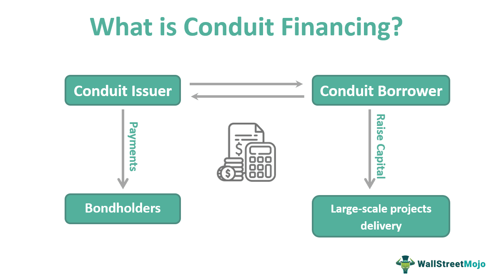

The landscape of real estate investment is indeed complex and multifaceted, encompassing a wide array of strategies, vehicles, and instruments designed to maximize returns while managing risk. Among these, Real Estate Mortgage Investment Conduits (REMICs) play a crucial role in the structuring of real estate investment portfolios. REMICs are financial vehicles that allow for the pooling of mortgage loans and the subsequent issuance of Mortgage-Backed Securities (MBS), enabling investors to gain exposure to real estate-backed assets without direct ownership of property. This nuanced approach provides liquidity and flexibility, which are vital components in responding to the ever-evolving nature of real estate markets.

Understanding the rules and implications of investing in REMICs is crucial for maximizing returns. The regulations governing REMICs are designed to optimize their efficacy as investment tools, providing both tax advantages and investment diversification. However, navigating these regulations requires a thorough grasp of their underlying principles and operational mechanisms, as improper management could lead to significant legal and financial repercussions. 

In parallel, algorithmic trading has become an influential force in how investments, including those in real estate, are evaluated and managed. The application of algorithms can enhance decision-making processes by optimizing risk assessments, valuations, and timing in securities trading. Algorithmic trading introduces a quantitative regime to investment strategies, which can further refine the approach to managing REMICs and other real estate instruments. This integration of advanced computational techniques with traditional investment strategies represents both an opportunity for growth and a challenge in maintaining effective practices amidst technological advancements.

This article will explore the key elements and rules associated with REMICs, detailing their similarities and differences with Collateralized Mortgage Obligations (CMOs) and Real Estate Investment Trusts (REITs). Furthermore, it will analyze the growing impact of algorithmic trading on real estate investment strategies. By doing so, readers will gain comprehensive insights into how these elements interact within the broader context of real estate investing and the potential pathways for optimizing their investment portfolios through informed strategy and advanced technology.

## Table of Contents

## What is a Real Estate Mortgage Investment Conduit (REMIC)?

A Real Estate Mortgage Investment Conduit (REMIC) is a special purpose vehicle established to pool mortgage loans and issue Mortgage-Backed Securities (MBS). This financial construction allows for the creation of diverse investment opportunities by categorizing mortgage loans into distinct tranches, each with unique risk and return profiles.

REMICs were authorized under the Tax Reform Act of 1986, a significant legislative action intended to streamline how mortgage-backed securities are taxed. The Act provided a specific legal and tax framework for REMICs, allowing them to facilitate the securitization of mortgage loans without the impediments that typically accompany traditional corporate and financial taxes. This tax exemption is a vital characteristic of REMICs, rendering them attractive to investors seeking mortgage-backed securities while avoiding the double taxation commonly associated with corporate structures.

Structurally, REMICs can be organized in multiple forms, including partnerships, trusts, corporations, or associations. This flexibility enables the conduit to accommodate varying legal and operational requisites depending on the financial objectives and regulatory compliance needs of the originators and participants. Despite these structural variations, most REMICs are constituted as trusts, which efficiently serve the purpose of holding mortgage pools and issuing corresponding securities.

The tax-exempt status of REMICs means they do not pay corporate income tax on interest income generated from the underlying mortgages. Instead, the tax obligations fall on the investors, who report earnings and expenses on their personal or corporate tax returns according to the character of each tranche’s cash flow received. This pass-through financial arrangement offers tax efficiency and can potentially enhance the yields available to investors holding REMIC-issued securities.

Through the pooling and securitization of mortgage loans, REMICs pave the way for enhanced [liquidity](/wiki/liquidity-risk-premium) in the financial markets, providing diverse and scalable investment opportunities while managing underlying risks associated with real estate lending.

## Understanding the Structure and Function of REMICs

Real Estate Mortgage Investment Conduits (REMICs) serve as sophisticated vehicles that transform large pools of mortgage loans into more marketable securities known as tranches. These tranches are effectively stratified layers of a mortgage-backed security, each designed to meet diverse investor needs in terms of risk and maturity profiles.

### Tranching of Mortgage Pools

The fundamental concept underlying a REMIC is the repackaging of a pool of mortgage loans into tranches, allowing investors to select a class that matches their risk tolerance and return expectations. Trunches are categorized by credit quality and maturity length:

- **Senior tranches** typically have the highest credit rating and are paid first from the mortgage cash flow, albeit with lower yields.
- **Mezzanine tranches** occupy the middle ground, offering balanced risk and return.
- **Equity or subordinate tranches** carry the most risk but also the potential for the highest returns, as they are the first to incur losses if underlying loans default.

### Roles of Key Entities in REMICs

Several entities play critical roles in the formation and maintenance of REMICs:

- **Sponsor**: The sponsor is responsible for assembling the mortgage loans and initiating the creation of the REMIC. The sponsor often retains a significant stake in the most subordinate tranches to align its interests with those of investors.

- **Depositor**: This entity serves as an intermediary, acquiring the mortgage pool from the sponsor and transferring it to the REMIC trust.

- **Servicer**: Essential for managing the ongoing operation of the mortgage loans, the servicer collects payments from borrowers, ensures accurate record-keeping, and handles foreclosures if necessary.

- **Trustee**: Acting as a custodian, the trustee manages the asset-backed trust, ensures compliance with REMIC regulations, and distributes payments to investors according to tranche priorities.

### Contribution to Market Liquidity and Investment Opportunities

By converting mortgage loans into a structured form like REMICs, greater liquidity is introduced into the real estate market. The issuance of mortgage-backed securities expands the market, thus providing more opportunities for investment. REMICs facilitate the distribution of risk among various classes of investors, making mortgage investment accessible to a broader audience, from conservative, risk-averse investors to aggressive, high-yield seekers.

REMICs are adept at offering tailored investment opportunities through tranching, which enhances the flexibility and appeal of real estate securities. The structure and operational roles within REMICs bolster confidence in mortgage-backed investing, further driving liquidity and diversity in real estate capital markets.

Through their intricate structuring and the involvement of multiple fiduciary entities, REMICs enhance the efficiency and stability of the financial market, thereby offering a vital instrument in real estate investment portfolios.

## Regulatory Framework and Changes to REMICs

Real Estate Mortgage Investment Conduits (REMICs) are governed by a specific set of federal regulations designed to ensure their proper functioning and tax treatment. Key among these regulations are sections 860A through 860G of the Internal Revenue Code. These provisions outline the requirements for REMIC qualifications, taxation, and operational mandates, critical for maintaining the tax-exempt status of these entities. 

### Federal Income Tax Code Sections 860A-860G

Sections 860A-860G are integral to the regulatory environment for REMICs. They stipulate the following conditions:

- **Qualification Requirements**: To qualify as a REMIC, the entity must be solely engaged in holding a pool of mortgage loans or foreclosure property and issuing multiple classes of securities to investors. The income generated must come predominantly from qualified mortgages or permitted investments.

- **Taxation Rules**: REMICs themselves are not subject to entity-level taxation. Instead, the income is passed through to the investors who then pay tax based on their proportionate share of the REMIC's income. This pass-through mechanism enables REMICs to avoid double taxation.

### Impact of the Real Estate Mortgage Investment Conduit Improvement Act of 2009

The Real Estate Mortgage Investment Conduit Improvement Act of 2009 significantly influenced the operations of REMICs. This legislation was particularly aimed at providing clarity and flexibility in the restructuring of mortgage securities in response to the financial crisis of 2008. It allowed REMICs to modify loans without risking their tax status, hence aiding in the management and mitigation of default risks.

### IRS Relief Measures During Economic Challenges

During unforeseeable economic challenges, such as the COVID-19 pandemic, the Internal Revenue Service (IRS) provided various relief measures to REMICs. These measures included extensions of certain filing deadlines and relaxed conditions for the modification of distressed mortgage loans. Such provisions were pivotal in allowing REMICs to maintain liquidity and continue functioning effectively under strained economic circumstances.

### Legal Implications and Tax Relief Provisions

Improper management of REMICs can have severe legal and financial consequences. If a REMIC fails to adhere to the stipulated requirements under sections 860A-860G, it risks losing its tax-exempt status. This would result in the REMIC being taxed as a corporation, significantly impacting the returns to investors.

Tax relief provisions are integral to mitigating these risks. For example, the Tax Reform Act of 1986 provides guidelines for REMICs to handle defaults in mortgage obligations without jeopardizing their tax treatment. By adhering to these guidelines, REMICs can navigate financial difficulties while preserving investor interests.

In conclusion, the regulatory framework surrounding REMICs is designed to facilitate their efficient operation while safeguarding investor returns. Understanding these regulations, along with potential legislative changes and relief measures, is crucial for ensuring compliance and optimizing the benefits offered by REMIC investments.

## REMICs vs. CMOs and REITs

REMICs (Real Estate Mortgage Investment Conduits), CMOs (Collateralized Mortgage Obligations), and REITs (Real Estate Investment Trusts) are popular vehicles in real estate investing, each with distinct structures, taxation, and investment implications. Understanding the differences and similarities among these can help investors align their investment strategies with their financial goals and risk tolerance.

### REMICs vs. CMOs
REMICs and CMOs primarily focus on mortgage-backed securities but differ in their structural and tax characteristics.

**Structure:**
REMICs and CMOs both repackage mortgage loans into tranches that vary by risk and return profiles. However, while all REMICs can be CMOs, not all CMOs are structured as REMICs. The primary distinction lies in the management and regulatory framework. REMICs are strictly defined under the Tax Reform Act of 1986 as special purpose vehicles. They are highly regulated, requiring compliance with IRS guidelines on structuring and income allocation.

**Taxation:**
REMICs enjoy a unique tax-exempt status, meaning they are not subject to entity-level federal taxation. Instead, income generated by REMICs passes through to the investors, who then report it on their individual tax returns. In contrast, CMOs not structured as REMICs could face different tax treatments, depending on their organizational setup, potentially leading to double taxation at the corporate and investor levels.

### REMICs vs. REITs
While both REMICs and REITs provide avenues for real estate investment, they cater to different segments of the market.

**Investment Strategies and Returns:**
REMICs focus on mortgage-backed securities, offering investors interests primarily in mortgage loans rather than direct ownership of real estate properties. The returns from REMICs typically depend on the performance of the underlying mortgages, including interest payments and principal prepayments. 

REITs, on the other hand, own, operate, or finance income-producing real estate. They generate revenue through rents or sales of properties. Consequently, REITs offer dividends and are prized for their potential for capital appreciation alongside income distribution, providing a more direct exposure to the real estate market.

**Tax Implications:**
REITs benefit from a "pass-through" mechanism, similar to REMICs, meaning they do not pay corporate income tax if they distribute at least 90% of their taxable income to shareholders. Investors must report these dividends as part of their taxable income. This requirement ensures that REITs serve as efficient income-generating vehicles for tax-sensitive investors, although investors face taxation on the dividends received.

### Investor Goals and Risk Tolerance
The choice between REMICs, CMOs, and REITs largely depends on the investor's goals and risk tolerance:

- **Risk Tolerance:** REMICs often appeal to conservative investors seeking structured debt exposure with predictable cash flows, courtesy of tranche differentiation that allows targeted risk management. CMOs might attract risk-tolerant investors when not under the REMIC umbrella, as they can offer higher returns at the cost of higher risk.

- **Investment Goals:** Investors focused on regular income might prefer REITs due to their dividend distribution mandates, in contrast to REMICs, which align with those looking for debt-based investment strategies.

Ultimately, the choice between these investment vehicles should consider the investors' specific market outlook, tax situation, and appetite for risk versus return.

## Algorithmic Trading in Real Estate Investment

Algorithmic trading, commonly defined as the use of computer algorithms to automate and optimize financial transactions, has significantly altered the landscape of modern financial markets. Its integration into real estate investment strategies is gradually transforming how portfolios are managed and assets evaluated. The precision and speed of algorithmic systems enable investors to process vast datasets and execute transactions at a pace and level of accuracy surpassing human capability.

Incorporating [algorithmic trading](/wiki/algorithmic-trading) into real estate investment strategies enhances decision-making through data-driven analysis. For REMICs and other real estate securities, algorithms can optimize risk assessment by analyzing historical and current market data to identify trends and predict future market behaviors. This allows investors to adjust their portfolios dynamically and make informed decisions in real-time.

Algorithmic valuation plays a crucial role in enhancing the accuracy of asset valuation. By employing algorithms that consider various economic indicators and market conditions, investors can derive valuations that reflect true market conditions, reducing reliance on manual and often subjective valuation techniques. For instance, [machine learning](/wiki/machine-learning) models could be used to predict default risks in mortgage pools that form part of a REMIC, thereby adjusting pricing or hedging strategies accordingly.

Challenges in this sector arise from the complexity and rapid changes inherent in financial markets. Algorithmic models require continuous refinement and updates to remain effective, demanding substantial resources and technical expertise. Ethical considerations and regulatory compliance present additional hurdles, necessitating transparency and accountability in algorithmic operations.

Despite these challenges, the opportunities are substantial. Enhanced liquidity and market efficiency are fostered by the rapid transaction capabilities of algorithmic systems. Moreover, they offer access to complex financial strategies previously inaccessible to individual investors. As technological advancements continue, algorithmic trading's integration with real estate investment has the potential to offer sophisticated tools that could optimize returns and mitigate risks, encouraging a strategic shift toward more data-driven investment methodologies.

## Conclusion

Understanding REMICs is crucial for real estate investors aiming to maximize their returns while maintaining a diversified and tax-efficient portfolio. Real Estate Mortgage Investment Conduits (REMICs) provide a successful approach to structuring real estate investments due to their ability to pool mortgage loans and issue Mortgage-Backed Securities (MBS). This structure allows investors to gain access to a broad array of real estate assets while benefiting from potential tax advantages due to REMICs' unique tax-exempt status.

The integration of REMICs in a real estate portfolio can significantly enhance diversification, offering exposure to various tranches of mortgage securities that cater to different risk preferences and maturities. Such investment vehicles are advantageous for aligning with strategic investment goals and achieving a balanced portfolio. In addition, REMICs contribute to market liquidity by transforming mortgage loans into investment-grade securities, thus enabling investors to seamlessly navigate the complexities of the market landscape.

Algorithmic trading introduces both opportunities and challenges for real estate investment strategies, including those involving REMICs. On the one hand, algorithms can optimize risk assessment and valuation processes, providing more accurate appraisals and forecasts for real estate securities. This modernization fosters informed decision-making, giving investors the tools to manage portfolios with greater precision and efficiency. On the other hand, the rapid advancements in technology and algorithmic trading require investors to remain vigilant about the inherent risks, such as market [volatility](/wiki/volatility-trading-strategies) and systemic unpredictability, which could impact performance.

Thus, investors are encouraged to embrace technological advancements and continuously update their knowledge to remain competitive. By leveraging these tools, they can enhance their investment strategies and potentially secure better outcomes. The active collaboration between traditional practices and innovative technologies may present a pathway for robust growth in real estate investment portfolios.

## References & Further Reading

[1]: ["Structured Finance: Risks and Rewards"](https://medium.com/the-financial-bibliotheca/structured-products-blending-risk-and-reward-in-finance-0a4bd7cae66c) by Rees Morgan

[2]: ["Real Estate Investment Trusts: Structure, Analysis, and Strategy"](https://www.amazon.com/Real-Estate-Investment-Trusts-Structure/dp/0786300027) by Richard Garrigan and John Parsons

[3]: ["Mortgage-Backed Securities: Products, Structuring, and Analytical Techniques"](https://www.amazon.com/Mortgage-Backed-Securities-Structuring-Analytical-Techniques/dp/1118004698) by Frank J. Fabozzi, Anand K. Bhattacharya, and William S. Berliner

[4]: ["Taxation of Mortgage-Backed Securities"](https://investologyhub.com/tax-implications-of-mbs-investments/) by Stewart G. Sperry

[5]: ["Algorithmic Trading and DMA: An Introduction to Direct Access Trading Strategies"](https://www.amazon.com/Algorithmic-Trading-DMA-introduction-strategies/dp/0956399207) by Barry Johnson

[6]: Goodman, L. S., Li, Y., Lucas, D. J., Zimmerman, T. S., & Fabozzi, F. J. (2008). ["Subprime Mortgage Credit Derivatives."](https://onlinelibrary.wiley.com/doi/book/10.1002/9781118267165) The Journal of Fixed Income, 17(4), 81-103.

[7]: Nguyen, T. H., & Sotiropoulos, M. (2019). ["The Impact of Algorithmic Trading in Financial Markets: A Literature Review."](https://ieeexplore.ieee.org/document/10379947) Journal of Risk and Financial Management, 12(4), 165.

[8]: ["Real Estate Finance and Investments"](https://www.mheducation.com/highered/product/Real-Estate-Finance-and-Investments-Brueggeman.html) by William Brueggeman and Jeffrey Fisher