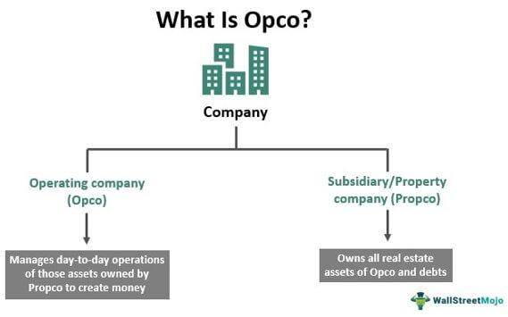

The intersection of real estate investments and algorithmic trading has paved the way for innovative opportunities for both investors and real estate operating companies (REOCs). As technology continues to evolve, the adoption of algorithmic trading has expanded beyond traditional finance and is making significant inroads in the real estate sector. This transformation enables REOCs to leverage advanced technology-driven strategies, optimizing their investment portfolios and enhancing operational efficiencies.

Algorithmic trading leverages complex algorithms and vast datasets to execute trades with precision and speed, analyzing multiple market variables that human traders cannot process in real time. This is particularly beneficial in sectors like real estate, where market dynamics and asset values can fluctuate rapidly. The potential integration of such advanced trading mechanisms into REOCs can augment traditional investment approaches, enabling these entities to react swiftly to market opportunities and threats.

The adoption of algorithmic trading in real estate is not without its challenges. REOCs must navigate technical complexities, assess the high initial costs associated with deploying these systems, and manage potential risks stemming from rapid market changes. Nevertheless, the strategic advantages offered by algorithmic trading systems, such as increased operational efficiency, enhanced decision-making through data-driven insights, and the potential for achieving higher returns, make it an attractive proposition for progressive REOCs. This article examines the potential benefits and the hurdles faced by these companies as they integrate algorithmic trading into their investment strategies, highlighting the transformative impact on their operations and growth potential.

## Table of Contents

## What is a Real Estate Operating Company (REOC)?

A Real Estate Operating Company (REOC) is a type of publicly traded entity primarily engaged in investment and management of real estate assets, focusing predominantly on commercial properties. These companies differentiate themselves from Real Estate Investment Trusts (REITs) in several key aspects. Notably, while REITs are required by law to distribute a significant portion of their income as dividends to qualify for tax exemptions, REOCs typically opt to reinvest their earnings back into the business for potential growth and expansion. This reinvestment strategy allows REOCs to enhance their property portfolio, upgrade existing assets, and seek new investment opportunities without the mandatory payout obligations that characterize REITs.

By investing in an REOC, investors gain exposure to a diversified range of real estate assets without assuming the direct risks and responsibilities associated with owning physical properties, such as property maintenance and tenant management. The diversified portfolio of a REOC typically includes various types of commercial properties, such as office buildings, shopping centers, and industrial properties, offering investors the potential for both capital appreciation and income generation through rental yields and strategic property management. This structure appeals to investors seeking to benefit from real estate market dynamics while avoiding the concentration and operational risks tied to direct property ownership.

## Understanding Algorithmic Trading

Algorithmic trading utilizes sophisticated computer algorithms to execute financial trades based on specific, pre-set criteria. At its core, this approach harnesses the power of technology to enhance the execution speed and accuracy of trading strategies across various financial markets. A defining feature of [algorithmic trading](/wiki/algorithmic-trading) is its ability to process and analyze large datasets at a pace and scale beyond human capability. This enables the identification of optimal trading opportunities and market inefficiencies that can be swiftly acted upon to capitalize on potential gains or mitigate risks.

The algorithms employed in this type of trading are designed to execute orders in milliseconds, capitalize on minute price discrepancies, and minimize the market impact of trades through strategic order placement. The algorithms can incorporate multiple variables and market factors to make real-time decisions, thus improving the overall efficiency of trading operations.

Mathematically, algorithmic strategies can range from simple to highly advanced, involving quantitative models that include regression analysis, correlation matrices, and [machine learning](/wiki/machine-learning) techniques. For instance, a simple moving average algorithm could be represented as follows:

$$
\text{SMA}(n) = \frac{1}{n} \sum_{i=0}^{n-1} P_i
$$

where $\text{SMA}(n)$ is the simple moving average over $n$ periods, and $P_i$ represents the price at any given time.

In the context of real estate, algorithmic trading finds its application in trading shares of Real Estate Operating Companies (REOCs) on public exchanges. The ability to automate and refine the trading of REOC shares offers a substantial advantage in managing large volumes of trades with precision and consistency. By employing algorithmic trading strategies, investors can react promptly to market movements, adjust their portfolios in real-time, and optimize their exposure to market risks.

As the landscape of trading continues to advance with technological breakthroughs, the integration of algorithmic trading within the real estate sector holds promising prospects for enhancing the dynamics of REOC share trading.

## The Integration of Algo Trading in REOCs

Real Estate Operating Companies (REOCs) can utilize algorithmic trading to enhance their trading strategies and refine investment decisions significantly. The implementation of algorithmic trading within REOCs involves leveraging computational techniques to automate and optimize trading processes, making them more efficient and data-driven.

At its core, algorithmic trading employs algorithms that analyze extensive datasets to identify patterns and trends in the market. For REOCs, this means utilizing algorithmic models to assess market conditions and valuation indicators, thereby facilitating more precise decisions regarding the buying or selling of shares. This approach not only increases the speed of transactions but also reduces human errors and cognitive biases.

A critical advantage of incorporating algorithmic trading is the improvement in asset [liquidity](/wiki/liquidity-risk-premium). By automating trading operations, REOCs can ensure that their asset positions are more liquid and adaptable to market changes. The rapid execution of trades enabled by algorithms ensures that opportunities are capitalized on promptly, which is especially crucial in high-frequency trading environments where milliseconds can mean significant financial impacts.

Additionally, algorithmic trading augments risk management capabilities. Advanced algorithms can be designed to conduct stress testing and simulate various market scenarios, allowing REOCs to anticipate potential risks and adjust strategies dynamically. This predictive capability can mitigate adverse outcomes by enabling preemptive adjustments to exposure levels in anticipated downturns or [volatility](/wiki/volatility-trading-strategies) spikes.

Cost savings can also arise from the reduced need for manual intervention and the potential decrease in transaction costs. While the initial investment in technology and algorithm development can be high, the long-term efficiency gains and reduction in labor costs can offset these expenses. Furthermore, algorithmic systems can exploit price inefficiencies in the market, potentially leading to higher profit margins.

In summary, the integration of algorithmic trading provides REOCs with a formidable tool for optimizing trading strategies. By employing data-driven models and real-time analytics, REOCs can enhance liquidity, improve risk management, and achieve cost efficiencies, positioning them favorably in a competitive market.

## Benefits of Algorithmic Trading for REOCs

Algorithmic trading provides several benefits for Real Estate Operating Companies (REOCs) by enhancing trading efficiency, decision-making capabilities, and potential returns. 

By leveraging sophisticated algorithms, REOCs can automate trading operations, significantly reducing the time and manual effort involved. Automation allows these companies to execute trades rapidly, often within milliseconds, a feat not feasible through manual trading. Such speed ensures that REOCs can respond instantly to market fluctuations, optimizing their trading performance and minimizing latency-related losses. 

Algorithmic trading systems are profoundly data-driven, utilizing vast amounts of historical and real-time data to generate insights. These systems enhance decision-making capabilities through predictive analytics, enabling REOCs to base their trading strategies on comprehensive data analysis rather than intuition or incomplete information. By identifying trends and patterns that might not be immediately apparent, these algorithms inform more robust and strategically sound investment decisions.

The ability to swiftly capitalize on market opportunities is another critical advantage. Algorithms can monitor numerous markets concurrently, identifying price discrepancies and emerging opportunities that could lead to profit. By executing trades at optimal times, REOCs can achieve potentially higher returns compared to traditional methods. This swift responsiveness is crucial in real estate markets, where conditions can change rapidly, and timely decision-making is paramount.

Collectively, these advantages make algorithmic trading an attractive approach for REOCs, seeking to optimize their investment strategies and boost their competitiveness in the evolving financial landscape.

## Challenges and Risks

Implementing algorithmic trading systems within Real Estate Operating Companies (REOCs) presents numerous challenges, primarily characterized by high initial costs, technical complexities, and prevalent market risks.

The costs of establishing algorithmic trading systems are often substantial. These include expenses not only for the initial software and hardware but also for the specialized personnel required to develop and maintain such complex systems. Moreover, the integration of this technology can demand significant capital investment in data acquisition and processing capabilities, as the availability of historical and real-time data is crucial for refining algorithmic models.

Technical challenges are significant, with system updates and maintenance becoming a continuous necessity. Algorithms require constant refinement, not only to account for evolving market conditions but also to incorporate improvements in predictive analytics and machine learning techniques. For instance, frequent updates are necessary to manage latency—a critical issue in algorithmic trading—ensuring that trading systems can operate at the highest speeds possible to exploit market inefficiencies.

The performance of algorithmic trading systems can be particularly sensitive to rapid changes in market conditions. Extreme market volatility can lead to unanticipated outcomes due to the rigid nature of algorithmic decision-making processes. Algorithms designed under stable market conditions might not perform optimally under stress, potentially causing substantial financial risk. To mitigate these risks, robust risk management frameworks, including stress testing and scenario analysis, are essential components in the design of reliable algorithmic trading systems.

In conclusion, while algorithmic trading offers significant potential advantages for REOCs, these companies must address considerable challenges involving high setup costs, technical maintenance, and market volatility to leverage technological advances effectively.

## Future of REOCs and Algo Trading

The future of Real Estate Operating Companies (REOCs) is intricately linked to the continuing advancements in algorithmic trading technologies. As these technologies evolve, they are poised to play a transformative role in the real estate sector, particularly for REOCs, which could serve as pioneers in implementing tech-driven strategies.

The increasing sophistication of AI and machine learning algorithms is likely to enhance the precision and effectiveness of trading strategies employed by REOCs. Algorithms that utilize machine learning can analyze vast datasets to identify patterns and trends that may not be apparent through traditional analysis. This capability allows for more informed decision-making and improved predictive analytics.

Moreover, the integration of big data and analytics tools is expected to expand the scope of real estate market insights. As algorithmic systems become more adept at processing and interpreting complex datasets, REOCs will be better equipped to assess market dynamics and make strategic investment decisions. This can potentially lead to more accurate valuation models and enhanced risk assessment procedures, further solidifying REOCs' positions as leaders in the real estate market.

Furthermore, technological innovations in natural language processing (NLP) could revolutionize how REOCs extract and analyze qualitative data from various sources, such as news articles, social media, and market reports. By incorporating NLP into algorithmic trading systems, REOCs can expand their analytical capabilities to include sentiment analysis and trend predictions, thus enriching their strategic frameworks.

In addition to improving analytical capabilities, ongoing technological advancements are likely to enhance the risk management aspects of algorithmic trading. As algorithms become more sophisticated, they can incorporate scenario analysis and stress testing more effectively, allowing for better anticipation of market changes and potential disruptions. This capability is crucial for maintaining stability and achieving long-term investment goals.

The development and adoption of blockchain technology also hold promise for the future of REOCs. Blockchain can introduce transparency and security in transactions, enabling more efficient and reliable trading operations. By leveraging decentralized ledgers, REOCs could streamline asset management and improve the integrity of financial transfers, further optimizing their operational efficiency.

In summary, as technology continues to advance, REOCs are in a prime position to set the trend for other real estate entities by adopting innovative, tech-driven strategies. The incorporation of advanced algorithms and data analysis tools promises to refine the accuracy, efficiency, and risk management processes of algorithmic trading, ensuring that REOCs remain at the forefront of the ever-evolving real estate sector.

## Conclusion

Algorithmic trading has emerged as a pivotal technological advancement for Real Estate Operating Companies (REOCs), furnishing them with a suite of strategic benefits essential for maintaining and elevating their competitiveness. The incorporation of algorithmic strategies allows REOCs to harness speed, precision, and data-driven decision making, which can significantly enhance their operational capabilities. By automating trading processes and applying sophisticated algorithms to analyze market data, REOCs can identify opportunities and risks much more swiftly and efficiently than traditional methods allow.

However, this integration is not without its challenges. Successful deployment of algorithmic trading systems necessitates meticulous planning and substantial investment in both technology and human capital. Ensuring the robustness of these systems involves continuous upgrades, maintenance, and real-time monitoring to cope with the volatile nature of financial markets. REOCs must invest in skilled personnel who can design, implement, and refine algorithms to adapt to evolving market conditions. Furthermore, strategic management is crucial to aligning these technological tools with the overarching goals of the company.

As the dynamics of real estate investing continue to transform, REOCs are positioned advantageously to capitalize on these technological advancements. The ongoing evolution in technology presents an opportunity for these companies to pioneer in the adoption of sophisticated, tech-driven strategies. By staying at the forefront of these advancements, REOCs can anticipate increased efficiency, improved risk management, and potentially higher returns on investments. This technological foresight fosters a competitive edge in an increasingly interconnected and data-centric economic environment.

## References & Further Reading

[1]: Bergstra, J., Bardenet, R., Bengio, Y., & Kégl, B. (2011). ["Algorithms for Hyper-Parameter Optimization."](https://dl.acm.org/doi/10.5555/2986459.2986743) Advances in Neural Information Processing Systems 24.

[2]: ["Advances in Financial Machine Learning"](https://www.amazon.com/Advances-Financial-Machine-Learning-Marcos/dp/1119482089) by Marcos Lopez de Prado

[3]: ["Evidence-Based Technical Analysis: Applying the Scientific Method and Statistical Inference to Trading Signals"](https://www.amazon.com/Evidence-Based-Technical-Analysis-Scientific-Statistical/dp/0470008741) by David Aronson

[4]: ["Machine Learning for Algorithmic Trading"](https://github.com/stefan-jansen/machine-learning-for-trading) by Stefan Jansen

[5]: ["Quantitative Trading: How to Build Your Own Algorithmic Trading Business"](https://github.com/LucindaYa/quant-resources/blob/master/Quantitative%20Trading%20How%20to%20Build%20Your%20Own%20Algorithmic%20Trading%20Business.pdf) by Ernest P. Chan