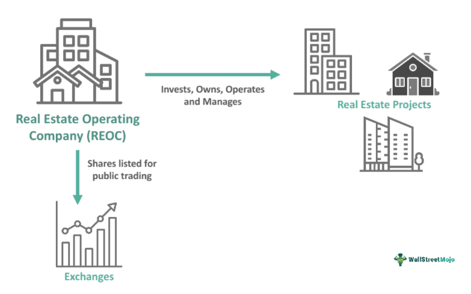

## Table of Contents

## What is a Real Estate Operating Company (REOC)?

A Real Estate Operating Company (REOC) is a type of business that owns, manages, and sometimes develops real estate properties. Unlike a Real Estate Investment Trust (REIT), which focuses on generating income through rental properties and must distribute most of its income as dividends to shareholders, a REOC has more flexibility in its operations. It can reinvest its earnings into the business, buy new properties, or develop new projects, which can lead to growth and expansion.

REOCs are often structured as corporations and can engage in a wider range of activities compared to REITs. This includes not only managing properties but also offering services like property management, construction, and development. Because of this broader scope, REOCs can be more appealing to investors who are interested in the potential for capital appreciation and growth, rather than just steady income from dividends.

## How does a REOC differ from a Real Estate Investment Trust (REIT)?

A Real Estate Operating Company (REOC) and a Real Estate Investment Trust (REIT) are both involved in real estate, but they work differently. A REOC is a company that can own, manage, and develop properties. It has the freedom to use its earnings to grow the business, buy new properties, or start new projects. This means a REOC can focus on increasing its value over time, which might attract investors looking for growth.

On the other hand, a REIT is set up to mainly earn money from renting out properties. By law, a REIT must give most of its income back to its shareholders as dividends. This makes REITs good for people who want regular income from their investments. Unlike a REOC, a REIT has less flexibility in how it can use its money, as it has to follow strict rules about distributing profits.

In simple terms, if you want a company that can grow and expand using its earnings, you might choose a REOC. If you're looking for steady income from real estate without much involvement in the business side, a REIT could be better for you.

## What are the primary functions of a REOC?

A Real Estate Operating Company (REOC) mainly owns and manages properties. This means they take care of buildings like offices, apartments, or shopping centers. They make sure these places are in good shape, find people to rent them, and handle any problems that come up. REOCs can also decide to sell properties if they think it's a good time to do so.

Besides managing properties, REOCs can also build new ones. They might buy land and then construct new buildings on it. This can help them grow their business and make more money in the future. Because they have this freedom, REOCs can use their earnings to try new things and expand, which is different from other types of real estate companies.

## What types of properties do REOCs typically manage?

REOCs usually manage different kinds of properties. They often take care of office buildings where businesses work. They also manage apartment buildings where people live. Shopping centers are another type of property they might handle, where stores and restaurants operate.

Sometimes, REOCs also manage hotels or resorts. These places are for people who need a place to stay for a short time. REOCs make sure all these properties are well-maintained, find tenants or guests, and deal with any issues that come up. This helps them keep the properties running smoothly and making money.

## How do REOCs generate revenue?

REOCs make money in a few main ways. They earn rent from the properties they manage. This means if they own office buildings, apartments, or shopping centers, they get money from the businesses or people who use these spaces. REOCs also make money when they sell properties. If they think it's a good time to sell, they can do so and use that money to buy new properties or invest in other ways.

Another way REOCs generate revenue is through developing new properties. They might buy land and build new buildings on it, like new apartments or shopping centers. Once these new buildings are ready, they can rent them out or sell them for a profit. This helps the REOC grow and make more money over time. By doing all these things, REOCs can keep their business running and expanding.

## What are the advantages of investing in a REOC?

Investing in a Real Estate Operating Company (REOC) can offer some good benefits. One big advantage is that REOCs have the freedom to use their earnings to grow their business. This means they can buy new properties, build new buildings, or even start new projects. For investors, this can mean that the value of their investment might go up over time. If the REOC does well, investors can see their shares become more valuable.

Another advantage is that REOCs can do more than just manage properties. They can also offer services like property management, construction, and development. This variety can make a REOC a good choice for investors who want to be part of a business that can grow in different ways. Plus, because REOCs are not required to pay out most of their income as dividends like REITs, they can keep more money to reinvest in the business, which can lead to even more growth.

## What are the potential risks associated with REOCs?

Investing in a Real Estate Operating Company (REOC) can come with some risks. One big risk is that the real estate market can go up and down. If the market goes down, the value of the properties that the REOC owns might drop too. This can make the REOC's shares worth less, and investors might lose money. Also, if the REOC has a lot of debt and can't pay it back because of lower property values, it could face big financial problems.

Another risk is that REOCs can make big bets on new projects. They might decide to build new buildings or buy new land, but these projects can be risky. If something goes wrong, like the project takes longer than expected or costs more money, the REOC might lose a lot of money. This can hurt the company's overall value and affect investors who own shares in the REOC.

Lastly, because REOCs are not required to pay out most of their income as dividends like REITs, they can keep more money to reinvest in the business. While this can be good for growth, it also means that investors might not get regular income from their investment. If the REOC doesn't grow as expected, investors might not see the returns they were hoping for, which can be disappointing.

## How can one start a REOC?

Starting a Real Estate Operating Company (REOC) involves a few key steps. First, you need to create a business plan. This plan should outline what kind of properties you want to own and manage, like apartments, office buildings, or shopping centers. It should also explain how you will make money, whether it's through renting out these properties, selling them, or developing new ones. Once you have a solid plan, you'll need to get the right legal structure for your business. This usually means forming a corporation, which requires filing paperwork with the state and getting any necessary licenses or permits.

Next, you'll need to find money to start your REOC. This can come from your own savings, loans from a bank, or investors who believe in your business plan. With the money in place, you can start buying properties. It's important to do a lot of research to make sure you're buying good properties that will make money. Once you have properties, you'll need to manage them well. This means finding tenants, keeping the buildings in good shape, and dealing with any issues that come up.

Running a REOC also means keeping an eye on the real estate market and being ready to make smart decisions. You might decide to sell some properties if the market is good, or you might buy more if you see a chance to grow. It's a lot of work, but if you do it right, a REOC can be a successful business that grows over time.

## What regulatory requirements must a REOC comply with?

A Real Estate Operating Company (REOC) needs to follow certain rules to operate legally. First, it must be set up as a corporation, which means filing paperwork with the state where it will operate. This process includes choosing a business name, getting a federal tax ID number, and registering with the state's business division. The REOC also needs to get any necessary licenses or permits to own and manage properties. These can vary by state or city, so it's important to check local regulations.

In addition to setting up the business, a REOC must follow laws about how it operates. This includes rules about how it treats tenants, like following fair housing laws that prevent discrimination. The company also has to keep good financial records and file taxes correctly. If the REOC has investors, it must follow securities laws, which can include rules about how it raises money and reports to shareholders. Keeping up with these regulations helps the REOC stay out of trouble and operate smoothly.

## How do REOCs manage property acquisitions and disposals?

REOCs handle buying and selling properties carefully to make the most money. When they want to buy a new property, they do a lot of research first. They look at the price, the location, and how much money they can make from renting it out or selling it later. If it looks like a good deal, they use their money or borrow from a bank to buy it. They also think about how this new property fits into their overall plan to grow their business.

When it comes to selling properties, REOCs watch the real estate market closely. They try to sell when prices are high so they can make a good profit. They might decide to sell a property if they think they can get a better return by investing the money in something else. The money they make from selling can be used to buy new properties or to pay off debts, helping the REOC to keep growing and making money.

## What role does technology play in the operations of modern REOCs?

Technology helps modern REOCs run their businesses better. They use special software to keep track of their properties and manage them more easily. This software can help with things like collecting rent, keeping buildings in good shape, and finding new tenants. REOCs also use the internet and social media to show off their properties to more people and find new buyers or renters faster. This can help them make more money by filling empty spaces quicker.

Another way technology helps is by making it easier for REOCs to talk to their tenants and investors. They can use apps and websites to send important information, like when rent is due or updates about the property. This makes everything run smoother and keeps everyone happy. Plus, technology helps REOCs do their research and make smart decisions about buying and selling properties. They can use data and special tools to see what's happening in the real estate market and plan their next moves.

## How do REOCs strategize for long-term growth and sustainability?

REOCs plan for long-term growth and sustainability by carefully choosing which properties to buy and when to sell them. They look at the real estate market to see where prices might go up or down. If they think a property will become more valuable, they might buy it and hold onto it for a while. They also think about how they can make money from the property, like renting it out or developing it into something new. By making smart choices about which properties to keep and which to sell, REOCs can grow their business over time.

Another way REOCs work on long-term growth is by using their earnings wisely. Instead of paying out all their money to shareholders like some other companies, REOCs can keep some of it to invest in new projects or improve their current properties. This helps them expand and become more valuable. They also focus on keeping their tenants happy and their buildings in good shape, which can lead to more stable income and a stronger business in the long run.

## What is Understanding Algorithmic Trading?

Algorithmic trading utilizes sophisticated computer algorithms to execute financial trades based on specific, pre-set criteria. At its core, this approach harnesses the power of technology to enhance the execution speed and accuracy of trading strategies across various financial markets. A defining feature of [algorithmic trading](/wiki/algorithmic-trading) is its ability to process and analyze large datasets at a pace and scale beyond human capability. This enables the identification of optimal trading opportunities and market inefficiencies that can be swiftly acted upon to capitalize on potential gains or mitigate risks.

The algorithms employed in this type of trading are designed to execute orders in milliseconds, capitalize on minute price discrepancies, and minimize the market impact of trades through strategic order placement. The algorithms can incorporate multiple variables and market factors to make real-time decisions, thus improving the overall efficiency of trading operations.

Mathematically, algorithmic strategies can range from simple to highly advanced, involving quantitative models that include regression analysis, correlation matrices, and [machine learning](/wiki/machine-learning) techniques. For instance, a simple moving average algorithm could be represented as follows:

$$
\text{SMA}(n) = \frac{1}{n} \sum_{i=0}^{n-1} P_i
$$

where $\text{SMA}(n)$ is the simple moving average over $n$ periods, and $P_i$ represents the price at any given time.

In the context of real estate, algorithmic trading finds its application in trading shares of Real Estate Operating Companies (REOCs) on public exchanges. The ability to automate and refine the trading of REOC shares offers a substantial advantage in managing large volumes of trades with precision and consistency. By employing algorithmic trading strategies, investors can react promptly to market movements, adjust their portfolios in real-time, and optimize their exposure to market risks.

As the landscape of trading continues to advance with technological breakthroughs, the integration of algorithmic trading within the real estate sector holds promising prospects for enhancing the dynamics of REOC share trading.

## References & Further Reading

[1]: Bergstra, J., Bardenet, R., Bengio, Y., & Kégl, B. (2011). ["Algorithms for Hyper-Parameter Optimization."](https://dl.acm.org/doi/10.5555/2986459.2986743) Advances in Neural Information Processing Systems 24.

[2]: ["Advances in Financial Machine Learning"](https://www.amazon.com/Advances-Financial-Machine-Learning-Marcos/dp/1119482089) by Marcos Lopez de Prado

[3]: ["Evidence-Based Technical Analysis: Applying the Scientific Method and Statistical Inference to Trading Signals"](https://www.amazon.com/Evidence-Based-Technical-Analysis-Scientific-Statistical/dp/0470008741) by David Aronson

[4]: ["Machine Learning for Algorithmic Trading"](https://github.com/stefan-jansen/machine-learning-for-trading) by Stefan Jansen

[5]: ["Quantitative Trading: How to Build Your Own Algorithmic Trading Business"](https://github.com/LucindaYa/quant-resources/blob/master/Quantitative%20Trading%20How%20to%20Build%20Your%20Own%20Algorithmic%20Trading%20Business.pdf) by Ernest P. Chan