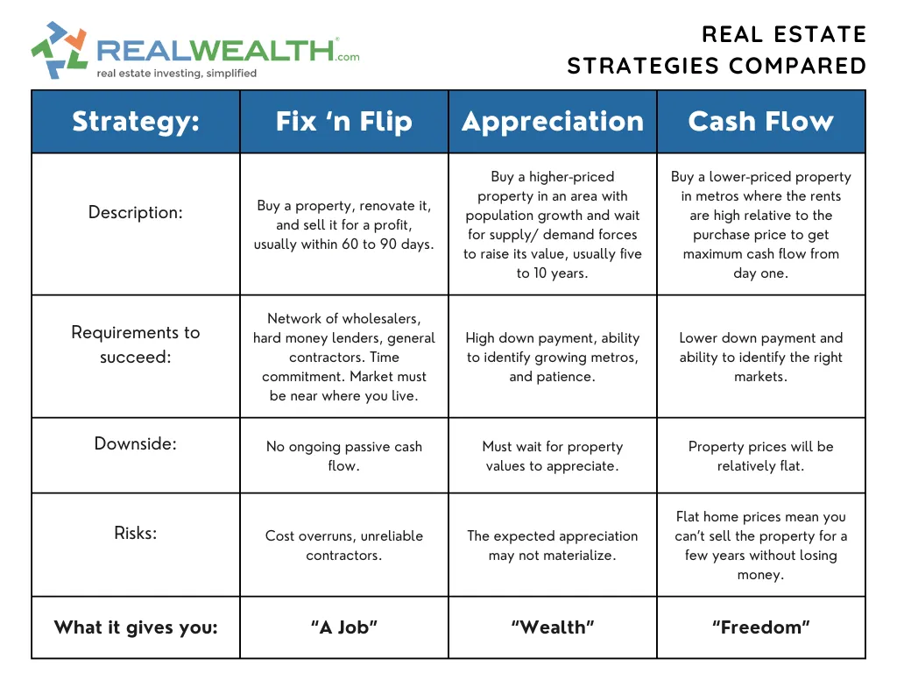

## Table of Contents

## What are the basic types of real estate investments for beginners?

Real estate investing can be a great way for beginners to start building wealth. One of the most common types of real estate investments for beginners is buying a rental property. This means you buy a house or an apartment and then rent it out to tenants. The rent you collect can help pay off the mortgage and any other costs, and over time, the property might increase in value. This can be a good way to earn a steady income and build equity in a property.

Another simple type of real estate investment for beginners is investing in a Real Estate Investment Trust (REIT). A REIT is a company that owns or finances income-generating real estate. When you buy shares in a REIT, you're essentially investing in a portfolio of properties without having to manage them yourself. REITs often pay out high dividends, which can provide a regular income stream. This can be a good option if you want to invest in real estate but don't want to deal with the responsibilities of being a landlord.

Lastly, house flipping can be an exciting option for beginners who are willing to take on more risk. House flipping involves buying a property that needs repairs or updates, fixing it up, and then selling it for a profit. This can be more hands-on and requires some knowledge of real estate markets and home renovation, but it can also be very rewarding if done correctly. It's important to do thorough research and have a solid plan before starting, as there can be significant costs and risks involved.

## How does one start investing in real estate with limited funds?

Starting to invest in real estate with limited funds can be challenging, but it's definitely possible. One way to get started is by looking into house hacking. This means buying a multi-unit property, like a duplex or a triplex, living in one unit, and renting out the others. The rent from the other units can help cover your mortgage and other expenses, making it easier to manage with limited funds. You can often get a better mortgage rate if you live in one of the units, which can also help.

Another option is to invest in a Real Estate Investment Trust (REIT). REITs allow you to invest in real estate without buying a property directly. You can start with a small amount of money, and the dividends from the REIT can provide you with regular income. This is a good way to get into real estate investing without a large upfront investment. Just make sure to do your research and choose a REIT that fits your investment goals.

Lastly, you might consider partnering with others to pool your resources. This could mean teaming up with friends or family to buy a property together. By combining your money, you can afford a larger investment than you could on your own. Make sure to have a clear agreement on how you'll manage the property and share the profits. This can be a good way to start investing in real estate even if you don't have a lot of money to start with.

## What are the key differences between residential and commercial real estate investing?

Residential real estate investing involves properties where people live, like houses, apartments, or condos. When you invest in residential properties, you usually deal with individual tenants. The main goal is often to earn rental income and maybe see the property's value go up over time. Managing residential properties can be easier because there are more potential tenants, but it can also be more hands-on, especially if you have to deal with tenant issues or maintenance problems.

Commercial real estate investing, on the other hand, involves properties used for business, like office buildings, retail spaces, or warehouses. When you invest in commercial properties, you usually deal with businesses as tenants. The leases are often longer and can provide more stable income, but finding tenants can be harder because there are fewer businesses looking to rent than people looking for homes. Commercial properties can also be more expensive to buy and maintain, but they might offer higher returns if you manage them well.

Both types of real estate investing have their own risks and rewards. Residential properties might be easier to get into and manage, but they can come with more frequent tenant turnover. Commercial properties might be more challenging to start with, but they can offer bigger rewards if you're willing to take on the extra work and risk. It's important to think about your goals and how much time and money you can put into your investment before deciding which type is right for you.

## What are the risks associated with real estate investing and how can they be mitigated?

One big risk with real estate investing is that property values can go down. If you need to sell your property during a time when the market is down, you might lose money. Another risk is not being able to find good tenants. If you can't rent out your property, you won't have any rental income to help pay your mortgage and other costs. There's also the risk of unexpected expenses, like repairs or legal fees, which can eat into your profits. 

To reduce these risks, you can do a lot of research before you buy a property. Look at the local market and see if property values are going up or down. Try to buy in areas where there's a strong demand for rentals. It's also a good idea to have some extra money saved up for unexpected costs. You might want to get insurance to protect against big problems like damage to the property. Talking to a real estate expert or a financial advisor can also help you make better decisions and avoid some of the common pitfalls of real estate investing.

## How can real estate flipping be a profitable strategy and what are the steps involved?

Real estate flipping can be profitable if you buy a house at a low price, fix it up, and then sell it for more money than you spent. The key is to find a house that needs some work but is in a good area where people want to live. If you can buy it cheap, make smart repairs, and sell it quickly, you can make a good profit. But it's important to know the local real estate market well and have a good plan for how much you'll spend on repairs and how much you can sell the house for.

The first step in flipping a house is to find the right property. Look for houses that are priced low because they need repairs or updates. You can find these through real estate [agents](/wiki/agents), online listings, or even auctions. Once you've bought the house, the next step is to fix it up. This might mean doing things like painting, fixing the roof, or updating the kitchen and bathrooms. It's important to keep your repair costs under control and focus on changes that will add the most value to the house. The final step is to sell the house. You'll need to set a good price based on what similar houses in the area are selling for, and then market the house to find a buyer. If everything goes well, you'll sell the house for more than you spent on buying and fixing it up, making a profit.

## What role does location play in real estate investment decisions?

Location is very important when you are thinking about investing in real estate. It can affect how much money you can make from your investment. A house in a good area, where people want to live, will usually be worth more and be easier to rent out. This means you can charge more rent and sell the house for a higher price later. On the other hand, a house in a not-so-good area might be cheaper to buy, but it can be harder to find good tenants and it might not go up in value as much.

It's also important to think about what's around the property. Things like good schools, shops, and public transport can make a location more attractive to people. If a house is close to these things, it can be easier to rent out and might be worth more money. When you're looking at a property, take some time to learn about the neighborhood and what it offers. This can help you decide if it's a good place to invest your money.

## How can one use real estate investment trusts (REITs) to diversify their portfolio?

Real estate investment trusts, or REITs, are a good way to spread out your investments and not put all your money in one place. When you buy shares in a REIT, you're investing in a bunch of different properties all at once. This can help you avoid the risk of putting all your money into just one house or building. Instead, your money is spread across many properties, which can be safer. Plus, REITs often invest in different types of real estate, like apartments, offices, or shopping centers, so you get even more variety in your investments.

Using REITs can also help you balance out other kinds of investments you might have, like stocks or bonds. If the stock market goes down, the value of your REITs might not go down as much, or they might even go up. This can help protect your money from big losses. And because REITs have to pay out most of their income as dividends, they can give you a regular income, which can be nice if you're looking for steady money coming in. So, by adding REITs to your portfolio, you can make it stronger and less risky.

## What are the tax implications of different real estate investment strategies?

When you invest in real estate, you need to think about taxes. If you own a rental property, you can take away some costs like mortgage interest, repairs, and property taxes from your income before you pay taxes. This can lower how much tax you pay. But, when you sell the property, you might have to pay capital gains tax if you make a profit. The tax rate depends on how long you owned the property. If you owned it for more than a year, you might pay a lower rate than if you owned it for less than a year.

Flipping houses can have different tax rules. When you flip a house, the profit you make is usually considered regular income, so you'll pay your normal income tax rate on it. This can be higher than the capital gains tax rate. Also, you can't take away as many costs from your income as you can with a rental property. But, if you do a lot of flipping, you might be able to be considered a real estate professional, which can give you some tax benefits.

Investing in REITs has its own tax rules too. REITs don't pay corporate income tax as long as they pay out at least 90% of their taxable income as dividends to shareholders. This means the dividends you get from REITs are usually taxed as regular income. But, a part of the dividends might be considered a return of capital, which can lower your taxable income. It's a good idea to talk to a tax professional to understand all the tax rules and how they apply to your specific situation.

## How can leveraging be used effectively in real estate investments?

Leveraging in real estate means using borrowed money to buy a property. This can help you buy a bigger or more expensive property than you could with just your own money. When you use a mortgage to buy a rental property, the rent you collect can help pay off the loan. If the property goes up in value, you can make a bigger profit when you sell it because you only put down a small amount of your own money. But, leveraging can also be risky. If you can't pay back the loan or if the property value goes down, you could lose money or even the property itself.

To use leveraging effectively, you need to be smart about it. First, make sure you can afford the loan payments, even if something goes wrong like not being able to rent out the property right away. It's also important to do a lot of research on the property and the local real estate market. Make sure the property is in a good area where it's likely to go up in value. Also, keep some extra money saved up for unexpected costs like repairs. By being careful and doing your homework, leveraging can help you grow your real estate investments and make more money.

## What advanced strategies can be used to maximize returns in real estate?

One advanced strategy to maximize returns in real estate is called "value-add investing." This means buying a property that needs some work and then fixing it up to make it worth more money. For example, you might buy an apartment building that's old and needs repairs. You can renovate the units, add new amenities like a gym or a pool, and then raise the rent. By doing this, you can increase the property's value and earn more money from rent. It's important to do a good job with the renovations and not spend too much money, so you can still make a profit.

Another strategy is called "1031 exchange." This is a way to sell one property and buy another without paying taxes on the profit right away. When you sell a property, you normally have to pay capital gains tax on any profit you made. But with a 1031 exchange, you can use the money from the sale to buy another "like-kind" property, and you won't have to pay the tax until you sell the new property. This can help you keep more of your money to invest in new properties, which can lead to bigger returns over time. It's a bit complicated, so it's good to talk to a tax professional to make sure you do it right.

A third strategy is "syndication," where you team up with other investors to buy a big property that you couldn't afford on your own. In a syndication, one person or group acts as the leader and finds the property, while the other investors put in money to help buy it. Everyone shares the profits based on how much they invested. This can be a good way to get into bigger, more profitable deals and spread out the risk among more people. It's important to choose good partners and have a clear agreement on how everything will work, so everyone is happy with the results.

## How does one evaluate the potential of a real estate market for investment?

To evaluate the potential of a real estate market for investment, you need to look at a few key things. First, check out the local economy. Is it growing? Are new businesses moving in and creating jobs? A strong economy usually means more people want to live in the area, which can drive up property values and rental demand. You should also look at the population trends. If the population is growing, there will be more demand for housing. Another important thing to consider is the supply of properties. If there are a lot of homes for sale or rent, it might be harder to make money because there's more competition. But if there's a shortage of properties, you might be able to charge more rent or sell your property for a higher price.

Another way to evaluate a real estate market is by looking at the specific neighborhood where you're thinking about investing. Are there good schools, shops, and public transport nearby? These things can make a neighborhood more attractive to people, which can help you rent out or sell your property more easily. You should also pay attention to any upcoming developments in the area, like new roads or shopping centers, because these can increase property values. Finally, it's helpful to talk to local real estate agents and other investors. They can give you insights into the market and help you understand what's happening and what might happen in the future. By doing your research and understanding these factors, you can make a smarter decision about where to invest your money.

## What are the emerging trends in real estate investment and how can they be capitalized on?

One big trend in real estate investment right now is the growth of technology and how it's changing the way we buy and sell properties. More people are using websites and apps to look for homes and even to buy them without ever seeing them in person. This means that investors can use technology to find good deals faster and reach more buyers when they want to sell. Another trend is the rise of short-term rentals, like Airbnb. More people are looking for short stays instead of long leases, and this can be a good way for investors to make more money from their properties. By turning a property into a short-term rental, you can charge more per night than you would for a long-term lease, especially in popular areas where tourists like to visit.

Another trend to watch is the focus on sustainable and green buildings. More people want to live in homes that are good for the environment, and this is pushing up the demand for properties that use less energy and have eco-friendly features. Investors can take advantage of this by buying or building properties that meet these standards, which can attract more tenants and maybe even qualify for special tax breaks or incentives. Finally, there's a growing interest in investing in smaller cities and towns instead of just big cities. These areas can offer good deals and might grow a lot in the future as people move away from crowded urban areas. By looking at these trends and understanding how they can affect the real estate market, investors can find new ways to make money and grow their investments.

## What are the tax implications and legal considerations?

Real estate investments offer several tax benefits that can significantly enhance the profitability of an investment portfolio. Among these, mortgage interest deductions allow investors to deduct interest payments on loans used to acquire real estate properties from their taxable income. This can lead to substantial tax savings, particularly in the initial years of property ownership when interest payments constitute a large portion of the mortgage payments. In the United States, this benefit is codified under section 163(h) of the Internal Revenue Code, which specifically allows qualified residence interest to be deductible.

Depreciation is another vital tax advantage. Real estate investors can depreciate the cost of property improvements over a specified recovery period, thereby reducing their taxable income each year. The Internal Revenue Service (IRS) provides guidelines on the depreciable life of various property types, with residential rental properties typically assigned a 27.5-year recovery period, while commercial properties are generally depreciated over 39 years. The formula for calculating annual depreciation is straightforward:

$$
\text{Annual Depreciation} = \frac{\text{Cost of the Property} - \text{Land Value}}{\text{Depreciation Period}}
$$

In addition to tax benefits, investors must be mindful of legal considerations within both real estate and [algorithmic trading](/wiki/algorithmic-trading). Real estate investments [carry](/wiki/carry-trading) legal compliance requirements, including zoning laws, property rights, and tenant-landlord regulations. Understanding these legalities is crucial to avoid penalties and ensure the smooth operation of property management activities. Furthermore, real estate laws differ from state to state and even locally, necessitating localized knowledge or consultation with a legal expert.

Algorithmic trading, although less tangible than real estate, demands robust compliance with financial regulations. Traders must adhere to guidelines set forth by securities regulatory bodies such as the Securities and Exchange Commission (SEC). This includes ensuring that algorithms do not engage in illegal practices, such as market manipulation or insider trading. Moreover, firms typically require strict data protection measures to safeguard sensitive financial data utilized by trading algorithms.

Given the complexity of tax legislation and legal regulations, consulting with specialists is essential for real estate investors and algorithmic traders alike. Tax professionals can help optimize tax strategies, ensuring all applicable deductions and credits are claimed effectively. Legal advisors can aid in navigating the regulations specific to both real estate and algorithmic trading. Their expertise reduces the risk of costly mistakes and supports compliance with relevant laws, ultimately contributing to a more secure and profitable investment strategy.

## References & Further Reading

1. **Books and Publications**
   - *Investing in Real Estate* by Gary W. Eldred: This book provides a comprehensive guide to the principles of real estate investing, integrating various strategies to maximize returns.
   - *Algorithmic Trading: Winning Strategies and Their Rationale* by Ernie Chan: A detailed exploration of successful algorithmic trading strategies, it offers practical insights into designing, testing, and implementing trading algorithms.

2. **Articles**
   - "The Benefits of Diversification in Real Estate Investment Trusts (REITs)" - This article, available on Investopedia, discusses the advantages and stability offered by REITs as part of a diverse investment portfolio.
   - "How Crowdfunding is Transforming Real Estate Investing" - Published in Forbes, it explains the impact of crowdfunding platforms on real estate investments and how they provide new opportunities for small investors.

3. **Online Courses**
   - **Coursera**: "Introduction to Real Estate Finance" - Offered by the University of Illinois, this course covers fundamental concepts in real estate finance, including investment strategies and risk assessment.
   - **Udacity**: "Machine Learning for Trading" - A course designed to equip learners with the skills to apply machine learning techniques in algorithmic trading and investment strategies.

4. **Websites and Platforms**
   - **Fundrise**: Known for its accessible real estate investment options via a crowdfunding model, Fundrise offers resources on understanding market dynamics and making informed real estate investments.
   - **QuantConnect**: A platform for professionals and hobbyists alike to develop licensed quantitative trading strategies, QuantConnect provides tools for algorithmic trading research and testing.

5. **Academic Journals**
   - *The Journal of Real Estate Finance and Economics*: This journal publishes papers on real estate markets, investment strategies, and financial analysis, offering insights into the latest research and trends in the sector.
   - *Journal of Algorithmic Finance*: Focuses on the application of quantitative methods in financial markets, discussing algorithmic strategies and their efficacy in various trading environments.

By exploring these resources, readers can gain a deeper understanding of both real estate and algorithmic trading, expanding their knowledge and improving their investment strategies.

