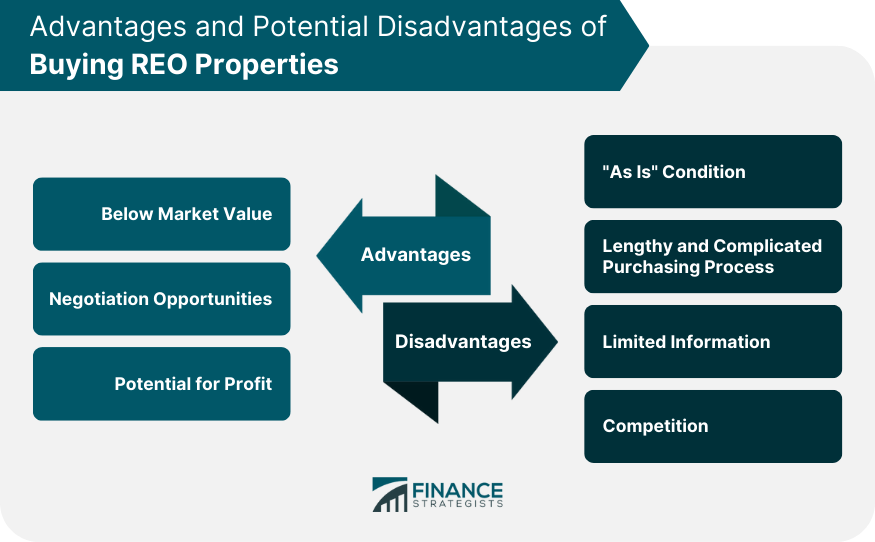

The integration of technology into the real estate sector has seen a significant rise, reshaping how properties are managed, transacted, and invested. This technological evolution encompasses various elements, including Real Estate Owned (REO) properties, real estate investment strategies, and algorithmic trading mechanisms. Understanding these concepts is fundamental in today's market as they influence how assets are valued, analyzed, and ultimately bought and sold.

REO properties are real estate assets that have reverted to the ownership of financial institutions, typically following an unsuccessful foreclosure auction. As banks strive to recoup some of their losses by selling these properties, a unique investment opportunity presents itself. However, the evaluation and acquisition of REO properties require a blend of market knowledge and financial acumen, making it a crucial area for potential investors wanting to capitalize on distressed assets.



Real estate investment remains a cornerstone of wealth building, supported by diverse strategies ranging from long-term buy-and-hold to short-term property flipping. Sophisticated market research and thorough property analysis are imperative, as the sector promises high returns countered by potential risks. Here, algorithmic trading comes into play, borrowing principles from financial markets to enhance investment strategies. Algorithmic trading in this context involves using advanced data analytics and machine learning algorithms to process vast amounts of market data, enabling investors to make informed decisions swiftly.

The convergence of these components—REO properties, real estate investment, and algorithmic trading—represents a frontier in real estate innovation. By exploring how these elements interact and complement each other, investors and stakeholders can unlock new efficiencies and opportunities within the market. This article aims to dissect these interconnected domains, providing insights into how technology is forging a path towards a more dynamic, data-driven real estate landscape. Understanding these emerging trends not only prepares stakeholders for current market dynamics but also positions them for future opportunities and challenges in an ever-evolving technological environment.

## Table of Contents

## Understanding Real Estate Owned (REO) Properties

Real Estate Owned (REO) properties arise when a borrower defaults on a mortgage, leading to foreclosure proceedings initiated by the lender. If the property fails to sell during a foreclosure auction, usually because the bids do not cover the outstanding mortgage amount, it comes back to the lender, typically a financial institution, and becomes classified as an REO property. This process places the financial institution in the position of having to manage or sell the property to recover the unpaid loan amount.

Financial institutions play a critical role in managing REO properties. These institutions, including banks and mortgage companies, hold these properties on their [books](/wiki/algo-trading-books) as non-performing assets. To minimize losses, they aim to sell the properties as swiftly as possible, often at a discount, making them attractive to investors seeking below-market deals. These institutions typically engage real estate [agents](/wiki/agents) or specialized REO property firms to facilitate the sale, conduct property maintenance, and handle the legalities involved in the transfer of ownership.

Investing in REO properties presents various benefits and challenges. On the positive side, these properties can often be acquired at significant discounts compared to market value, allowing investors to realize higher returns after renovations and resale or through rental income. Moreover, since these properties are usually free from liens and other encumbrances, investors can expect a clearer path to ownership.

However, challenges abound. REO properties are often sold "as-is," which means the onus is on the investor to manage and finance any necessary repairs or renovations. Additionally, the process of purchasing an REO property can be more complex and drawn out than buying a property from a private individual, requiring patience and persistence. Investors must also be adept at assessing the potential costs and risks associated with bringing the property up to market standards.

Examples of successful REO property investments can be found across various markets. Savvy investors often specialize in acquiring these properties, refurbishing them, and either flipping them for a profit or renting them out for steady income. Companies that focus on distressed real estate markets frequently report profits from such strategic acquisitions, highlighting the potential for significant returns with the right approach and due diligence.

In conclusion, REO properties present a lucrative investment opportunity for those equipped to handle the inherent risks and complexities. Financial institutions play a fundamental role in facilitating the sale of these properties, creating opportunities for informed investors to acquire real estate assets at below-market prices. Successful investment in REO properties requires careful evaluation, financial resources for potential renovations, and a well-thought-out [exit](/wiki/exit-strategy) strategy.

## The Basics of Real Estate Investment

Real estate investment is a critical component of wealth generation and portfolio diversification. Its allure lies in the potential for stable income and appreciation over time, amidst a relatively low correlation to stock markets. Understanding the foundational principles is essential for any prospective investor.

### Key Principles of Real Estate Investment

1. **Cash Flow**: The net income generated from a property after deducting operating expenses and mortgage payments. Positive cash flow is pivotal for sustained investment success.

2. **Appreciation**: Over time, properties typically increase in value. This appreciation contributes to wealth accumulation when the property is sold at a higher price than it was purchased.

3. **Leverage**: Utilizing borrowed capital to increase the potential return of an investment. While leverage can amplify gains, it also intensifies losses, highlighting the importance of prudent financial management.

4. **Tax Advantages**: Real estate investments often come with tax benefits, including depreciation deductions and potential deferrals or reductions in capital gains tax.

5. **Diversification**: Investing in a mix of real estate types and locations can mitigate risk and enhance potential returns.

### Types of Real Estate Investment Strategies

1. **Buy and Hold**: Involves purchasing properties to rent them out for steady income over the long term. This strategy benefits from both cash flow and appreciation.

2. **Fix and Flip**: Entails buying properties in need of renovation, improving them, and selling for a profit in a short timeframe. While lucrative, it requires a keen eye for undervalued properties and efficient project management.

3. **Real Estate Investment Trusts (REITs)**: Publicly traded companies owning, operating, or financing income-generating real estate. They provide investors with liquidity and diversification without the need to manage properties directly.

4. **Wholesaling**: Involves securing a property under contract and assigning it to another buyer for a fee. This strategy requires minimal capital, as the wholesaler never actually purchases the property.

### Importance of Market Research and Property Analysis

Conducting comprehensive market research is imperative to making informed investment decisions. This includes assessing local economic indicators, property values, rental rates, demand trends, and vacancy rates. Effective property analysis involves evaluating the property's condition, potential improvements, and calculating expected returns through metrics such as:

- **Net Operating Income (NOI)**: $\text{NOI} = \text{Total Revenue} - \text{Operating Expenses}$

- **Capitalization Rate (Cap Rate)**: $\text{Cap Rate} = \frac{\text{NOI}}{\text{Property Value}}$

- **Cash on Cash Return**: $\text{Cash on Cash Return} = \frac{\text{Annual Pre-Tax Cash Flow}}{\text{Total Cash Invested}}$

### Potential for High Returns and Risks

Real estate investment can yield high returns through rental income, property appreciation, and tax benefits. However, several risks must be managed:

- **Market Risk**: Changes in the economic environment can affect property values and rental demand.

- **Liquidity Risk**: Real estate is not as liquid as stocks or bonds, which can complicate quick asset disposition.

- **Operational Risk**: Managing properties involves myriad challenges, from tenant management to property maintenance.

- **Leverage Risk**: The use of debt can compound losses during market downturns, underscoring the need for a sound financial strategy.

Investors must balance these risks against potential rewards, employing strategic analysis and market comprehension to optimize their investment portfolios. Through rigorous research and a diversified approach, real estate investment can serve as a foundation for financial growth and stability.

## Algorithmic Trading in Real Estate

Algorithmic trading, initially developed within financial markets, involves the use of computer programs to execute trades at high speeds and volumes based on predefined criteria. This automated process leverages complex algorithms and data-driven strategies to make swift and efficient trading decisions, thereby minimizing human intervention and potential errors. Originating in the early 1970s, [algorithmic trading](/wiki/algorithmic-trading) gained traction with the advent of electronic financial markets, revolutionizing traditional trading mechanisms. 

Recently, the principles of algorithmic trading have been applied to the real estate market, marking a significant shift in how property investments are approached. Through sophisticated algorithms, stakeholders can analyze vast sets of real estate data, identifying trends and making predictive market decisions. This application is facilitated by the increased availability of real estate data and advancements in computational power.

Data analytics and [machine learning](/wiki/machine-learning) play a crucial role in enhancing real estate trading processes. Machine learning algorithms, which learn from and make predictions based on data, are capable of analyzing numerous variables such as property prices, market trends, and economic indicators. For instance, regression models can predict future property prices based on historical data, while classification algorithms can determine the likelihood of a property's price increasing or decreasing. Python, with its robust libraries like NumPy, pandas, and scikit-learn, is widely used to implement these algorithms:

```python
from sklearn.linear_model import LinearRegression
import numpy as np

# Sample data for demonstration
property_features = np.array([[1500, 2], [2300, 3], [1200, 2], [2000, 4]])  # Square footage, Bedrooms
property_prices = np.array([300000, 500000, 250000, 450000])  # Prices

# Fit the model
model = LinearRegression()
model.fit(property_features, property_prices)

# Predict the price of a new property
new_property = np.array([[1800, 3]])
predicted_price = model.predict(new_property)
print(f"Predicted Price: ${predicted_price[0]:,.2f}")
```

This capability transforms real estate investment by providing a quantitative foundation for making informed decisions, potentially enhancing returns and mitigating risks.

Beyond theoretical applications, real-world examples illustrate the successful integration of algorithmic trading in real estate investing. Companies like Reonomy and HouseCanary employ data analytics to offer insights that optimize property portfolios and identify lucrative investment opportunities. Their models [factor](/wiki/factor-investing) in a diverse range of data inputs—from geospatial information to demographic trends—demonstrating the profound impact algorithmic approaches have in shaping modern real estate markets.

However, the application of algorithmic trading within real estate is not without challenges. The complexity of real estate transactions, influenced by spatial, temporal, and economic factors, demands advanced algorithms capable of processing multidimensional and often unstructured data. Furthermore, the integration of algorithmic trading requires careful consideration of regulatory frameworks governing real estate transactions to ensure compliance and investor protection.

In conclusion, the infusion of algorithmic trading into the real estate sector is redefining investment dynamics, supported by data analytics and machine learning. As these technologies continue to evolve, the potential for more innovative, data-driven investment strategies in real estate becomes increasingly tangible.

## The Synergy Between REO Properties and Algo Trading

The synergy between Real Estate Owned (REO) properties and algorithmic trading represents a promising frontier. Algorithmic trading tools, known for their ability to process vast amounts of data rapidly, can significantly enhance the investment strategy for REO properties. By utilizing predictive analytics, investors can identify market trends and potential opportunities within the REO sector, optimizing their investment decisions.

Predictive analytics leverages historical data, statistical algorithms, and machine learning techniques to forecast future outcomes. In the context of REO properties, this can involve analyzing various factors such as economic indicators, property values, neighborhood trends, and market demand to assess the potential value increase of a property. Advanced models can predict the likelihood of a property's appreciation or depreciation, allowing investors to make informed decisions.

However, integrating algorithmic trading with REO properties is not without challenges. One significant limitation is the quality and availability of data. Reliable, high-quality data is crucial for accurate predictions. Inconsistent or incomplete datasets can lead to erroneous forecasts, affecting investment outcomes. Additionally, the real estate market's less liquid and more static nature compared to traditional financial markets poses challenges for algorithmic applications designed primarily for rapid trading environments.

Moreover, legal and logistical constraints related to real estate transactions can slow down the automation and efficiency that algorithmic trading offers. For example, the process of transferring property ownership and the involvement of multiple parties can reduce the speed and flexibility that characterize algorithmic trading in stock markets.

Investors looking to leverage technology in the REO property domain can take several steps to optimize their approach. Firstly, focusing on data quality is crucial. Collaborating with data providers to access comprehensive and accurate datasets will enhance predictive models' reliability. Investors should also tailor their algorithmic tools to accommodate the unique aspects of the real estate market, possibly incorporating hybrid models that combine traditional analysis with algorithmic predictions.

Continuous experimentation and adjustment are key to refining algorithms. Implementing a feedback loop where model predictions are consistently compared against real-world outcomes allows for ongoing improvement and accuracy enhancement. Additionally, staying informed about technological advancements in machine learning and data analytics can provide investors with cutting-edge tools to improve decision-making processes.

Finally, investors must remain cognizant of the regulatory landscape surrounding both real estate and algorithmic applications. Understanding the legal and ethical implications of algorithmic investments can safeguard investors from potential pitfalls, ensuring compliance while maximizing the benefits of technology-assisted investing.

## Future Trends and Opportunities

As technology continues to evolve, the real estate industry stands poised at the brink of significant transformation, particularly in the realms of Real Estate Owned (REO) properties and algorithmic trading. Future trends indicate a profound shift towards a more data-driven approach to investment, leveraging advanced analytics to enhance decision-making processes.

One of the most notable trends is the increasing application of machine learning and [artificial intelligence](/wiki/ai-artificial-intelligence) in real estate data analytics. These tools enable investors to sift through vast amounts of data swiftly, identifying patterns and insights that can inform investment strategies. For instance, predictive analytics can be employed to gauge the potential profitability of REO properties by analyzing historical data, market conditions, and economic indicators. Such models often utilize regression analysis or neural networks to forecast future performance, providing investors with a quantitative basis for decision-making.

Moreover, the integration of blockchain technology into real estate transactions is gaining traction. Blockchain can offer enhanced transparency and security, streamlining processes such as title transfers and property management. This technological shift is expected to reduce transaction costs and increase trust among market participants, thereby potentially boosting the [liquidity](/wiki/liquidity-risk-premium) of REO properties.

Real estate markets will also see significant benefits from the advent of 5G technology, which promises to enhance the Internet of Things (IoT) connectivity. This advancement could lead to smarter properties equipped with devices that monitor and optimize energy use, security, and maintenance needs, thereby increasing property values and investment returns.

Emerging markets present fertile ground for these methodologies. For example, rapidly urbanizing regions in Asia and Africa offer vast opportunities for leveraging algorithmic trading and data analytics to predict urban growth patterns and infrastructure needs. These insights can inform strategic investments in REO properties in these burgeoning areas, unlocking potentially high returns.

In terms of upcoming innovations, the use of virtual and augmented reality is set to revolutionize property viewings and evaluations. This technology allows investors to conduct immersive tours of potential REO investments without the need for physical travel, making it a valuable tool for portfolio expansion across different geographical locations.

For investors, the implications of these trends are considerable. The ability to harness advanced technology to analyze and predict market movements could lead to more informed decision-making and ultimately, greater profitability. As these innovations continue to develop, they are likely to redefine how REO properties are assessed and traded, underscoring the importance of staying at the forefront of technological advancements in real estate investment.

## Conclusion

The integration of technology with real estate investment strategies has become increasingly vital, as demonstrated by the exploration of Real Estate Owned (REO) properties and algorithmic trading. This article has highlighted the significance of these elements, providing insights into how they can be effectively combined to enhance investment outcomes. REO properties, which emerge when financial institutions repossess homes due to foreclosure, offer unique investment opportunities. By understanding and leveraging algorithmic trading, investors can exploit these opportunities, utilizing data analytics and predictive modeling to make informed decisions. Emphasizing the potential for innovation, the article encourages investors to harness algorithmic tools for more efficient real estate investing.

Moreover, the convergence of technology and real estate is not only inevitable but a significant step towards optimal outcomes in investment ventures. As the landscape of real estate continues to evolve, driven by advancements in machine learning and data analytics, we anticipate a future where these methodologies are seamlessly integrated. Investors are thus encouraged to keep abreast of technological advancements and consider their application in real estate as a means to gain competitive advantages.

In conclusion, the intersection of real estate and technology presents promising opportunities that can transform investment strategies. By embracing these developments, investors can navigate the complexities of the modern market with increased agility and foresight, fostering a future marked by innovation and growth in the real estate sector.

## References & Further Reading

[1]: Cleary, M. & Malins, M. (2016). ["Real Estate Market Analysis: Methods and Case Studies, Second Edition."](https://www.amazon.com/Real-Estate-Market-Analysis-Methods/dp/0874203651) American Bar Association.

[2]: Reonomy. ["How Data and Analytics are Changing Commercial Real Estate."](https://www.reonomy.com/) Reonomy.

[3]: Lopez de Prado, M. (2018). ["Advances in Financial Machine Learning."](https://www.amazon.com/Advances-Financial-Machine-Learning-Marcos/dp/1119482089) Wiley.

[4]: Chan, E. P. (2008). ["Quantitative Trading: How to Build Your Own Algorithmic Trading Business."](https://github.com/ftvision/quant_trading_echan_book) Wiley.

[5]: Jansen, S. (2020). ["Machine Learning for Algorithmic Trading - Second Edition: Predictive models to extract signals from market and alternative data for systematic trading strategies with Python."](https://thuvienso.hoasen.edu.vn/bitstream/handle/123456789/12260/Contents.pdf?sequence=1) Packt Publishing.

[6]: Aronson, D. R. (2006). ["Evidence-Based Technical Analysis: Applying the Scientific Method and Statistical Inference to Trading Signals."](https://www.amazon.com/Evidence-Based-Technical-Analysis-Scientific-Statistical/dp/0470008741) Wiley.

[7]: Geltner, D., Miller, N.G., Clayton, J., & Eichholtz, P. (2013). ["Commercial Real Estate Analysis & Investments."](https://www.researchgate.net/publication/245702364_Commercial_Real_Estate_Analysis_and_Investments) OnCourse Learning.