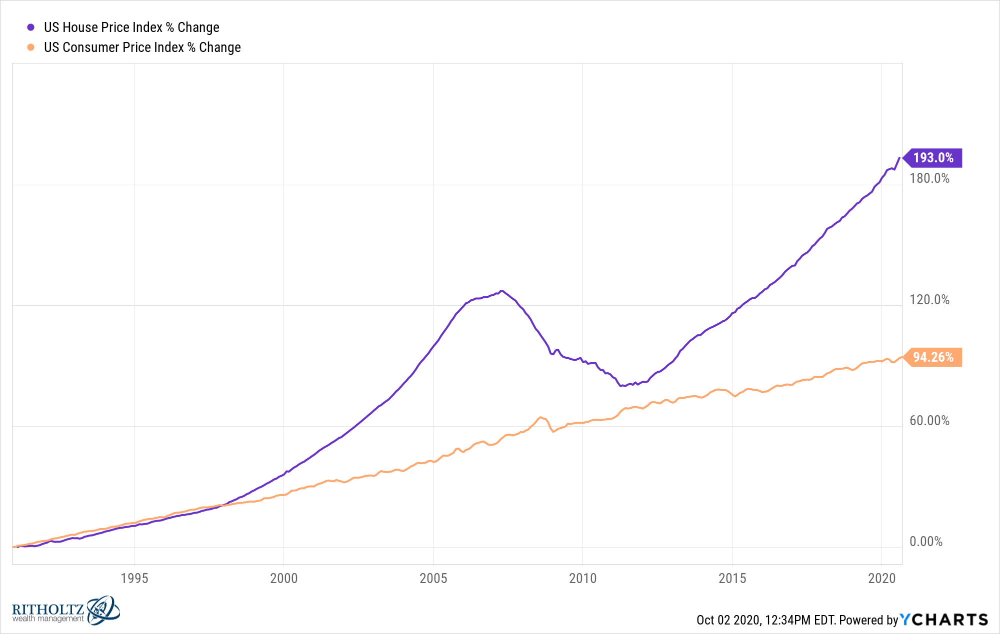

The real estate market has consistently served as a robust pillar within the global economy, providing a variety of opportunities for both individual and institutional investors. Its historical significance and potential for stable returns have solidified its position as a key investment avenue. However, as the market dynamics evolve, influenced by factors like economic changes, demographic shifts, and technological advancements, new methodologies have emerged to predict property prices with increasing accuracy.

These advancements have introduced algorithmic trading to the field, a concept previously dominated by financial markets. Algorithmic trading refers to using computer algorithms to automate investment decisions, allowing for rapid analysis and response to market changes. As this technology finds its application in real estate, it promises to streamline the prediction of property values and enhance market strategies through precise data analysis.



This article examines how algorithmic trading intersects with trends in the real estate market and property pricing. By leveraging large datasets and advanced computational techniques, this method provides novel insights into market behavior, potentially transforming traditional real estate practices and offering strategic advantages to stakeholders. The adaptation of algorithmic trading signifies a pivotal development in real estate, offering a glimpse into the future where data-driven decision-making could reshape the investment landscape.

## Table of Contents

## Historical Overview of the Real Estate Market

The real estate market has historically been considered a dependable and steady investment avenue, characterized by generally increasing property prices over extended periods. This stability is largely attributed to factors such as population growth, urbanization, and the limited supply of land, making real estate a favored asset class for wealth accumulation and a hedge against inflation.

However, the 2008 financial crisis, often referred to as the housing bubble burst, highlighted significant vulnerabilities within the real estate sector. Triggered by subprime mortgage lending and the ensuing credit crunch, the crisis resulted in a drastic depreciation of property values across many regions. This period underscored the fact that real estate prices are not immune to economic shocks and can experience substantial volatility.

In the years following the crisis, property markets have demonstrated varying recovery rates, closely tied to broader economic conditions and policy interventions. Central banks implemented monetary policies, such as lowering interest rates, to stimulate economic activity, contributing to a gradual rebound in property values. However, the pace of recovery has been uneven both globally and within countries, reflecting local economic dynamics, regulatory environments, and shifts in consumer preferences.

The post-crisis landscape also introduced fluctuations in property prices, as markets adjusted to new economic realities and consumer behaviors. Efforts to stabilize and invigorate real estate activities saw a push for transparency and more stringent lending standards. These initiatives aimed to prevent the recurrence of a similar financial debacle and to ensure a more resilient real estate sector.

Overall, while the long-term trend of rising property prices remains apparent, historical episodes such as the 2008 financial crisis illustrate that the real estate market is subject to cyclical downturns and is influenced by a multitude of economic variables.

## Current Real Estate Market Trends

The COVID-19 pandemic drastically influenced the global real estate market, primarily characterized by a surge in property prices. This surge was largely driven by historically low mortgage rates, which made borrowing cheaper, and a limited housing inventory, creating a seller's market with heightened competition among buyers. The confluence of these factors propelled real estate values upwards, as buyers quickly adapted to the changing economic environment, often prioritizing home purchases due to increased remote work flexibility.

Entering 2024, the dynamics of the real estate market have shifted once again. Interest rates are on the rise, a decisive move by central banks to combat inflationary pressures that had been building post-pandemic. Higher interest rates lead to increased mortgage costs, which subsequently impacts buyers' purchasing power, potentially cooling the previously heated demand for real estate. For example, a rise in mortgage rates from 3% to 4% can significantly affect monthly payment amounts:

$$
\text{Monthly Payment} = \frac{\text{Principal} \times \text{Rate}}{1 - (1 + \text{Rate})^{-\text{Term}}}
$$

As mortgage rates increase, the monthly payments for potential homebuyers also escalate, potentially pricing out some demographics and altering demand patterns.

Regional variations continue to define the landscape of real estate trends. Different states and local markets exhibit unique patterns based on a variety of factors such as economic growth, employment rates, and demographic shifts. Metropolitan areas, traditionally characterized by high demand, are experiencing differing degrees of buyer interest; while some continue to see robust market activity, others might be witnessing a slowdown as buyers seek more affordable alternatives in suburban or rural areas. These disparities highlight the importance of localized market analysis rather than relying solely on national trends to understand real estate dynamics comprehensively. 

Navigating through the complexities of these trends requires stakeholders to adapt strategies according to the evolving economic conditions and consumer behaviors, ensuring they remain informed and responsive to both macroeconomic indicators and regional particularities.

## Property Valuation Methods

Property valuation methods are fundamental tools in determining the worth of real estate assets, each employing distinct approaches to appraise value. The Sales Comparison Approach (SCA), the Cost Approach, and the Income Capitalization Approach stand out as the most widely used traditional methods.

The Sales Comparison Approach (SCA) is often employed for residential property valuation and relies on an examination of recent sales of similar properties within a particular area. This method presumes that real estate is valued similarly when recently sold properties share comparable features. Appraisers make adjustments based on differences between the properties, considering aspects such as size, location, condition, and features. The formula used in the SCA can be represented as:

$$

\text{Value of Subject Property} = \text{Comparable Sale Price} + \text{Adjustments for Differences}
$$

In contrast, the Cost Approach, often applied to unique or new properties, calculates the value based on the cost of reproducing or replacing the structure, minus depreciation, plus the value of the land. This approach is ideal for properties where no comparable sales exist and commonly involves assessing either the reproduction cost (exact duplicate) or the replacement cost (similar utility but current standards). The Cost Approach formula is:

$$

\text{Property Value} = (\text{Reproduction or Replacement Cost} - \text{Depreciation}) + \text{Land Value}
$$

The Income Capitalization Approach is mainly utilized for income-producing properties, such as office buildings or apartment complexes. This method evaluates the present value of future income streams. The property's value is determined by dividing the net operating income (NOI) by the capitalization rate (cap rate), reflecting the investor's required rate of return. The calculation is given by:

$$

\text{Property Value} = \frac{\text{Net Operating Income (NOI)}}{\text{Capitalization Rate}}
$$

Net Operating Income is calculated by subtracting operating expenses from the gross income derived from the property. Understanding these approaches is crucial for investors, appraisers, and stakeholders seeking accurate assessments of real estate value.

While these traditional methods remain foundational, they are not without limitations. Factors like market [volatility](/wiki/volatility-trading-strategies) can affect recent sales data, construction costs can vary, and income projections may be uncertain. Despite these challenges, these methods continue to provide essential frameworks for real estate valuation, often serving as reference points for more advanced or algorithmically-inclined valuation techniques.

 to Algorithmic Trading in Real Estate

Algorithmic trading in real estate leverages technology to enhance the prediction accuracy of property prices, moving beyond traditional valuation approaches. Automation in this context refers to computational models that process extensive datasets with minimal human intervention, which allows for rapid analysis of various market factors. This methodological shift is fueled by the integration of big data, [machine learning](/wiki/machine-learning), and [artificial intelligence](/wiki/ai-artificial-intelligence).

Big data plays a crucial role by offering vast amounts of information from different sources, such as economic indicators, historical property values, and market trends. The capacity to handle and analyze this data is augmented by advancements in machine learning and AI, which enable the development of sophisticated algorithms capable of recognizing patterns and predicting future market movements.

Machine learning techniques, including regression analysis, decision trees, and neural networks, are commonly employed in these algorithms. These models are designed to learn from data inputs, optimizing their predictive capacity over time. The mathematical representation of a basic linear regression, often used for estimating property prices, can be expressed as:

$$

Y = \beta_0 + \beta_1X_1 + \beta_2X_2 + \cdots + \beta_nX_n + \epsilon 
$$

where $Y$ is the predicted property price, $\beta_0$ is the intercept, $\beta_1, \beta_2, \ldots, \beta_n$ are the coefficients for each independent variable $X_1, X_2, \ldots, X_n$ representing different market factors, and $\epsilon$ is the error term.

Moreover, [algorithmic trading](/wiki/algorithmic-trading) in real estate allows for real-time analysis and response to market changes, offering a strategic advantage in a highly competitive market. This approach not only improves the efficiency of predicting price movements but also enhances decision-making processes related to property investments. As a result, stakeholders in the real estate market, such as investors and financial institutions, can optimize their strategies by relying on data-driven insights provided by algorithmic trading systems.

## Machine Learning and Market Analysis

Machine learning models have revolutionized the way data is processed and analyzed to predict property values and market trajectories in the real estate sector. These models are adept at handling large datasets, allowing for a detailed examination of various influencing factors. By leveraging techniques such as regression analysis, decision trees, and neural networks, machine learning significantly improves the accuracy of predictions.

Regression analysis forms the backbone of many predictive models. Linear regression, for instance, is used to model the relationship between a dependent variable, such as property price, and one or more independent variables, like location, size, and amenities. The basic formula used in linear regression can be expressed as:

$$
y = \beta_0 + \beta_1x_1 + \beta_2x_2 + \ldots + \beta_nx_n + \epsilon
$$

where $y$ is the predicted property value, $\beta_0$ is the intercept, $\beta_1, \beta_2, \ldots, \beta_n$ are the coefficients of independent variables $x_1, x_2, \ldots, x_n$, and $\epsilon$ represents the error term.

Decision trees offer another robust method for predictive analysis, breaking down complex decision-making processes into a tree-like structure of decisions and their possible consequences. They are particularly useful for handling categorical data and can be used to model various outcomes based on different input variables. Techniques like Random Forests and Gradient Boosting enhance decision trees by combining multiple trees to produce a more accurate and stable prediction.

Neural networks, inspired by the human brain's neural structure, have grown increasingly popular for their ability to model and predict complex patterns. These networks consist of interconnected nodes (or neurons) arranged in layers. Inputs are processed through hidden layers to output predictions. The flexibility and adaptability of neural networks make them exceptionally suited for real estate market analysis, where the data and interrelationships can be complex and nonlinear.

Utilizing diverse data sources significantly enhances the precision of these models. Economic indicators, such as GDP growth rates, unemployment rates, and consumer confidence indices, can influence market trajectories and play a crucial role in forecasting property values. Property-specific details, such as historical sales data, proximity to essential services, and neighborhood crime rates, provide granular insights that refine predictions.

Python has become a popular language for implementing machine learning models due to its extensive libraries and simplicity. Below is an example of how a simple linear regression model can be implemented using the Python library scikit-learn:

```python
from sklearn.model_selection import train_test_split
from sklearn.linear_model import LinearRegression
import pandas as pd

# Load dataset
data = pd.read_csv('real_estate_data.csv')

# Features and target variable
X = data[['location', 'size', 'amenities']]
y = data['price']

# Splitting the dataset into training and testing sets
X_train, X_test, y_train, y_test = train_test_split(X, y, test_size=0.2, random_state=42)

# Initialize and train the linear regression model
model = LinearRegression()
model.fit(X_train, y_train)

# Predicting property values
predictions = model.predict(X_test)
```

This code demonstrates the foundational steps for deploying a regression model to predict property prices using historical data. As models become more sophisticated, incorporating additional techniques and diverse data sources will continue to enhance the reliability and accuracy of real estate market predictions.

## Challenges in Real Estate Algo Trading

Algorithmic trading in real estate has the potential to revolutionize the way properties are appraised, bought, and sold. However, several challenges must be addressed to fully realize its potential. One major challenge is ensuring data quality and consistency. Real estate markets are characterized by heterogeneous data sources, such as property listings, historical sales data, and economic indicators. Variability in data collection methods, missing data points, and outdated information can significantly impact the accuracy of algorithmic models. Furthermore, discrepancies in data formats and standards across different regions or platforms complicate efforts to consolidate information for analysis.

Market volatility also poses a challenge for algorithmic trading in real estate. Property markets are subject to fluctuations driven by various factors, including economic cycles, policy changes, and unforeseen events such as natural disasters or pandemics. Algorithmic models must be robust enough to handle such fluctuations, which can introduce noise and lead to prediction errors. Moreover, real estate is influenced by local regulations and zoning laws that can change frequently. Adapting algorithms to accommodate evolving legal frameworks is essential to maintain compliance and accuracy in predictions.

Ensuring the ethical use of algorithms is another critical consideration. Biases in data can lead to skewed predictions that disadvantage certain groups or regions. For instance, historical data reflecting discriminatory lending practices may result in models that perpetuate these biases if not carefully managed. An important step in addressing this is to incorporate fairness constraints into machine learning models. Techniques such as reweighting datasets or using fairness-aware algorithms can help mitigate bias, but these require careful implementation and validation.

Ethical considerations also encompass transparency in decision-making processes. Stakeholders, including potential homebuyers, sellers, and investors, need to understand the factors driving property evaluations and market forecasts. Providing clear explanations of algorithmic outputs can foster trust and allow for informed decisions.

In sum, addressing data quality, market volatility, regulatory complexity, and ethical considerations are vital to harness the benefits of algorithmic trading in real estate. Through ongoing research and development, these challenges can be tackled, paving the way for more precise and equitable real estate markets.

## Case Studies and Emerging Trends

Companies like Zillow have been at the forefront of integrating AI-driven platforms for property appraisals. Zillow's Zestimate, for example, leverages machine learning algorithms to analyze various data inputs, such as comparable sales and publicly available property data, to estimate home values. The platform uses a self-improving algorithm that continuously learns from new data to enhance its valuation accuracy. This technological advancement enables users to receive more precise property valuations, providing a significant advantage in the decision-making process for buyers and sellers.

Investment firms also capitalize on real-time algorithms for efficient property portfolio management. These algorithms process vast amounts of market data, including price trends, inventory levels, and economic indicators, to make informed investment decisions swiftly. By utilizing predictive analytics, firms can optimize portfolio performance, manage risk, and identify lucrative investment opportunities. This capability is crucial in a dynamic market environment where rapid decision-making can lead to substantial financial benefits.

The integration of blockchain technology is enhancing transparency and efficiency in real estate transactions. Blockchain's decentralized ledger offers a secure and immutable record of transactions, reducing the risk of fraud and errors. Smart contracts, powered by blockchain, automate and streamline processes such as property transfers and escrow agreements, reducing the need for intermediaries and speeding up transaction times. For example, Propy, a blockchain-based real estate platform, facilitates international property transactions with increased security and reduced bureaucratic hurdles.

Collectively, these emerging trends are reshaping the landscape of the real estate market. AI-driven property appraisals, real-time algorithmic portfolio management, and blockchain technology are not only enhancing operational efficiency but also offering stakeholders a strategic edge. As these innovations continue to evolve, they promise to drive further transformation and growth in the real estate sector.

## Conclusion

Algorithmic trading in real estate demonstrates substantial promise in enhancing property valuations and understanding market dynamics. By leveraging data-driven methodologies, stakeholders such as investors, real estate [agents](/wiki/agents), and financial institutions gain access to actionable insights that were previously inaccessible through conventional means. The precision and speed afforded by algorithmic models allow for more informed decision-making, reducing the risks associated with market fluctuations and asset mispricing.

The integration of technologies like machine learning and artificial intelligence into property analysis paves the way for more accurate predictions of market trends. These models can adapt to new data in real-time, continuously refining their predictive capabilities. As a result, stakeholders can achieve strategic advantages by identifying lucrative investment opportunities and optimizing asset portfolios in response to evolving market conditions.

Continued innovation in algorithmic trading is likely to introduce further advancements in the real estate sector. Emerging trends, such as the use of blockchain technology for transaction transparency and efficiency, signify the potential for profound transformations. The ongoing refinement of algorithmic methods will facilitate the development of more sophisticated tools, driving growth and efficiency within the market.

Consequently, as the real estate sector embraces these technological advancements, a more dynamic and resilient market landscape is anticipated. The collaboration between traditional real estate practices and innovative algorithmic approaches holds the potential to redefine property valuation and investment strategies in the years to come.

## References & Further Reading

[1]: Bergstra, J., Bardenet, R., Bengio, Y., & Kégl, B. (2011). ["Algorithms for Hyper-Parameter Optimization."](https://papers.nips.cc/paper/4443-algorithms-for-hyper-parameter-optimization) Advances in Neural Information Processing Systems 24.

[2]: ["Advances in Financial Machine Learning"](https://www.amazon.com/Advances-Financial-Machine-Learning-Marcos/dp/1119482089) by Marcos Lopez de Prado

[3]: ["Evidence-Based Technical Analysis: Applying the Scientific Method and Statistical Inference to Trading Signals"](https://www.amazon.com/Evidence-Based-Technical-Analysis-Scientific-Statistical/dp/0470008741) by David Aronson

[4]: ["Machine Learning for Algorithmic Trading"](https://github.com/stefan-jansen/machine-learning-for-trading) by Stefan Jansen

[5]: ["Quantitative Trading: How to Build Your Own Algorithmic Trading Business"](https://www.amazon.com/Quantitative-Trading-Build-Algorithmic-Business/dp/1119800064) by Ernest P. Chan