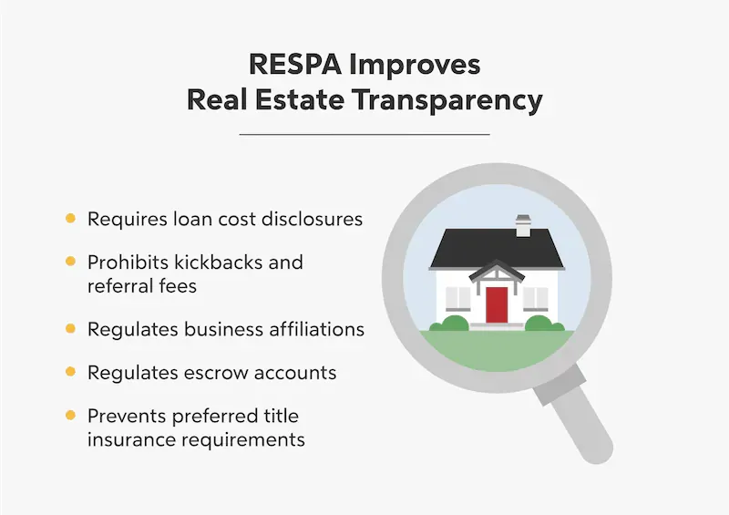

## Table of Contents

## What is the Real Estate Settlement Procedures Act (RESPA)?

The Real Estate Settlement Procedures Act, or RESPA, is a law that helps protect people who are buying or refinancing a home. It was created to make sure that everyone involved in the home buying process is treated fairly. RESPA requires lenders to give borrowers clear and accurate information about the costs of a mortgage and the settlement process. This includes a booklet that explains the process and a special form called a Loan Estimate that shows all the costs you can expect to pay.

RESPA also helps prevent certain practices that could be harmful to homebuyers. For example, it stops companies from giving or receiving kickbacks or referral fees for sending business their way. This means that the services you get during your home purchase should be based on what's best for you, not on secret deals between companies. If you think someone has broken the rules set by RESPA, you can file a complaint with the Consumer Financial Protection Bureau or take legal action.

## When was RESPA enacted and why is it important?

RESPA was enacted in 1974. This law is important because it helps people who are buying or refinancing a home. It makes sure that everyone is treated fairly and gets clear information about the costs involved in getting a mortgage.

RESPA requires lenders to give borrowers a booklet that explains the home buying process and a Loan Estimate form that lists all the costs. It also stops companies from giving or receiving kickbacks or referral fees, which means the services you get should be good for you, not just because of secret deals. If someone breaks RESPA rules, you can complain to the Consumer Financial Protection Bureau or go to court.

## Who does RESPA apply to?

RESPA applies to people who are getting a mortgage to buy or refinance a home. This includes first-time homebuyers and people who already own a home and want to change their mortgage. It also applies to those who are using a mortgage to build a home.

The law covers most types of home loans, like fixed-rate and adjustable-rate mortgages. But it does not apply to loans for business, commercial, or agricultural purposes, or to loans made by someone who is not in the business of lending money. So, if you are borrowing money to buy or refinance a home for yourself or your family, RESPA is there to protect you.

## What are the key provisions of RESPA?

RESPA has some important rules to protect home buyers. One key rule is that lenders have to give you a booklet that explains the home buying process. They also have to give you a Loan Estimate form that shows all the costs you will have to pay. This helps you know exactly what you are getting into before you decide to buy a home.

Another important part of RESPA is that it stops companies from giving or getting kickbacks or referral fees. This means that the services you get during your home purchase should be the best for you, not because of secret deals between companies. If someone breaks these rules, you can file a complaint with the Consumer Financial Protection Bureau or take them to court.

RESPA also requires lenders to give you a Closing Disclosure form at least three days before you close on your home. This form shows the final costs and terms of your loan. This gives you time to review everything and make sure it matches what you were told before. Knowing these rules can help you make better choices when buying a home.

## How does RESPA protect homebuyers?

RESPA helps homebuyers by making sure they get clear and accurate information about the costs of buying a home. Lenders have to give you a special booklet that explains the whole process. They also have to give you a Loan Estimate form that shows all the costs you will need to pay. This helps you know exactly what to expect before you decide to buy a home. It also gives you time to compare different loans and choose the one that is best for you.

Another way RESPA protects homebuyers is by stopping companies from giving or getting secret payments, called kickbacks or referral fees. This means that the services you get during your home purchase should be good for you, not just because of secret deals between companies. If someone breaks these rules, you can file a complaint with the Consumer Financial Protection Bureau or take them to court. This helps keep the home buying process fair and honest.

RESPA also requires lenders to give you a Closing Disclosure form at least three days before you close on your home. This form shows the final costs and terms of your loan. This gives you time to review everything and make sure it matches what you were told before. Knowing these rules can help you make better choices when buying a home and protect you from unfair practices.

## What is a HUD-1 Settlement Statement and its role under RESPA?

The HUD-1 Settlement Statement is a form that used to be given to homebuyers before they closed on their home. It showed all the costs and fees they would have to pay at the closing. It was an important part of RESPA because it helped homebuyers see all the money they would need to bring to the closing table. This way, they could check that everything was correct and that they were not being charged for things they did not know about.

However, the HUD-1 was replaced by the Closing Disclosure form in 2015. The new form still serves the same purpose under RESPA, which is to give homebuyers clear information about their loan costs and terms. The Closing Disclosure must be given to the buyer at least three days before closing, giving them time to review it and make sure it matches the Loan Estimate they received earlier. This helps keep the home buying process fair and transparent.

## Can you explain the RESPA requirements for loan servicing?

RESPA has rules about how companies that service your loan should treat you. These companies are the ones that handle your mortgage payments and keep track of your loan. RESPA says they have to give you clear information about your loan, like how much you owe and where your payments are going. They also have to respond to your questions quickly, usually within a certain number of days. This helps you know what is happening with your loan and makes sure you are treated fairly.

If you have a problem with your loan servicer, RESPA gives you the right to ask for help. You can send them a written request called a "qualified written request" if you think something is wrong or if you need more information. The servicer has to look into your request and give you an answer within a specific time. They also can't charge you extra fees or report you as late to credit bureaus while they are looking into your request. This part of RESPA helps protect you and makes sure your loan servicer does their job properly.

## What are the disclosure requirements under RESPA?

RESPA requires lenders to give you clear information about the costs of buying a home. When you apply for a mortgage, the lender must give you a booklet called "Your Home Loan Toolkit" that explains the home buying process. They also have to give you a Loan Estimate form within three business days of your application. This form shows all the costs you will have to pay, like the interest rate, monthly payments, and closing costs. This helps you understand what you will need to pay and compare different loans.

Before you close on your home, the lender must give you a Closing Disclosure form at least three days before closing. This form shows the final costs and terms of your loan. It's important because it gives you time to check that everything matches what was on the Loan Estimate. If there are big changes, you can ask questions or even back out of the deal if you need to. These disclosure requirements help make sure you are not surprised by any costs and can make a good decision about buying your home.

## How does RESPA regulate kickbacks and unearned fees?

RESPA stops companies from giving or getting kickbacks and unearned fees. A kickback is when one company pays another company to send them business. An unearned fee is when someone charges you for a service they did not actually provide. RESPA says that these practices are not allowed because they can make the home buying process unfair and more expensive for you.

If someone breaks these rules, they can get in big trouble. They might have to pay a lot of money as a penalty, and they could even go to jail. If you think a company has given or gotten a kickback or charged you an unearned fee, you can file a complaint with the Consumer Financial Protection Bureau or take them to court. This helps make sure that everyone plays by the rules and treats homebuyers fairly.

## What are the penalties for violating RESPA?

If someone breaks the rules of RESPA, they can get in big trouble. The law says that if a company gives or gets a kickback or charges an unearned fee, they could have to pay a lot of money as a penalty. This penalty can be up to three times the amount of the kickback or fee. The company might also have to pay for any damage they caused to the homebuyer. If the violation was on purpose, the people involved could even go to jail for up to one year.

People who break RESPA rules can also be sued by the government or by the homebuyers themselves. If a homebuyer wins a lawsuit against a company for breaking RESPA, they might get their legal fees paid for by the company. This makes sure that companies follow the rules and treat homebuyers fairly. Knowing about these penalties can help homebuyers feel safer and more protected during the home buying process.

## How have recent amendments changed RESPA regulations?

Recent changes to RESPA have made the home buying process clearer and easier for people. One big change happened in 2015 when the TILA-RESPA Integrated Disclosure (TRID) rule was put into place. This rule combined the old RESPA and Truth in Lending Act (TILA) disclosures into two new forms: the Loan Estimate and the Closing Disclosure. The Loan Estimate has to be given to you within three days of applying for a loan, and it shows all the costs you will have to pay. The Closing Disclosure must be given to you at least three days before you close on your home, and it shows the final costs and terms of your loan. These new forms help you understand exactly what you will need to pay and give you time to review everything before closing.

Another important change is how RESPA now deals with mortgage servicing. The law now requires servicers to give you clear information about your loan, like how much you owe and where your payments are going. They also have to respond to your questions quickly. If you have a problem with your loan servicer, you can send them a "qualified written request" to ask for help. The servicer has to look into your request and give you an answer within a specific time. They can't charge you extra fees or report you as late to credit bureaus while they are looking into your request. These changes help make sure that loan servicers treat you fairly and keep you informed about your loan.

## What are some common misconceptions about RESPA and how can they be addressed?

Some people think that RESPA only applies to buying a new home, but it also covers refinancing and even building a home. Another common mistake is thinking that RESPA only helps with the closing costs. It actually helps in many ways, like making sure you get clear information about your loan and stopping companies from giving or getting secret payments. People sometimes believe that RESPA is just about the forms you get, but it's also about making the whole home buying process fair and honest.

To address these misconceptions, it's important to know that RESPA is there to help you at every step of getting a mortgage. It doesn't matter if you are buying a new home, refinancing, or building a house; RESPA applies to all of these. Also, remember that RESPA is not just about the money you pay at closing. It's about getting clear information, like the Loan Estimate and Closing Disclosure forms, so you can make good choices. And it's about stopping unfair practices, like secret deals between companies. Knowing these things can help you feel more confident and protected when you buy a home.

## References & Further Reading

[1]: U.S. Government Publishing Office. ["Real Estate Settlement Procedures Act (RESPA) Legal Texts, 12 U.S.C. Chapter 27."](https://www.consumerfinance.gov/compliance/compliance-resources/mortgage-resources/real-estate-settlement-procedures-act/)

[2]: Consumer Financial Protection Bureau. ["Regulation X: Real Estate Settlement Procedures Act."](https://www.consumerfinance.gov/rules-policy/regulations/1024/)

[3]: U.S. Department of Housing and Urban Development (HUD). ["HUD Regulations and Policy Page."](https://www.hud.gov/)

[4]: Journal of Real Estate Research. ["Algorithmic Trading and Real Estate: An Emerging Frontier."](https://www.jstor.org/journal/jrealestarese) 

[5]: Financial Industry Regulatory Authority (FINRA). ["Guidance on Algorithmic Trading."](https://www.finra.org/rules-guidance/key-topics/algorithmic-trading)

[6]: National Association of Realtors (NAR). ["Regulatory Affairs Resources."](https://www.nar.realtor/)

[7]: Urban Institute. ["Housing Finance Policy Center – Recent Developments in Housing Policies."](https://www.urban.org/policy-centers/housing-finance-policy-center)