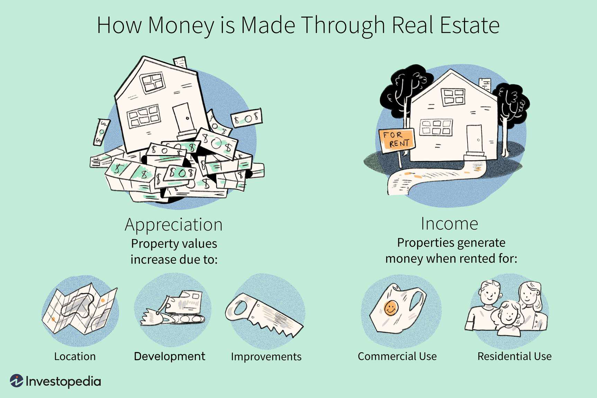

In the quest for a secure and wealthy retirement, diversification of income streams is paramount. Relying solely on traditional financial instruments like pensions or annuities may not suffice in the ever-evolving economic landscape. Thus, exploring diverse investment opportunities becomes crucial.

Real estate, combined with investment properties, emerges as a compelling option for many retirees seeking stable income. The allure of real estate lies in its potential to generate consistent cash flow through rental income and appreciate in value over time. By investing in properties, retirees can establish a dependable income stream that supplements their retirement funds, potentially outpacing inflation and offering tax advantages.



Algorithmic trading offers an innovative and data-driven approach to real estate investments. By leveraging advanced computational techniques and vast datasets, it allows investors to make informed and timely decisions. Algorithmic trading can enhance the accuracy and efficiency of identifying lucrative real estate opportunities, thereby optimizing investment strategies and enhancing returns.

This article will explore how these elements can intertwine to enhance retirement income. By understanding the intricacies of real estate investment and the role of algorithmic trading, retirees can effectively integrate these approaches to create a robust and diversified retirement portfolio. We'll cover the basics of each facet and how they can be effectively integrated to ensure a financially secure retirement.

## Table of Contents

## Understanding Real Estate as a Retirement Income Source

Real estate has traditionally been a preferred investment vehicle, offering the dual advantages of stable cash flow and long-term appreciation. For retirees, the ownership of rental properties can serve as a vital source of consistent income, helping to maintain financial independence and stability. However, like all investment forms, real estate comes with its own set of benefits and risks that must be carefully considered when planning for retirement.

One of the primary advantages of real estate investment is the ability to generate regular rental income. This can be particularly useful for retirees, providing a predictable monthly cash flow that can supplement other retirement income sources such as pensions or social security benefits. Additionally, real estate often appreciates over time, allowing investors to accrue capital gains, which can be realized upon the sale of the property.

However, it is crucial to recognize the inherent risks associated with real estate investments. Market fluctuations can significantly impact property values and rental prices, affecting potential returns. Additionally, real estate investments require ongoing management, including property maintenance, tenant management, and compliance with regulatory requirements. These tasks can be labor-intensive and may necessitate hiring professional management services, which adds to overall costs.

The success of real estate investments, particularly for retirement purposes, largely depends on three critical factors: property location, market trends, and management costs. The location is pivotal as properties in sought-after areas with strong economic fundamentals are more likely to experience higher demand and appreciation. Market trends, including employment rates and demographic shifts, can also influence rental yields and property values, emphasizing the need to stay informed about local and global economic conditions.

Management costs encompass the expenses associated with property upkeep, legal compliance, and tenant relations. While these can reduce net rental income, effective property management ensures the investment remains profitable over the long term.

In summary, real estate can be a valuable addition to a retirement income portfolio, offering the potential for steady cash flow and investment growth. However, understanding and mitigating associated risks, as well as considering strategic factors like location and market dynamics, are crucial for maximizing the benefits and securing a financially stable retirement.

## Leveraging Investment Properties for Maximum Returns

Investment properties are an integral component for enhancing retirement income, offering multiple avenues for financial growth through property appreciation and rental yield. Understanding the various types of investment properties and the factors influencing their success can significantly increase potential returns.

### Types of Investment Properties

1. **Residential Properties**: These include single-family homes, condominiums, apartments, and multi-family units such as duplexes. Residential properties often provide consistent rental income and stable long-term appreciation. They generally benefit from high demand, especially in urban locations with limited housing supply.

2. **Commercial Properties**: This category encompasses office buildings, retail spaces, warehouses, and industrial properties. Commercial real estate typically offers higher rental yields compared to residential properties, although they may require more significant initial investments and longer rental agreements. They are often influenced by trends in business cycles and local economic development.

3. **Vacation Rentals**: Typically located in tourist-heavy areas, vacation rentals, such as beach houses or mountain cabins, can offer high income during peak seasons. However, they may be susceptible to fluctuating occupancy rates dependent on tourism trends and seasonal variations.

### Identifying Lucrative Investment Opportunities

Investors can maximize returns by strategically selecting properties in high-demand markets with solid growth potential. Consider the following tips:

- **Location Analysis**: Research areas with strong economic growth, population influx, and infrastructure development. Proximity to amenities, quality schools, and transportation hubs can enhance property value and rental demand.

- **Market Trends**: Stay informed regarding local real estate cycles and demographic shifts. Understanding these patterns can help anticipate property value appreciation and rent adjustments.

- **Property Condition and Potential**: Evaluate the current state of potential investments. Properties that require minimal renovations or promise future development opportunities can be more valuable. Renovations can also increase rental income and property value over time.

### Economic Factors Affecting Investment Properties

Several macroeconomic factors influence the profitability of investment properties. Key considerations include:

- **Interest Rates**: Lower interest rates reduce borrowing costs, making property acquisition and mortgage refinancing more affordable for investors. Conversely, higher interest rates can diminish purchasing power and exacerbate financing challenges.

- **Tax Policies**: Tax legislation can significantly impact investment returns. Favorable tax policies, such as deductions for mortgage interest or property depreciation, can enhance net returns. Conversely, changes in capital gains tax rates or property tax increases can affect overall profitability.

- **Inflation**: Real estate traditionally serves as a reliable hedge against inflation, as property values and rental prices tend to rise in tandem with inflation rates. However, inflation can also increase maintenance costs and affect affordability for potential tenants.

By carefully selecting investment properties based on type, location, and market conditions, and by accounting for relevant economic factors, retirees can harness the full potential of real estate to amplify their income streams and achieve financial security.

## The Role of Algorithmic Trading in Real Estate Investment

Algorithmic trading utilizes automated systems designed to execute trading strategies using real-time data analysis. In the context of real estate investment, [algorithmic trading](/wiki/algorithmic-trading) can substantially enhance decision-making by rapidly identifying market trends and investment opportunities with increased accuracy. This approach leverages the power of extensive data processing and sophisticated algorithms to analyze various factors affecting real estate markets, including property prices, economic indicators, and consumer behavior, allowing investors to make informed decisions in a timely manner.

Traditionally, real estate investments rely heavily on manual analysis and gut instinct, which can be time-consuming and error-prone. Algorithmic trading, however, offers a more efficient and objective method by using algorithms that incorporate large datasets and perform analyses at speeds unattainable by human efforts. For instance, [machine learning](/wiki/machine-learning) models can be trained to predict property price movements based on historical data and current market conditions, while AI can sift through massive volumes of data to detect subtle changes in market trends.

Integration of AI and machine learning in real estate algorithmic trading can optimize property investment strategies. Machine learning algorithms, such as regression models and neural networks, can be utilized to predict real estate prices and rental yields. Python libraries like Scikit-learn or TensorFlow can be employed to build these predictive models. For example, a linear regression model can be represented as:

$$
\text{Price} = \theta_0 + \theta_1 \times \text{Square Footage} + \theta_2 \times \text{Number of Bedrooms} + \ldots + \epsilon
$$

where $\theta$ represents the coefficients learned by the model, and $\epsilon$ is the error term. Implementing these models in Python could involve:

```python
from sklearn.linear_model import LinearRegression

# Sample data: features (square footage, bedrooms) and target (price)
X = [[2000, 3], [1600, 2], [2400, 4]]
y = [500000, 350000, 700000]

# Creating and training the model
model = LinearRegression().fit(X, y)

# Predicting price for a new property
new_property = [[1800, 3]]
predicted_price = model.predict(new_property)
```

Algorithmic trading offers the advantage of swiftly adapting to changing market conditions, thereby providing investors with a competitive edge. However, this approach is not without challenges and risks. Data quality is paramount; poor or biased data can lead to flawed predictions and substantial financial losses. Furthermore, real estate markets are influenced by numerous unpredictable factors, such as political changes or natural disasters, which may not be fully captured by algorithms.

Additionally, the complexity of algorithmic models can pose a barrier to entry for those without a strong technical background. Developing robust algorithms requires understanding both the technical aspects of model design and the practical nuances of real estate investing. There's also the risk of overfitting, where a model may perform well on historical data but fail to generalize to new data.

In summary, while algorithmic trading offers significant advantages in optimizing real estate investment strategies, it requires careful consideration of data quality, model complexity, and external market variables to mitigate risks effectively.

## Integrating Real Estate and Algo Trading for a Robust Retirement Portfolio

Combining real estate investments with algorithmic trading presents a sophisticated strategy to achieve a balanced and diverse retirement portfolio. By leveraging the strengths of both asset classes, investors can potentially maximize income while minimizing associated risks.

### Strategies for Management and Optimization

1. **Diversification Across Asset Types**:
   Real estate and algorithmic trading serve as complementary components in a retirement strategy. While real estate offers tangible assets with the possibility of appreciation and steady rental income, algorithmic trading provides [liquidity](/wiki/liquidity-risk-premium) and opportunities for short-term gains. Balancing these assets ensures that a decrease in one can be offset by gains in the other, thus reducing overall portfolio [volatility](/wiki/volatility-trading-strategies).

2. **Utilization of Data Analytics**:
   Data-driven decision-making is crucial in both realms. For real estate, this might include analyzing geographic and demographic data to predict property value trends. In algorithmic trading, harnessing historical market data can refine trading algorithms to better optimize buying and selling strategies.

   ```python
   import pandas as pd
   from sklearn.model_selection import train_test_split
   from sklearn.ensemble import RandomForestRegressor

   # Sample code to predict property investment returns
   data = pd.read_csv('real_estate_data.csv')
   X = data.drop(columns=['Return'])
   y = data['Return']

   X_train, X_test, y_train, y_test = train_test_split(X, y, test_size=0.2, random_state=42)
   model = RandomForestRegressor()
   model.fit(X_train, y_train)

   predicted_returns = model.predict(X_test)
   print(predicted_returns)
   ```

3. **Risk Management**:
   Employing algorithmic trading can hedge against real estate market downturns. Algorithms can be programmed to recognize risk patterns, triggering automated selling or buying to protect against sudden losses. Additionally, diversification within territories and property types can protect against localized downturns, while algorithms can be adapted to various financial instruments to mitigate risk.

### Real-World Examples

Real estate firms like Redfin and Zillow have integrated machine learning algorithms to predict housing prices and optimize property listings and purchases. In algorithm trading, firms like Renaissance Technologies have achieved significant success by using mathematical models to guide market actions, showcasing the potential of tech-driven investment strategies.

### Future Trends

Technological advancements promise further synergy between real estate and algorithmic trading. Blockchain technology could streamline property transactions, enhance transparency, and even enable tokenization of real estate assets, allowing algorithmic trade of fractional ownership. Additionally, advances in [artificial intelligence](/wiki/ai-artificial-intelligence) could lead to more sophisticated predictive models that improve decision-making in both sectors.

As these technologies evolve, they are expected to drive more efficient market operations and offer innovative opportunities for investors seeking robust retirement portfolios. The challenge lies in staying informed and adaptive to these rapid technological changes to capitalize on new opportunities that align with future financial goals.

## Conclusion

Diversifying retirement income through the integration of real estate investments and algorithmic trading offers substantial benefits for retirees. Real estate has traditionally provided stable cash flow and potential for appreciation, serving as a reliable income source during retirement. When combined with algorithmic trading, which utilizes data-driven techniques to optimize investment decisions, the potential for income generation is significantly enhanced.

Careful planning and strategic integration of these investment avenues are crucial for maximizing returns and ensuring financial stability. Retirees must assess their risk tolerance, financial goals, and market conditions before committing to such diversified strategies. By analyzing data and leveraging algorithmic tools, retirees can identify lucrative real estate opportunities and optimize their portfolios for better performance. For instance, using Python to analyze historical price trends and rental income data can inform decision-making and improve investment outcomes.

Staying informed about market dynamics, emerging technology trends, and regulatory changes is vital to maintaining a competitive edge. Real estate markets are inherently local, and understanding regional economic factors, housing demand, and legislative updates can greatly influence investment success. Similarly, staying abreast of advancements in algorithmic trading paints a clearer picture of potential investment strategies and their associated risks.

With the right approach, retirees can create a sustainable income stream that accommodates their financial goals. The integration of real estate and algorithmic trading provides a comprehensive mechanism to diversify income, hedge against market volatility, and achieve financial security in retirement. By consistently refining their strategies and adapting to changes, retirees can ensure a balanced and growth-oriented investment portfolio, paving the way for a comfortable retirement.

## References & Further Reading

[1]: Bergstra, J., Bardenet, R., Bengio, Y., & Kégl, B. (2011). ["Algorithms for Hyper-Parameter Optimization."](https://papers.nips.cc/paper/4443-algorithms-for-hyper-parameter-optimization) Advances in Neural Information Processing Systems 24.

[2]: ["Advances in Financial Machine Learning"](https://www.amazon.com/Advances-Financial-Machine-Learning-Marcos/dp/1119482089) by Marcos Lopez de Prado

[3]: ["Evidence-Based Technical Analysis: Applying the Scientific Method and Statistical Inference to Trading Signals"](https://www.amazon.com/Evidence-Based-Technical-Analysis-Scientific-Statistical/dp/0470008741) by David Aronson

[4]: ["Machine Learning for Algorithmic Trading"](https://github.com/stefan-jansen/machine-learning-for-trading) by Stefan Jansen

[5]: ["Quantitative Trading: How to Build Your Own Algorithmic Trading Business"](https://www.amazon.com/Quantitative-Trading-Build-Algorithmic-Business/dp/1119800064) by Ernest P. Chan