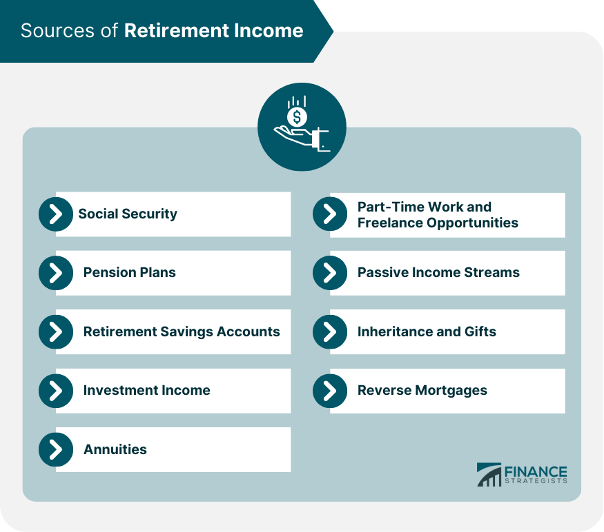

## Table of Contents

## What is real estate as a source of retirement income?

Real estate can be a good way to make money when you retire. You can buy a house or an apartment and rent it out to people. The money you get from rent can help you pay for things you need in retirement, like food and medicine. It's like having a regular job, but instead of working, you own a property that earns money for you.

There are some things to think about before you start. You need to make sure you can afford to buy the property and fix anything that breaks. You also need to find good people to rent your property, and sometimes that can be hard. But if you do it right, real estate can give you money every month, and over time, the value of your property might go up, which is good for your retirement savings.

Overall, real estate can be a smart choice for retirement income if you plan carefully. It's important to understand the risks and rewards. With the right property and good management, it can help make your retirement more comfortable and secure.

## How does investing in real estate help with retirement planning?

Investing in real estate can help with retirement planning by providing a steady stream of income. When you buy a property and rent it out, the rent money you receive each month can help pay for your living expenses during retirement. This is important because it gives you money to live on without having to dip into your savings. Plus, if you have more than one property, you can earn even more money, which can make your retirement more comfortable.

Another way real estate helps with retirement planning is through property value growth. Over time, the value of your property might go up. This means that if you decide to sell your property later, you could make a profit. This extra money can be a big help in retirement, giving you a financial cushion or even allowing you to buy another property to rent out. So, real estate not only provides monthly income but also has the potential to increase your wealth over time, making it a smart choice for planning your retirement.

## What are the different types of real estate investments suitable for retirement?

There are a few types of real estate investments that can be good for retirement. One type is rental properties, where you buy a house or an apartment and rent it out to tenants. The rent money you get every month can help you pay for things you need in retirement. Another type is vacation rentals, where you buy a property in a place where people like to go on vacation. You can rent it out to people who are on holiday, and this can bring in more money, especially during busy times of the year.

Another option is real estate investment trusts, or REITs. These are companies that own lots of properties and you can buy shares in them. When the company makes money from rent, you get some of that money as dividends. REITs are easier to manage than owning a property yourself because you don't have to worry about fixing things or finding tenants. Lastly, there are real estate crowdfunding platforms where lots of people pool their money together to buy a property. This can be a good way to invest in real estate without having to buy a whole property on your own.

Each type of real estate investment has its own benefits and things to think about. Rental properties and vacation rentals can give you regular income, but they need more work to manage. REITs and crowdfunding are easier to handle but might not give you as much control over your investment. It's important to think about what you want and what you can handle when choosing the right type of real estate investment for your retirement.

## What are the benefits of using real estate for retirement income?

Using real estate for retirement income has many benefits. One big benefit is that it can give you a steady stream of money every month. When you own a rental property, the rent you collect can help pay for your living expenses in retirement. This means you don't have to use your savings as quickly, which can make your retirement more secure and comfortable. Plus, if you own more than one property, you can earn even more money, which is great for covering your costs.

Another benefit is that real estate can grow in value over time. If you buy a property and its value goes up, you could sell it later and make a profit. This extra money can be very helpful in retirement, giving you a financial cushion or even letting you buy another property to rent out. Also, real estate can be a good way to protect your money from inflation. As prices go up, you can usually raise the rent, which helps keep your income in line with the cost of living. So, real estate can not only provide monthly income but also increase your wealth, making it a smart choice for retirement planning.

## What are the potential risks and challenges of real estate investment for retirement?

Investing in real estate for retirement can be risky because it costs a lot of money to buy a property. You need to have enough money not just to buy the property but also to fix anything that breaks and to pay for things like taxes and insurance. If you can't afford these costs, you might lose money instead of making it. Also, finding good tenants can be hard. If you have tenants who don't pay rent on time or who damage the property, it can be stressful and costly to deal with. Plus, if the economy goes bad, it might be harder to find people who want to rent your property, which means less money coming in.

Another challenge is that real estate is not easy to sell quickly. If you need money fast in retirement, you might not be able to sell your property as quickly as you need to. This can be a problem if you have unexpected expenses. Also, the value of your property can go down as well as up. If the housing market crashes, you could lose money on your investment. It's important to think about these risks and have a plan for what to do if things don't go as expected. While real estate can be a good way to make money in retirement, it's important to understand the challenges and be ready to handle them.

## How can one start investing in real estate for retirement?

To start investing in real estate for retirement, you first need to save up enough money to buy a property. This can be a big challenge because real estate is expensive. You might need to get a loan from a bank, which means you'll have to pay it back over time with interest. Before you buy, it's a good idea to do a lot of research. Look at different areas to see where property values are going up and where you can find good tenants. You should also think about how much work you want to put into managing the property. If you don't want to deal with fixing things or finding tenants, you might want to look into easier options like real estate investment trusts (REITs) or real estate crowdfunding.

Once you've decided on the type of investment that's right for you, it's time to take action. If you're buying a rental property, you'll need to find a good one in a place where people want to live. You might want to work with a real estate agent who can help you find the right property and negotiate the price. After you buy the property, you'll need to get it ready for tenants, which might mean fixing it up or making it look nice. Then, you'll need to find good tenants who will pay rent on time and take care of the property. If you choose REITs or crowdfunding, the process is easier because you're investing in a company or a project rather than managing a property yourself. Either way, starting early and planning carefully can help make real estate a good part of your retirement plan.

## What are the tax implications of using real estate as a retirement income source?

Using real estate as a retirement income source can have important tax implications that you should know about. When you own a rental property, the money you get from rent is considered taxable income. You have to report this income on your tax return every year. But there's some good news too. You can deduct certain expenses related to your rental property from your income, like mortgage interest, property taxes, insurance, and the cost of repairs and maintenance. These deductions can lower the amount of taxes you have to pay. Also, if you sell your property and make a profit, you might have to pay capital gains tax on that profit, but there are ways to reduce this tax, like using a 1031 exchange to swap one property for another without paying immediate taxes on the gain.

Another thing to consider is how real estate fits into your overall retirement plan. If you have a retirement account like an IRA or 401(k), the rules about taxes can be different. For example, if you use money from these accounts to buy a rental property, you might have to pay taxes and penalties if you're not yet at retirement age. But if you use money that's already been taxed, like from a regular savings account, you won't have to worry about these extra taxes. It's a good idea to talk to a tax advisor who can help you understand all the tax rules and make sure you're doing everything right. They can help you plan how to use real estate to make your retirement income as tax-efficient as possible.

## How does real estate investment compare to other retirement income sources like stocks or annuities?

Real estate investment can be a good way to make money for retirement, but it's different from other options like stocks or annuities. When you invest in real estate, you can get regular income from rent, and over time, the value of your property might go up. This can help you have more money in retirement. But real estate needs a lot of work. You have to find good tenants, fix things when they break, and deal with money problems like taxes and insurance. It also costs a lot to buy a property, so you need to have enough money saved up or get a loan.

Stocks and annuities are different. Stocks can grow a lot in value, but they can also lose value quickly, which can be scary if you need the money in retirement. Annuities are like a promise from an insurance company to give you a certain amount of money every month for the rest of your life. They're easier to manage than real estate because you don't have to do anything once you buy them. But annuities might not grow as much as stocks or real estate, and they can be hard to change once you've bought them. So, each option has its own good and bad points, and the best choice depends on what you want and how much risk you're okay with.

## What strategies can maximize returns from real estate investments for retirement?

To maximize returns from real estate investments for retirement, it's important to pick the right property in a good location. Look for areas where property values are going up and where there are lots of people who want to rent. You can also make your property more valuable by fixing it up or adding things that tenants like, such as new appliances or a nice backyard. Another way to increase your returns is to keep your costs low. This means finding good deals on properties, getting the best interest rates on loans, and being smart about how you spend money on repairs and maintenance. By doing these things, you can make more money from your rental income and see your property's value grow over time.

Another strategy is to use leverage wisely. This means using loans to buy properties so you can own more than one without using all your own money. But you have to be careful because loans also mean more risk. If you can manage this well, you can earn more money from multiple properties. It's also a good idea to diversify your investments. Instead of putting all your money into one property, you might want to invest in different types of real estate, like rental properties, vacation homes, or even real estate investment trusts (REITs). This way, if one type of investment doesn't do well, you still have others that can help you make money for retirement.

## How should one manage and maintain real estate properties to ensure steady retirement income?

Managing and maintaining real estate properties for steady retirement income involves a few key steps. First, you need to keep your property in good shape. This means fixing things when they break and doing regular maintenance like painting or cleaning. When your property looks nice and works well, you can attract good tenants who will pay rent on time and take care of the place. It's also important to keep your costs down. Shop around for the best deals on insurance, taxes, and repairs. By managing your expenses carefully, you can make sure more of the rent money goes into your pocket, which is important for your retirement income.

Another part of managing your property is dealing with tenants. You need to find good tenants who will pay rent on time and follow the rules. Sometimes this can be hard, but it's worth the effort because good tenants help keep your income steady. You should also stay on top of the rental market in your area. If you see that other landlords are raising their rents, you might be able to raise yours too, as long as it's fair. This can help your income keep up with inflation and make your retirement more comfortable. By taking care of your property and managing your tenants well, you can enjoy a steady stream of income during your retirement years.

## What are advanced strategies for leveraging real estate to enhance retirement income?

One advanced strategy for leveraging real estate to enhance retirement income is to use a 1031 exchange. This lets you sell one property and buy another without paying taxes on the profit right away. By doing this, you can keep more of your money working for you, which can help you buy more properties and earn more rent. Another strategy is to invest in properties that can be turned into multiple units, like a house that can be split into several apartments. This way, you can get rent from more than one tenant, which means more income for your retirement. You can also look into short-term rentals, like Airbnb, which can bring in more money than long-term rentals, especially in popular areas.

Another way to boost your retirement income from real estate is to use leverage wisely. This means using loans to buy more properties than you could with just your own money. If you can manage the loans well, you can earn more rent from multiple properties, which can make your retirement more comfortable. It's also smart to diversify your real estate investments. Instead of putting all your money into one type of property, you can invest in different kinds, like rental homes, vacation rentals, or even real estate investment trusts (REITs). This way, if one type of investment doesn't do well, you still have others to help keep your income steady. By using these advanced strategies, you can make the most of your real estate investments for a better retirement.

## How can real estate be integrated into a comprehensive retirement plan?

Real estate can be a big part of your retirement plan because it can give you money every month from rent. This regular income can help you pay for things you need in retirement, like food and medicine. When you own a rental property, you can use the rent money to live on without using up your savings too quickly. Plus, if you own more than one property, you can get even more money each month. Real estate can also grow in value over time. If you buy a house and its value goes up, you could sell it later and make a profit. This extra money can be very helpful in retirement, giving you a financial cushion or letting you buy another property to rent out.

To make real estate fit well into your overall retirement plan, you need to think about other types of investments too. For example, you might have money in stocks or a retirement account like an IRA or 401(k). Real estate can work well with these other investments because it can give you steady income while stocks might grow a lot over time. It's important to talk to a financial advisor who can help you plan how to use real estate along with your other investments. They can help you make sure you're doing everything right and that your retirement income will be enough to live on. By planning carefully and using real estate wisely, you can have a more secure and comfortable retirement.

## What is the Role of Algorithmic Trading in Real Estate Investment?

Algorithmic trading utilizes automated systems designed to execute trading strategies using real-time data analysis. In the context of real estate investment, [algorithmic trading](/wiki/algorithmic-trading) can substantially enhance decision-making by rapidly identifying market trends and investment opportunities with increased accuracy. This approach leverages the power of extensive data processing and sophisticated algorithms to analyze various factors affecting real estate markets, including property prices, economic indicators, and consumer behavior, allowing investors to make informed decisions in a timely manner.

Traditionally, real estate investments rely heavily on manual analysis and gut instinct, which can be time-consuming and error-prone. Algorithmic trading, however, offers a more efficient and objective method by using algorithms that incorporate large datasets and perform analyses at speeds unattainable by human efforts. For instance, [machine learning](/wiki/machine-learning) models can be trained to predict property price movements based on historical data and current market conditions, while AI can sift through massive volumes of data to detect subtle changes in market trends.

Integration of AI and machine learning in real estate algorithmic trading can optimize property investment strategies. Machine learning algorithms, such as regression models and neural networks, can be utilized to predict real estate prices and rental yields. Python libraries like Scikit-learn or TensorFlow can be employed to build these predictive models. For example, a linear regression model can be represented as:

$$
\text{Price} = \theta_0 + \theta_1 \times \text{Square Footage} + \theta_2 \times \text{Number of Bedrooms} + \ldots + \epsilon
$$

where $\theta$ represents the coefficients learned by the model, and $\epsilon$ is the error term. Implementing these models in Python could involve:

```python
from sklearn.linear_model import LinearRegression

# Sample data: features (square footage, bedrooms) and target (price)
X = [[2000, 3], [1600, 2], [2400, 4]]
y = [500000, 350000, 700000]

# Creating and training the model
model = LinearRegression().fit(X, y)

# Predicting price for a new property
new_property = [[1800, 3]]
predicted_price = model.predict(new_property)
```

Algorithmic trading offers the advantage of swiftly adapting to changing market conditions, thereby providing investors with a competitive edge. However, this approach is not without challenges and risks. Data quality is paramount; poor or biased data can lead to flawed predictions and substantial financial losses. Furthermore, real estate markets are influenced by numerous unpredictable factors, such as political changes or natural disasters, which may not be fully captured by algorithms.

Additionally, the complexity of algorithmic models can pose a barrier to entry for those without a strong technical background. Developing robust algorithms requires understanding both the technical aspects of model design and the practical nuances of real estate investing. There's also the risk of overfitting, where a model may perform well on historical data but fail to generalize to new data.

In summary, while algorithmic trading offers significant advantages in optimizing real estate investment strategies, it requires careful consideration of data quality, model complexity, and external market variables to mitigate risks effectively.

## References & Further Reading

[1]: Bergstra, J., Bardenet, R., Bengio, Y., & Kégl, B. (2011). ["Algorithms for Hyper-Parameter Optimization."](https://papers.nips.cc/paper/4443-algorithms-for-hyper-parameter-optimization) Advances in Neural Information Processing Systems 24.

[2]: ["Advances in Financial Machine Learning"](https://www.amazon.com/Advances-Financial-Machine-Learning-Marcos/dp/1119482089) by Marcos Lopez de Prado

[3]: ["Evidence-Based Technical Analysis: Applying the Scientific Method and Statistical Inference to Trading Signals"](https://www.amazon.com/Evidence-Based-Technical-Analysis-Scientific-Statistical/dp/0470008741) by David Aronson

[4]: ["Machine Learning for Algorithmic Trading"](https://github.com/stefan-jansen/machine-learning-for-trading) by Stefan Jansen

[5]: ["Quantitative Trading: How to Build Your Own Algorithmic Trading Business"](https://www.amazon.com/Quantitative-Trading-Build-Algorithmic-Business/dp/1119800064) by Ernest P. Chan