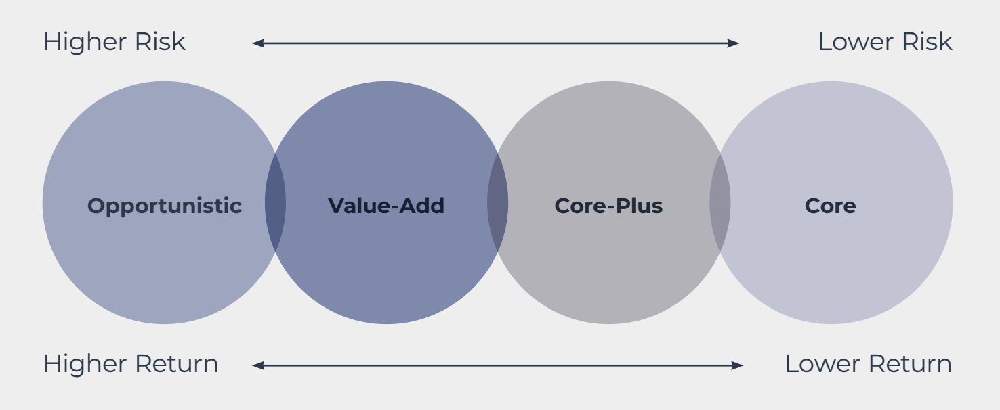

The intersection of real estate, investment, and algorithmic trading is reshaping the landscape of investment strategies, offering unprecedented opportunities for modern investors. Understanding the distinct categories of real estate properties—residential, commercial, industrial, retail, and specialty—is crucial for developing effective investment strategies. Each property type presents unique characteristics and benefits that can be leveraged for specific financial goals.

Algorithmic trading, characterized by the application of computer algorithms to automate investment transactions, is gaining traction as an innovative approach to optimizing real estate investments. By employing data-driven insights, algorithms can swiftly process extensive market data to identify patterns, trends, and potential opportunities. This reduces human error and emotional bias, enhancing decision-making and portfolio management.



This article will explore the transformative impact of technology on real estate investments. We will focus on property types and algorithmic trading, elucidating the advantages and challenges they present for today's investor. As the financial landscape evolves, staying informed and adaptable in these areas will be essential for maximizing returns and minimizing risks.

## Table of Contents

## Real Estate Property Types

Real estate properties are generally categorized into several types: residential, commercial, industrial, retail, and specialty. Each category serves distinct purposes and is associated with different investment opportunities and challenges.

Residential properties encompass structures designed for people to live in, such as single-family homes and multi-family dwellings. Single-family homes are standalone units suitable for individual families, often featuring private yards and garages. Multi-family dwellings include apartment buildings, condos, and townhouses where multiple separate housing units are contained within one building or complex. Investors often choose residential properties for their relatively steady income potential and tax advantages.

Commercial properties are primarily used for business purposes. This category includes office buildings, warehouses, and shopping centers. Office buildings range from small professional buildings to large skyscrapers and are typically leased to various businesses. Warehouses are integral to logistics networks, facilitating storage and distribution, while shopping centers house retail spaces that attract various retailers and service providers. The appeal of commercial properties lies in their potential for high yields and long-term leases, though they require careful consideration of location and tenant occupancy rates.

Industrial properties cater to the manufacturing, production, and storage sectors. These properties include factories, plants, and facilities used for heavy industries, adding significant value through production capabilities. They are usually located in industrial zones away from residential areas due to noise and environmental considerations. Investment in industrial properties is often influenced by macroeconomic factors, such as industrial demand and economic cycles.

Specialty properties cover more niche markets, including mixed-use developments and raw land. Mixed-use developments integrate residential, commercial, and sometimes industrial spaces within a single project, offering diverse income streams and reduced investment risks through diversification. Raw land investment entails purchasing undeveloped land for future development or resale. This type of property can present opportunities for significant appreciation, though it requires a keen understanding of zoning laws, growth trends, and urban planning.

Overall, understanding the distinctions between these property types is crucial in selecting appropriate strategies for real estate investment, considering factors like market demand, economic conditions, and the intended use of the property.

## Why Invest in Real Estate?

Real estate provides a essential component of a diversified investment portfolio, offering investors unique opportunities for steady income and capital appreciation. Its tangible nature and utility make it a stable and attractive asset class over time. One primary reason for investing in real estate is its potential value growth. This appreciation is driven by factors like urbanization, population growth, and demand for housing, commercial spaces, and other property types. Furthermore, real estate can generate consistent rental income, which contributes to portfolio stability and cash flow.

The market's inherent stability and potential tax benefits further enhance real estate's attractiveness as an investment choice. Compared to the more volatile equity markets, real estate generally exhibits lower short-term price [volatility](/wiki/volatility-trading-strategies) while demonstrating long-term upward trends in value. Additionally, numerous tax advantages can be utilized by real estate investors. These include deductions for mortgage interest, property taxes, and depreciation, as well as the potential for deferring capital gains taxes through strategies like 1031 exchanges in the United States.

Investors looking to succeed in real estate must carefully consider various factors that affect investment outcomes. One of the most significant factors is location, as it influences property demand and value. For instance, properties in growing metropolitan areas or regions with strong economic fundamentals are likely to experience higher appreciation rates and rental income compared to stagnant or declining regions. Furthermore, property type plays a crucial role in defining investment strategies and expected returns. 

Each property type carries unique benefits and challenges that impact investment decisions and performance. Residential properties, such as single-family homes or multi-family dwellings, typically offer more predictable cash flows but may require more hands-on management. Commercial properties, like office buildings and retail centers, can yield higher returns but often involve longer lease terms and potentially higher vacancy risks. Industrial properties, serving manufacturing and logistic needs, benefit from e-commerce growth but might face risks related to economic cycles. Specialty properties, including mixed-use developments or land for future development, provide diversification potential but may [carry](/wiki/carry-trading) greater uncertainty.

When assessing real estate investments, it is crucial for investors to consider local economic conditions. Factors such as employment growth, business development, infrastructure projects, and government policies can significantly impact the supply and demand dynamics, ultimately affecting property values and returns. Understanding these variables allows investors to develop a strategic approach tailored to their goals and risk tolerance. By aligning these strategies with market conditions, investors can optimize their real estate portfolios for long-term growth and financial success.

 to Algorithmic Trading in Real Estate

Algorithmic trading in real estate involves the use of advanced computer programs and algorithms to automate the buying, selling, and management of real estate assets. This approach leverages technology to enhance investment decision-making by analyzing large volumes of market data to discern patterns and trends with heightened speed and precision. This data-driven methodology is capable of processing real-time information, allowing algorithms to continuously optimize investment strategies and respond to market changes promptly.

By incorporating [machine learning](/wiki/machine-learning) and statistical models, these algorithms can sift through historical and current data to predict future price movements and identify profitable opportunities. For example, machine learning techniques such as regression analysis and decision trees can be employed to forecast rental yield trends or property valuations based on various indicators like economic conditions, interest rates, and regional growth patterns.

One of the primary benefits of [algorithmic trading](/wiki/algorithmic-trading) in real estate is its ability to minimize human error and emotional biases that typically affect investment decisions. Human traders often struggle with cognitive biases that can impair judgment, such as loss aversion and overconfidence. Algorithms, by contrast, operate based on quantifiable data and predefined criteria, ensuring decisions are made objectively and efficiently. This objectivity is critical in a market segment as varied and complex as real estate, where factors influencing property values are numerous and frequently changing.

Furthermore, algorithmic trading tools enable quicker execution of transactions. The speed of execution is particularly advantageous in competitive real estate markets where timing is crucial. Algorithms can instantly ascertain when to enter or [exit](/wiki/exit-strategy) a position, thereby optimizing portfolio performance and enhancing returns. For instance, when exploring real estate investment trusts (REITs), algorithmic systems can continually monitor market conditions and adjust exposure to different sectors like residential or commercial real estate depending on performance metrics.

In summary, algorithmic trading provides a sophisticated, technology-driven approach to real estate investments, promoting efficiency, minimizing cognitive biases, and enhancing the agility of investment portfolios. These systems are designed to stay abreast of market dynamics, allowing investors to capitalize on opportunities swiftly and effectively.

## Integration of Algo Trading with Real Estate Investments

The integration of algorithmic trading with real estate investments represents a paradigm shift driven by advancements in [artificial intelligence](/wiki/ai-artificial-intelligence) (AI) and machine learning. These technologies enhance the capacity for real estate investors to make informed decisions based on comprehensive data analysis. 

Automated systems powered by machine learning algorithms can effectively assess property values by processing large datasets that include historical prices, current market conditions, demographic shifts, and economic indicators. This capability allows for precise forecasts of market conditions, enabling investors to anticipate fluctuations in property values more accurately than traditional methods.

Moreover, algorithmic trading facilitates the identification of undervalued properties and emerging market trends. By employing AI algorithms that detect patterns and anomalies across vast datasets, investors can pinpoint opportunities that may not be immediately apparent through conventional analysis. For example, machine learning models can be trained to recognize indicators of economic growth in specific regions, such as increased infrastructure development, which may signal rising real estate values.

The optimization of real estate portfolios becomes markedly more efficient through the use of these technologies. Automated trading systems can execute transactions rapidly, thereby taking advantage of short-term market inefficiencies. This speed is critical in competitive markets where timing can significantly impact investment outcomes. Investors can employ algorithmic trading strategies to balance portfolios by adjusting asset allocations based on predictive analytics.

Python, a popular programming language in the field of data science, is often used to implement these algorithmic strategies. Libraries such as Pandas and NumPy facilitate data manipulation and statistical analysis, while machine learning frameworks like TensorFlow and scikit-learn provide tools for developing predictive models. Below is a simple example of how Python could be used to forecast property prices using a linear regression model:

```python
import pandas as pd
from sklearn.model_selection import train_test_split
from sklearn.linear_model import LinearRegression
from sklearn.metrics import mean_squared_error

# Load dataset
data = pd.read_csv('real_estate_data.csv')

# Features and target variable
X = data[['average_income', 'proximity_to_central_business_district', 'crime_rate']]
y = data['property_price']

# Split the data into training and testing sets
X_train, X_test, y_train, y_test = train_test_split(X, y, test_size=0.2, random_state=42)

# Train the model
model = LinearRegression()
model.fit(X_train, y_train)

# Predict and evaluate
predictions = model.predict(X_test)
mse = mean_squared_error(y_test, predictions)
print(f'Mean Squared Error: {mse}')
```

In summary, the integration of AI and algorithmic trading in real estate investments maximizes investment efficiency by leveraging data-driven insights, thus transforming traditional investment methodologies. As these technologies continue to evolve, they will offer even greater precision and opportunities for investors seeking to optimize their real estate portfolios.

## Tax Implications and Considerations

Understanding the tax implications of real estate investments is essential for maximizing returns, particularly when employing algorithmic trading strategies. Capital gains taxes are a primary consideration for investors using algo trading in real estate. Capital gains occur when an asset sold has appreciated in value since its purchase. Depending on the holding period, these gains are taxed at different rates: short-term capital gains (assets held for less than a year) are taxed as ordinary income, while long-term capital gains benefit from a reduced tax rate.

Investors can enhance profitability through strategic tax planning, which capitalizes on potential deductions and deferments. For instance, depreciation deductions can reduce taxable income, acknowledging the wear and tear on a property over time. Algorithmic trading systems can be programmed to account for these deductions, optimizing the selection of properties and their holding durations to align with favorable tax treatments.

Additionally, investors should consider tax-deferred exchanges, such as the 1031 exchange in the United States, allowing the deferral of capital gains taxes by reinvesting the proceeds from a sale into a similar property. Algorithmic systems, with precise calculations, can help identify opportunities where such exchanges might maximize after-tax returns.

Proper management of expenses is also crucial. Costs associated with property management, maintenance, and improvements can often be deducted, thus lowering the overall tax burden. A comprehensive algorithmic trading strategy would [factor](/wiki/factor-investing) in these deductions, aiming to select investments that not only promise good returns but also allow for optimal tax efficiency.

In conclusion, gaining a thorough understanding of the tax implications linked to real estate investments and algorithmic trading can significantly enhance an investment's profitability. By leveraging strategic tax planning tools and deductions, investors can ensure they are not only choosing the right investments but also securing the best possible after-tax returns.

## Challenges and Risks

Algorithmic trading in real estate, while innovative and efficient, is not without its challenges and risks. One significant risk associated with algo trading is software vulnerability. The reliance on automated systems makes these trades susceptible to programming errors, security breaches, and hacking, which can lead to substantial financial losses if not properly managed. Ensuring the robustness and security of trading algorithms is crucial to mitigating these risks.

The accuracy and reliability of the underlying data are vital for the success of algorithmic strategies. Real estate markets are influenced by numerous factors, including demographic trends, economic indicators, and geopolitical events. Algorithms depend heavily on historical and real-time data to predict future market movements and make trading decisions. If the data is inaccurate, outdated, or biased, it can lead to erroneous conclusions and potential financial losses.

Additionally, investors must remain vigilant regarding regulatory changes and market volatility. The regulatory environment for algo trading and real estate varies across regions and is subject to change, impacting trading strategies and compliance requirements. Algorithmic strategies that are successful under one regulatory regime may require adjustments if regulations evolve.

Market volatility also poses a risk, as algorithms designed for stable market conditions may not perform well during times of high volatility or unexpected market disruptions. This unpredictability can result in significant portfolio losses if the algorithms are not adaptive.

To mitigate these challenges and risks, investors can take several precautions. Regular audits and updates of trading algorithms can address software vulnerabilities. Employing diverse data sources and implementing machine learning techniques can enhance data accuracy and reliability. Staying informed about regulatory changes and employing real-time risk management systems can help investors navigate market volatility effectively.

As the integration of technology and real estate investment continues to evolve, understanding and managing these risks will be critical for investors seeking to leverage algorithmic trading successfully.

## Conclusion

The fusion of real estate and algorithmic trading signifies a transformative development in contemporary investment methodologies. The integration of these fields allows investors to utilize advanced technological tools to make precise and data-driven decisions. By employing algorithms that can efficiently analyze vast datasets, investors can optimize their real estate portfolios, achieving enhanced returns through improved timing and selection of asset transactions.

Moreover, the adaptability and continuous evolution of technology in this sector mean that staying informed and up-to-date with the latest advancements is crucial. The capacity to learn and adapt not only involves understanding current technology trends but also anticipating regulatory changes and market dynamics that could impact investment strategies. For instance, machine learning models can refine their predictive accuracy over time, offering more nuanced insights into market movements, thus providing a competitive edge to those who leverage these tools effectively.

In conclusion, the amalgamation of real estate investing with algorithmic trading tools yields a potent combination that promises to redefine asset management. While the potential benefits are considerable, they rely heavily on the commitment of investors to sustain learning and adaptation, ensuring that they can continuously capitalize on the technological innovations shaping the future of investment.

## References & Further Reading

[1]: Bergstra, J., Bardenet, R., Bengio, Y., & Kégl, B. (2011). ["Algorithms for Hyper-Parameter Optimization."](https://dl.acm.org/doi/10.5555/2986459.2986743) Advances in Neural Information Processing Systems 24.

[2]: ["Advances in Financial Machine Learning"](https://www.amazon.com/Advances-Financial-Machine-Learning-Marcos/dp/1119482089) by Marcos Lopez de Prado

[3]: ["Evidence-Based Technical Analysis: Applying the Scientific Method and Statistical Inference to Trading Signals"](https://books.google.com/books/about/Evidence_Based_Technical_Analysis.html?id=jbD47VkOHAEC) by David Aronson

[4]: ["Machine Learning for Algorithmic Trading"](https://github.com/stefan-jansen/machine-learning-for-trading) by Stefan Jansen

[5]: ["Quantitative Trading: How to Build Your Own Algorithmic Trading Business"](https://www.amazon.com/Quantitative-Trading-Build-Algorithmic-Business/dp/1119800064) by Ernest P. Chan