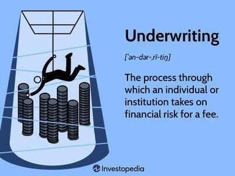

The real estate market is a multifaceted domain where precise evaluations are essential for successful transactions. It operates as a complex ecosystem with numerous stakeholders, including buyers, sellers, investors, and financial institutions, each aiming to make well-informed decisions. Within this system, underwriting stands as a critical procedure, providing the foundation for assessing risks, establishing pricing strategies, and informing decision-making processes.

Underwriting is integral to real estate transactions, as it evaluates the viability of deals by scrutinizing various risk factors. It encompasses a thorough analysis of financial, legal, market, and physical aspects associated with a property or transaction. This rigorous examination aids in determining potential profitability and ensures that investments are sound.



With recent advancements, the role of technology in underwriting has become increasingly prominent. Algorithmic trading, a burgeoning trend in real estate, utilizes sophisticated data analysis techniques and automated trading strategies to enhance market evaluations and transaction efficiency. This development has notable implications for underwriting practices, transforming conventional methods and reshaping the landscape of property assessment by providing deeper insights into pricing and investment strategies.

This article will illuminate the underwriting process, its integration with property assessments, and how algorithmic trading is altering approaches within the real estate sector. Understanding these dimensions is crucial for navigating the intricate dynamics of real estate and ensuring effective management of risks and opportunities.

## Table of Contents

## What is Underwriting in Real Estate?

Underwriting in real estate is a fundamental aspect of the property transaction process, serving as a critical evaluation mechanism to determine the feasibility and risk associated with potential investments. This process encompasses several detailed examinations focusing on various dimensions of the property or transaction.

Financial facets are at the core of real estate underwriting. Underwriters assess the financial health and creditworthiness of prospective buyers or entities, examining income statements, balance sheets, and cash flow projections. These financial analyses aim to ensure that borrowers have the capability to meet their financial obligations and that the investment is sound for lenders. The expected profitability of the transaction is also determined through methods like the net present value (NPV) and internal rate of return (IRR), which help gauge the future financial benefits against the initial cost.

The legal aspect of underwriting involves verifying that the property complies with all relevant regulations and that there are no legal encumbrances, such as liens or unresolved title issues, that could jeopardize the transaction. Legal due diligence is paramount to safeguard the interests of both buyers and lenders.

Market analysis is another critical component. Underwriters analyze current market conditions, including supply and demand dynamics, to project future property values and rental rates. This analysis often involves comparing similar properties (comps) to ensure that pricing aligns with market norms and to predict potential appreciation or depreciation trends.

Additionally, the physical aspects of the property are evaluated through inspections and appraisals. This process involves assessing the physical condition, location, and any structural issues or repairs needed that might affect the property's value and insurability.

In combination, these thorough assessments form the basis for informed decision-making in property investments. Understanding the multifaceted nature of underwriting enables stakeholders to better anticipate risks, maximize profitability, and ultimately engage in transactions with a higher degree of confidence and security.

## The Underwriting Process: Steps and Stakeholders

The underwriting process in real estate is a comprehensive and multi-step procedure critical to understanding and managing the risks associated with real estate transactions. It involves several stages, each requiring detailed evaluations and assessments to facilitate informed decision-making.

Preliminary vetting is the first stage of the underwriting process. In this stage, underwriters conduct an initial review of the real estate transaction to ensure it meets basic eligibility criteria. This involves a preliminary analysis of the borrower's financial status, including credit scores and income verification, to determine their ability to fund the transaction.

Following preliminary vetting, a detailed analysis is conducted. This includes an in-depth examination of financial documents, such as tax returns, bank statements, and income records. The purpose is to gauge the financial soundness of all parties involved in the transaction. This stage may also include an analysis of market conditions, trends, and comparable property values to assess potential investment returns.

Financial assessments are crucial in determining the fiscal viability of a transaction. Underwriters evaluate the cash flow projections, debt service ratios, and profitability forecasts. A common formula used in this stage is the Debt Service Coverage Ratio (DSCR), given by:

$$
\text{DSCR} = \frac{\text{Net Operating Income}}{\text{Total Debt Service}}
$$

A DSCR greater than 1 indicates that the property generates sufficient income to cover its debt obligations.

Legal checkups form another vital component, ensuring the transaction complies with applicable laws and regulations. This involves scrutinizing property titles, zoning laws, and contracts to identify any legal hurdles that might impede the transaction.

Physical inspections are essential to assessing the property's condition. Appraisers and inspectors evaluate the physical structure, systems, and location of the property to pinpoint potential issues that may affect its value. The findings from these inspections guide the risk evaluation process, influencing the final underwriting decision.

Various stakeholders play foundational roles throughout the underwriting process. Lenders typically finance real estate deals and require underwriting to ensure the security of their investment. Underwriters are the professionals responsible for conducting the assessments and providing conclusive analyses. Real estate [agents](/wiki/agents) facilitate the transaction, offering market insights and connecting buyers and sellers, while appraisers provide objective property valuations based on detailed inspections and market evaluations.

Overall, the underwriting process is intricate, involving multiple evaluative steps and a collaborative approach among different stakeholders. This careful scrutiny is essential for securing the financial health and legal feasibility of real estate transactions.

## Property Assessment in Real Estate Underwriting

Property assessment plays a critical role in real estate underwriting by establishing the accurate value of a property, which is essential for informed investment and lending decisions. This process involves a meticulous approach encompassing various methodologies such as appraisals, market analysis, and site evaluations to understand the property's value dynamics.

Detailed appraisals are fundamental to property assessment. Appraisers conduct thorough investigations by inspecting the property's physical condition, location, and comparable sales in the area. This evaluation results in a property valuation that reflects its current market worth. The Uniform Standards of Professional Appraisal Practice (USPAP) often guide the appraisal process to ensure consistency and reliability.

Market analysis is another integral component, evaluating economic trends, local real estate markets, and broader economic indicators that could affect property values. Analysts examine factors like supply and demand dynamics, economic growth rates, interest rates, and rental yields to forecast the potential future performance of the property in question.

Site evaluations delve into specific aspects of the property's location, including its zoning laws, neighborhood attractiveness, and infrastructure quality. These evaluations help underwriters assess the property's desirability and potential for value appreciation or depreciation.

Data from these assessments are then used in underwriting to establish key transaction parameters such as fair pricing, loan amounts, and potential risks. The underwriting relies heavily on this information to determine the property's loan-to-value (LTV) ratio, a crucial metric in financing decisions. Lower LTV ratios generally indicate reduced risk for lenders and a higher likelihood of loan approval.

By integrating appraisals, market analysis, and site evaluations, property assessment provides a comprehensive foundation for real estate underwriting, ensuring transactions are based on sound financial criteria and minimizing risk for all stakeholders involved.

## Real Estate Algorithmic Trading and Its Impact

Algorithmic trading in real estate represents a significant advancement by integrating data-driven technology with traditional property trading methodologies. This modern approach involves the use of sophisticated algorithms designed to automatically evaluate and execute trades within real estate markets, thereby increasing efficiency and optimizing investment opportunities.

Such automated strategies analyze massive volumes of data, including market trends, historical pricing, and economic indicators, to predict future market movements and identify profitable trading opportunities. These algorithms can process information and execute trades at speeds impossible for human traders, thereby capitalizing on fleeting market conditions.

The impact of [algorithmic trading](/wiki/algorithmic-trading) is profoundly reshaping the underwriting process. Traditionally, underwriting relied heavily on expert judgment and manual analyses to assess risk and determine property values. However, algorithms can enhance risk assessment by integrating multifaceted datasets and unearthing patterns that might not be immediately evident to human analysts. This advanced analysis leads to more accurate pricing strategies, as properties are evaluated with a broader and deeper understanding of market dynamics.

Additionally, algorithmic trading influences investment decisions by providing real-time insights and predictions. Investors can leverage these tools to make informed choices rapidly, aligning their decisions with current market conditions and potential future scenarios. By using data analytics and predictive modeling, algorithms offer a competitive edge, allowing investors to optimize their portfolios and enhance returns.

Moreover, algorithmic trading facilitates increased market [liquidity](/wiki/liquidity-risk-premium). As algorithms are capable of executing large volumes of trades swiftly, they enable more frequent transactions, thereby boosting capital flow within real estate markets. This increased liquidity helps stabilize markets by reducing [volatility](/wiki/volatility-trading-strategies) and creating smoother transitions between supply and demand.

Despite its advantages, the integration of algorithmic trading within real estate markets does present challenges, such as potential over-reliance on automated systems and the risk of algorithmic errors leading to market disruptions. Ensuring data accuracy and maintaining robust, transparent algorithms are crucial to mitigating these risks.

In conclusion, while still an emerging trend, algorithmic trading is a transformative force in real estate. By enhancing underwriting processes, refining pricing strategies, and informing investment decisions, it offers a more efficient, data-driven approach to property trading. As technology continues to evolve, so too will the capabilities and applications of algorithmic trading in real estate.

## Challenges and Evolutions in Real Estate Underwriting

The underwriting process in real estate is confronted with multiple challenges, such as ensuring data accuracy, navigating regulatory constraints, and managing economic volatility. Each of these factors plays a significant role in how effectively underwriting can be managed and executed, affecting the overall reliability and outcome of real estate transactions.

Data accuracy stands out as a pivotal challenge. The integrity of the data used for underwriting directly influences risk assessments, property valuations, and ultimately, the decision-making process. Inaccurate or incomplete data can lead to misjudgments that may result in financial losses or missed opportunities. This challenge necessitates the implementation of robust data collection and verification processes to maintain high standards of accuracy.

Regulatory constraints also pose a considerable hurdle. The real estate market is subject to a complex array of federal, state, and local regulations designed to ensure fair practices and protect consumers. Compliance with these regulations requires significant effort and resources, and failure to adhere can lead to legal repercussions and financial penalties. Adaptability to regulatory changes is thus essential for those involved in underwriting.

Economic volatility is another [factor](/wiki/factor-investing) that underwriters must contend with. Market fluctuations impact property values, interest rates, and investment strategies, requiring underwriters to be vigilant and proactive. Economic downturns or booms can rapidly change the landscape of real estate, necessitating swift adjustments to underwriting criteria and risk assessments.

Despite these challenges, advancements in technology and data analytics offer promising solutions. The integration of big data analytics enables more accurate and comprehensive analysis of property values, market trends, and potential risks. Machine learning algorithms can enhance predictive modeling, allowing underwriters to make more informed decisions with a higher degree of confidence.

Consider the following Python snippet where we utilize a [machine learning](/wiki/machine-learning) model to predict property prices based on historical data and relevant features:

```python
from sklearn.model_selection import train_test_split
from sklearn.ensemble import RandomForestRegressor
from sklearn.metrics import mean_absolute_error

# Assume 'data' is a DataFrame containing historical real estate data
features = ['location', 'size', 'age', 'amenities']
X = data[features]
y = data['price']

# Split the dataset
X_train, X_test, y_train, y_test = train_test_split(X, y, test_size=0.2, random_state=42)

# Train a random forest regressor
model = RandomForestRegressor(n_estimators=100, random_state=42)
model.fit(X_train, y_train)

# Predict and evaluate
predictions = model.predict(X_test)
mae = mean_absolute_error(y_test, predictions)

print(f"Mean Absolute Error: {mae}")
```

This code exemplifies how predictive modeling can be employed to improve the accuracy of property valuations, mitigating risks associated with economic volatility and data reliability.

Technological advancements drive the evolution of real estate underwriting by providing tools that streamline processes and enhance accuracy. Automated systems can perform tasks traditionally done manually, increasing efficiency and reducing the likelihood of human error. Moreover, blockchain technology is emerging as a method to secure data transactions, offering transparency and tamper-proof records.

As the underwriting process continues to evolve, stakeholders must remain informed of these technological trends to effectively navigate the complexities of real estate transactions. Embracing these advancements not only addresses existing challenges but also positions stakeholders to capitalize on new opportunities within the market.

## Conclusion

Underwriting is a pivotal process in real estate that ensures transactions are viable and risks are well-managed. This meticulous evaluation sets the foundation for assessing the financial viability and inherent risks associated with property investments. As the real estate market evolves, incorporating new technologies and market dynamics becomes essential for enhancing underwriting practices. The adoption of advanced analytics and algorithmic tools enables more precise risk assessments and pricing strategies, aligning with modern market expectations.

The future of real estate underwriting lies in a synergy of traditional assessments and algorithm-driven insights. By combining established methods with algorithmic advancements, stakeholders can achieve a balanced approach that maximizes the accuracy and efficiency of underwriting. This integration not only facilitates informed decision-making but also improves the adaptability of underwriting frameworks to accommodate varying economic conditions. Ultimately, the continuous evolution of underwriting, supported by technology, ensures more robust and resilient real estate transactions.

## References & Further Reading

[1]: Bergstra, J., Bardenet, R., Bengio, Y., & Kégl, B. (2011). ["Algorithms for Hyper-Parameter Optimization."](https://dl.acm.org/doi/10.5555/2986459.2986743) Advances in Neural Information Processing Systems 24.

[2]: ["Advances in Financial Machine Learning"](https://www.amazon.com/Advances-Financial-Machine-Learning-Marcos/dp/1119482089) by Marcos Lopez de Prado

[3]: ["Evidence-Based Technical Analysis: Applying the Scientific Method and Statistical Inference to Trading Signals"](https://www.amazon.com/Evidence-Based-Technical-Analysis-Scientific-Statistical/dp/0470008741) by David Aronson

[4]: ["Machine Learning for Algorithmic Trading"](https://github.com/stefan-jansen/machine-learning-for-trading) by Stefan Jansen

[5]: ["Quantitative Trading: How to Build Your Own Algorithmic Trading Business"](https://www.amazon.com/Quantitative-Trading-Build-Algorithmic-Business/dp/1119800064) by Ernest P. Chan