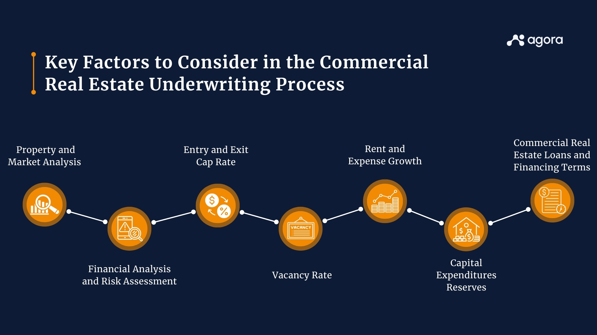

## Table of Contents

## What is real estate underwriting?

Real estate underwriting is the process of evaluating a property and a borrower to decide if a loan should be given. It involves looking at the property's value, the borrower's ability to pay back the loan, and the risks involved. Lenders use this process to make sure the loan is a good investment for them.

During underwriting, the lender checks the borrower's credit score, income, and other debts to see if they can afford the loan payments. They also look at the property to make sure it's worth the amount of money being borrowed. This helps the lender decide if the loan is safe and if they should approve it.

## Why is underwriting important in real estate?

Underwriting is important in real estate because it helps lenders decide if they should give someone a loan to buy a property. It's like a safety check for the lender. They look at the person asking for the loan and the property to make sure everything is okay. This helps them see if the person can pay back the loan and if the property is worth the money.

If lenders didn't do underwriting, they might give loans to people who can't pay them back. This could lead to big problems for the lender, like losing money. Underwriting helps keep things fair and safe for both the lender and the borrower. It makes sure that only people who can afford the loan get it, and that the property is a good investment.

## What are the basic steps involved in the real estate underwriting process?

The real estate underwriting process starts with the borrower submitting an application for a loan. The lender then collects important information like the borrower's credit score, income, and other debts. They use this to see if the borrower can afford to pay back the loan. At the same time, the lender also looks at the property. They check its value by getting an appraisal, which tells them how much the property is worth. This helps them decide if the loan amount makes sense for the property's value.

Next, the lender assesses the risk of the loan. They look at the loan-to-value ratio, which compares the loan amount to the property's value. A lower ratio means less risk for the lender. They also consider the debt-to-income ratio, which shows how much of the borrower's income goes towards paying debts. If these ratios look good, the lender feels more confident about approving the loan. Finally, the underwriter reviews all this information and makes a decision. If everything checks out, the loan is approved; if not, the application might be denied or the lender might ask for more information.

This process is important because it helps lenders make smart decisions about who gets a loan and for how much. By carefully checking the borrower and the property, lenders can avoid giving out loans that might not be paid back. This keeps the real estate market stable and helps both borrowers and lenders feel secure in their transactions.

## How has real estate underwriting evolved historically?

Real estate underwriting has changed a lot over time. In the old days, underwriting was done by hand. Lenders would look at a person's income and the property's value, but they didn't have computers or fancy tools to help them. They had to trust their own judgment and experience. This made the process slower and sometimes less accurate. Lenders would meet with borrowers face-to-face and make decisions based on what they saw and heard.

As time went on, technology started to play a bigger role in underwriting. Computers and software made it easier to check a person's credit score and other financial details quickly. This made the process faster and more accurate. Lenders could now use data and numbers to make better decisions. They also started using automated systems to help with the underwriting process. These systems could look at a lot of information at once and help lenders decide if a loan was a good idea. This made underwriting more efficient and helped lenders manage risk better.

## What are the key differences between underwriting for residential and commercial properties?

Underwriting for residential properties is usually simpler than for commercial properties. When lenders look at a home loan, they mostly check the borrower's credit score, income, and the house's value. They want to make sure the person can pay back the loan and that the house is worth the money. The process focuses a lot on the borrower's ability to pay. Lenders use tools like the debt-to-income ratio to see if the borrower's income is enough to cover the loan payments and other debts.

Underwriting for commercial properties is more complicated. Lenders look at not just the borrower's finances but also the business plan for the property. They want to know how the property will be used, like if it will be a store, an office, or something else. They also check the property's potential to make money, called cash flow. This involves looking at things like rental income, operating costs, and the stability of the tenants. Because commercial properties can be riskier, lenders take a closer look at all these details to make sure the loan is a good investment.

## What role do underwriters play in assessing risk in real estate investments?

Underwriters are very important in figuring out the risks of real estate investments. They look at a lot of information to decide if a loan is safe for the lender. They check the borrower's credit score, income, and other debts to see if the borrower can pay back the loan. They also look at the property to make sure it's worth the amount of money being borrowed. This helps them understand how risky the loan is. If the borrower's finances look good and the property's value is strong, the risk is lower.

For commercial properties, underwriters do even more work to assess risk. They look at the business plan for the property and how it will make money. They want to know if the property will bring in enough rental income to cover the loan payments and other costs. They also check how stable the tenants are and how the property will be used. All of this helps underwriters decide if the loan is a good investment for the lender. By looking at all these details, underwriters help make sure that the risks are managed well.

## How do economic conditions influence real estate underwriting standards?

Economic conditions can change how lenders decide to give out loans for real estate. When the economy is doing well, people have more money and jobs are easier to find. This makes lenders feel more confident about giving loans because they think people can pay them back. They might make their rules a bit easier, like allowing people to borrow more money or have a lower credit score. But when the economy is not doing so well, like during a recession, lenders get more careful. They might make their rules stricter because they are worried about people losing jobs and not being able to pay back their loans. They might want to see higher credit scores or more money saved up before they give out a loan.

These changes in rules are important because they help lenders manage risk. If the economy is strong, lenders might be willing to take on a bit more risk because they think the chances of getting their money back are good. But if the economy is weak, lenders want to be very careful to avoid losing money. So, they will tighten their rules to make sure only the safest loans are given out. This can affect how many people can buy homes or invest in real estate, depending on how the economy is doing at the time.

## What are some common underwriting criteria used by lenders?

Lenders use several common criteria to decide if they should give someone a loan for a property. One big thing they look at is the borrower's credit score. A good credit score shows that the person has a history of paying back money they owe. Lenders also check the borrower's income to make sure they earn enough to pay back the loan. They look at the debt-to-income ratio, which compares how much money the borrower makes to how much they owe in debts. If this ratio is low, it means the borrower can handle the loan payments better.

Another important criterion is the property's value. Lenders get an appraisal to find out how much the property is worth. They compare this value to the loan amount to see the loan-to-value ratio. A lower ratio means less risk for the lender. For commercial properties, lenders also look at the property's cash flow, which is how much money the property can make. They want to know if the rental income will be enough to cover the loan payments and other costs. All these criteria help lenders decide if the loan is a safe bet.

## How do technological advancements affect the underwriting process?

Technological advancements have made the underwriting process a lot easier and faster. In the past, underwriters had to do everything by hand, which took a lot of time and could lead to mistakes. Now, with computers and software, they can check a person's credit score and other financial details quickly. This means they can make decisions faster and with more accuracy. Automated systems can look at a lot of information at once and help underwriters decide if a loan is a good idea. This makes the whole process more efficient and helps lenders manage risk better.

These technological tools also help underwriters look at more data than before. They can use algorithms and data analytics to see patterns and make better predictions about whether someone will pay back their loan. This can lead to fairer decisions because the computer doesn't get tired or make human errors. However, some people worry that too much reliance on technology might miss important details that a human underwriter would catch. So, while technology helps a lot, it's still important for human underwriters to check the work and make the final call.

## What are the challenges faced by underwriters in the current real estate market?

Underwriters in today's real estate market face a lot of challenges. One big problem is dealing with a lot of data. With technology, they have to look at more information than ever before. This can make it hard to decide if a loan is safe. They have to use computers and software to help them, but sometimes these tools can miss important details that a human might see. Also, the market can change quickly, and underwriters have to keep up with new rules and trends. This can make their job even harder because they need to be ready for anything.

Another challenge is managing risk in a changing economy. When the economy is up and down, underwriters have to be very careful about who they give loans to. They need to make sure people can still pay back their loans even if things get tough. This means they have to look closely at each borrower's finances and the property's value. But, if they are too strict, they might miss out on good loans. If they are too lenient, they might give loans to people who can't pay them back. It's a tricky balance, and underwriters have to make the best decisions they can with the information they have.

## How does regulatory compliance impact real estate underwriting practices?

Regulatory compliance plays a big role in how underwriters do their job in real estate. There are a lot of rules that lenders have to follow when they give out loans. These rules come from the government and are meant to make sure that loans are fair and safe for everyone. Underwriters have to check that every loan they approve follows these rules. For example, they have to make sure they are not discriminating against anyone and that they are giving out loans based on the right criteria, like credit score and income. If they don't follow the rules, they could get in trouble and the lender could face fines or other penalties.

These rules can make the underwriting process more complicated. Underwriters have to keep up with changes in the law and make sure their decisions match what the government says. This can slow down the process because they have to be very careful. But it's important because it helps protect borrowers and keeps the real estate market stable. Even though it can be challenging, following these rules helps make sure that loans are given out fairly and that lenders are doing their job the right way.

## What future trends might shape the field of real estate underwriting?

In the future, technology will play an even bigger role in real estate underwriting. More and more, underwriters will use [artificial intelligence](/wiki/ai-artificial-intelligence) and [machine learning](/wiki/machine-learning) to help them make decisions. These tools can look at a lot of data very quickly and find patterns that humans might miss. This could make the underwriting process faster and more accurate. But, it's important that underwriters still check the work of these machines to make sure they are not missing important details. Also, as technology gets better, we might see more online platforms where people can apply for loans and get decisions in real-time, making the whole process easier for borrowers.

Another trend that might shape real estate underwriting is changes in the economy and the environment. As the world changes, underwriters will have to think about new risks, like climate change. They might need to check if a property is safe from things like floods or wildfires before giving out a loan. This could change how they decide if a loan is a good idea. Also, if the economy keeps changing, underwriters might have to be more flexible with their rules. They will need to find a good balance between being safe and helping people get the loans they need. These trends will make the job of an underwriter more challenging but also more important.

## What are the steps and stakeholders involved in the underwriting process?

The underwriting process in real estate is a comprehensive and multi-step procedure critical to understanding and managing the risks associated with real estate transactions. It involves several stages, each requiring detailed evaluations and assessments to facilitate informed decision-making.

Preliminary vetting is the first stage of the underwriting process. In this stage, underwriters conduct an initial review of the real estate transaction to ensure it meets basic eligibility criteria. This involves a preliminary analysis of the borrower's financial status, including credit scores and income verification, to determine their ability to fund the transaction.

Following preliminary vetting, a detailed analysis is conducted. This includes an in-depth examination of financial documents, such as tax returns, bank statements, and income records. The purpose is to gauge the financial soundness of all parties involved in the transaction. This stage may also include an analysis of market conditions, trends, and comparable property values to assess potential investment returns.

Financial assessments are crucial in determining the fiscal viability of a transaction. Underwriters evaluate the cash flow projections, debt service ratios, and profitability forecasts. A common formula used in this stage is the Debt Service Coverage Ratio (DSCR), given by:

$$
\text{DSCR} = \frac{\text{Net Operating Income}}{\text{Total Debt Service}}
$$

A DSCR greater than 1 indicates that the property generates sufficient income to cover its debt obligations.

Legal checkups form another vital component, ensuring the transaction complies with applicable laws and regulations. This involves scrutinizing property titles, zoning laws, and contracts to identify any legal hurdles that might impede the transaction.

Physical inspections are essential to assessing the property's condition. Appraisers and inspectors evaluate the physical structure, systems, and location of the property to pinpoint potential issues that may affect its value. The findings from these inspections guide the risk evaluation process, influencing the final underwriting decision.

Various stakeholders play foundational roles throughout the underwriting process. Lenders typically finance real estate deals and require underwriting to ensure the security of their investment. Underwriters are the professionals responsible for conducting the assessments and providing conclusive analyses. Real estate [agents](/wiki/agents) facilitate the transaction, offering market insights and connecting buyers and sellers, while appraisers provide objective property valuations based on detailed inspections and market evaluations.

Overall, the underwriting process is intricate, involving multiple evaluative steps and a collaborative approach among different stakeholders. This careful scrutiny is essential for securing the financial health and legal feasibility of real estate transactions.

## References & Further Reading

[1]: Bergstra, J., Bardenet, R., Bengio, Y., & Kégl, B. (2011). ["Algorithms for Hyper-Parameter Optimization."](https://dl.acm.org/doi/10.5555/2986459.2986743) Advances in Neural Information Processing Systems 24.

[2]: ["Advances in Financial Machine Learning"](https://www.amazon.com/Advances-Financial-Machine-Learning-Marcos/dp/1119482089) by Marcos Lopez de Prado

[3]: ["Evidence-Based Technical Analysis: Applying the Scientific Method and Statistical Inference to Trading Signals"](https://www.amazon.com/Evidence-Based-Technical-Analysis-Scientific-Statistical/dp/0470008741) by David Aronson

[4]: ["Machine Learning for Algorithmic Trading"](https://github.com/stefan-jansen/machine-learning-for-trading) by Stefan Jansen

[5]: ["Quantitative Trading: How to Build Your Own Algorithmic Trading Business"](https://www.amazon.com/Quantitative-Trading-Build-Algorithmic-Business/dp/1119800064) by Ernest P. Chan