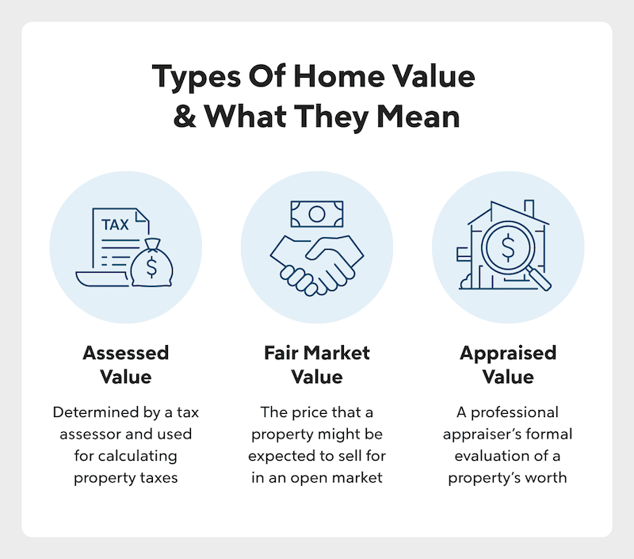

## Table of Contents

## What is real estate valuation?

Real estate valuation is the process of figuring out how much a property is worth. People do this when they want to buy, sell, or invest in a property. They look at things like the property's location, size, condition, and what similar properties have sold for recently. This helps them come up with a fair price that reflects what the property is really worth in the current market.

There are different methods to value a property. One common way is the sales comparison approach, where you compare the property to similar ones that have sold nearby. Another method is the cost approach, which calculates how much it would cost to build the same property from scratch, minus any wear and tear. The income approach is used for rental properties, where the value is based on how much money the property can make from rent. Each method has its own use, depending on the type of property and what you need the valuation for.

## Why is real estate valuation important?

Real estate valuation is important because it helps people make smart choices about buying, selling, or investing in property. When you know the true value of a property, you can decide if it's a good deal or not. For example, if you're buying a house, you don't want to pay more than it's worth. On the other hand, if you're selling, you want to make sure you're not selling it for less than it's worth. Valuation helps everyone involved understand the fair price of the property.

Valuation also matters for things like getting a loan or paying taxes. Banks need to know the value of a property before they lend money for it, to make sure the loan amount makes sense. And when it comes to taxes, the value of your property can affect how much you have to pay. So, knowing the right value helps keep everything fair and helps people plan their finances better.

## What are the basic methods used for valuing real estate?

There are three main ways to figure out how much a property is worth: the sales comparison approach, the cost approach, and the income approach. The sales comparison approach is when you look at similar properties that have sold recently in the same area. You compare things like size, age, and features to see how much those properties sold for, and then you use that information to guess the value of the property you're looking at. This method is really common because it gives a good idea of what buyers are willing to pay in the current market.

The cost approach is another way to value a property. With this method, you figure out how much it would cost to build the same property from scratch today, including the land it sits on. Then, you subtract any wear and tear or damage the property might have. This approach is useful for new or unique properties where there aren't many similar ones to compare to. It's like saying, "If I had to build this exact property today, how much would it cost?"

The income approach is used mostly for rental properties or commercial buildings. This method looks at how much money the property can make from rent or other income. You take the expected income and then use a formula to figure out what the property is worth based on that income. This is helpful for investors who want to know if a property will make them money over time. Each of these methods has its own use, depending on what kind of property you're dealing with and what you need the valuation for.

## How does the sales comparison approach work in real estate valuation?

The sales comparison approach is a way to find out how much a property is worth by looking at other similar properties that have sold recently in the same area. You start by finding a bunch of properties that are a lot like the one you're trying to value. These should be in the same neighborhood and have similar sizes, ages, and features. Then, you look at the prices these properties sold for and use that information to guess the value of your property. For example, if a similar house down the street sold for $300,000, that gives you a good starting point for figuring out what your house might be worth.

After you have the prices of the similar properties, you make adjustments to account for any differences between them and your property. If your house has an extra bathroom or a bigger yard, you might add some value to account for those features. On the other hand, if your house is older or needs repairs, you might subtract some value. By making these adjustments, you can come up with a more accurate estimate of what your property is worth. This method is popular because it reflects what buyers are actually paying in the current market, making it a reliable way to value a property.

## What is the cost approach and when is it most useful?

The cost approach is a way to figure out how much a property is worth by calculating what it would cost to build it from scratch today. You start by finding out the price of the land, and then you add the cost of building the exact same building on that land. After that, you subtract any wear and tear or damage the property might have. This gives you an idea of what it would cost to replace the property if you had to build it all over again.

This method is most useful for new or unique properties where there aren't many similar ones to compare to. For example, if you have a special kind of building that's not common in the area, the sales comparison approach might not work well because there aren't enough similar properties to compare. The cost approach is also helpful for insurance purposes, where you need to know how much it would cost to rebuild the property if it were destroyed. It's like saying, "If I had to build this exact property today, how much would it cost?"

## Can you explain the income capitalization approach in real estate valuation?

The income capitalization approach is a way to figure out how much a property is worth by looking at how much money it can make. This method is mostly used for rental properties or commercial buildings. You start by figuring out how much money the property will bring in from rent every year. Then, you use something called a capitalization rate, or "cap rate," to turn that yearly income into a value for the whole property. The cap rate is kind of like an interest rate that shows how much return an investor expects to get from the property.

To find the value of the property, you divide the yearly rental income by the cap rate. For example, if a property brings in $50,000 a year in rent and the cap rate is 5%, you divide $50,000 by 0.05 to get a value of $1,000,000. This approach is helpful for investors because it shows them if a property will make them money over time. It's all about understanding how the income from the property can be turned into a price that makes sense for buying or selling.

## What factors influence the value of a property?

Several things can affect how much a property is worth. The location of the property is a big one. If it's in a good neighborhood with good schools, stores, and other amenities, it will be worth more. The size and condition of the property also matter. A bigger house in good shape will usually be worth more than a smaller one that needs a lot of repairs. Another important factor is what similar properties in the area have sold for recently. If houses down the street are selling for high prices, that can push up the value of your property too.

The economy and interest rates can also influence property values. When the economy is doing well, more people can afford to buy homes, which can drive up prices. But if the economy is bad, fewer people are buying, and prices might go down. Interest rates affect how much it costs to borrow money for a home. Lower interest rates can make it cheaper to buy a home, which can increase demand and push up property values. On the other hand, higher interest rates can make buying a home more expensive, which can lower demand and property values.

## How do economic conditions affect real estate valuation?

Economic conditions play a big role in how much a property is worth. When the economy is doing well, people have more money and jobs, so they are more likely to buy homes. This increased demand can drive up property prices because more people are competing to buy. On the other hand, if the economy is struggling, people might not have as much money or they might be worried about losing their jobs. This can make fewer people want to buy homes, which can lower property values because there's less competition.

Interest rates, which are part of the economy, also affect real estate valuation. When interest rates are low, it's cheaper to borrow money to buy a home. This can make more people want to buy, pushing up demand and property values. But when interest rates go up, borrowing money becomes more expensive, which can make fewer people want to buy homes. This decrease in demand can lead to lower property values. So, the overall health of the economy and the cost of borrowing money both have a big impact on how much a property is worth.

## What role do market trends play in property valuation?

Market trends are like the big waves that can push property values up or down. If lots of people want to buy homes and there aren't enough homes for sale, that's called a seller's market. In a seller's market, prices can go up because buyers are competing to buy. On the other hand, if there are too many homes for sale and not enough buyers, that's a buyer's market. In a buyer's market, prices might go down because sellers have to lower their prices to attract buyers. So, knowing the current market trend can help you guess if property values will go up or down.

Trends in the economy and the real estate market can also affect what people want in a home. For example, if working from home becomes more popular, people might look for homes with extra rooms they can use as offices. This can make homes with these features more valuable. Also, if there's a trend toward living in certain areas, like cities or suburbs, that can change property values in those places. By keeping an eye on these trends, you can get a better idea of what properties will be worth in the future.

## How can advanced statistical models improve real estate valuation accuracy?

Advanced statistical models can make real estate valuation more accurate by looking at a lot of data all at once. These models can take in information about the property, like its size and condition, as well as data about the neighborhood, like recent sales of similar homes and even things like school ratings and crime rates. By using all this information together, the models can find patterns and make predictions that are more precise than just guessing or using simple methods. This helps to give a clearer picture of what a property is really worth in the current market.

These models also help by taking out some of the guesswork and personal opinions that can affect traditional valuation methods. For example, when people use the sales comparison approach, they might make different adjustments for things like extra bathrooms or a bigger yard. But with advanced statistical models, these adjustments can be based on hard data and math, making the valuation more consistent and fair. This can be really helpful for everyone involved, from buyers and sellers to banks and investors, because it gives them a more reliable number to work with when making decisions about property.

## What are the challenges faced in valuing unique or specialized properties?

Valuing unique or specialized properties can be tricky because there aren't many similar ones to compare to. When you're trying to figure out the value of a regular house, you can look at what other houses in the neighborhood sold for recently. But with a special property, like a historic building or a custom-designed home, there might not be any other properties exactly like it. This makes it hard to use the sales comparison approach, which is a common way to value properties. You might have to rely more on the cost approach, which looks at how much it would cost to build the property from scratch, but even that can be tough if the property has unique features that are hard to put a price on.

Another challenge is that these unique properties might have special uses or appeal to a smaller group of buyers. For example, a building that's only good for a certain type of business or a home that's designed for someone with specific needs might not be valuable to everyone. This can make it harder to find buyers who are willing to pay a high price. Also, figuring out the income from a specialized property can be difficult because it might not be easy to predict how much money it will make. So, valuing these kinds of properties often requires a lot of research and sometimes even hiring experts who understand the special features and uses of the property.

## How do regulatory changes impact real estate valuation practices?

Regulatory changes can have a big effect on how people value properties. When the government changes rules about things like zoning or building codes, it can change what people can do with their property. For example, if a new rule says you can't build a certain type of building in an area, that might make some properties less valuable because they can't be used in the same way anymore. Also, if the government changes how much tax people have to pay on property, that can change how much buyers are willing to pay. So, when the rules change, people who value properties have to think about how those changes will affect the property's worth.

These changes can also affect how people do valuations. Sometimes, new rules might mean that people have to use different methods or follow new steps to value a property. For example, if the government starts requiring more detailed reports on property values, appraisers might need to spend more time and use more data to do their job. This can make the valuation process more complicated and expensive. So, keeping up with regulatory changes is important for anyone involved in valuing real estate, because these changes can have a big impact on how they do their work and on the final value they come up with for a property.

## What are Traditional Appraisal Methods?

Traditional appraisal methods have long been the backbone of real estate property valuation, allowing stakeholders to estimate the value of real estate assets accurately. These methods provide a structured approach and are widely accepted within the industry, forming the basis of transaction negotiations, investment analysis, and financial reporting.

### Sales Comparison Approach

The Sales Comparison Approach, also known as the Market Data Approach, evaluates a property based on the comparison to recent sales of similar properties in the same area. This method relies heavily on the principle of substitution, which suggests that a rational buyer will not pay more for a property than the cost of acquiring an equivalent substitute. Key steps in applying the Sales Comparison Approach include:

1. **Identifying Comparable Properties**: Locating properties similar in size, location, and features.
2. **Adjusting Sales Prices**: Making adjustments to the sale prices of comparable properties to account for differences between them and the subject property.
3. **Deriving an Estimate**: Using the adjusted sales prices to estimate the value of the subject property.

**Advantages**: The Sales Comparison Approach is straightforward and relies on actual market data, making it generally reliable in active markets.

**Limitations**: Its accuracy diminishes in markets with limited comparable sales or where there's significant heterogeneity among properties.

### Cost Approach

The Cost Approach estimates a property's value by considering the cost of constructing a replica of the asset, adjusted for depreciation. The fundamental assumption here is that a potential buyer will not pay more for a property than the cost of building an equivalent one. This approach involves:

1. **Calculating the Replacement or Reproduction Cost**: Determining the current cost of building a similar property.
2. **Estimating Depreciation**: Accounting for physical deterioration, functional obsolescence, and external factors that devalue the property.
3. **Adding the Land Value**: Using other valuation approaches to estimate the land value, which is then added to the depreciated cost of the building.

**Advantages**: This approach is particularly useful for valuing new properties or unique, non-market-traded properties.

**Limitations**: The method can become subjective when estimating depreciation and may not reflect current market conditions fully.

### Income Capitalization Approach

The Income Capitalization Approach, often termed simply the Income Approach, values a property based on the income it generates. This method is particularly prevalent for income-producing properties, such as rental buildings. It follows these steps:

1. **Estimating Potential Gross Income**: Calculating total revenue from all sources associated with the property.
2. **Subtracting Operating Expenses**: Deducting costs related to the property's operation.
3. **Calculating Net Operating Income (NOI)**: Through NOI = Potential Gross Income - Operating Expenses.
4. **Capitalizing the NOI**: Dividing the NOI by a capitalization rate to determine the property's value, using the formula: 
$$
   \text{Property Value} = \frac{\text{Net Operating Income}}{\text{Capitalization Rate}}

$$

**Advantages**: This method directly ties property value to its income potential, making it ideal for investors.

**Limitations**: Estimating a correct capitalization rate can be challenging, and fluctuations in income or market conditions can significantly affect valuation accuracy.

Together, these traditional appraisal methods provide a comprehensive toolkit for assessing real estate value, each contributing unique perspectives based on different valuation principles. While they each have inherent strengths and weaknesses, using them in conjunction ensures a well-rounded property valuation.

## What is the role of algorithmic trading in real estate?

Algorithmic trading in real estate leverages complex computational algorithms to streamline and automate trading decisions, fundamentally enhancing market efficiency and mitigating the potential for human error. These algorithms, often powered by [machine learning](/wiki/machine-learning) and big data analytics, provide sophisticated insights into market trends and property valuation.

The heart of [algorithmic trading](/wiki/algorithmic-trading) resides in its capacity to process and analyze massive datasets at remarkable speeds. To achieve this, algorithms employ machine learning techniques to identify patterns and correlations within historical data, current market trends, and economic indicators. By considering an extensive array of variables, including property characteristics, location, macroeconomic factors, and consumer behavior, algorithmic systems can forecast market movements and price fluctuations with precision.

For example, a typical machine learning model used in real estate algo trading might incorporate regression analysis to assess the relationship between property prices and influencing factors. The model can be designed to predict a property's future value $V_t$ using a regression formula:

$$
V_t = \beta_0 + \beta_1X_1 + \beta_2X_2 + \ldots + \beta_nX_n + \epsilon
$$

Where:
- $\beta_0$ is the intercept,
- $\beta_1, \beta_2, ..., \beta_n$ are coefficients for each predictor $X_1, X_2, ..., X_n$,
- $\epsilon$ denotes the error term.

In addition to regression, algorithms may also utilize classification techniques to categorize properties into risk levels, or cluster analysis to group properties with similar characteristics, thereby identifying undervalued or overvalued assets.

The implementation of these models is further streamlined through the use of programming languages such as Python, which offers libraries like Scikit-learn for building predictive models, Pandas for data manipulation, and NumPy for numerical computations. A simple Python script to train a model might resemble:

```python
import pandas as pd
from sklearn.model_selection import train_test_split
from sklearn.linear_model import LinearRegression

# Load the data
data = pd.read_csv('real_estate_data.csv')

# Define features and target
features = data[['feature1', 'feature2', 'feature3']]
target = data['property_value']

# Split the data
X_train, X_test, y_train, y_test = train_test_split(features, target, test_size=0.2, random_state=42)

# Train the model
model = LinearRegression()
model.fit(X_train, y_train)

# Predict
predictions = model.predict(X_test)
```

The integration of such technologies in real estate algo trading not only boosts the accuracy of asset assessments but also identifies lucrative investment opportunities. By continuously analyzing fresh data streams, algorithms dynamically adjust predictions to reflect the most current market conditions, a capability that manual analysis struggles to match.

However, the efficacy of algorithmic trading in real estate heavily depends on the quality of the data and the robustness of the algorithmic models employed. The landscape is constantly evolving; therefore, continuous model training and validation are essential to maintain the precision and reliability of predictions.

As algorithmic trading further embeds itself into the real estate sector, it promises to redefine traditional paradigms by offering enhanced decision-making tools, ultimately driving more informed and strategic investment practices.

## Can we analyze the Real Estate Market using Machine Learning?

Machine learning models, when applied to real estate data, serve as potent tools for generating precise price predictions and facilitating comprehensive market analysis. These models are adept at handling vast datasets, processing numerous variables simultaneously to deliver accurate valuation insights. The integration of machine learning models into real estate encompasses a blend of data sources, including economic indicators, historical sales data, and individual property features, to construct robust predictive models.

The underlying architecture of these models often involves supervised learning techniques, where algorithms learn from labeled datasets to predict continuous outcomes, such as property valuations. For example, regression techniques, both linear and nonlinear, are widely used to predict real estate prices based on factors like location, size, amenities, and proximity to essential services. The formula for a simple linear regression model is expressed as:

$$

Y = \beta_0 + \beta_1X_1 + \beta_2X_2 + \ldots + \beta_nX_n + \epsilon 
$$

Where $Y$ is the predicted property price, $X_1, X_2, \ldots, X_n$ represent the different features (e.g., square footage, number of bedrooms, etc.), $\beta_i$ are the coefficients, and $\epsilon$ is the error term.

Beyond traditional regression, machine learning leverages advanced methods such as decision trees, random forests, and neural networks to improve predictive accuracy. These models are particularly well-suited for detecting nonlinear relationships and interactions among variables. Methods like Random Forests and Gradient Boosting take advantage of ensemble learning, where multiple models are trained and their predictions are aggregated to enhance overall accuracy and robustness against overfitting.

Econometric models typically require assumptions about the form and distribution of data; however, machine learning models are more flexible, often achieving higher levels of accuracy without stringent assumptions. For example, Random Forest algorithms utilize an ensemble of decision trees to model complex interactions, offering reliable predictions even with highly non-linear data structures.

Python provides a rich collection of libraries such as scikit-learn and TensorFlow, which are instrumental in building and deploying machine learning models in real estate analysis. Below is a Python example using scikit-learn to build a simple regression model:

```python
import pandas as pd
from sklearn.model_selection import train_test_split
from sklearn.linear_model import LinearRegression
from sklearn.metrics import mean_squared_error

# Load dataset
df = pd.read_csv('real_estate_data.csv')

# Features and target variable
X = df[['feature1', 'feature2', 'feature3']]
y = df['price']

# Split data into training and testing sets
X_train, X_test, y_train, y_test = train_test_split(X, y, test_size=0.2, random_state=42)

# Initialize and train the model
model = LinearRegression()
model.fit(X_train, y_train)

# Predict and evaluate
predictions = model.predict(X_test)
mse = mean_squared_error(y_test, predictions)

print(f'Mean Squared Error: {mse}')
```

Machine learning's potency in real estate transcends price predictions. It augments risk assessment by identifying patterns indicative of market shifts, thus allowing stakeholders to proactively adjust their strategies. For investors, employing machine learning models means enhanced data-driven decision-making processes that effectively weigh potential risks against expected returns.

The continual progression of machine learning technology fosters an environment where these tools become indispensable in maximizing returns and minimizing risks. Stakeholders equipped with these insights can navigate the complexities of real estate markets more effectively, adapting to dynamic conditions with greater precision. As these technologies mature, they will undoubtedly play an increasingly significant role in shaping real estate investment strategies, pushing the boundaries of what's possible in market analysis and property valuation.

## References & Further Reading

[1]: Friedmann, J., & Eisenberg, J. (2017). ["The use of big data and artificial intelligence in real estate"]. Real Estate Issues.

[2]: ["Advances in Financial Machine Learning"](https://www.amazon.com/Advances-Financial-Machine-Learning-Marcos/dp/1119482089) by Marcos Lopez de Prado

[3]: Schonfeld, S. (2018). ["Machine Learning Approaches and Real Estate Valuation"]. Journal of Property Investment & Finance.

[4]: Zou, H., & Hastie, T. (2005). ["Regularization and variable selection via the elastic net"](https://academic.oup.com/jrsssb/article/67/2/301/7109482). Journal of the Royal Statistical Society: Series B (Statistical Methodology).

[5]: ["Real Estate Market Analysis: Methods and Cases"](https://books.google.com/books/about/Real_Estate_Market_Analysis.html?id=6xxhPwAACAAJ) by Deborah L. Brett & Adrienne Schmitz