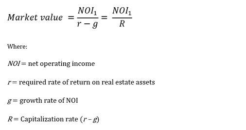

The real estate market is a significant component of the global economy, consistently presenting investors with profitable opportunities. Traditionally, this sector has depended on conventional valuation methodologies and expert assessments to determine property values and make informed market decisions. In recent years, algorithmic trading, commonly associated with financial markets, has begun to impart its influence on the real estate sector, particularly in property valuation and market analysis.

Algorithmic trading involves using complex algorithms to automate and enhance decisions, thereby improving efficiency and reducing human error. This technological advancement is not just confined to stock markets but is gradually integrating into real estate, where it plays a crucial role in transforming how properties are valued and markets are analyzed. By leveraging machine learning and big data analytics, algo trading systems are providing advanced insights into market trends and predicting property values with higher accuracy.



The integration of algorithmic trading in real estate introduces a data-driven approach that is revolutionizing traditional valuation methods. Traditional methods, such as the Sales Comparison Approach, Cost Approach, and Income Capitalization Approach, are being augmented and, in some instances, replaced by algorithmic models capable of processing vast datasets quickly. These models take into account numerous factors, including economic indicators, historical trends, and property-specific features, to offer precise valuations and forecasts.

Moreover, as the real estate market becomes increasingly digital, the strategic use of algorithms can offer competitive advantages. Investors and stakeholders who adopt these data-driven strategies are equipped to better navigate the complexities of the market, maximize returns, and mitigate risks. The integration of algorithms, supported by emerging technologies, is paving the way for a more dynamic, efficient, and transparent real estate marketplace.

This article will explore various property valuation methods, the transformative role of algorithmic trading in real estate, and how data-driven insights are reshaping this landscape. As technology advances, its impact on the real estate sector is expected to grow, offering new vistas for growth and innovation for those who embrace it.

## Table of Contents

## Real Estate Property Valuation Concepts

Property valuation is essential for making informed decisions in real estate, whether one is buying, selling, financing, or investing. Understanding certain fundamental concepts is crucial for evaluating a property's market value accurately. The primary factors in property valuation include demand, utility, scarcity, and transferability, often summarized by the acronym "DUST." These elements collectively influence the perceived and actual worth of real estate assets.

**Demand** refers to the desire for ownership supported by financial capability. In real estate, demand influences how many prospective buyers are interested in purchasing properties. An increase in demand, assuming supply remains constant, typically leads to higher property values. Conversely, if demand decreases, property values might decline unless there is a corresponding decrease in supply.

**Utility** represents a property's ability to satisfy consumer needs or desires. It encompasses the functional usefulness and appeal of the property, such as its size, design, and configuration. Properties with higher utility usually command higher prices as they better meet the needs of potential buyers. For example, a property with modern amenities and desirable features typically has higher utility than one that lacks these characteristics.

**Scarcity** is the limited availability of properties relative to demand. A high scarcity value means fewer properties exist than interested buyers, thereby driving up prices. Scarcity can be influenced by geographic limitations, zoning regulations, and economic factors that restrict new construction or expansion. In markets where land or properties are limited, scarcity plays a critical role in value assessment.

**Transferability** pertains to the ease with which ownership rights can be transferred from one party to another. Legal impediments, such as unresolved title disputes or complex regulatory requirements, can decrease a property's transferability, negatively impacting its value. A property that is readily transferable is more attractive to buyers, thus enhancing its market value.

For accurate pricing and risk assessment, stakeholders must grasp these valuation concepts to evaluate real estate assets effectively. Market conditions, local economic factors, and individual property characteristics all play pivotal roles. To quantify their effects systematically, data-driven approaches and statistical models can be employed to capture and analyze these insights effectively.

Using Python, one might employ libraries such as Pandas for data manipulation, Scikit-learn for predictive modeling, and Matplotlib for visualization to analyze these factors' impact on property valuation. For example:

```python
import pandas as pd
from sklearn.linear_model import LinearRegression
import matplotlib.pyplot as plt

# Sample data for demand, utility, scarcity, and transferability
data = {'Demand': [100, 150, 200],
        'Utility': [0.8, 0.85, 0.9],
        'Scarcity': [0.5, 0.3, 0.2],
        'Transferability': [0.9, 0.85, 0.8],
        'Value': [500000, 650000, 800000]}

df = pd.DataFrame(data)

# Features and target variable
X = df[['Demand', 'Utility', 'Scarcity', 'Transferability']]
y = df['Value']

# Linear regression model
model = LinearRegression()
model.fit(X, y)

# Predicted property values
predictions = model.predict(X)
plt.scatter(df.index, y, color='blue', label='Actual')
plt.plot(df.index, predictions, color='red', label='Predicted')
plt.xlabel('Sample')
plt.ylabel('Property Value')
plt.legend()
plt.show()
```

By understanding and applying these concepts, parties involved in real estate can better assess and negotiate property values, optimizing their investment decisions while mitigating associated risks.

## Traditional Appraisal Methods

Traditional appraisal methods have long been the backbone of real estate property valuation, allowing stakeholders to estimate the value of real estate assets accurately. These methods provide a structured approach and are widely accepted within the industry, forming the basis of transaction negotiations, investment analysis, and financial reporting.

### Sales Comparison Approach

The Sales Comparison Approach, also known as the Market Data Approach, evaluates a property based on the comparison to recent sales of similar properties in the same area. This method relies heavily on the principle of substitution, which suggests that a rational buyer will not pay more for a property than the cost of acquiring an equivalent substitute. Key steps in applying the Sales Comparison Approach include:

1. **Identifying Comparable Properties**: Locating properties similar in size, location, and features.
2. **Adjusting Sales Prices**: Making adjustments to the sale prices of comparable properties to account for differences between them and the subject property.
3. **Deriving an Estimate**: Using the adjusted sales prices to estimate the value of the subject property.

**Advantages**: The Sales Comparison Approach is straightforward and relies on actual market data, making it generally reliable in active markets.

**Limitations**: Its accuracy diminishes in markets with limited comparable sales or where there's significant heterogeneity among properties.

### Cost Approach

The Cost Approach estimates a property's value by considering the cost of constructing a replica of the asset, adjusted for depreciation. The fundamental assumption here is that a potential buyer will not pay more for a property than the cost of building an equivalent one. This approach involves:

1. **Calculating the Replacement or Reproduction Cost**: Determining the current cost of building a similar property.
2. **Estimating Depreciation**: Accounting for physical deterioration, functional obsolescence, and external factors that devalue the property.
3. **Adding the Land Value**: Using other valuation approaches to estimate the land value, which is then added to the depreciated cost of the building.

**Advantages**: This approach is particularly useful for valuing new properties or unique, non-market-traded properties.

**Limitations**: The method can become subjective when estimating depreciation and may not reflect current market conditions fully.

### Income Capitalization Approach

The Income Capitalization Approach, often termed simply the Income Approach, values a property based on the income it generates. This method is particularly prevalent for income-producing properties, such as rental buildings. It follows these steps:

1. **Estimating Potential Gross Income**: Calculating total revenue from all sources associated with the property.
2. **Subtracting Operating Expenses**: Deducting costs related to the property's operation.
3. **Calculating Net Operating Income (NOI)**: Through NOI = Potential Gross Income - Operating Expenses.
4. **Capitalizing the NOI**: Dividing the NOI by a capitalization rate to determine the property's value, using the formula: 
$$
   \text{Property Value} = \frac{\text{Net Operating Income}}{\text{Capitalization Rate}}

$$

**Advantages**: This method directly ties property value to its income potential, making it ideal for investors.

**Limitations**: Estimating a correct capitalization rate can be challenging, and fluctuations in income or market conditions can significantly affect valuation accuracy.

Together, these traditional appraisal methods provide a comprehensive toolkit for assessing real estate value, each contributing unique perspectives based on different valuation principles. While they each have inherent strengths and weaknesses, using them in conjunction ensures a well-rounded property valuation.

## The Role of Algorithmic Trading in Real Estate

Algorithmic trading in real estate leverages complex computational algorithms to streamline and automate trading decisions, fundamentally enhancing market efficiency and mitigating the potential for human error. These algorithms, often powered by [machine learning](/wiki/machine-learning) and big data analytics, provide sophisticated insights into market trends and property valuation.

The heart of [algorithmic trading](/wiki/algorithmic-trading) resides in its capacity to process and analyze massive datasets at remarkable speeds. To achieve this, algorithms employ machine learning techniques to identify patterns and correlations within historical data, current market trends, and economic indicators. By considering an extensive array of variables, including property characteristics, location, macroeconomic factors, and consumer behavior, algorithmic systems can forecast market movements and price fluctuations with precision.

For example, a typical machine learning model used in real estate algo trading might incorporate regression analysis to assess the relationship between property prices and influencing factors. The model can be designed to predict a property's future value $V_t$ using a regression formula:

$$
V_t = \beta_0 + \beta_1X_1 + \beta_2X_2 + \ldots + \beta_nX_n + \epsilon
$$

Where:
- $\beta_0$ is the intercept,
- $\beta_1, \beta_2, ..., \beta_n$ are coefficients for each predictor $X_1, X_2, ..., X_n$,
- $\epsilon$ denotes the error term.

In addition to regression, algorithms may also utilize classification techniques to categorize properties into risk levels, or cluster analysis to group properties with similar characteristics, thereby identifying undervalued or overvalued assets.

The implementation of these models is further streamlined through the use of programming languages such as Python, which offers libraries like Scikit-learn for building predictive models, Pandas for data manipulation, and NumPy for numerical computations. A simple Python script to train a model might resemble:

```python
import pandas as pd
from sklearn.model_selection import train_test_split
from sklearn.linear_model import LinearRegression

# Load the data
data = pd.read_csv('real_estate_data.csv')

# Define features and target
features = data[['feature1', 'feature2', 'feature3']]
target = data['property_value']

# Split the data
X_train, X_test, y_train, y_test = train_test_split(features, target, test_size=0.2, random_state=42)

# Train the model
model = LinearRegression()
model.fit(X_train, y_train)

# Predict
predictions = model.predict(X_test)
```

The integration of such technologies in real estate algo trading not only boosts the accuracy of asset assessments but also identifies lucrative investment opportunities. By continuously analyzing fresh data streams, algorithms dynamically adjust predictions to reflect the most current market conditions, a capability that manual analysis struggles to match.

However, the efficacy of algorithmic trading in real estate heavily depends on the quality of the data and the robustness of the algorithmic models employed. The landscape is constantly evolving; therefore, continuous model training and validation are essential to maintain the precision and reliability of predictions.

As algorithmic trading further embeds itself into the real estate sector, it promises to redefine traditional paradigms by offering enhanced decision-making tools, ultimately driving more informed and strategic investment practices.

## Real Estate Market Analysis through Machine Learning

Machine learning models, when applied to real estate data, serve as potent tools for generating precise price predictions and facilitating comprehensive market analysis. These models are adept at handling vast datasets, processing numerous variables simultaneously to deliver accurate valuation insights. The integration of machine learning models into real estate encompasses a blend of data sources, including economic indicators, historical sales data, and individual property features, to construct robust predictive models.

The underlying architecture of these models often involves supervised learning techniques, where algorithms learn from labeled datasets to predict continuous outcomes, such as property valuations. For example, regression techniques, both linear and nonlinear, are widely used to predict real estate prices based on factors like location, size, amenities, and proximity to essential services. The formula for a simple linear regression model is expressed as:

$$

Y = \beta_0 + \beta_1X_1 + \beta_2X_2 + \ldots + \beta_nX_n + \epsilon 
$$

Where $Y$ is the predicted property price, $X_1, X_2, \ldots, X_n$ represent the different features (e.g., square footage, number of bedrooms, etc.), $\beta_i$ are the coefficients, and $\epsilon$ is the error term.

Beyond traditional regression, machine learning leverages advanced methods such as decision trees, random forests, and neural networks to improve predictive accuracy. These models are particularly well-suited for detecting nonlinear relationships and interactions among variables. Methods like Random Forests and Gradient Boosting take advantage of ensemble learning, where multiple models are trained and their predictions are aggregated to enhance overall accuracy and robustness against overfitting.

Econometric models typically require assumptions about the form and distribution of data; however, machine learning models are more flexible, often achieving higher levels of accuracy without stringent assumptions. For example, Random Forest algorithms utilize an ensemble of decision trees to model complex interactions, offering reliable predictions even with highly non-linear data structures.

Python provides a rich collection of libraries such as scikit-learn and TensorFlow, which are instrumental in building and deploying machine learning models in real estate analysis. Below is a Python example using scikit-learn to build a simple regression model:

```python
import pandas as pd
from sklearn.model_selection import train_test_split
from sklearn.linear_model import LinearRegression
from sklearn.metrics import mean_squared_error

# Load dataset
df = pd.read_csv('real_estate_data.csv')

# Features and target variable
X = df[['feature1', 'feature2', 'feature3']]
y = df['price']

# Split data into training and testing sets
X_train, X_test, y_train, y_test = train_test_split(X, y, test_size=0.2, random_state=42)

# Initialize and train the model
model = LinearRegression()
model.fit(X_train, y_train)

# Predict and evaluate
predictions = model.predict(X_test)
mse = mean_squared_error(y_test, predictions)

print(f'Mean Squared Error: {mse}')
```

Machine learning's potency in real estate transcends price predictions. It augments risk assessment by identifying patterns indicative of market shifts, thus allowing stakeholders to proactively adjust their strategies. For investors, employing machine learning models means enhanced data-driven decision-making processes that effectively weigh potential risks against expected returns.

The continual progression of machine learning technology fosters an environment where these tools become indispensable in maximizing returns and minimizing risks. Stakeholders equipped with these insights can navigate the complexities of real estate markets more effectively, adapting to dynamic conditions with greater precision. As these technologies mature, they will undoubtedly play an increasingly significant role in shaping real estate investment strategies, pushing the boundaries of what's possible in market analysis and property valuation.

## Challenges and Considerations in Real Estate Algo Trading

Implementing algorithmic solutions in real estate introduces several challenges, including data quality, market [volatility](/wiki/volatility-trading-strategies), and regulatory issues. Each of these factors plays a crucial role in determining the accuracy and reliability of algorithmic trading models, particularly when applied to real estate markets.

Data quality is foundational in the development of robust algorithmic trading systems. Real estate data can be fragmented and inconsistent, often gathered from various sources, including public records, real estate listings, and market reports. To ensure that algorithms provide reliable insights, it is essential to clean and preprocess this data effectively. Advanced techniques in data cleaning may utilize natural language processing (NLP) for unstructured data like property descriptions and computer vision for analyzing images associated with listed properties. Consider the following Python code snippet that demonstrates handling missing data points using the Pandas library:

```python
import pandas as pd

# Load real estate data into a DataFrame
data = pd.read_csv("real_estate_data.csv")

# Fill missing values with the median of the column
data.fillna(data.median(), inplace=True)
```

Market volatility is another significant challenge, as real estate markets can be influenced by a plethora of factors including economic indicators, interest rates, and geopolitical events. Algorithms must be capable of adapting to these dynamic conditions to provide reliable predictions and maintain profitability. This adaptability requires the incorporation of machine learning models capable of evolving with the market, allowing them to recognize patterns and react to unexpected changes effectively.

Additionally, regulatory considerations pose challenges to the deployment of algo trading solutions in real estate. Regulatory frameworks governing property transactions can vary widely between jurisdictions, requiring algorithms to be tailored to regional compliance structures. Failure to comply with these regulations can lead to legal repercussions, making it imperative for developers to be well-versed in the legal landscape of the real estate markets they operate in.

Handling outliers and anomalies in real estate data is crucial for ensuring the accuracy of model outputs. Outliers, which can arise from atypical sales or data-entry errors, must be identified and either corrected or excluded from the analysis to prevent skewed results. This process often involves statistical techniques such as z-score normalization or robust scaling to detect anomalies. The Python code below illustrates the use of z-score to identify outliers:

```python
import numpy as np

# Calculate the z-score of each value in the column
data['z_score'] = np.abs((data['price'] - data['price'].mean()) / data['price'].std())

# Identify outliers as records with a z-score greater than 3
outliers = data[data['z_score'] > 3]
```

Ethical considerations are increasingly important in algorithmic trading, particularly in ensuring fairness, transparency, and inclusivity in property valuations. Ethical algorithms must account for potential biases in data, such as historical disparities in property valuations based on location or demographics. This involves using fair lending principles and ensuring that models do not inadvertently perpetuate existing inequities. Moreover, transparency in how algorithms are constructed and the decision-making processes they employ is essential for maintaining trust among stakeholders, including buyers, sellers, and investors.

In conclusion, while algorithmic trading presents significant opportunities for enhancing real estate market analysis and property valuation, it also brings forth challenges that must be meticulously addressed. By focusing on data quality, adapting to market volatility, ensuring regulatory compliance, and adhering to ethical guidelines, stakeholders can leverage algorithmic solutions to gain a strategic advantage in the real estate sector.

## Case Studies and Trends

Real-world applications of algorithmic trading in real estate highlight how advanced technologies are reshaping this traditionally conservative industry. Several case studies exemplify the integration and impact of algorithmic trading and machine learning tools on property valuation and market strategies.

One notable example is the collaboration between real estate firms and technology companies to develop AI-driven platforms that assist in property valuation models. These platforms utilize historical sales data, regional economic indicators, and property attributes to provide accurate real estate appraisals. For instance, Zillow's Zestimate, a valuation tool, employs statistical algorithms and machine learning to predict property values, which significantly impacts buyer perceptions and market dynamics (CEO Forum, 2020).

Additionally, hedge funds and investment firms have started leveraging algo trading systems to optimize their real estate portfolios. These systems analyze market data in real-time, enabling investors to make informed buying or selling decisions quickly. In 2019, Blackstone Group integrated an algorithmic trading system that evaluates rental yields, demographic shifts, and macroeconomic patterns to strategically manage their real estate assets (Financial Times, 2019).

Recent trends indicate an increasing reliance on big data analytics in the real estate sector. Algorithms now incorporate satellite imagery, social media sentiment analysis, and IoT data from smart buildings to derive insights into neighborhood trends and property desirability. This comprehensive data amalgamation allows stakeholders to anticipate shifts in market demand and align their strategies accordingly.

Another emerging trend is the use of blockchain technology to enhance transparency and efficiency in real estate transactions. Algorithmic trading systems are beginning to integrate blockchain to validate property titles, streamline transactions, and reduce fraud. This shift towards digital ledger systems is expected to transform the due diligence process and foster trust among participants in real estate markets (PwC, 2021).

In summary, case studies underscore the transformative power of algorithmic trading in real estate. By harnessing machine learning, big data, and blockchain technology, stakeholders can anticipate market trends, strategically manage asset portfolios, and optimize property valuations. The continued advancement and adoption of these technologies are likely to further influence the evolution and competitiveness of the real estate sector.

## Conclusion

The integration of algorithmic trading and machine learning within real estate valuation and market analysis provides substantial advantages to the sector. By automating trading decisions and enhancing market analysis, these technologies reduce human error and improve the precision of property valuations. As algorithms can rapidly process vast quantities of data, they offer significant insights into market trends and enable accurate prediction of market shifts. Consequently, stakeholders, from buyers to investors, can make better-informed decisions, capitalize on profitable opportunities, and minimize risks.

As these technologies continue to evolve, their transformative impact on the real estate domain is expected to grow. Machine learning and algorithmic trading not only streamline existing processes but also open the door for innovative valuation approaches that were previously impractical. For instance, [deep learning](/wiki/deep-learning) models can incorporate diverse data sources, such as socioeconomic indicators and historical trends, to predict market behaviors with greater accuracy.

Stakeholders who adopt data-driven strategies position themselves for competitive advantages in an increasingly digital-era marketplace. By leveraging advanced analytical tools, these stakeholders can stay ahead of market developments, optimize investment strategies, and drive efficiency in real estate transactions. As a result, the strategic adoption of algorithmic trading and machine learning techniques offers a forward-looking pathway for enhanced profitability and sustainable growth in the real estate industry.

## References & Further Reading

[1]: Friedmann, J., & Eisenberg, J. (2017). ["The use of big data and artificial intelligence in real estate"]. Real Estate Issues.

[2]: ["Advances in Financial Machine Learning"](https://www.amazon.com/Advances-Financial-Machine-Learning-Marcos/dp/1119482089) by Marcos Lopez de Prado

[3]: Schonfeld, S. (2018). ["Machine Learning Approaches and Real Estate Valuation"]. Journal of Property Investment & Finance.

[4]: Zou, H., & Hastie, T. (2005). ["Regularization and variable selection via the elastic net"](https://academic.oup.com/jrsssb/article/67/2/301/7109482). Journal of the Royal Statistical Society: Series B (Statistical Methodology).

[5]: ["Real Estate Market Analysis: Methods and Cases"](https://books.google.com/books/about/Real_Estate_Market_Analysis.html?id=6xxhPwAACAAJ) by Deborah L. Brett & Adrienne Schmitz