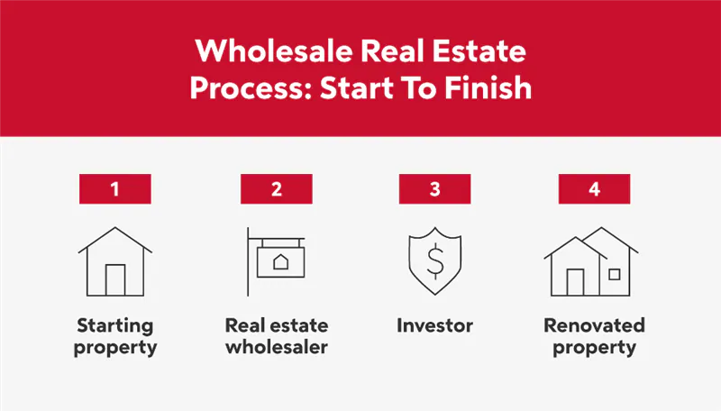

## Table of Contents

## What is real estate wholesaling?

Real estate wholesaling is when someone finds a good deal on a house and then sells that deal to another person, usually an investor, without actually buying the house themselves. The wholesaler makes money by charging the investor a fee for finding the deal. This method is popular because it allows people to make money in real estate without needing a lot of cash or a good credit score.

To start wholesaling, a person first looks for homes that are priced low, often because they need repairs or the owner needs to sell quickly. Once they find a good deal, they get the house under contract with the seller. Then, they find an investor who wants to buy the house at a higher price than what the wholesaler agreed to pay. The difference between these two prices is the wholesaler's profit. It's important for wholesalers to have a good network of investors and to understand the local real estate market well.

## What are the basic steps involved in real estate wholesaling?

Real estate wholesaling starts with finding a good deal on a house. You look for homes that are priced low, maybe because they need repairs or the owner needs to sell fast. Once you find a good deal, you talk to the seller and get the house under contract. This means you agree to buy the house at a certain price, but you don't actually buy it yet.

Next, you need to find an investor who wants to buy the house. You show them the deal and offer to sell them your contract for a higher price than what you agreed with the seller. The difference between these two prices is your profit. It's important to have a good network of investors and to know the local real estate market well so you can find and sell these deals quickly.

## How do you find potential properties for wholesaling?

To find potential properties for wholesaling, you need to be proactive and look in places where people might want to sell their homes quickly. One good way is to drive around neighborhoods and look for signs that say "For Sale by Owner." These sellers might be more open to a quick deal. You can also use websites and apps that list homes for sale, especially those that are priced low or need a lot of work. Another way is to contact real estate agents who work with distressed properties, like homes that are in foreclosure or need a lot of repairs.

Networking is also really important. You can join local real estate investment groups or go to meetings where people talk about buying and selling homes. These places are great for meeting sellers and other investors who might know about good deals. You can also use direct mail campaigns, sending letters to homeowners in certain areas, telling them you're interested in buying their home. This can help you find people who might not be actively trying to sell but would consider it for the right price.

Lastly, you can use online tools and data services that list properties that might be good for wholesaling. These services can show you homes that are in pre-foreclosure or have been on the market for a long time. By using a mix of these methods, you can find a lot of potential properties and increase your chances of finding a good deal to wholesale.

## What are the key legal considerations in real estate wholesaling?

When you do real estate wholesaling, you need to know the laws about contracts. You have to be honest with the seller about what you plan to do with the house. Some states have rules that say you can't assign a contract to someone else without telling the seller first. It's a good idea to have a lawyer check your contracts to make sure they follow the law and protect you. If you don't follow the rules, you could get in trouble and lose money.

Another important thing is to make sure you have the right to sell the contract to someone else. This is called the "assignment clause." If the contract doesn't let you do this, you might have to buy the house yourself before you can sell it to an investor. This can be risky if you don't have the money to do that. Also, some places have laws about who can do real estate deals, so you might need a license to wholesale. Always check the local laws and maybe talk to a real estate lawyer to make sure you're doing everything right.

## How can you effectively market a property as a wholesaler?

To market a property as a wholesaler, start by using your network of investors. Let them know about the deal you have as soon as you can. You can send them a text, an email, or call them directly. It's good to have a list of investors who are always looking for deals. You can also use social media to post about the property. Make sure to include all the important details like the price, location, and any repairs the house needs. This way, more people can see your deal and you might find a buyer faster.

Another way to market the property is by using online platforms. There are websites and apps where you can list your wholesale deals. Make sure your listing is clear and has good photos of the property. You can also join real estate investment groups or forums online. These places are great for meeting other investors who might be interested in your deal. The more places you can show your property, the better chance you have of finding someone who wants to buy it.

## What are the common challenges faced by real estate wholesalers and how can they be overcome?

One common challenge for real estate wholesalers is finding good deals. It can be hard to find properties that are priced low enough to make a profit when you sell them to an investor. To overcome this, wholesalers need to be proactive. They should drive around neighborhoods, use online tools, and network with other real estate people. By looking in many places and talking to a lot of people, they can find more deals and increase their chances of finding a good one.

Another challenge is getting the seller to agree to the contract. Some sellers might not like the idea of wholesaling and could back out of the deal. To deal with this, it's important to be honest with the seller from the start. Tell them what you plan to do with the house and make sure they understand the process. Having a good contract that protects both you and the seller can also help. If you're not sure about the contract, it's a good idea to have a lawyer look at it.

Lastly, finding an investor to buy the deal can be tough. Sometimes, wholesalers can't find someone who wants to buy the house at the price they need to make a profit. To solve this, wholesalers should build a strong network of investors. They can do this by going to real estate meetings, joining online groups, and keeping in touch with people who have bought from them before. The more investors they know, the easier it will be to find someone who wants to buy their deal.

## How do you calculate the profit in a wholesaling deal?

To calculate the profit in a wholesaling deal, you first need to know the price you agreed to pay the seller. This is called the contract price. Then, you need to find an investor who will buy the house from you for a higher price. This higher price is called the assignment price. The profit you make is the difference between the assignment price and the contract price. For example, if you agreed to buy the house for $100,000 and you find an investor who will pay $110,000, your profit is $10,000.

It's important to remember that you might have some costs when wholesaling. These can include marketing costs to find the deal, or fees for legal help to make sure your contracts are good. You need to subtract these costs from your profit to know how much money you will really make. So, if your costs were $2,000, then your real profit from the deal would be $10,000 - $2,000 = $8,000. Keeping track of all these numbers helps you know if a deal is worth doing.

## What are the best practices for negotiating with sellers in real estate wholesaling?

When negotiating with sellers in real estate wholesaling, it's important to be honest and clear about what you plan to do with the house. Tell the seller right away that you are a wholesaler and that you will be selling the contract to an investor. This builds trust and can make the seller more willing to work with you. Also, listen carefully to what the seller needs. If they need to sell the house quickly or if they are having money problems, you can use this information to offer them a solution that fits their situation. For example, you might offer to close the deal faster than a traditional sale.

Another good practice is to be ready to walk away if the deal doesn't make sense for you. Sometimes, sellers might want too much money or have too many conditions that make it hard for you to make a profit. If this happens, it's better to find another deal than to force a bad one. Also, try to keep the negotiations friendly and respectful. Even if you can't agree on a deal, you might want to work with the seller again in the future. By being fair and understanding, you can build a good reputation in the real estate market.

## How does wholesaling differ from other real estate investment strategies?

Wholesaling is different from other real estate investment strategies because it doesn't require you to actually buy the property. Instead, you find a good deal on a house and then sell that deal to an investor for a fee. This means you don't need a lot of money to start wholesaling, unlike strategies like fix and flip, where you have to buy the house, fix it up, and then sell it for a profit. With wholesaling, your profit comes from the difference between what you agreed to pay the seller and what the investor pays you.

Other real estate strategies, like rental properties or fix and flip, involve more risk and money. With rental properties, you buy a house and rent it out to tenants, hoping to make money from the rent over time. This requires a big upfront investment and ongoing management. Fix and flip means buying a house, fixing it up, and then selling it for more than you spent. This can be risky because you might not sell the house for as much as you hoped, or the repairs might cost more than you expected. Wholesaling is less risky because you're not putting your own money into the property, but it also usually means smaller profits compared to these other strategies.

## What advanced techniques can be used to scale a wholesaling business?

To scale a wholesaling business, one effective technique is to build a strong team. You can hire people to help you find deals, talk to sellers, and work with investors. This way, you can handle more deals at the same time. Another technique is to use technology to make your work easier. You can use software to keep track of your deals, send out marketing messages, and stay in touch with your network. By using these tools, you can work faster and reach more people.

Another advanced technique is to focus on specific types of properties or neighborhoods. By becoming an expert in a certain area, you can find deals faster and build a reputation as someone who knows the market well. This can attract more sellers and investors to work with you. Also, you can start wholesaling in different cities or states. This can help you find more deals and spread your risk. By doing these things, you can grow your wholesaling business and make more money.

## How can technology and tools enhance your wholesaling operations?

Technology and tools can really help you do better in wholesaling. You can use software to keep track of all your deals. This makes it easier to remember important dates and details about each property. You can also use tools to send out messages to lots of people at once, like emails or texts, to find sellers and investors. This saves you time and helps you reach more people quickly. There are also apps that can help you find properties that might be good for wholesaling, like homes that are in foreclosure or need repairs.

Another way technology helps is by making it easier to talk to people. You can use online platforms and social media to show off your deals to more investors. This can help you find buyers faster. Also, there are tools that can help you understand the market better, like data services that show you what homes are selling for in different areas. By using these tools, you can make smarter decisions and find better deals. This can help you grow your wholesaling business and make more money.

## What are the ethical considerations in real estate wholesaling and how can they impact your business?

In real estate wholesaling, it's important to be honest and fair with everyone you work with. This means telling the seller right away that you are a wholesaler and that you plan to sell the contract to an investor. If you don't tell the truth, the seller might feel tricked and could back out of the deal. This can hurt your reputation and make it harder to find good deals in the future. Being honest builds trust and can help you work with more people over time.

Another ethical thing to think about is how you treat the investors who buy your deals. You should make sure the deals you offer are good and fair. If you try to sell bad deals or charge too much, investors might not want to work with you again. This can make it hard to grow your business. By being fair and honest with both sellers and investors, you can build a good reputation and have a successful wholesaling business.

## What is the Role of Algo Trading in Real Estate Investment?

Algorithmic trading, commonly referred to as algo trading, involves the use of automated systems to execute trades in real estate-related securities based on pre-established criteria. This sophisticated strategy leverages advanced mathematical models and statistical analysis to interpret vast amounts of market data and execute trades at remarkable speeds. The primary advantage of algo trading is its ability to perform complex calculations and trades more efficiently than human operators, making it a preferred choice for institutional investors looking to minimize human error and emotional decision-making.

The principal components of algo trading involve the identification of trading opportunities through algorithms designed to detect patterns or trends within market data. These algorithms are created using intricate mathematical models that analyze data inputs such as historical prices, market conditions, and economic indicators. For example, a simple mean-reversion strategy might use the following formula to identify potential buy or sell signals:

$$
\text{Signal} = P_t - \overline{P}_{t-n}
$$

where $P_t$ is the current price and $\overline{P}_{t-n}$ is the average price over the previous $n$ periods. If the signal is positive, it may indicate that a security price will revert to its mean, suggesting a selling opportunity.

Algo trading provides exposure to the real estate sector through instruments such as Real Estate Investment Trusts (REITs) and real estate index funds. These financial products allow investors to trade on the underlying value of the real estate market without directly purchasing physical properties. This is particularly advantageous in creating diversified portfolios with a real estate component while maintaining [liquidity](/wiki/liquidity-risk-premium) and flexibility.

However, trading at such high speeds comes with inherent risks. The rapid pace can lead to significant losses if algorithms act on erroneous signals or if market [volatility](/wiki/volatility-trading-strategies) exceeds the model's parameters. Investors engaging in high-frequency trading must therefore have robust technological infrastructure and risk management systems in place to monitor trades and make necessary adjustments swiftly.

Moreover, regulatory compliance plays a critical role in [algorithmic trading](/wiki/algorithmic-trading). Investors must ensure that their trading practices adhere to legal standards, which may vary by country and exchange. This requires continual monitoring of regulatory changes and adjusting algorithms accordingly.

Overall, while algo trading does not involve direct interaction with physical real estate, it remains a crucial tool for investors seeking exposure to real estate markets through a data-driven, systematic approach. By effectively utilizing algorithms and maintaining technological integrity, investors can capitalize on potential opportunities in the ever-evolving landscape of real estate investment.

## References & Further Reading

[1]: ["Investing in REITs: Real Estate Investment Trusts"](https://www.investopedia.com/articles/mortgages-real-estate/10/real-estate-investment-trust-reit.asp) by Ralph L. Block

[2]: ["The Book on Investing In Real Estate with No (and Low) Money Down"](https://www.amazon.com/Book-Investing-Real-Estate-Money/dp/1947200976) by Brandon Turner 

[3]: ["Real Estate Wholesaling Bible: The Fastest, Easiest Way to Get Started in Real Estate Investing"](https://www.amazon.com/Real-Estate-Wholesaling-Bible-Investing/dp/1118807529) by Than Merrill

[4]: ["Algorithmic Trading: Winning Strategies and Their Rationale"](https://www.wiley.com/en-us/Algorithmic+Trading%3A+Winning+Strategies+and+Their+Rationale-p-9781118460146) by Ernest P. Chan 

[5]: ["The Intelligent REIT Investor: How to Build Wealth with Real Estate Investment Trusts"](https://www.amazon.com/Intelligent-REIT-Investor-Wealth-Investment/dp/1119252717) by Stephanie Krewson-Kelly and R. Brad Thomas