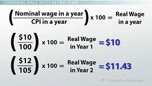

The dynamics of an economy are ever-changing, influenced by numerous factors such as inflation, real income, and technological advancements like algorithmic trading. Economic shifts are common as these elements interact, presenting challenges and opportunities for individuals and businesses alike. Inflation, a measure of the rate at which the general level of prices for goods and services rises, can erode purchasing power. Real income and real wages offer clearer reflections of an individual's economic status by eliminating the distortions caused by inflation. In tandem, technological advancements, particularly algorithmic trading, play a significant role in shaping today's financial markets by automating trading processes and improving market efficiency.

Understanding how these elements interact can provide valuable insights into economic trends and individual financial well-being. Inflation affects not only the cost of living but also the real value of wages, thus influencing consumer behavior and savings patterns. Meanwhile, real income and real wages give a more accurate assessment of living standards and economic status. Algorithmic trading, representing a leap in financial technology, impacts market dynamics by providing liquidity and potentially increasing volatility, thus influencing investment strategies.

This article explores the relationship between real income, inflation, real wages, and the impact of algorithmic trading on the financial markets. It will examine how inflation interacts with wages and purchasing power, analyzing their implications for individuals, businesses, and policymakers. Furthermore, the discussion will extend to the influence of algorithmic trading, a tool that reshapes the way markets operate and respond to these economic fundamentals.

By examining these components and their interactions, we aim to provide a comprehensive understanding of the economic landscape today. A detailed look at these factors will help clarify their role in shaping economic conditions and highlight the importance of monitoring them to make informed financial decisions. This understanding serves as a basis for anticipating future economic scenarios and preparing for a financial ecosystem increasingly influenced by technology and economic variables.

## Table of Contents

## Understanding Real Income and Real Wages

Real income is an essential economic measure that reflects the purchasing power of an individual or household, taking into account the effects of inflation. It is a more accurate representation of economic well-being than nominal income because it adjusts for changes in price levels. The calculation of real income is straightforward: 

$$
\text{Real Income} = \frac{\text{Nominal Income}}{\text{Price Index}} \times 100
$$

where the Price Index is a measure of the average level of prices in the economy, often represented by the Consumer Price Index (CPI).

Real wages, likewise, refer to the compensation received by workers after accounting for inflation. By removing the inflationary effects from wages, real wages provide a clearer indication of an individual's true economic status. This metric is crucial in assessing the purchasing power of earnings over time. The formula for real wages is similar to that of real income:

$$
\text{Real Wages} = \frac{\text{Nominal Wages}}{\text{CPI}} \times 100
$$

Both real income and real wages are vital metrics for evaluating the economic health of individuals and the broader economy. They allow policymakers, businesses, and consumers to make informed decisions by understanding the true value of money at any given time. As a rule, when real income and wages rise, individuals generally experience an improvement in their standard of living, assuming other factors remain constant.

Economic participants, such as governments, businesses, and households, track these measures to assess financial well-being and strategize accordingly. Policymakers use them to gauge the effectiveness of economic policies, such as taxation or social welfare programs. Businesses monitor real wages to make decisions about pricing, wage growth, and recruitment, which impacts their operational strategies and competitiveness. Individuals, on the other hand, use these insights to plan consumption, savings, and investment decisions.

In essence, understanding real income and real wages equips stakeholders with the knowledge to interpret economic signals and trends more accurately, facilitating better decision-making in personal finance and public policy.

## Impact of Inflation on Real Income and Wages

Inflation affects the economic landscape by directly impacting real income and wages, which in turn influences purchasing power. Real income is understood as the income of individuals after adjusting for the effects of inflation, providing an essential perspective on purchasing power and economic prosperity. As inflation rises, the nominal value of wages might increase, but if this increase doesn't outpace inflation, the real value or purchasing power declines. This erosion of purchasing power presents significant challenges for consumers and savers alike.

There are different types of inflation, each with unique implications for economic performance:

1. **Demand-pull inflation** occurs when aggregate demand in an economy outpaces aggregate supply, leading to an increase in prices. This situation often results in higher wages if the labor market is tight, but if wage growth does not keep pace with price increases, real wages will effectively decrease.

2. **Cost-push inflation** is driven by rising costs of production, such as wages and raw materials, which push up prices. In this scenario, companies may not be able to increase wages concurrently with cost increases, leading to reduced real income.

3. **Built-in inflation**, also known as wage-price inflation, is a self-sustaining cycle where workers demand higher wages to keep up with rising living costs, and companies pass those higher labor costs onto consumers in the form of higher prices.

Each of these types of inflation can have varying impacts on real income and wages, necessitating different strategic responses from both consumers and businesses.

Consumers often adjust their spending patterns in response to inflation changes. They may cut back on discretionary spending, seek cheaper or alternative goods, or increase savings in anticipation of future price increases. Moreover, savers might look for investment options that can yield returns above the inflation rate to preserve or increase purchasing power. 

Businesses, on the other hand, might adopt various strategies to mitigate the effects of inflation. This includes optimizing supply chains to reduce costs, adjusting pricing strategies to maintain profit margins, or investing in productivity improvements to offset the increased cost of inputs. Some might invest in inflation-hedged assets to protect their financial health against inflationary pressures.

To illustrate how inflation impacts purchasing power using a simple calculation: assume nominal wages are $50,000 and inflation is 3%. The real wages can be calculated using the formula:

$$
\text{Real Wages} = \frac{\text{Nominal Wages}}{1 + \frac{\text{Inflation Rate}}{100}}
$$

Substituting the given values:

$$
\text{Real Wages} = \frac{50,000}{1 + 0.03} \approx 48,543.69
$$

This calculation reveals that even though nominal wages remain $50,000, the purchasing power of those wages is equivalent to about $48,543.69 in real terms. Thus, recognizing and understanding the impact of inflation on real income and wages is crucial for consumers and businesses as they concoct strategies to safeguard financial well-being in an inflationary environment.

## Algorithmic Trading in the Financial Markets

Algorithmic trading, commonly referred to as algo trading, represents the intersection of finance and technology, where computer algorithms are used to automate trading decisions. These algorithms can execute orders at speeds and frequencies that are impossible for human traders, relying on predefined criteria and mathematical models.

### How Algo Trading Works

At its core, [algorithmic trading](/wiki/algorithmic-trading) involves using algorithms to identify profitable trading opportunities based on various market parameters. These parameters can include price, timing, [volume](/wiki/volume-trading-strategy), and other complex mathematical variables. The primary objective is to leverage computational power to execute trades that optimize profits and minimize risks.

A typical algo trading framework includes data analysis, signal generation, risk management, and execution. Data analysis involves retrieving and processing vast amounts of historical and real-time market data. Signal generation uses this data to identify trading signals, which are indicators of when to buy or sell an asset. Risk management ensures that trading activities align with the trader's risk tolerance, while execution handles the final trade placement.

### Role in Today's Economic Landscape

Algorithmic trading has gained prominence across global financial markets, accounting for a significant portion of the trading volume on exchanges. It is particularly prevalent in high-frequency trading ([HFT](/wiki/high-frequency-trading-strategies)), where algorithms execute thousands of trades per second to capitalize on minor price discrepancies.

Today’s financial environment is increasingly demanding in terms of speed and precision, necessitating advanced methodologies that algo trading offers. The role of algo trading extends beyond equities; it is also prevalent in commodities, foreign exchange, and fixed-income markets.

### Efficiencies and Complexities

Algorithmic trading offers notable efficiencies by reducing transaction costs and improving the speed of trade execution. Algorithms can identify optimal execution strategies, such as slicing large orders into smaller parts to minimize market impact. Furthermore, they facilitate better risk management by incorporating stop-loss levels and risk-adjusted return strategies.

However, algo trading also introduces complexities, particularly regarding the potential for increased market [volatility](/wiki/volatility-trading-strategies). The rapid execution speeds can lead to "flash crashes," where markets experience sharp, brief drops in prices due to algorithmic malfunctions. Additionally, the reliance on complex algorithms necessitates rigorous testing and validation to ensure reliability under various market conditions.

### Influence on Market Volatility and Liquidity

Algorithmic trading can significantly impact market [liquidity](/wiki/liquidity-risk-premium) and volatility. By enabling quicker trades, algorithms enhance market liquidity, ensuring that buyers and sellers can transact more efficiently. This improved liquidity generally benefits smaller market participants by narrowing bid-ask spreads.

On the downside, the same speed that enhances liquidity can increase volatility. Rapid trading can lead to sudden price swings, particularly in less liquid markets. Regulatory bodies often monitor these impacts, implementing safeguards such as circuit breakers to minimize systemic risks.

### Technological Advancements Driving Innovations

The advancement of technology continues to propel the evolution of algorithmic trading. Machine learning and [artificial intelligence](/wiki/ai-artificial-intelligence) are increasingly being integrated into trading algorithms, allowing for the analysis of complex data patterns and the prediction of market trends.

Developments in hardware, such as high-performance computing (HPC) and low-latency networks, support faster and more effective data processing and trade execution. These technologies enable traders to build more sophisticated models and execute trades with minimal time lags.

In conclusion, algorithmic trading stands as a hallmark of contemporary financial markets, enhancing efficiencies yet posing unique challenges. Its evolution, driven by continued technological advancements, will likely shape future trading landscapes, underscoring its integral role in global market dynamics.

## The Interplay Between Real Income, Inflation, and Algo Trading

Real income, inflation, and algorithmic trading are interconnected elements that significantly impact the economic environment. Algorithmic trading has been shown to influence market volatility and liquidity, which, in turn, can affect inflationary pressures and the overall economic landscape. By understanding these interactions, stakeholders can make more informed decisions.

Algorithmic trading employs complex algorithms and high-speed data processing to execute trading strategies, often faster and more efficiently than human traders. This increased efficiency can influence market liquidity by increasing the volume and frequency of trades. When markets are more liquid, price discovery becomes more efficient, potentially impacting inflation rates indirectly by stabilizing currency values.

Furthermore, algorithmic trading strategies can respond to changes in real income and wages, as these factors influence consumer behavior and spending patterns. For instance, a period of rising real incomes might indicate increased consumer spending potential, prompting algorithmic trading models to adjust portfolios to capitalize on anticipated market growth.

Investors also use algorithmic trading as a tool to hedge against inflationary risks. Hedging strategies may include the use of derivatives, such as futures and options, to protect against potential losses due to price level changes. By automating these strategies, investors can quickly adjust their positions in response to real-time market data, thereby mitigating risks associated with inflation.

Moreover, algorithmic trading can alter market behavior by introducing new dynamics into price-setting mechanisms. For example, rapid automation and high-frequency trading can create feedback loops that exacerbate price movements, influencing short-term inflation expectations. In extreme cases, this could lead to sudden shifts in market sentiment, impacting wage negotiations and labor market dynamics.

For investors aiming to leverage algorithmic trading, understanding market trends and inflation data is crucial. By integrating economic indicators such as consumer price index (CPI) changes and wage growth into their trading algorithms, investors can devise strategies that anticipate market movements and adapt to inflationary pressures.

In conclusion, the interplay between real income, inflation, and algorithmic trading is intricate and multifaceted. The influence of algorithmic trading extends beyond market efficiency, affecting inflationary pressures and economic behavior. By grasping these relationships, investors and policymakers can better navigate economic uncertainties and capitalize on emerging opportunities.

## Future Trends and Considerations

Understanding the synergy between real income, inflation, and algorithmic trading is vital for forecasting future economic conditions. As the economy continues to evolve, various stakeholders, including individuals, businesses, and policymakers, must anticipate potential future scenarios and formulate strategic responses.

### Preparing for Future Scenarios

**1. Individuals and Real Income:**
Individuals should focus on maintaining and enhancing their real income by investing in skills that are less susceptible to wage erosion due to inflation. Lifelong learning and adapting to market needs can safeguard purchasing power in the face of changing economic conditions. It is also essential for individuals to diversify their investment portfolios, considering assets that typically hedge against inflation, such as real estate and commodities.

**2. Businesses and Inflation:**
For businesses, understanding inflationary trends is critical to safeguarding profitability. Companies should consider adopting dynamic pricing models that reflect real-time inflation data. Additionally, businesses may explore leveraging algorithmic trading strategies to manage operational costs associated with purchasing raw materials and hedging against market volatility. The adoption of technology to automate supply chain and inventory management can further mitigate inflationary impacts.

**3. Policymakers and Algorithmic Impact:**
Policymakers have a crucial role in regulating and monitoring algorithmic trading to ensure it does not exacerbate market volatility. Implementing frameworks that foster transparency and ethical trading practices can help balance the positive aspects of algorithmic trading, such as improved market liquidity, with potential risks. Additionally, policies aimed at promoting wage growth in real terms can help counteract the negative effects of inflation on real income.

### Strategic Planning in a Rapidly Changing Financial Ecosystem

Strategic planning in the context of these economic dynamics requires a focus on adaptability and resilience. For individuals, this means maintaining financial flexibility and awareness of macroeconomic trends. Businesses must prioritize agility, investing in technology and data analytics to stay competitive. They should also foster a corporate culture that is proactive in responding to economic shifts.

Policymakers should prioritize ensuring economic stability by integrating real-time data analytics into policy-making processes. This can provide more accurate forecasts and aid in timely interventions. Moreover, fostering an environment that supports innovation in financial technologies, while ensuring adequate safeguards, can help harness the benefits of algorithmic trading.

### Conclusion

The interconnectedness of real income, inflation, and algorithmic trading highlights the necessity of preparing for future economic scenarios strategically. By understanding these relationships, stakeholders can implement measures to protect economic well-being and leverage opportunities arising within a dynamic financial ecosystem. Continuous adaptation and strategic foresight are imperative in navigating the complexities of the modern economy.

## Conclusion

Real income, inflation, and algorithmic trading are pivotal elements of the contemporary economy, each interlinked and exerting influence on the others. Throughout this article, we have examined the dynamic interplay among these aspects, shedding light on how they collectively shape economic landscapes and individual financial well-being.

Understanding the relationships between real income, inflation, and algorithmic trading is essential for informed decision-making in economic and financial contexts. Real income serves as a measure of purchasing power, providing insights into the economic status of individuals when adjusted for inflation. Inflation, on the other hand, affects purchasing power directly by altering the real value of wages and savings. Algorithmic trading introduces further complexity, as it can impact market volatility and liquidity, potentially influencing inflationary pressures and economic stability.

Continuous monitoring and analysis of real income, inflation, and algorithmic trading are imperative as these factors continuously evolve with technological advancements and economic shifts. For instance, understanding how algorithmic trading strategies respond to inflationary trends or how they might affect real income distribution can provide crucial insights for investors, policymakers, and individuals alike.

The ever-changing nature of global economies necessitates a proactive approach to managing these components. By keeping abreast of technological innovations in trading, anticipating inflationary trends, and accurately measuring real income, stakeholders can better navigate the intricate financial environment. Ultimately, comprehending these interactions is crucial for ensuring financial stability and promoting sustained economic growth in an era marked by rapid change.

## References & Further Reading

[1]: ["Inflation and Economic Growth"](https://www.economicsonline.co.uk/all/the-relationship-between-inflation-and-economic-growth.html/) by Robert J. Barro, published in the National Bureau of Economic Research

[2]: ["Advances in Financial Machine Learning"](https://www.amazon.com/Advances-Financial-Machine-Learning-Marcos/dp/1119482089) by Marcos Lopez de Prado

[3]: ["Quantitative Trading: How to Build Your Own Algorithmic Trading Business"](https://github.com/LucindaYa/quant-resources/blob/master/Quantitative%20Trading%20How%20to%20Build%20Your%20Own%20Algorithmic%20Trading%20Business.pdf) by Ernest P. Chan

[4]: ["NBER Macroeconomics Annual 1998, Volume 13"](https://www.nber.org/books-and-chapters/nber-macroeconomics-annual-1998-volume-13) by Ben S. Bernanke and Julio J. Rotemberg, available at the National Bureau of Economic Research

[5]: ["Algorithmic Trading & DMA: An Introduction to Direct Access Trading Strategies"](https://www.semanticscholar.org/paper/Algorithmic-trading-%26-DMA-%3A-an-introduction-to-Johnson/aa5de1ab883d5e23b6651faa7c1807586d688e4b) by Barry Johnson