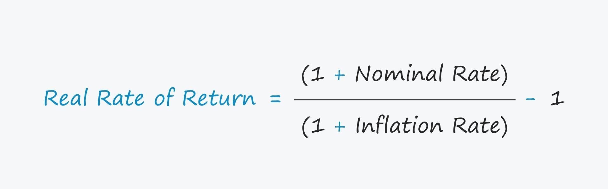

Understanding the real rate of return is crucial for investors aiming to measure the true profitability of their investments. It is a key metric that considers inflation, which can erode purchasing power over time. Inflation-adjusted returns provide a more accurate reflection of investment performance than nominal returns, which do not account for inflation's effect on money's value.

Nominal rates of return are often misleading when evaluating investment success. They present the gross increase in value without accounting for the inflation rate, risking an overestimation of actual investment performance. In contrast, real rates of return offer a clear picture by taking inflation into account, thus reflecting the true enhancement in wealth.



Algorithmic trading plays a significant role in managing investment returns in an inflationary context. By leveraging complex algorithms, investors are better positioned to respond to inflationary pressures effectively. These algorithms can efficiently analyze vast amounts of market data and update trading strategies in real-time to optimize returns and preserve purchasing power under varying inflation conditions.

This article aims to provide readers with a detailed understanding of assessing investment returns using inflation-adjusted metrics. By learning to evaluate investments considering inflation's impact, investors can make more informed decisions and achieve their financial goals despite the dynamic nature of market environments.

## Table of Contents

## Understanding the Real Rate of Return

The real rate of return is a crucial metric for investors, representing the annual percentage profit earned on an investment after adjusting for inflation. This adjustment is essential because inflation erodes the purchasing power of money over time, meaning that the nominal returns often cited can be misleading. Nominal returns reflect only the percentage increase in the investment's value, without accounting for changes in the general price level. Thus, understanding the distinction between nominal and real returns is imperative for evaluating the true performance of an investment.

To calculate the real rate of return, one must subtract the inflation rate from the nominal [interest rate](/wiki/interest-rate-trading-strategies). This can be expressed with the formula:

$$
\text{Real Rate of Return} = \frac{1 + \text{Nominal Interest Rate}}{1 + \text{Inflation Rate}} - 1
$$

This formula provides a more accurate depiction of the investment's profitability by considering the inflation [factor](/wiki/factor-investing). For example, if an investment yields a nominal return of 8% and the inflation rate is 3%, the real rate of return is approximately 4.85%. This calculation is performed as follows:

```python
nominal_return = 0.08
inflation_rate = 0.03
real_return = (1 + nominal_return) / (1 + inflation_rate) - 1
real_return_percent = real_return * 100
print(f"Real Rate of Return: {real_return_percent:.2f}%")
```

This real rate of return better reflects the investment's actual increase in purchasing power, providing investors with a clearer picture of its value. Additionally, understanding and calculating real returns can illuminate how inflation impacts the realized value of investment gains. When inflation is high, it can severely diminish the real returns of investments, affecting both the short-term and long-term financial outcomes.

By focusing on real rates of returns, investors can make more informed decisions, assessing whether their investments not only grow in nominal terms but also preserve or enhance purchasing power. This approach enables a more realistic assessment of investment success, ensuring that returns align with the investor's financial goals in an inflationary economic environment.

## Importance of Inflation-Adjusted Returns

Inflation-adjusted returns provide a crucial metric for assessing the true growth in an investor's wealth by reflecting the impact of inflation on investment performance. When evaluating investment success, focusing solely on nominal returns can be misleading due to the erosive effects of inflation on purchasing power. Understanding inflation-adjusted returns is especially important for long-term investors who aim to preserve their purchasing power over time.

Consider an example: an investment producing a nominal return of 6% in a period where inflation is 2% results in a real return of approximately 3.92%. This is computed using the formula for the real rate of return: 

$$

\text{Real Return} = \frac{1 + \text{Nominal Return}}{1 + \text{Inflation Rate}} - 1 
$$

The practical significance of computing inflation-adjusted returns lies in enabling investors to make informed decisions about their investment portfolios. For instance, without adjusting for inflation, an investor might erroneously assume that a nominal return of 10% indicates substantial growth. However, if inflation is 4%, the real return is only around 5.77%, demonstrating that nearly half of the perceived growth is eroded by inflation.

Inflation-adjusted returns also facilitate effective planning for significant financial goals such as retirement. When these returns are accounted for, investors can better gauge how much they will need to save to maintain their current standard of living in the future. This is vital for avoiding shortfalls that might arise from overestimating the success of investments when only nominal returns are considered.

Higher nominal returns can therefore be deceptive if inflation significantly undermines actual purchasing power. For example, during periods of high inflation, asset classes like equities, which might offer higher nominal returns, may still not provide substantial real returns. Conversely, understanding inflation's impact helps investors select assets that are likely to perform better in preserving real wealth, such as those with returns that are historically resilient against inflationary pressures.

In conclusion, accounting for inflation-adjusted returns is imperative for investors seeking to accurately assess their investment performance and ensure their financial strategies are robust against inflationary erasure of wealth. This understanding supports more effective long-term financial planning and helps maintain the purchasing power necessary to achieve desired financial outcomes.

## How Algorithmic Trading Enhances Investment Returns

Algorithmic trading leverages sophisticated computer algorithms to streamline and optimize trading strategies, enabling investors to efficiently track and respond to market conditions. These algorithms are grounded in data analysis, integrating variables such as price trends, trading volumes, and economic indicators to execute trades at optimal times. One key advantage is their ability to assess inflationary trends, making it possible to adjust strategies that minimize inflation's negative effects on investment returns.

Algorithms process vast amounts of real-time data to optimize buy and sell decisions, enhancing investors' capability to achieve real, inflation-adjusted returns. For instance, by incorporating data on inflation rates and economic forecasts, algorithms can predict how different asset classes might react to inflationary pressures. This capability allows for quick adjustments to portfolios, ensuring investments continue to preserve purchasing power.

Furthermore, [algorithmic trading](/wiki/algorithmic-trading) technology enables investors to swiftly adapt to volatile markets. The ability to process and analyze data at high speeds lends itself to proactive strategy adjustments, which help shield investments from potential losses due to inflation. For example, algorithms can identify when inflation is on an upward trend and trigger purchases of assets traditionally seen as inflation hedges, such as real estate or commodities.

Integrating algorithmic strategies with traditional investment approaches significantly strengthens portfolio management. While traditional methods rely on manual analysis and decision-making, which are often time-consuming and subject to human errors, algorithms provide a quantitative edge. They offer consistent performance analysis and execution speed that are difficult to achieve otherwise.

In conclusion, algorithmic trading stands as a powerful tool in an investor's arsenal, particularly in an inflationary climate where preserving purchasing power is paramount. By effectively assessing and acting on inflationary trends, algorithmic trading ensures that investment strategies are both responsive and resilient, ultimately enhancing real rates of return.

## Practical Insights: Examples and Calculations

When assessing investment returns, it's critical to adjust for inflation to obtain a realistic view of profitability. Consider an investment that offers a nominal return of 8% in an environment where inflation is at 3%. To determine the real rate of return, the basic calculation involves subtracting the inflation rate from the nominal rate. However, a more precise formula is used:

$$
\text{Real Rate of Return} = \frac{1 + \text{Nominal Rate}}{1 + \text{Inflation Rate}} - 1
$$

Applying this to our example, the formula becomes:

$$
\text{Real Rate of Return} = \frac{1 + 0.08}{1 + 0.03} - 1 \approx 0.0485 \text{ or } 4.85\%
$$

### Step-by-Step Calculation

1. **Identify Nominal and Inflation Rates**: Start by determining the nominal return and the inflation rate. In our example, this is 8% and 3% respectively.

2. **Convert to Decimal Format**: Convert these percentages into decimal format (8% becomes 0.08; 3% becomes 0.03).

3. **Apply Formula**:
   - Add 1 to each of the decimal rates (1.08 and 1.03).
   - Divide the adjusted nominal rate by the adjusted inflation rate result.
   - Subtract 1 from this division outcome to obtain the real rate of return.

4. **Convert back to Percentage**: Multiply the result by 100 to express it as a percentage (if desired).

### Practical Tools and Resources

Investors can take advantage of online calculators to simplify these calculations, which are often available on financial websites and investment platforms. These tools enable users to input their nominal return and inflation rate to automatically compute the real rate of return.

### Example Using Python

For those comfortable with programming, a simple Python script can automate these calculations:

```python
def real_rate_of_return(nominal_rate, inflation_rate):
    return ((1 + nominal_rate) / (1 + inflation_rate)) - 1

nominal_rate = 0.08
inflation_rate = 0.03

real_return = real_rate_of_return(nominal_rate, inflation_rate)
print(f"The real rate of return is: {real_return * 100:.2f}%")
```

This script calculates and prints the real rate of return based on the input nominal and inflation rates, demonstrating the power of programming to enhance investment analysis.

### Empowering Investor Decisions

Understanding and calculating inflation-adjusted returns equip investors to better evaluate their investment strategies, ensuring decisions are grounded in a realistic assessment of growth in purchasing power. By using the methodologies and tools described, investors can make well-informed financial decisions, thus safeguarding their financial goals against inflation's erosive effects.

## Impact of Inflation Trends on Investment Strategies

Historical inflation trends have significantly shaped investment strategies as they underscore the influence of inflation on real investment returns. Stagflation, a period characterized by stagnant economic growth and high inflation, serves as a stark reminder of these impacts. During such times, traditional investments may not perform as expected, leading to substantial deviations from nominal returns, which do not account for inflation.

Inflation affects various asset classes to different extents, necessitating strategic portfolio adjustments by investors. During high-inflation periods, certain assets tend to provide better protection against the erosion of purchasing power. Equities, real estate, and commodities generally have a better track record than fixed-income investments in environments where inflation is high. This is primarily because these assets often have intrinsic values that rise with inflation, thus offering a hedge against the declining value of money.

For instance, equities can benefit from inflation if companies pass on higher costs to consumers, thereby maintaining profit margins. Real estate typically appreciates with inflation and also often provides a rental income that can be adjusted to inflationary pressures. Commodities, being tangible assets, generally rise in value with increasing prices, directly reflecting inflationary trends.

Investors benefit by understanding how inflation trends impact asset performance, enabling them to choose suitable inflation-resistant assets. For example, Treasury Inflation-Protected Securities (TIPS) and certain types of mutual funds offer protection by adjusting payments based on inflation benchmarks like the Consumer Price Index.

Maintaining vigilance over inflation trends is crucial for safeguarding real returns. This calls for a dynamic approach, where portfolios are regularly reassessed and rebalanced to align with the prevailing economic conditions. It involves not only protecting against inflation but also capitalizing on investment opportunities that arise from such shifts.

In conclusion, by strategically adapting to historical and expected inflationary conditions, investors can better manage their portfolios to maintain real returns, thus achieving their long-term financial objectives.

## Conclusion

Accurate assessment of investment success requires a focus on real, inflation-adjusted returns rather than nominal figures. Nominal returns often present an illusion of growth, failing to account for inflation's diminishing effect on purchasing power. By adjusting for inflation, investors gain a clearer picture of actual profitability, allowing for sound financial decision-making.

Adapting investment strategies to include inflation-resistant assets can mitigate the adverse effects of inflation. Diversification into asset classes such as equities, real estate, and commodities often proves beneficial as these have historically demonstrated resilience in periods of rising prices. By aligning portfolios with assets that typically retain or increase in value during inflationary times, investors can safeguard their wealth from erosion.

Algorithmic trading offers innovative approaches to manage real returns and maintain purchasing power in inflationary conditions. Through the use of sophisticated algorithms capable of processing real-time data, investors can dynamically adjust their buying and selling strategies based on current and anticipated inflation trends. This flexibility not only enhances the potential for preserving returns but also optimizes asset allocation efficiently.

Investors armed with a comprehensive understanding of inflation-adjusted returns are better positioned to achieve their financial goals. Mastery of inflation's impact on investment outcomes ensures that strategies remain robust, regardless of economic fluctuations. By being proactive in monitoring inflationary indicators and adjusting strategies accordingly, investors can protect their investments and increase the likelihood of achieving long-term objectives.

This article provides a foundation for readers to deepen their understanding and make informed investment decisions in an inflation-sensitive market. By recognizing the importance of real returns and embracing adaptive strategies, investors can navigate the complexities of market dynamics while maintaining a focus on preserving and growing their wealth.

## References & Further Reading

[1]: Bodie, Z., Kane, A., & Marcus, A. J. (2014). ["Investments"](https://www.mheducation.com/highered/product/Investments-Bodie.html). McGraw-Hill Education.

[2]: ["A Random Walk Down Wall Street: The Time-Tested Strategy for Successful Investing"](https://www.amazon.com/Random-Walk-Down-Wall-Street/dp/0393358380) by Burton G. Malkiel

[3]: ["The Intelligent Investor: The Definitive Book on Value Investing"](https://www.amazon.com/Intelligent-Investor-3rd-Ed/dp/0063356724) by Benjamin Graham

[4]: Campbell, J. Y., Lo, A. W., & MacKinlay, A. C. (1997). ["The Econometrics of Financial Markets"](https://press.princeton.edu/books/hardcover/9780691043012/the-econometrics-of-financial-markets). Princeton University Press.

[5]: ["Algorithmic and High-Frequency Trading"](https://www.amazon.com/Algorithmic-High-Frequency-Trading-Mathematics-Finance/dp/1107091144) by Álvaro Cartea, Sebastian Jaimungal, and José Penalva

[6]: ["Principles: Life and Work"](https://www.amazon.com/Principles-Life-Work-Ray-Dalio/dp/1501124021) by Ray Dalio

[7]: Sharpe, W. F. (1966). ["Mutual Fund Performance"](https://www.scirp.org/reference/ReferencesPapers?ReferenceID=1451307). Journal of Business, 39(1), 119-138.