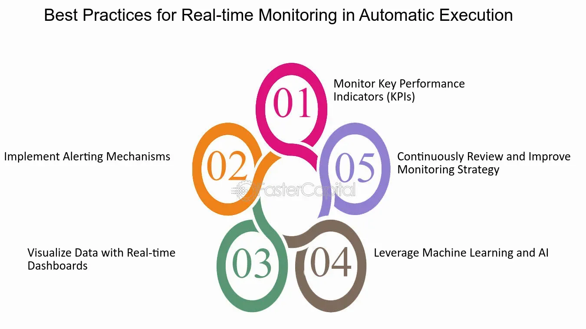

## Table of Contents

## What is real-time execution monitoring?

Real-time execution monitoring is when you watch and check how a computer program or system is working while it's running. It's like keeping an eye on a machine to make sure it's doing its job correctly and on time. This helps to catch any problems or mistakes quickly, so you can fix them before they cause bigger issues.

By using real-time execution monitoring, people can see if a program is running slowly, using too much memory, or not working as expected. This kind of monitoring is very useful in places where things need to happen without delay, like in hospitals or air traffic control. It helps to keep everything running smoothly and safely.

## Why is real-time execution monitoring important?

Real-time execution monitoring is important because it helps people see what a computer program or system is doing while it's running. This means they can spot any problems or mistakes right away. If something goes wrong, they can fix it quickly before it causes bigger issues. This is really helpful in places where things need to happen without delay, like in hospitals or air traffic control. It makes sure that everything keeps working smoothly and safely.

Another reason why real-time execution monitoring is important is that it helps to keep programs running efficiently. By watching the program as it works, people can see if it's running slowly or using too much memory. They can then make changes to improve how the program works. This is good for businesses because it can save time and money. It also makes the experience better for people using the program, as it runs faster and more reliably.

## What are the basic components of a real-time execution monitoring system?

A real-time execution monitoring system has several important parts that work together to keep an eye on a program or system while it's running. One key part is the data collection module. This part gathers information about how the program is working, like how fast it's running, how much memory it's using, and if there are any errors. This information is collected in real-time, which means it's happening right now, as the program is running.

Another important part is the analysis module. This part looks at the information collected by the data collection module and figures out if anything is going wrong. It can spot problems like the program running too slowly or using too much memory. If it finds a problem, it can send out an alert to let people know something needs to be fixed. The analysis module helps to make sure the program keeps working correctly and efficiently.

The last main part is the visualization and reporting module. This part takes the information and analysis and turns it into easy-to-understand pictures and reports. These visuals help people see what's happening with the program at a glance. They can use these reports to make decisions about how to improve the program or fix any issues. Together, these three parts make up a complete real-time execution monitoring system that helps keep programs running smoothly and safely.

## How does real-time execution monitoring differ from traditional monitoring?

Real-time execution monitoring and traditional monitoring both keep an eye on how a program or system is working, but they do it in different ways. Real-time monitoring watches the program as it's running, right now. It collects and looks at information about the program's speed, memory use, and errors as they happen. This means people can see problems and fix them quickly, before they cause bigger issues. Traditional monitoring, on the other hand, usually checks the program after it has been running for a while. It might look at logs or data that's been saved, but it doesn't watch the program in the moment.

Because real-time monitoring happens as the program runs, it's really important in places where things need to happen without delay, like hospitals or air traffic control. It helps to keep everything running smoothly and safely by catching problems early. Traditional monitoring is good for looking at how a program has been working over time, and it can help with planning and making long-term improvements. But it might not catch problems as quickly as real-time monitoring, which can be a big deal in situations where every second counts.

## What industries benefit most from real-time execution monitoring?

Real-time execution monitoring is really important in the healthcare industry. In hospitals, doctors and nurses need to know right away if a medical machine or computer system is not working correctly. If something goes wrong with a machine that's helping a patient, real-time monitoring can catch the problem quickly. This means doctors can fix it before it hurts the patient. It's all about keeping people safe and making sure the care they get is the best it can be.

The transportation industry also benefits a lot from real-time execution monitoring. For example, in air traffic control, planes need to take off and land on time, and controllers need to know if their systems are working properly every second. If there's a problem, real-time monitoring can alert them right away, so they can keep planes safe. It's the same with trains and buses, where delays can cause big problems for lots of people. Real-time monitoring helps keep everything running smoothly and on schedule.

In the financial industry, real-time execution monitoring is crucial too. Banks and stock markets use lots of computer systems to handle money and trades. If these systems slow down or make a mistake, it could cost a lot of money. Real-time monitoring helps catch these issues quickly, so they can be fixed before they cause big financial problems. This keeps the financial world running smoothly and helps protect people's money.

## What are the common tools used for real-time execution monitoring?

There are several common tools used for real-time execution monitoring. One popular tool is Prometheus, which is an open-source monitoring and alerting system. It collects metrics from different parts of a program or system and lets you see them in real-time. Another tool is Grafana, which works well with Prometheus. Grafana helps you make graphs and dashboards so you can see the data in a way that's easy to understand. These tools are often used together to keep an eye on how a program is running.

Another tool that's widely used is the Elastic Stack, also known as ELK Stack. This includes Elasticsearch for storing and searching data, Logstash for collecting and processing logs, and Kibana for visualizing the data. The Elastic Stack is good at handling lots of data and showing it in real-time, which makes it useful for monitoring big systems. For simpler needs, tools like Nagios or Zabbix can also be used. They check if a program is working correctly and send alerts if something goes wrong.

These tools all help people see what's happening with their programs as they run. They collect data, analyze it, and show it in a way that's easy to understand. This helps people catch problems quickly and keep their systems running smoothly. Whether it's a big company or a small project, these tools can make a big difference in how well a program works.

## How can real-time execution monitoring be implemented in a software development environment?

To implement real-time execution monitoring in a software development environment, you start by choosing the right tools. Tools like Prometheus and Grafana are popular because they work well together. Prometheus collects data from your software while it's running, and Grafana turns that data into easy-to-read graphs and dashboards. You set up these tools to watch things like how fast your software is running, how much memory it's using, and if there are any errors. Once everything is set up, the tools will keep an eye on your software all the time, letting you know if something goes wrong right away.

After setting up the tools, you need to make sure they are working correctly. This means testing them to see if they catch problems as they happen. You might create some test cases where you make the software run slowly or use too much memory on purpose, just to see if the monitoring tools notice. If they do, you know they're working right. It's also important to keep an eye on the alerts the tools send. If you get too many alerts, you might need to adjust the settings so you only get alerts for the most important problems. This way, real-time execution monitoring helps you keep your software running smoothly and fix issues quickly.

## What are the challenges faced when implementing real-time execution monitoring?

Implementing real-time execution monitoring can be tricky because it needs a lot of resources. You need powerful computers to collect and look at data as it happens. If your system isn't strong enough, it might slow down or not work properly. Also, setting up the tools can be hard. You have to make sure they are watching the right things and sending the right alerts. If you don't set them up correctly, you might miss important problems or get too many alerts that aren't helpful.

Another challenge is dealing with a lot of data. Real-time monitoring means you're always collecting information, and that can add up quickly. You need a good way to store and manage all this data so you can look at it later. Plus, you need to make sure the data is accurate. If the data is wrong, you might fix things that aren't broken or miss real problems. It's also important to keep the monitoring system up to date. As your software changes, you need to change the monitoring too, which can take time and effort.

## How does real-time execution monitoring help in optimizing system performance?

Real-time execution monitoring helps in optimizing system performance by letting you see how a program is working while it's running. It collects data on things like how fast the program is, how much memory it's using, and if there are any errors. By watching this data, you can spot problems like the program running slowly or using too much memory. Once you know about these problems, you can fix them right away. This makes the program run better and faster, which is good for everyone using it.

Another way real-time execution monitoring helps is by giving you information to make smart decisions. When you can see exactly what's happening with the program, you can figure out the best ways to make it work better. For example, if you see that a part of the program is using a lot of memory, you might decide to change that part to use less. Or if the program is running slowly at certain times, you can find out why and fix it. This kind of monitoring helps keep the program running smoothly and efficiently, which saves time and money.

## What advanced techniques can be used to enhance real-time execution monitoring?

One advanced technique to make real-time execution monitoring better is using [machine learning](/wiki/machine-learning). Machine learning can look at a lot of data and find patterns that people might miss. It can learn what normal behavior for a program looks like and then spot when something unusual happens. This means it can catch problems even faster and more accurately than regular monitoring. For example, if a program starts acting differently because of a new kind of error, machine learning can notice this change and alert you right away.

Another technique is using distributed tracing. This means following a request as it goes through different parts of a system. It helps you see exactly where things are slowing down or going wrong. With distributed tracing, you can see the whole path a request takes, from start to finish. This makes it easier to find and fix problems in big, complex systems. It's like having a map that shows you where the traffic jams are, so you can fix the road and keep everything moving smoothly.

## How can real-time execution monitoring be integrated with other monitoring and management systems?

Real-time execution monitoring can be connected with other monitoring and management systems to make everything work better together. For example, you can link real-time monitoring tools like Prometheus with a system that keeps track of logs, like the ELK Stack. This way, you can see both real-time data and past logs in one place. It helps you understand what's happening now and what happened before, so you can find and fix problems faster. You can also connect real-time monitoring with systems that manage how resources are used, like Kubernetes. This lets you see if a program is using too much memory or CPU and adjust things to keep everything running smoothly.

Another way to integrate real-time execution monitoring is by using APIs (Application Programming Interfaces). APIs let different systems talk to each other easily. For example, you can set up your real-time monitoring system to send alerts to a management system like ServiceNow. This way, when the monitoring system finds a problem, it can automatically create a ticket in ServiceNow for someone to fix it. This makes the whole process of finding and fixing problems quicker and more efficient. By connecting real-time monitoring with other systems, you can get a complete picture of how your programs are working and manage them better.

## What are the future trends in real-time execution monitoring technology?

In the future, real-time execution monitoring is going to get even smarter thanks to things like [artificial intelligence](/wiki/ai-artificial-intelligence) (AI) and machine learning. These technologies will help monitoring systems learn what normal behavior looks like for a program. If something unusual happens, the system can spot it right away and even guess what might be causing the problem. This means people can fix issues faster and keep programs running smoothly. Also, as more devices connect to the internet, like in the Internet of Things (IoT), real-time monitoring will need to handle even more data. It will become important to monitor not just one program but many devices and systems all working together.

Another trend we'll see is real-time monitoring becoming easier to use. Right now, setting up these systems can be hard and take a lot of time. But in the future, tools will become simpler and more user-friendly. This means more people will be able to use real-time monitoring without needing to be experts. Also, monitoring systems will start working more closely with other systems, like those that manage resources or handle logs. This will give a complete picture of how everything is working, making it easier to keep things running well and fix problems quickly.

## References & Further Reading

[1]: Narang, R. K. (2013). ["Inside the Black Box: A Simple Guide to Quantitative and High-Frequency Trading"](https://onlinelibrary.wiley.com/doi/book/10.1002/9781118662717) (2nd ed.). Wiley.

[2]: Aldridge, I. (2013). ["High-Frequency Trading: A Practical Guide to Algorithmic Strategies and Trading Systems"](https://www.ahmetbeyefendi.com/wp-content/uploads/2020/07/High-Frequency-Trading-Irene-Aldridge.pdf) (2nd ed.). Wiley.

[3]: Hasbrouck, J. (2007). ["Empirical Market Microstructure: The Institutions, Economics, and Econometrics of Securities Trading"](https://academic.oup.com/book/52241). Oxford University Press.

[4]: Kissell, R. (2013). ["The Science of Algorithmic Trading and Portfolio Management"](https://www.sciencedirect.com/book/9780124016897/the-science-of-algorithmic-trading-and-portfolio-management). Academic Press.

[5]: Diewert, W. E., & Nakamura, A. O. (2005). "[Volatility Deferred Execution Costs and Execution Strategies in Real and Simulated Foreign Exchange Markets](https://www.semanticscholar.org/paper/Accounting-for-Housing-in-a-CPI-Diewert-Nakamura/1163288c9f32b1182e74c2eb94512abef5d54440)." Review of Quantitative Finance and Accounting.