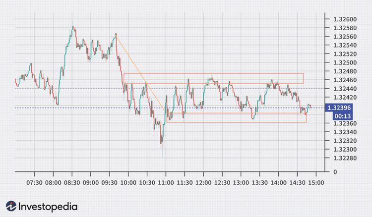

In today's fast-paced financial environment, real-time trading, particularly in the forex market, has emerged as a crucial strategy for investors aiming for quick returns. Forex, or foreign exchange trading, involves the simultaneous buying and selling of currency pairs, and real-time trading in this market operates within incredibly short timeframes. This rapid execution is made possible through sophisticated trading platforms that provide instantaneous access to market data and trading capabilities, allowing traders to capitalize on even the smallest fluctuations in currency values.

The integration of algorithmic trading strategies into these forex platforms has fundamentally transformed the trading landscape. Algorithmic trading involves using computer algorithms to execute trades automatically based on pre-set criteria, facilitating a higher volume of trades than would be possible manually. These strategies can analyze large datasets, identify trading patterns, and execute transactions faster than any human trader could.



The combination of real-time and algorithmic trading strategies is particularly powerful in forex, where the market operates 24 hours a day, five days a week, making speed and efficiency paramount. By leveraging these advanced techniques, traders can potentially enhance their trading performance and achieve more consistent results.

This article aims to guide traders in understanding the intricacies of real-time forex trading, currency exchange, and the role of algorithmic trading. By providing a comprehensive overview, we hope to equip readers with the knowledge to leverage these strategies effectively for increased financial success. Ultimately, readers will gain an appreciation for the complexity and potential profitability that real-time and algorithmic trading in forex can offer.

## Table of Contents

## Understanding Real-Time Forex Trading

Real-time forex trading is characterized by the rapid execution of transactions involving currency pairs within highly compressed time frames. This trading approach necessitates the use of sophisticated platforms capable of providing traders with immediate access to market data and the ability to execute trades almost instantaneously. The technological foundation of these platforms typically includes features such as low latency data feeds, high-speed internet connectivity, and advanced analytics tools to process market information swiftly.

The essence of real-time forex trading lies in its emphasis on speed and precision. Traders who engage in real-time trading generally operate within the framework of day trading, where all positions are opened and closed within the same trading day. This practice is aimed at maximizing profit opportunities as market prices fluctuate throughout the day. However, the fast-paced nature of this trading style requires traders to make quick decisions and react promptly to market signals, which emphasizes the importance of both skill and reliable technology.

One of the primary advantages of real-time [forex](/wiki/forex-system) trading is its potential for high profitability. Traders can capitalize on minor price movements in the market, executing numerous trades in a single day to accumulate gains. The profit in real-time trading can be expressed with the basic formula:
$$
\text{Profit} = \sum(\text{Sell Price} - \text{Buy Price}) \times \text{Volume}
$$

Despite its potential rewards, real-time forex trading also bears significant risks. The need for rapid decision-making can lead to errors and emotional trading, especially in volatile markets. Moreover, the leverage often used in forex trading can amplify both profits and losses, posing a risk of substantial financial loss. Traders must be acutely aware of these risks and employ stringent risk management strategies.

In summary, real-time forex trading offers a high-octane environment where technology is leveraged to make swift transactions, presenting both opportunities and challenges. Successful real-time traders must combine technical proficiency with effective risk management to navigate the complexities of this trading arena competently.

## Currency Exchange in Forex Trading

Forex trading stands as the pinnacle of financial markets, boasting a daily trading [volume](/wiki/volume-trading-strategy) that surpasses many other markets combined. At its core, forex trading involves the exchange of currencies, where participants aim to profit from the fluctuations in currency pair values. This market operates over-the-counter (OTC) with no centralized exchange, facilitating trades across the globe 24 hours a day.

Currency exchange in forex is driven by the dynamic nature of currency pair movements. A currency pair involves two currencies: a base currency and a quote currency. For example, in the EUR/USD pair, EUR is the base currency, and USD is the quote. The quote signifies how much of the quote currency is needed to purchase one unit of the base currency. Traders engage in buying or selling these pairs based on their anticipation of price movements.

Several factors influence these currency movements, prominently including economic indicators, geopolitical events, and market sentiment. Economic indicators such as Gross Domestic Product (GDP) figures, employment rates, and inflation data provide insights into the economic health of a country and can cause significant market reactions. For instance, a higher-than-expected GDP growth rate could strengthen a country’s currency as it signals economic expansion.

Geopolitical events, such as elections, policy changes, or conflicts, also sway currency values. Traders keenly observe these events as they can lead to market [volatility](/wiki/volatility-trading-strategies). For instance, a country facing political instability may see its currency depreciate due to a loss of investor confidence.

Market sentiment, the overall attitude of traders towards a particular market or currency, can also play a pivotal role. Sentiment might be influenced by a range of factors, including media reports and prevalent economic theories. Traders use tools like the Commitment of Traders (COT) report to gauge sentiment and align their strategies accordingly.

For traders to be successful, staying informed about these factors is crucial. This involves continuously monitoring news, economic releases, and global events, often using a combination of fundamental and technical analysis. Fundamental analysis focuses on evaluating economic indicators and news events, while technical analysis involves studying historical price movements and patterns to forecast future trends.

In conclusion, the currency exchange is the backbone of forex trading, requiring traders to be well-versed in the factors influencing currency values. Understanding these elements helps in making informed trading decisions to capitalize on market opportunities. With trillions of dollars traded each day, the forex market offers vast potential, but it also necessitates a comprehensive understanding of the interplay between various economic and geopolitical factors.

 to Algorithmic Trading

Algorithmic trading employs the use of computer-based algorithms to automate the process of trading securities based on pre-established rules. These algorithms rely on a series of mathematical and statistical models to analyze vast datasets and execute trades at speeds and frequencies beyond human capability. This technological advancement enables traders to capitalize on small price changes with high volumes, a process often referred to as high-frequency trading ([HFT](/wiki/high-frequency-trading-strategies)).

At its core, [algorithmic trading](/wiki/algorithmic-trading) functions by encoding specific trading strategies into algorithms that monitor and respond to varying market conditions. For instance, a straightforward algorithm might be structured to buy a stock when its 50-day moving average exceeds its 200-day moving average—a common technical indicator strategy. The Python implementation of such a strategy could look like this:

```python
def moving_average(prices, window_size):
    return sum(prices[-window_size:]) / window_size

def trade_strategy(prices, short_window, long_window):
    short_ma = moving_average(prices, short_window)
    long_ma = moving_average(prices, long_window)
    if short_ma > long_ma:
        return "Buy"
    elif short_ma < long_ma:
        return "Sell"
    else:
        return "Hold"
```

A significant advantage of algorithmic trading is its ability to eliminate human emotions, such as fear and greed, from the trading process, which can often lead to inconsistent trading decisions. By adhering strictly to predefined criteria, these systems promote disciplined trading, potentially leading to more stable performance over time.

Despite these benefits, developing an effective algorithmic trading strategy is inherently complex. It necessitates an in-depth understanding of financial markets, including the factors that drive price movements and risk management principles. Additionally, programmers must possess proficiency in coding languages such as Python, R, or C++, and familiarity with analytical tools to create and refine algorithms.

Another complexity involves the necessity for continuous algorithm adjustments in response to evolving market conditions. Markets are fluid, and strategies that are successful in one environment may fail in another. Therefore, traders must regularly backtest their algorithms using historical data to validate their effectiveness and make necessary strategy refinements.

Finally, while algorithmic trading offers the potential for increased efficiency and profitability, it is not devoid of risks. Technical failures, such as software bugs or connectivity issues, can result in significant financial losses. To mitigate these risks, robust risk management protocols and infrastructure reliability checks should be integral components of any algorithmic trading system. As technology and markets continue to evolve, adeptness in combining algorithmic logic with real-time data analysis will remain a crucial skill for traders aiming to thrive in this competitive landscape.

## Benefits and Challenges of Algo Trading

Algorithmic trading, often referred to as algo trading, offers several significant advantages within the forex market. One of the primary benefits is its ability to process complex data sets and execute trades with remarkable precision at high speeds. By leveraging powerful computational capabilities, algorithms can rapidly analyze market trends, historical data, and real-time quotes, enabling traders to make informed decisions with accuracy that surpasses human capabilities. 

Professionals engaged in algo trading can backtest their strategies using historical data, allowing them to assess potential success before deploying their strategies in live market conditions. This provides valuable insights into the strategy's viability and risk factors, helping traders make adjustments to enhance performance. Successful [backtesting](/wiki/backtesting) involves applying the strategy to past data to forecast how it would have performed, thus minimizing risks and optimizing returns.

However, algo trading comes with its own set of challenges. The initial development and deployment of algorithmic strategies often involve substantial costs and require advanced technical expertise. Creating reliable and efficient algorithms necessitates a deep understanding of both financial markets and programming. Furthermore, these systems depend heavily on high-speed internet connections to ensure timely data access and trade execution. Any latencies or technical issues could adversely impact trading performance, leading to potential financial losses.

Traders must also remain vigilant of inherent market risks not always anticipated by algorithms. For instance, rapid market shifts or unforeseen geopolitical events might lead to volatile price movements, challenging for pre-set algorithms to handle effectively. Such scenarios can result in incorrect trading signals, necessitating the incorporation of robust risk management protocols within the algorithmic architecture.

In conclusion, while algorithmic trading provides an array of benefits, including precision, speed, and analytical capabilities, it demands careful consideration of development costs, technical dependencies, and market risks. The ability to anticipate potential issues and align trading strategies accordingly can determine the success and sustainability of algorithmic trading in the competitive forex market.

## Combining Real-Time and Algo Trading in Forex

Algorithmic trading enhances the capabilities of real-time trading in the forex market by allowing the execution of high-frequency, automated transactions. This synergy between real-time data and algorithmic strategies is critical for traders aiming to capitalize on fleeting market opportunities. Algorithmic systems are adept at processing large volumes of data in milliseconds, which facilitates prompt decision-making and execution of trades in real-time. This high-speed interaction with the market is advantageous in capturing favorable price movements instantly.

Traders utilize real-time data streams to develop and refine algorithms capable of acting upon conditions set by market fluctuations. For instance, an algorithm might be programmed to place a buy order when a specific currency pair reaches a particular threshold, integrating both technical indicators and market sentiment analysis. The mathematical models driving these algorithms are designed to execute trades based purely on data-driven insights, minimizing human bias and reducing reaction times to market changes. 

This combination supports the creation of scalable trading strategies capable of handling high levels of market volatility inherent in forex trading. By adjusting position sizes, entry and [exit](/wiki/exit-strategy) points, and risk management parameters algorithmically, traders can dynamically adapt to the market's rhythm. Additionally, the scalability of such strategies allows for operations across multiple currency pairs simultaneously, optimizing the capital allocation based on real-time analysis.

To maintain effectiveness, continuous monitoring and adjustment of algorithmic strategies are vital. Market conditions often change unpredictably, necessitating regular updates to trading algorithms. This can include recalibrating parameters, incorporating new data sources, or refining [machine learning](/wiki/machine-learning) models. Python is frequently used for such tasks, given its robust libraries for data analysis and machine learning. Below is a simple example of a Python code snippet that uses a moving average crossover strategy to signal potential trades:

```python
import pandas as pd

# Load data
data = pd.read_csv('forex_data.csv')
data['Short_MA'] = data['Close'].rolling(window=20).mean()
data['Long_MA'] = data['Close'].rolling(window=50).mean()

# Identify signals
data['Signal'] = 0
data['Signal'][20:] = np.where(data['Short_MA'][20:] > data['Long_MA'][20:], 1, 0)
data['Position'] = data['Signal'].diff()

# Display trade signals
print(data[['Close', 'Short_MA', 'Long_MA', 'Position']].dropna())
```

This approach ensures that traders remain aligned with the evolving forex market landscape, pairing the computational efficiency of algorithms with the immediacy of real-time data feeds to enhance overall trading performance. By integrating these practices, traders are better equipped to respond to market shifts swiftly, maximizing their potential for profitable trades in the dynamic forex market.

## Conclusion

Real-time and algorithmic trading are pivotal to the future of forex markets, blending enhanced speed and efficiency to create a competitive edge. By leveraging sophisticated trading algorithms, traders can process vast amounts of market data instantly and execute trades with precision that far exceeds manual capabilities. However, successful implementation of these strategies requires the right tools and a comprehensive understanding of both market dynamics and technological frameworks.

For traders aiming to harness these advanced methods, the importance of meticulous planning and robust risk management cannot be overstressed. Real-time trading, characterized by the rapid execution of trades, needs a dynamic approach to risk due to its inherent volatility. Meanwhile, algorithmic trading, which automates decision-making processes, can mitigate human error but must be designed to anticipate and react to unpredictable market shifts.

As technological advancements continue to permeate financial markets, the combination of real-time and algorithmic trading is poised to offer unparalleled advantages. Traders who adeptly integrate these practices into their strategies can better adapt to market fluctuations, optimize their trading performance, and potentially achieve greater financial success in the forex market. The key lies in the continuous adaptation and optimization of algorithms to align with evolving market conditions, ensuring that the strategies remain relevant and effective.

## References & Further Reading

[1]: Bergstra, J., Bardenet, R., Bengio, Y., & Kégl, B. (2011). ["Algorithms for Hyper-Parameter Optimization."](https://dl.acm.org/doi/10.5555/2986459.2986743) Advances in Neural Information Processing Systems 24.

[2]: ["Advances in Financial Machine Learning"](https://www.amazon.com/Advances-Financial-Machine-Learning-Marcos/dp/1119482089) by Marcos Lopez de Prado

[3]: ["Evidence-Based Technical Analysis: Applying the Scientific Method and Statistical Inference to Trading Signals"](https://www.amazon.com/Evidence-Based-Technical-Analysis-Scientific-Statistical/dp/0470008741) by David Aronson

[4]: ["Machine Learning for Algorithmic Trading"](https://github.com/stefan-jansen/machine-learning-for-trading) by Stefan Jansen

[5]: ["Quantitative Trading: How to Build Your Own Algorithmic Trading Business"](https://github.com/LucindaYa/quant-resources/blob/master/Quantitative%20Trading%20How%20to%20Build%20Your%20Own%20Algorithmic%20Trading%20Business.pdf) by Ernest P. Chan