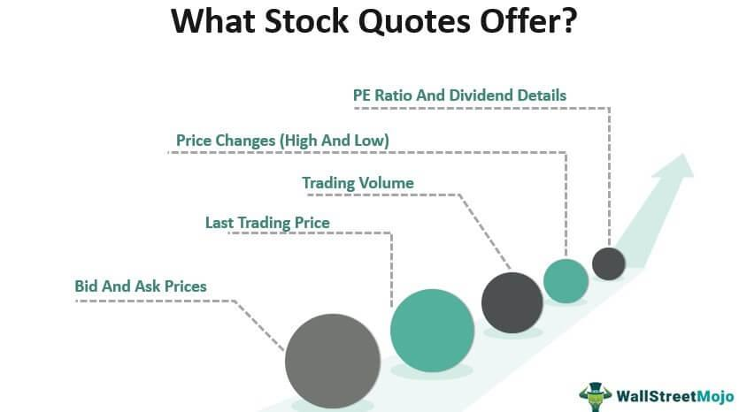

The digital transformation has drastically reshaped the financial markets, providing traders with unparalleled access to market data and advanced trading tools. Modern trading is deeply intertwined with financial data, real-time stock market quotes, and algorithmic trading, which collectively redefine how market engagement occurs. 

Financial data is at the core of informed trading, allowing investors to analyze company performance and economic indicators to predict future market trends. Real-time stock market quotes offer immediate price and volume information for securities, empowering traders to make swift decisions in response to volatile market conditions. Algorithmic trading (algo trading) employs sophisticated algorithms to execute trades based on pre-programmed criteria, significantly speeding up the execution process and minimizing human error.

The interaction of these elements enables traders to make smarter and faster decisions, responding almost instantaneously to market changes. Real-time data informs algorithmic trading systems, allowing them to adjust strategies on the fly. This synergy enhances market efficiency and liquidity, providing traders with new opportunities and challenges.

Navigating the fast-paced environment of modern financial markets requires a comprehensive understanding of these tools. This article aims to explore how real-time quotes and algorithmic trading impact trading strategies, offering insights into effectively maximizing market engagement today. Through examining their roles, investors can better position themselves to succeed in the ever-evolving digital landscape.

## Table of Contents

## Understanding Financial Data in the Stock Market

Financial data is a fundamental component of the stock market, essential for analyzing the financial performance of companies and broader economic indicators. This data encompasses a range of information, from earnings reports to key performance indicators (KPIs), enabling investors to assess the health of a particular company or the economic environment as a whole. Investors use this knowledge to make informed decisions, tailoring their strategies based on insights derived from these data points.

There are two primary forms of financial data: historical and real-time. Historical data, often delayed, provides insights into past performance and trends. By analyzing historical data, investors can identify patterns and make predictions about future market movements. Real-time quotes, on the other hand, offer current price and volume information for securities, allowing investors to respond promptly to market changes. For example, stock prices might be represented using real-time data, enabling traders to capitalize on short-term price fluctuations.

Incorporating financial data analysis into an investment strategy can aid in predicting market trends and company performance, enhancing decision-making capabilities. Such analysis often involves statistical methods and technical indicators, such as moving averages or relative strength index (RSI), which help detect trends and overbought or oversold conditions in the market.

Online platforms and brokerage services serve as vital channels for accessing financial data. These services range from free options providing basic data to premium offerings with comprehensive datasets and advanced analytical tools. Platforms like Bloomberg, Reuters, and Yahoo Finance are popular among investors seeking timely and accurate financial information. Furthermore, many brokerage firms offer proprietary trading platforms with integrated analytical tools, although access to detailed and real-time datasets might come at additional costs.

In summary, understanding and utilizing financial data is crucial for participants in the stock market. Through the insightful interpretation of this data, investors can make strategic choices that align with their financial goals. This reliance on financial data underscores its importance in elucidating market dynamics and guiding investment decisions.

## The Role of Real-Time Quotes

Real-time quotes serve as a pivotal resource for investors aiming to make timely and informed investment decisions, particularly in markets characterized by high [volatility](/wiki/volatility-trading-strategies). These quotes provide precise information regarding the current price and [volume](/wiki/volume-trading-strategy) of a security, which is indispensable for traders who need to understand and respond to immediate market sentiment.

For day traders, real-time data is particularly essential. These traders depend on the fluctuations that occur throughout the trading day to make profits. Having access to the most current prices enables them to capitalize on small price movements, thus requiring immediate data to make split-second trading decisions. Analyzing real-time data allows traders to execute trades swiftly, adjusting their strategies on-the-fly to line up with the prevailing market conditions, which can be the difference between profit and loss.

Historically, access to real-time quotes was primarily a privilege reserved for professional traders who operated within the trading floors of major financial institutions. Retail investors were frequently restricted to delayed quotes, typically with a lag of 15 minutes or more, hindering their ability to respond promptly to market shifts. However, technological advancements and the democratization of financial markets have increasingly made real-time quotes accessible to individual investors. This shift has empowered retail investors, enabling them to trade with a level of insight and precision that was once only available to professionals.

Despite this broadened access, it is important to recognize that not all real-time data is equal. Many trading platforms offer basic real-time quotes for free, allowing investors to monitor prices without cost. However, platforms often charge for premium data services, which may include enhanced features such as in-depth market analysis, advanced charting tools, and access to less liquid securities' quotes. These value-added data services cater to traders who require more comprehensive data to support their complex trading strategies and ensure they have a competitive edge.

In conclusion, real-time quotes have revolutionized trading by providing traders with immediate market insights necessary for making informed decisions. While basic access has become more widespread, understanding the different tiers of data availability and their potential impact on trading performance remains essential for any investor navigating today's fast-paced financial landscape.

## Algorithmic Trading: An Overview

Algorithmic trading utilizes sophisticated technology to execute trades based on pre-set instructions, capitalizing on speed and data processing capabilities unattainable by manual trading methods. This modern approach to trading applies algorithms—essentially complex mathematical models and rules—to automatically execute trading strategies. The effectiveness of [algorithmic trading](/wiki/algorithmic-trading) lies in its ability to rapidly analyze large volumes of market data, identify patterns or opportunities, and execute trades efficiently without human intervention.

One of the most notable subsets of algorithmic trading is High-Frequency Trading ([HFT](/wiki/high-frequency-trading-strategies)). HFT strategies focus on executing a large number of trades at extremely high speeds, often holding positions for very short durations—ranging from milliseconds to seconds. This type of trading relies on powerful computing systems that can swiftly process incoming market data and execute trades within microseconds. The primary goal is to capitalize on even the smallest price discrepancies that are imperceptible in traditional trading scenarios.

Algorithmic trading also plays a crucial role in minimizing emotional biases that often affect human traders. Emotions like fear or greed can lead to suboptimal trading decisions, potentially impacting performance negatively. By using pre-programmed trading strategies, algorithms ensure that trading decisions follow a systematic and unbiased approach, increasing consistency and potentially enhancing returns.

Institutional investors and hedge funds are particularly keen to incorporate algorithmic trading into their operations. These organizations typically have significant resources to develop and maintain sophisticated trading systems. Algorithmic strategies can vary from simple moving averages to more complex [machine learning](/wiki/machine-learning) models that predict trends and prices, enhancing the overall efficiency and precision of their trading activities.

In summary, algorithmic trading provides a framework that not only speeds up trading processes but also improves the accuracy and efficiency of execution. This integration of technology into trading seeks to optimize returns and manage risk more effectively in a fast-paced financial market environment.

## The Synergy Between Real-Time Data and Algorithmic Trading

The integration of real-time data and algorithmic trading forms a compelling combination that empowers traders with enhanced capabilities to navigate complex financial markets. Algorithms, at their core, are sets of rules or instructions designed to [carry](/wiki/carry-trading) out specific tasks, such as analyzing data or executing trades. The success of algorithmic trading largely hinges on the quality and timeliness of the data it processes.

Real-time data is crucial for these trading algorithms as it provides the most current information about market conditions, including price movements, trading volumes, and news events. This data enables algorithms to make informed decisions quickly, which is essential in capturing short-lived market opportunities, especially given the dynamic nature of financial markets.

The integration of real-time data with algorithms enables traders to exploit market inefficiencies almost instantaneously. For instance, consider a scenario where an algorithm monitors the stock market for [arbitrage](/wiki/arbitrage) opportunities. It could spot a slight price discrepancy between exchanges and execute trades to lock in a profit before the market corrects the disparity. The capability to act on such opportunities is dictated by the availability of up-to-the-second data, without which the algorithm might not be competitive.

Moreover, automated systems leveraging real-time data can adjust trading strategies on-the-fly, which is particularly beneficial during volatile market conditions. For example, an algorithm programmed to follow a [momentum](/wiki/momentum) strategy might increase its trading frequency when volatility rises, capturing more significant price swings. This adaptability to incoming data streams is pivotal for maintaining a competitive edge and maximizing returns.

The synergy between real-time data and algorithmic trading also contributes to enhanced market [liquidity](/wiki/liquidity-risk-premium). As numerous algorithms simultaneously execute trades based on real-time data, they provide a steady stream of buy and sell orders, thus narrowing bid-ask spreads and facilitating smoother transactions. Consequently, traders benefit from improved market conditions, with faster trade execution and reduced transaction costs.

In summary, the symbiotic relationship between real-time data and algorithmic trading enhances the efficiency and responsiveness of trading systems. This integration not only empowers traders to seize immediate market opportunities but also fosters an environment of liquidity and stability in financial markets.

## Challenges and Considerations

Real-time data and algorithmic trading have become integral components of the contemporary financial ecosystem. However, their implementation is not without challenges. One primary concern is the cost and complexity of building and maintaining the necessary technological infrastructure. The processing of real-time data feeds demands high-performance computing systems capable of handling vast data quantities swiftly and reliably. These systems often require substantial investment, not only in hardware but also in software development and ongoing maintenance.

Beyond infrastructure demands, regulatory considerations significantly impact algorithmic trading, particularly high-frequency trading (HFT). Regulatory bodies, like the Securities and Exchange Commission (SEC) in the United States and the European Securities and Markets Authority (ESMA) in Europe, establish stringent guidelines to ensure market fairness and stability. These regulations include requirements for transparency, fair access, and mechanisms to halt trading during abnormal market fluctuations. Compliance with these regulations necessitates continuous monitoring and adjustment of trading algorithms, posing additional operational challenges for traders.

The risk of systemic failures also looms large. Algorithms, although efficient, can malfunction or respond unexpectedly to unforeseen market conditions. For example, on May 6, 2010, the Dow Jones Industrial Average experienced a "flash crash," plummeting nearly 1,000 points within minutes before recovering most losses. Investigations revealed that algorithmic trading played a significant role in this event, magnifying market volatility rather than stabilizing it. Such incidents highlight the potential for algorithmic systems to exacerbate market downturns inadvertently, underscoring the need for rigorous testing and risk assessment protocols.

To navigate these challenges, traders must focus on understanding and managing the complexities associated with real-time data and algorithmic trading. Investing in robust infrastructure and complying with evolving regulations are fundamental. Additionally, developing contingency plans to mitigate the risk of systemic failures is crucial. Implementing thorough testing strategies, including [backtesting](/wiki/backtesting) algorithms against historical data and simulating various market scenarios, can help identify potential weaknesses and enhance system resilience. 

Ultimately, while real-time data and algorithmic trading offer significant potential for optimizing trading strategies, a comprehensive grasp of their challenges is essential for leveraging these tools effectively. Knowledge, preparation, and adaptability will remain paramount in utilizing these advanced trading technologies.

## Conclusion

Financial data, real-time quotes, and algorithmic trading are indispensable components in today's financial markets. Their integration offers traders potent tools to enhance their trading efficiency and gain critical insights into market dynamics. By combining these elements, traders can access and analyze vast datasets in real-time, enabling swift and informed decision-making.

To succeed in leveraging these tools, traders must possess a thorough understanding of not only the functionalities but also the intricacies and challenges they present. This knowledge facilitates the development of strategies that optimize trading outcomes while mitigating risks associated with rapid market shifts or technological failures. As technology continues to advance, staying abreast of the latest developments in financial data analytics, trading algorithms, and real-time market information becomes essential for maintaining a competitive advantage.

Investment in education and infrastructure is crucial for traders aiming for long-term success. Continuous learning about emerging technologies and market strategies will empower traders to adapt and thrive in an environment characterized by constant change and high-speed trading transactions. Robust technological infrastructure, capable of handling the demands of real-time data processing and algorithmic execution, will provide the necessary support for executing complex trading strategies effectively.

In summary, the symbiotic relationship between financial data, real-time market information, and algorithmic trading represents a powerful force driving modern trading operations. By embracing these elements and addressing their inherent challenges, traders can position themselves for sustained success in the ever-evolving landscape of financial markets.

## References & Further Reading

[1]: ["Advances in Financial Machine Learning"](https://www.amazon.com/Advances-Financial-Machine-Learning-Marcos/dp/1119482089) by Marcos Lopez de Prado

[2]: ["Evidence-Based Technical Analysis: Applying the Scientific Method and Statistical Inference to Trading Signals"](https://www.amazon.com/Evidence-Based-Technical-Analysis-Scientific-Statistical/dp/0470008741) by David Aronson

[3]: ["Machine Learning for Algorithmic Trading"](https://github.com/stefan-jansen/machine-learning-for-trading) by Stefan Jansen

[4]: ["Quantitative Trading: How to Build Your Own Algorithmic Trading Business"](https://www.amazon.com/Quantitative-Trading-Build-Algorithmic-Business/dp/1119800064) by Ernest P. Chan

[5]: Bergstra, J., Bardenet, R., Bengio, Y., & Kégl, B. (2011). ["Algorithms for Hyper-Parameter Optimization."](https://dl.acm.org/doi/10.5555/2986459.2986743) Advances in Neural Information Processing Systems 24.