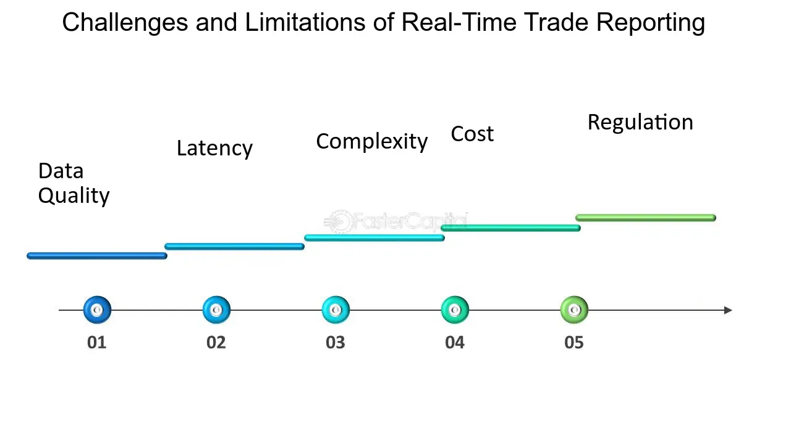

## Table of Contents

## What is real-time trade reporting?

Real-time trade reporting is when trades in financial markets are reported as soon as they happen. This means that people can see the buying and selling of stocks, bonds, or other financial products almost instantly. It helps everyone in the market know what is happening right away, which can be very important for making quick decisions.

This kind of reporting is really helpful for traders and investors because it gives them up-to-date information. Without real-time reporting, they might have to wait, and the market could change before they know it. So, real-time trade reporting makes the market more open and fair for everyone involved.

## Why is real-time trade reporting important in financial markets?

Real-time trade reporting is super important in financial markets because it keeps everyone in the loop. When trades are reported right away, everyone can see what's happening with stocks, bonds, and other financial stuff as it happens. This means that if someone wants to buy or sell something, they can make their move based on the latest information. Without real-time reporting, people might miss out on important changes in the market, which could lead to bad decisions or lost opportunities.

Also, real-time trade reporting helps make the market fair for everyone. When all the trades are out in the open and easy to see, it's harder for anyone to cheat or take advantage of others. This openness builds trust among traders and investors, which is really important for a healthy market. So, by showing trades as they happen, real-time reporting helps keep the market honest and working well for everyone involved.

## How does real-time trade reporting differ from traditional trade reporting?

Real-time trade reporting shows trades as soon as they happen, while traditional trade reporting waits until the end of the day or even longer to share this information. Imagine you're playing a fast game and you need to know what's happening right away to make good moves. Real-time reporting is like that, giving you the latest information instantly. Traditional reporting is more like getting a report card at the end of the school year; it tells you what happened, but it's too late to do anything about it.

Because real-time reporting gives you information right away, it helps traders and investors make quick decisions. If someone wants to buy or sell something, they can see what's happening in the market at that exact moment and act fast. Traditional reporting, on the other hand, might leave people waiting and missing out on chances to make good trades. So, real-time reporting is like having a superpower in the fast-paced world of financial markets, while traditional reporting is more like reading yesterday's news.

## What are the key components of a real-time trade reporting system?

A real-time trade reporting system needs a few important parts to work well. First, it needs a strong data collection system that grabs trade information the moment a trade happens. This system has to be super fast and accurate, making sure it doesn't miss any trades. Then, there's a data processing part that takes this information and gets it ready to be shared. It has to be quick and able to handle lots of information at once, turning raw trade data into something useful that everyone can understand.

Next, the system needs a way to send out this information in real-time. That means it uses a good communication network to make sure the trade data gets to everyone who needs it as fast as possible. This part is super important because if the information is delayed, it's not really real-time anymore. Finally, the system needs to be safe and reliable. It should protect the trade data from being messed with or stolen, and it should keep working even if something goes wrong. All these parts together make sure that real-time trade reporting can keep up with the fast-moving world of financial markets.

## What technologies are commonly used to facilitate real-time trade reporting?

Real-time trade reporting relies on a bunch of cool technologies to make sure trades are shown as soon as they happen. One big technology is high-speed data networks. These networks help send trade information super fast from where the trade happens to where it needs to go. Another important technology is data processing software. This software takes the raw trade data and turns it into something that's easy to understand and share with everyone. It has to be really quick and able to handle a lot of information at once.

Then there are databases that store all the trade information. These databases need to be fast and able to keep up with the constant flow of new trades. They also need to be safe so no one can mess with the data. Another technology that helps is application programming interfaces (APIs). APIs let different computer systems talk to each other, so the trade data can be shared easily with all the people who need it. All these technologies work together to make sure real-time trade reporting is fast, accurate, and reliable.

## How do regulatory requirements influence real-time trade reporting?

Regulatory requirements are like rules that make sure real-time trade reporting works the way it should. These rules say that trades need to be reported quickly and accurately so everyone in the market can trust the information. For example, regulators might say that a trade has to be reported within a few seconds of happening. This helps keep the market fair and open because everyone can see what's going on right away. If companies don't follow these rules, they might get in trouble, so it's really important for them to make sure their real-time reporting systems are up to date and working well.

These rules also make companies use certain technologies and follow specific steps to report trades. For instance, regulators might require that the systems used for real-time reporting are safe and can't be hacked. They might also say that the data needs to be stored in a certain way so it can be checked later if needed. By setting these standards, regulators help make sure that real-time trade reporting is not only fast but also reliable and secure. This helps everyone in the market feel confident that the information they're seeing is correct and that the market is being watched to make sure it's fair for everyone.

## What are the challenges faced in implementing real-time trade reporting?

Implementing real-time trade reporting can be tough because it needs to be super fast and accurate. Imagine trying to catch every single trade as it happens and then sharing that information with everyone right away. It's like trying to keep up with a really fast game where you can't miss a single move. The technology has to be top-notch, with high-speed networks and powerful computers that can handle a lot of information at once. If any part of the system slows down or makes a mistake, the whole thing can fall apart, and people might not get the latest information they need to make good decisions.

Another challenge is making sure the system is safe and follows all the rules. There are a lot of rules that say how fast trades need to be reported and how the information should be kept safe. If the system doesn't follow these rules, the company could get in big trouble. Plus, hackers might try to mess with the trade data, so the system has to be really secure. It's like trying to build a super fast car that's also super safe and follows all the traffic laws. It's not easy, but it's really important to get it right so everyone in the market can trust the information they're seeing.

## How can real-time trade reporting improve market transparency?

Real-time trade reporting helps make the market more transparent by showing trades as soon as they happen. This means that everyone can see what's going on in the market right away. When people know what's happening, they can trust that the market is fair and open. If someone wants to buy or sell something, they can make their decision based on the latest information, not old news. This openness helps stop people from cheating or hiding what they're doing, because everyone can see the trades.

Also, real-time reporting makes it easier for everyone to understand the market. When trades are reported quickly, it's like having a clear window into what's happening. This helps traders and investors feel more confident because they know they're working with the most up-to-date information. It also helps regulators keep an eye on the market to make sure everything is fair. So, real-time trade reporting is like turning on a bright light in a dark room, making everything clear and easy to see.

## What are the best practices for ensuring the accuracy of real-time trade data?

To make sure real-time trade data is accurate, it's really important to have good systems in place. First, you need strong data validation rules that check every piece of information as soon as a trade happens. These rules make sure that the data is correct and complete before it's shared with everyone. It's like having a smart guard who checks every trade to make sure it's right. Also, using high-quality data sources helps a lot. If the information coming in is good, then the information going out will be good too. It's important to keep these sources updated and reliable.

Another best practice is to have regular checks and balances. This means having people and systems that constantly look at the data to make sure it's accurate. If they find any mistakes, they can fix them quickly. It's also a good idea to have backup systems in case something goes wrong with the main system. This way, if there's a problem, the data can still be reported accurately and on time. By following these practices, you can make sure that real-time trade data is as accurate as possible, helping everyone in the market trust the information they're seeing.

## How do different financial markets implement real-time trade reporting mechanisms?

Different financial markets use real-time trade reporting in ways that fit their own needs and rules. In the stock market, for example, trades are usually reported through big exchanges like the New York Stock Exchange or NASDAQ. These exchanges have fast systems that catch every trade as it happens and share the information with everyone right away. They use special technology to make sure the data is accurate and secure. In the bond market, real-time reporting might work a bit differently. Since the bond market is often less centralized, different platforms and dealers might report their trades to a central system that then shares the information. This helps keep the bond market open and fair, even though it's spread out.

In the foreign exchange market, real-time trade reporting is important because it's a huge, global market where money is traded 24/7. Banks and big financial companies report their trades to systems that collect and share the data in real-time. This helps everyone see what's happening with currencies around the world. In the futures and options markets, exchanges like the Chicago Mercantile Exchange use real-time reporting to show trades as soon as they happen. This helps traders and investors make quick decisions based on the latest information. Each market has its own way of making sure real-time trade reporting works well, but the goal is always the same: to keep the market transparent and trustworthy for everyone involved.

## What future trends are expected in real-time trade reporting technologies?

In the future, real-time trade reporting technologies are expected to become even faster and more accurate. One big trend is the use of [artificial intelligence](/wiki/ai-artificial-intelligence) (AI) and [machine learning](/wiki/machine-learning). These technologies can help catch mistakes and make sure the trade data is correct before it's shared with everyone. They can also help predict what might happen in the market next, which can be really helpful for traders and investors. Another trend is the use of blockchain technology. Blockchain can make trade reporting more secure and transparent because it's really hard to change the data once it's recorded. This can help build even more trust in the market.

Another future trend is the use of more advanced data analytics. This means using big computers to look at a lot of trade data at once and find patterns that might be hard for people to see. This can help make better decisions and spot problems before they get big. Also, as more markets around the world start working together, real-time trade reporting will need to be able to handle information from different places and in different languages. This will make the global market more connected and easier to understand for everyone.

## How can real-time trade reporting be integrated with other financial systems for enhanced functionality?

Real-time trade reporting can be connected with other financial systems to make things work better. Imagine you have different pieces of a puzzle that need to fit together perfectly. By using special computer programs called APIs, real-time trade reporting can share information with systems like risk management tools and trading platforms. This means that as soon as a trade happens, the information can go to these other systems right away. For example, if a big trade happens, the risk management system can quickly check if it's safe, and the trading platform can update its prices to match what's happening in the market.

This connection makes everything smoother and faster. When real-time trade reporting works well with other systems, it helps everyone see the full picture of the market. Traders can make better decisions because they have all the latest information in one place. It also helps keep the market safe because any problems can be spotted and fixed quickly. By working together, these systems make the whole financial world more open, fair, and easy to understand.

## References & Further Reading

[1]: Anagnostopoulos, I. (2018). ["Machine Learning Applications in Financial Markets."](https://www.sciencedirect.com/science/article/pii/S2405844023107006) Springer.

[2]: Aldridge, I. (2013). ["High-Frequency Trading: A Practical Guide to Algorithmic Strategies and Trading Systems."](https://www.amazon.com/High-Frequency-Trading-Practical-Algorithmic-Strategies/dp/1118343506) Wiley.

[3]: Financial Industry Regulatory Authority (FINRA). ["Trade Reporting."](https://www.finra.org/filing-reporting/trace)

[4]: Securities and Exchange Commission (SEC). ["Fast Answers: Trade Reporting and Compliance."](https://www.sec.gov/resources-small-businesses/small-business-compliance-guides/insider-trading-arrangements-and-related-disclosures)

[5]: Hasbrouck, J., & Saar, G. (2013). ["Low-Latency Trading."](https://www.sciencedirect.com/science/article/abs/pii/S1386418113000165) The Review of Financial Studies, 26(9), 2585–2620.