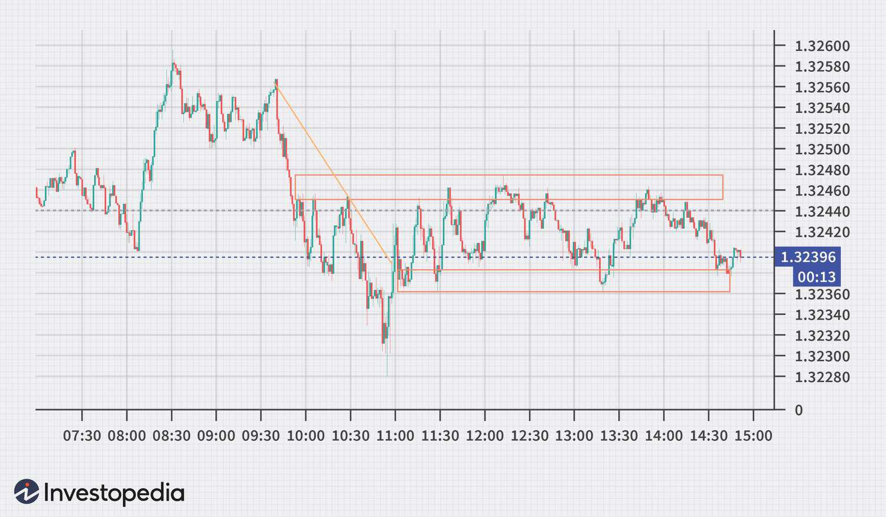

Financial markets serve as vital components of any economy, acting as platforms where individuals, institutions, and governments can trade financial securities, commodities, and other fungible items of value at determinable prices. These markets exist primarily to facilitate the raising of capital, the transfer of risk, price discovery, and the global movement of financial resources. With their complex structure encompassing various asset classes like stocks, bonds, commodities, and derivatives, financial markets influence both short-term and long-term economic activities.

Transparency in trade practices is paramount for the efficient functioning of financial markets. It enhances market integrity by ensuring that all participants have equal access to information, which is crucial for maintaining trust and preventing fraudulent activities. Transparency facilitates better decision-making by providing investors with comprehensive insights into market conditions, thus minimizing the risks associated with asymmetric information.



Algorithmic trading, a modern innovation within financial markets, refers to the use of computer algorithms to automate trading strategies that execute orders based on pre-defined criteria. This approach allows for faster and more efficient trading processes, reducing the manual intervention required in traditional trading methods. Real-time trade reporting, on the other hand, involves the immediate dissemination of trade details to market participants, regulators, and the public. It plays a fundamental role in keeping markets transparent by providing up-to-date information on the price, volume, and timing of trades.

The integration of algorithmic trading and real-time trade reporting is critical for modern financial markets. The synergy between these elements ensures that trades are executed efficiently and transparently, fostering a fair and competitive marketplace. Algorithmic trading relies heavily on real-time data to refine its strategies and manage risks effectively, while real-time reporting upholds the transparency standards vital for market stability. Together, they contribute to enhanced market efficiency, increased liquidity, and improved investor confidence, underscoring their significance in contemporary financial ecosystems.

## Table of Contents

## Understanding Financial Markets

Financial markets serve as platforms where buyers and sellers exchange financial securities, commodities, and other fungible assets at prices determined by supply and demand. These markets play a crucial role in the global economy by facilitating liquidity, price discovery, and risk management. Financial markets encompass a variety of instruments, including stocks, bonds, and commodities.

Stocks represent ownership in a corporation and are traded on stock exchanges such as the New York Stock Exchange (NYSE) or NASDAQ. They provide companies with an avenue to raise capital and investors with an opportunity to partake in corporate profits through dividends and capital gains.

Bonds are debt securities issued by corporations, municipalities, or governments to raise funds for various projects and operations. Investors who purchase bonds effectively lend money to the issuer in exchange for periodic interest payments and the return of the bond's face value at maturity.

Commodities such as oil, gold, and agricultural products are traded in commodity markets. They are typically traded via futures contracts, allowing traders to speculate on future price movements or hedge against price fluctuations.

Market transparency plays a vital role in ensuring the efficiency and integrity of financial markets. Transparency refers to the availability of accurate and timely information regarding market prices and trading activities. It fosters trust among market participants, which is essential for the smooth functioning of the market. When transparency is compromised, it can lead to inefficiencies such as mispriced assets and increased [volatility](/wiki/volatility-trading-strategies).

Fraud and opacity can significantly undermine market integrity. In the absence of transparency, dishonest practices such as insider trading, market manipulation, and fraudulent reporting may go undetected. These activities not only distort market prices but also erode investor confidence, potentially leading to reduced market participation and [liquidity](/wiki/liquidity-risk-premium).

To maintain transparency, regulatory bodies worldwide implement guidelines and rules that enforce disclosure and fair trading practices. Effective regulation enhances trust and participation, ensuring that market prices reflect true supply and demand conditions and thereby contributing to a stable financial system.

## The Role of Transparency in Trading

Trade transparency is a crucial aspect of maintaining efficiency and fairness in financial markets. It refers to the extent to which pertinent trading information is available and accessible to all market participants. This includes data on trade prices, volumes, and the identities of trading parties. Transparency facilitates informed decision-making, reduces information asymmetry, and builds trust among market participants, thereby promoting a more robust and efficient market structure.

Regulatory frameworks play a significant role in enforcing transparency within trade practices. One of the key regulations is real-time trade reporting, which requires transactions to be reported to the market promptly after execution. This ensures that all participants have access to the latest trading data, allowing them to make decisions based on current market conditions. Real-time reporting is particularly important for maintaining market equilibrium and preventing market manipulation, as it discourages unethical trading behavior by making trade information public almost instantaneously.

Organizations such as the Financial Industry Regulatory Authority (FINRA) and the Securities and Exchange Commission (SEC) are pivotal in ensuring transparency within financial markets. The SEC, a key regulatory body in the United States, enforces laws designed to protect investors, maintain orderly markets, and facilitate capital formation. It mandates disclosures that are vital for transparency, aiming to provide all investors with the same level of information.

FINRA, on the other hand, is a self-regulatory organization that works to safeguard market integrity. It administers rules governing the activities of broker-dealers, including transparency and disclosure requirements. One of its significant contributions to market transparency is the Trade Reporting and Compliance Engine (TRACE), which provides comprehensive real-time data on bond transactions in the over-the-counter (OTC) markets. TRACE enhances transparency by giving market participants insights into pricing and trade volumes, which are essential for evaluating market trends and making informed investment decisions.

Through the efforts of these regulatory bodies and the implementation of stringent reporting standards, financial markets can operate more efficiently, with reduced risk of fraud and manipulation. Such transparency measures are integral to enhancing the confidence of investors and other stakeholders, ultimately contributing to the stability and success of financial markets globally.

## Real-Time Trade Reporting: Enhancing Market Efficiency

Real-time trade reporting is a mechanism that involves the immediate recording and dissemination of trade details to ensure that financial transactions are transparent and accessible to market participants. This process is crucial for promoting market efficiency by providing timely and accurate information about trades, including price, [volume](/wiki/volume-trading-strategy), and timing. It serves to enhance market transparency by allowing investors to assess market conditions more accurately and make informed decisions.

The mechanisms of real-time trade reporting commonly involve automated systems and technologies that capture trade data and broadcast it effectively. The implementation of standardized protocols and infrastructures ensures consistent data flows and reduces the chances of data discrepancies. These systems are typically governed by regulatory frameworks that mandate the submission of trade reports within seconds of execution, thus minimizing information asymmetry between various market stakeholders.

One notable technology that facilitates real-time trade reporting is the Trade Reporting and Compliance Engine (TRACE). Operated by the Financial Industry Regulatory Authority (FINRA), TRACE provides a comprehensive platform for the reporting of over-the-counter (OTC) transactions in eligible fixed-income securities. Through TRACE, trade data is collected and aggregated, and then disseminated to the public and regulatory bodies, enabling enhanced market surveillance and transparency.

The benefits of real-time trade reporting extend beyond merely providing transparency. It plays a pivotal role in fostering accountability within financial markets. By ensuring that trade information is publicly available shortly after execution, market participants can verify trades and monitor trading activities more effectively. This level of transparency deters fraudulent activities and manipulative practices, thereby reinforcing the integrity of the market.

Real-time reporting also facilitates improved price discovery. When trade data is available in real time, it reflects the current market conditions, allowing prices to adjust more swiftly to new information. This leads to more accurate pricing of securities, which benefits both issuers and investors by ensuring a fairer market. Furthermore, real-time reporting supports market liquidity by enhancing the ability of investors to assess and respond to market trends quickly, thus facilitating smoother transactions and reducing the costs associated with trading.

Technological advancements such as TRACE have made real-time reporting feasible by employing robust data collection and dissemination networks. These systems are equipped with advanced software and hardware to handle vast amounts of data and execute complex transactions with minimal latency. Additionally, the use of algorithms and data analytics within these platforms enables market participants to gain insights from trade data, driving more strategic decision-making and optimizing trading strategies.

In summary, real-time trade reporting is a foundational element in modern financial markets that promotes transparency and accountability. Through technologies like TRACE, it enhances market efficiency by providing timely, accurate, and accessible trade information, which in turn supports fair pricing, increased liquidity, and robust market integrity.

## Algorithmic Trading: The New Frontier

Algorithmic trading refers to the use of computer algorithms to automate financial transactions. It employs mathematical models and complex statistical analysis to make trading decisions and execute orders in financial markets. Over the past few decades, [algorithmic trading](/wiki/algorithmic-trading) has evolved significantly, becoming a prominent component of modern financial markets.

The origins of algorithmic trading trace back to the 1970s when the New York Stock Exchange introduced the Designated Order Turnaround (DOT) system. This was an early electronic system for sending orders directly to the trading floor. The development of technology and the internet during the late 20th century further accelerated the adoption of algorithmic trading. Today, it accounts for a significant portion of trading activities across major stock exchanges around the world.

One of the primary benefits of algorithmic trading is its ability to process vast amounts of data quickly and execute orders at high speeds. This speed and efficiency minimize human error and allow traders to capitalize on market opportunities that would otherwise be missed with manual trading. Moreover, algorithmic trading enables the execution of sophisticated trading strategies which can include [arbitrage](/wiki/arbitrage), [market making](/wiki/market-making), and [trend following](/wiki/trend-following).

The integration of real-time data into algorithmic strategies is crucial for enhancing the accuracy and efficiency of these trading models. Real-time data feeds provide algorithmic systems with the most current market information, allowing them to respond instantaneously to market changes. This is particularly important given the volatile nature of financial markets where conditions can change in milliseconds. 

For instance, a basic algorithmic strategy might involve analyzing past price movements to identify trends. More advanced strategies could incorporate real-time data, such as [order book](/wiki/order-book-trading-strategies) information and transaction records, to make split-second decisions. In a Python implementation, an example could be using libraries such as `pandas` for data manipulation and `numpy` for numerical computations to handle data streams:

```python
import pandas as pd
import numpy as np

# Simulating real-time data ingestion
price_data = np.random.rand(100)  # Randomly generated data representing market prices
price_series = pd.Series(price_data, name='Price')

# Simple algorithmic strategy: Moving Average Crossover
short_window = 10
long_window = 30

signals = pd.DataFrame(index=price_series.index)
signals['signal'] = 0.0
signals['short_mavg'] = price_series.rolling(window=short_window, min_periods=1, center=False).mean()
signals['long_mavg'] = price_series.rolling(window=long_window, min_periods=1, center=False).mean()

# Create trading signals based on moving average crossover
signals['signal'][short_window:] = np.where(signals['short_mavg'][short_window:] > signals['long_mavg'][short_window:], 1.0, 0.0)
signals['positions'] = signals['signal'].diff()
```

This example demonstrates how real-time price data can be used in a moving average crossover strategy to generate buy and sell signals. By continuously updating with live data, the algorithm can dynamically adjust its position based on market conditions.

In conclusion, algorithmic trading represents a significant leap forward in trading efficiency and effectiveness. Its evolution and the integration of real-time data have transformed how financial markets operate, providing traders with sophisticated tools to navigate complex market environments.

## Integration of Real-Time Reporting in Algo Trading

Real-time trade reporting significantly influences algorithmic trading by providing immediate access to critical market data, thereby enabling more informed decision-making and enhanced strategy execution. Algorithmic trading relies heavily on data accuracy and speed; thus, the integration of real-time data becomes a crucial component in optimizing trading algorithms.

Real-time trade reporting ensures that market participants can access the latest transaction data, including price, volume, and order execution details. This information is vital for algorithmic systems that are designed to detect trading opportunities based on market conditions. For instance, the incorporation of real-time data allows algorithms to swiftly adjust their strategies in response to newly available information, helping traders to capitalize on short-lived opportunities and mitigate risks associated with market volatility.

One of the key advantages of utilizing real-time trade data in algorithmic trading is the enhancement of predictive modeling and risk management techniques. Algorithms can incorporate real-time data inputs to refine their predictive models, leading to more accurate forecasts of price movements. In risk management, real-time data allows for dynamic adjustment of positions and hedges, reducing the likelihood of exposure to adverse market conditions. For example, a trading algorithm can instantly reposition a portfolio in response to significant market events, such as sudden price fluctuations or changes in liquidity.

Several implementations of real-time trade reporting within algorithmic trading systems showcase its practical benefits. A prominent example is the Trade Reporting and Compliance Engine (TRACE) operated by the Financial Industry Regulatory Authority (FINRA) in the United States. TRACE provides comprehensive real-time data on bond transactions, aiding algorithmic traders in the fixed-income markets to evaluate trade execution quality and market liquidity. By integrating TRACE data, algorithms can improve execution strategies and offer more competitive pricing.

Moreover, advanced trading platforms now leverage real-time trade reporting to facilitate algorithmic strategy development. Python, a widely-used programming language in the financial sector, enables traders to develop algorithms that utilize APIs to access live market data feeds. The following Python code snippet demonstrates how real-time market data can be integrated into an algorithmic trading system using a popular library such as `pandas` for data analysis:

```python
import pandas as pd
import requests

# Access real-time market data via API
url = "https://api.exchange.com/market_data"
response = requests.get(url)
data = response.json()

# Load data into a DataFrame for analysis
df = pd.DataFrame(data)

# Example: Calculate moving average for a trading strategy
df['moving_average'] = df['price'].rolling(window=20).mean()

# Algorithmic decision-making based on real-time data
if df['price'].iloc[-1] > df['moving_average'].iloc[-1]:
    # Execute buy order
    print("Execute Buy Order")
else:
    # Execute sell order
    print("Execute Sell Order")
```

In this example, real-time price data is pulled from an exchange and processed to calculate a moving average, a common indicator in trading strategies. The algorithm then compares the current price to the moving average to decide whether to buy or sell.

To conclude, the integration of real-time trade reporting into algorithmic trading frameworks is indispensable for improving trading strategies and risk management. By leveraging timely data, traders can make more informed decisions, react promptly to market changes, and enhance the efficiency and effectiveness of their trading systems.

## Addressing Challenges and Ensuring Compliance

Implementing real-time trade reporting and achieving transparency in financial markets present several challenges. These challenges include technological constraints, data management issues, regulatory compliance, and the need for robust security measures. Addressing these challenges is crucial in ensuring that the benefits of transparency and real-time reporting are fully realized.

**Common Challenges**

One of the primary challenges in implementing real-time reporting is the technological infrastructure required to handle vast amounts of trading data swiftly and accurately. Financial markets generate substantial data every second, and processing this data in real-time necessitates advanced computing power and efficient algorithms. Latency issues can also arise, potentially causing delays that undermine the benefits of immediate reporting.

Data privacy and security are significant concerns. As real-time reporting involves the transmission of sensitive financial information, ensuring the integrity and confidentiality of this data is paramount. Cybersecurity threats pose a risk not only to the data but also to the overall trust in financial markets.

Moreover, data standardization is essential for consistency in reporting. Different markets and jurisdictions may have varying standards and practices, complicating the aggregation and analysis of data across different platforms. This inconsistency can lead to discrepancies that hinder market transparency.

**Regulatory Compliance**

Regulatory compliance is another key challenge. Regulatory bodies such as the Financial Industry Regulatory Authority (FINRA) and the Securities and Exchange Commission (SEC) enforce stringent rules to ensure market transparency and protect investors. Compliance with these regulations often requires significant effort and continuous adaptation to evolving rules. Non-compliance can result in penalties and damage to reputation.

Ensuring adherence to these regulations involves implementing robust compliance systems capable of monitoring trading activities and reporting requirements in real-time. Firms must continuously update these systems to keep pace with regulatory changes, which can be both costly and technically demanding.

**Solutions and Best Practices**

To overcome these challenges, financial institutions can adopt several best practices. Investing in modern technology infrastructure is essential. This includes utilizing cloud computing for scalable data processing and integrating advanced analytics tools to handle real-time data efficiently.

Implementing comprehensive data security measures is also vital. Encryption, two-[factor](/wiki/factor-investing) authentication, and regular security audits can help protect sensitive trade information from unauthorized access.

For regulatory compliance, firms should establish dedicated compliance teams to monitor changes in regulations and ensure that all reporting practices align with the latest rules. Automating compliance checks can further enhance efficiency and accuracy in adherence to regulations.

Collaboration is another key strategy. Financial institutions can work with regulatory bodies, industry associations, and technology providers to develop standardized reporting protocols that facilitate consistency across different markets.

In conclusion, while challenges in implementing real-time trade reporting and ensuring transparency are substantial, they are not insurmountable. With the right technological investments, security measures, regulatory compliance systems, and collaborative efforts, financial markets can enhance transparency and maintain integrity, ultimately fostering trust and efficiency.

## Future Trends and Innovations

The future of algorithmic trading and trade transparency is poised to undergo significant transformation driven by technological advancements and evolving regulatory landscapes. As the financial markets continue to become more intricate, integrating cutting-edge technologies such as Artificial Intelligence (AI) and Machine Learning (ML) is expected to significantly enhance the capabilities of trade reporting systems, making them more robust, efficient, and transparent.

AI and [machine learning](/wiki/machine-learning) have the potential to revolutionize the process of trade reporting by automating data collection, processing, and analysis tasks, thereby reducing the lag between trade execution and reporting. Machine learning algorithms can be employed to detect patterns and anomalies in vast sets of trade data, enabling real-time monitoring and fraud detection. This capability not only enhances transparency but also strengthens the overall integrity of financial markets. For instance, predictive analytics powered by AI can provide insights into market trends, helping traders make informed decisions. 

Python, a programming language widely used for data analysis, can be harnessed for such purposes. Consider the following example, which demonstrates how a simple machine learning model can be used to predict stock price movements based on historical data:

```python
import pandas as pd
from sklearn.model_selection import train_test_split
from sklearn.ensemble import RandomForestClassifier
from sklearn.metrics import accuracy_score

# Load historical stock price data
data = pd.read_csv('historical_stock_data.csv')

# Preprocess data
features = data.drop('PriceMovement', axis=1)
labels = data['PriceMovement']

# Split the data
X_train, X_test, y_train, y_test = train_test_split(features, labels, test_size=0.2, random_state=42)

# Train a random forest classifier
model = RandomForestClassifier(n_estimators=100, random_state=42)
model.fit(X_train, y_train)

# Predict and evaluate
predictions = model.predict(X_test)
accuracy = accuracy_score(y_test, predictions)

print(f"Model Accuracy: {accuracy:.2f}")
```

In parallel with technological advancements, the regulatory environment will also need to adapt to ensure continued transparency in increasingly complex trading ecosystems. Regulators such as the Securities and Exchange Commission (SEC) and the Financial Industry Regulatory Authority (FINRA) are likely to collaborate with technology experts to devise frameworks that address challenges posed by rapid technological changes. These frameworks would ensure that innovations do not compromise ethical standards and market fairness.

The future role of regulators will encompass developing augmented regulatory measures that account for the speed and volume of modern trading activities. Implementing real-time compliance checks and utilizing blockchain technology for immutable record-keeping are possible avenues. Additionally, regulators might foster cooperation across international frontiers to create a unified approach towards maintaining global market integrity.

To conclude, the integration of AI and machine learning with existing trade reporting practices promises significant enhancements in transparency and efficiency, while regulatory bodies will need to fortify their oversight practices to ensure these innovations operate within ethical and fair frameworks. These changes will contribute to a more transparent, efficient, and trustworthy financial marketplace.

## Conclusion

Trade transparency, real-time reporting, and algorithmic trading collectively serve as pivotal components in the landscape of modern financial markets. They each contribute significantly to enhancing market efficiency and safeguarding investor interests. 

Trade transparency is crucial for maintaining confidence among market participants, ensuring that all stakeholders have access to the information necessary to make informed decisions. This openness is essential for identifying and mitigating fraudulent activities and for preserving the integrity of the trading ecosystem. Real-time trade reporting complements transparency by providing immediate access to trade data. This facilitates quicker decision-making and promotes accountability among traders. Organizations like the Financial Industry Regulatory Authority (FINRA) and the Securities and Exchange Commission (SEC) play instrumental roles in enforcing regulations that uphold these standards, thereby fostering an environment of trust.

Algorithmic trading, which leverages mathematical models and algorithms to execute trades, has revolutionized market operations by increasing the speed and accuracy of trade executions. It integrates seamlessly with real-time data to construct strategies that respond instantly to market changes, thus optimizing trading opportunities and risk management. The symbiotic relationship between algorithmic trading and real-time reporting not only enhances liquidity but also stabilizes markets, reducing volatility through efficient information dissemination.

The continuous improvement and compliance with transparency and reporting standards are indispensable for nurturing trust within financial markets. As technology continues to evolve, there is a necessity for the adaptive development of strategies and practices that uphold these principles. Regulators, trading platforms, and market participants must work collectively to address emerging challenges and harness technological advancements. This collaborative effort ensures that markets remain resilient, efficient, and reliable, benefiting investors and the economy as a whole. In conclusion, trade transparency, real-time reporting, and algorithmic trading form the bedrock of a robust financial system, promoting efficiency, fairness, and trust among investors.

## References & Further Reading

[1]: Anagnostopoulos, I. (2018). ["Machine Learning Applications in Financial Markets."](https://www.sciencedirect.com/science/article/pii/S2405844023107006) Springer.

[2]: Aldridge, I. (2013). ["High-Frequency Trading: A Practical Guide to Algorithmic Strategies and Trading Systems."](https://www.amazon.com/High-Frequency-Trading-Practical-Algorithmic-Strategies/dp/1118343506) Wiley.

[3]: Financial Industry Regulatory Authority (FINRA). ["Trade Reporting."](https://www.finra.org/filing-reporting/trace)

[4]: Securities and Exchange Commission (SEC). ["Fast Answers: Trade Reporting and Compliance."](https://www.sec.gov/resources-small-businesses/small-business-compliance-guides/insider-trading-arrangements-and-related-disclosures)

[5]: Hasbrouck, J., & Saar, G. (2013). ["Low-Latency Trading."](https://www.sciencedirect.com/science/article/abs/pii/S1386418113000165) The Review of Financial Studies, 26(9), 2585–2620.