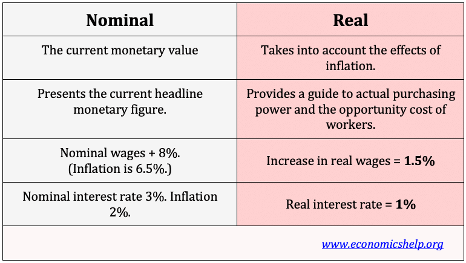

## Table of Contents

## What is the basic definition of nominal value?

Nominal value is a basic term that means the face value of something. It's the value that is stated or written on an item, like the price on a price tag or the amount printed on a coin or bill. For example, if a coin says it's worth one dollar, that one dollar is its nominal value.

This value doesn't always show the real or current worth of the item. For instance, the nominal value of money can be different from its actual buying power because of inflation or other economic changes. So, while nominal value gives us a starting point, it's important to understand that it might not reflect the true value in real-life situations.

## What is the basic definition of real value?

Real value is what something is actually worth, not just what it says on the label. It's about how much an item can buy or how useful it is in real life. For example, if you have a $100 bill, its real value is what you can actually get with that $100, which might be less if prices have gone up because of inflation.

This idea of real value helps us understand the true worth of money and goods over time. It takes into account things like inflation, which can make the same amount of money buy less in the future. So, while the nominal value of a $100 bill stays the same, its real value might go down if the cost of living increases.

## How do nominal and real values differ in economic terms?

In economics, nominal value and real value are two ways to look at the worth of money and goods. Nominal value is the face value or the number that is written on something, like the price tag on a product or the amount printed on a currency note. For example, if a shirt has a price tag of $50, that $50 is its nominal value. This value doesn't change over time just because it's written down, so it stays the same no matter what's happening in the economy.

Real value, on the other hand, is what something is actually worth in terms of what it can buy or how useful it is. It takes into account changes in the economy, like inflation, which can make money less valuable over time. For instance, if inflation goes up and the same $50 can now only buy a shirt that used to cost $40, the real value of that $50 has gone down even though its nominal value hasn't changed. Understanding the difference between nominal and real value helps us see the true purchasing power of money and goods in the real world.

## Why is it important to distinguish between nominal and real values?

It's important to tell the difference between nominal and real values because it helps us understand the true worth of money and goods. Nominal value is just the number on the price tag or the face of a bill, but it doesn't show how much that money can actually buy. For example, if you have a $100 bill, its nominal value stays the same, but if prices go up, that $100 won't buy as much as it used to. Knowing this helps people make better decisions about spending and saving.

Real value takes into account things like inflation, which can make money less valuable over time. If you only look at the nominal value, you might think you're doing well financially, but if the cost of living has gone up, you might be worse off than you realize. By understanding real value, we can see how our money's buying power changes and plan for the future more effectively. This is crucial for businesses, governments, and everyday people who want to manage their finances wisely.

## What are some common examples where nominal and real values are used?

One common example where nominal and real values are used is in wages and salaries. If your boss gives you a raise from $50,000 to $52,000 a year, that's the nominal increase in your salary. But if prices have gone up by 3% in the same year, your real salary might not have increased at all because you can't buy as much with that extra $2,000 as you could before. Understanding the difference helps you see if you're actually better off or not.

Another example is with interest rates on savings accounts or loans. If a bank says they're giving you a 2% interest rate on your savings, that's the nominal rate. But if inflation is at 3%, the real interest rate is actually negative because the money in your account is losing value over time. For loans, a nominal interest rate of 5% might seem low, but if inflation is high, the real cost of borrowing could be much less because the money you pay back will be worth less in the future. Knowing this helps you make smarter choices about saving and borrowing money.

## How can inflation affect the difference between nominal and real values?

Inflation can make a big difference between what something is worth on paper (nominal value) and what it's really worth (real value). Imagine you have $100. If there's no inflation, that $100 can buy the same amount of stuff next year as it does now. But if inflation goes up by 2%, next year that $100 will only buy as much as $98 does this year. So even though the number on the bill stays the same, its real value goes down because everything costs more.

This is important for things like salaries and savings. If your boss gives you a 3% raise but inflation is at 4%, your real salary actually goes down because you can't buy as much with that extra money. The same goes for savings. If you put money in a bank and it earns 1% interest, but inflation is at 2%, the real value of your savings is shrinking because the money is losing buying power faster than it's growing. Understanding how inflation changes the difference between nominal and real values helps you make better choices about money.

## What is the formula used to calculate real value from nominal value?

To calculate the real value from the nominal value, you need to take into account the effects of inflation. The formula to do this is: Real Value = Nominal Value / (1 + Inflation Rate). For example, if you have $100 and the inflation rate is 2%, you would calculate the real value like this: $100 / (1 + 0.02) = $100 / 1.02 = $98.04. This means that even though you have $100 on paper, its real value is only $98.04 because of inflation.

This formula helps you understand how much your money can actually buy after accounting for the rise in prices. It's useful for figuring out things like real wages, real interest rates, and the real value of savings. By using this formula, you can see if you're really getting ahead or if inflation is eating away at your money's worth.

## Can you provide a simple example of calculating real value from a given nominal value?

Let's say you have $100 and the inflation rate is 2%. To find out the real value of your $100, you use the formula: Real Value = Nominal Value / (1 + Inflation Rate). So, you take $100 and divide it by 1 plus the inflation rate, which is 1 plus 0.02. That comes out to $100 divided by 1.02, which equals $98.04. This means that even though you have $100 on paper, because of inflation, it's really only worth $98.04 in terms of what you can buy with it.

This simple example shows how inflation can make your money worth less over time. If you didn't know about this, you might think you have more money than you really do. Understanding the difference between nominal and real value helps you plan better, whether it's for saving, spending, or figuring out if a raise at work is really making you better off.

## How do changes in price levels impact the calculation of real value?

Changes in price levels, like when things get more expensive because of inflation, can make a big difference in the real value of money. If prices go up, the same amount of money can't buy as much stuff as before. For example, if you have $100 and the price of everything goes up by 2%, that $100 won't buy as much as it used to. To figure out the real value, you divide the nominal value of your money by 1 plus the inflation rate. So, if you do the math with a 2% inflation rate, your $100 is really only worth about $98.04 in terms of what you can buy.

Understanding how changes in price levels affect real value is important for making good choices about money. If you get a raise at work, but prices have gone up even more, you might not be better off even though your paycheck is bigger. The same goes for saving money. If you save $1,000 and the price of everything goes up by 3% in a year, the real value of your savings goes down to about $970.87. Knowing this helps you plan for the future and make sure you're not fooled by just looking at the numbers on your money.

## What are the limitations of using real value calculations in economic analysis?

Using real value calculations in economic analysis can be helpful, but it has some limitations. One big problem is that inflation rates can be hard to measure accurately. Different places might have different inflation rates, and even official numbers can be off because they're based on a basket of goods that might not match what everyone buys. So, when you use these inflation numbers to find the real value, you might not be getting a true picture of how much your money can buy.

Another limitation is that real value calculations don't always take into account other economic changes. For example, if new technology makes things cheaper or better, the real value of money might actually go up even if inflation is high. Also, real value doesn't show the full impact of taxes or changes in how much people earn. So, while real value gives you a better idea than just looking at nominal value, it's still just one part of understanding the economy.

## How do economists adjust nominal values to real values over different time periods?

Economists adjust nominal values to real values over different time periods by using something called a price index, like the Consumer Price Index (CPI). The CPI measures how much the prices of a bunch of common things people buy, like food and gas, have gone up or down. To find the real value, economists take the nominal value and divide it by the CPI for that time period. This helps them see how much the money is really worth compared to a base year, which is usually a year they pick to compare everything to.

For example, if you earned $50,000 in 2020 and want to know what that's worth in 2023 dollars, you'd use the CPI for both years. If the CPI went up by 6% from 2020 to 2023, you'd divide $50,000 by 1.06 to get the real value in 2023 dollars, which would be about $47,170. This shows that even though you made $50,000, it's really only worth $47,170 in today's money because prices have gone up. By doing this, economists can compare money and prices from different years in a fair way, helping everyone understand how the economy is changing over time.

## What advanced techniques or models are used to forecast future real values based on current nominal data?

Economists use different advanced techniques to guess what the real value of money and goods will be in the future. One common method is using something called econometric models. These models look at past data to find patterns and then use those patterns to make guesses about the future. For example, they might look at how inflation, interest rates, and other economic stuff have changed over time and then use that info to predict what the real value of money will be next year. These models can be pretty complicated and need a lot of math and computer power, but they help economists make better guesses about the future.

Another technique is using something called time series analysis. This method looks at how a single thing, like the price of a product, changes over time. By studying these changes, economists can spot trends and seasonal patterns that help them predict future real values. For example, if the price of a certain food goes up every summer, they might guess it will happen again next summer. Time series analysis can be used with other data, like inflation rates, to make even better predictions. Both of these methods help economists and businesses plan for the future by giving them a better idea of what money and goods will be worth down the road.

## What is the Real Value: Adjusting for Inflation?

Real value, as a concept, plays a crucial role in financial analysis by adjusting nominal value to account for inflation, thereby offering a more accurate measurement of an asset's purchasing power over time. This adjustment is critical because inflation erodes the value of money, meaning that a dollar today does not have the same purchasing power as a dollar in the future. By adjusting for inflation, real value provides a clearer and more meaningful assessment of financial performance and economic conditions.

To compute real value, the nominal value is adjusted using an inflation index, such as the Consumer Price Index (CPI). The formula to calculate real value is given by:

$$
\text{Real Value} = \frac{\text{Nominal Value}}{\text{Price Index}} \times 100
$$

where the Price Index is often normalized to a base year to facilitate meaningful comparisons over time.

One of the primary advantages of using real values is that it allows for the comparison of economic growth, investments, and incomes across different periods without the distortions introduced by inflation. This is particularly important for analyzing long-term financial trends where inflation can significantly skew nominal measurements. 

For example, if an investor wants to assess the growth of an investment portfolio over a decade, simply looking at the nominal returns may suggest robust growth. However, by evaluating the real returns, the investor can determine whether the portfolio has genuinely outpaced inflation, thereby gaining insights into true wealth accumulation.

In summary, by adjusting nominal values for inflation, real values offer a valuable tool for investors and economists to assess true financial performance and make more informed decisions based on purchasing power and economic growth.

## How do you calculate the differences between nominal and real values?

To calculate the difference between nominal and real values, it is essential to adjust for inflation, which reflects the change in purchasing power over time. The formula commonly used to obtain a real value from a nominal value involves using the Consumer Price Index (CPI) or any relevant price index that indicates how prices have changed.

The formula is as follows:

$$
\text{Real Value} = \frac{\text{Nominal Value}}{(1 + \text{Inflation Rate})^n}
$$

Where:
- **Nominal Value** is the face value without inflation adjustments.
- **Inflation Rate** is the annual rate at which the general level of prices for goods and services is rising.
- **n** is the number of years over which inflation is considered.

By reorganizing the formula to find the change (i.e., the difference) when comparing a nominal value to a real one adjusted for inflation, we examine the inflation-adjusted value removal:

$$
\text{Difference} = \text{Nominal Value} - \text{Real Value}
$$

This calculation is fundamental in finance as it helps in distinguishing between earnings that are merely a result of inflation and those that demonstrate genuine growth or returns on investment. Understanding this distinction allows investors to make informed decisions by evaluating the real performance of their assets rather than being misled by nominal increases. This differentiation is essential in assessing the true value and yield of investments over time, providing investors with insights into the actual economic data and meaningful investment returns. 

### Example Calculation in Python

To automate this process, consider the following Python snippet, which calculates the real value given nominal values and the inflation rate:

```python
def calculate_real_value(nominal_value, inflation_rate, years):
    real_value = nominal_value / ((1 + inflation_rate) ** years)
    difference = nominal_value - real_value
    return real_value, difference

# Example usage
nominal_value = 1000
inflation_rate = 0.03  # 3% annual inflation
years = 5

real_value, difference = calculate_real_value(nominal_value, inflation_rate, years)
print(f"Real Value: {real_value}, Difference: {difference}")
```

This script provides both the real value and the difference between nominal and real values, facilitating a clearer understanding of how inflation affects investment valuations over time.

## How can the example be applied in stock valuation?

In stock valuation, understanding the distinction between nominal and real values aids investors in assessing the true worth of their investments. Consider a scenario where a stock has a nominal value of $1 per share at the time of issuance. This nominal value does not change due to inflation. However, over time, inflation erodes the purchasing power of the dollar, which affects the real value of the stock.

Let's say several years later, due to a combination of economic growth and inflationary pressures, the market price of this stock rises to $4. At first glance, this appears to be a significant increase in value. To accurately assess the stock's performance, it's essential to calculate its real value, taking into account the inflation rate over the period.

Suppose the cumulative inflation rate over this period is 50%. To find the real value of the stock, one can use the formula:

$$
\text{Real Value} = \frac{\text{Nominal Value}}{1 + \text{Inflation Rate}}
$$

Applying this to our example:

$$
\text{Real Value} = \frac{4}{1 + 0.50} = \frac{4}{1.5} \approx 2.67
$$

Here, the real value of the stock, adjusted for a 50% inflation rate, is approximately $2.67. This calculation reveals that the purchasing power of the stock has increased, but not as substantially as the nominal price change might suggest.

For investors, understanding these dynamics is crucial. It ensures a comprehensive assessment of investment performance beyond nominal gains. Such considerations are particularly important in making informed purchase or sale decisions and in evaluating the impact of economic forces on stock prices.

## References & Further Reading

[1]: ["Consumer Price Index (CPI): Definition, Calculation, and Its Role in Inflation."](https://www.investopedia.com/terms/c/consumerpriceindex.asp) - Investopedia.

[2]: ["The Basics of Nominal vs. Real Interest Rates"](https://www.thebalancemoney.com/nominal-vs-real-interest-rates-5214217) - Investopedia.

[3]: Graham, B. & Dodd, D. (1934). ["Security Analysis"](https://books.google.com/books/about/Security_Analysis_The_Classic_1934_Editi.html?id=wXlrnZ1uqK0C). McGraw-Hill Education.

[4]: ["Algorithmic and High-Frequency Trading"](https://www.cambridge.org/us/universitypress/subjects/mathematics/mathematical-finance/algorithmic-and-high-frequency-trading) by Álvaro Cartea, Sebastian Jaimungal, and José Penalva.

[5]: ["Modern Portfolio Theory and Investment Analysis"](https://books.google.com/books/about/Modern_Portfolio_Theory_and_Investment_A.html?id=181CEAAAQBAJ) by Edwin J. Elton, Martin J. Gruber, Stephen J. Brown, William N. Goetzmann.