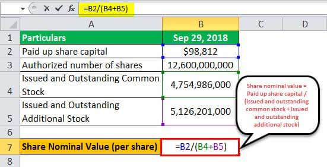

In today's financial landscape, understanding the difference between nominal and real values is crucial, particularly for professionals engaged in algorithmic trading. These values serve as fundamental components in the analysis of financial instruments and their market performances. Nominal value, the unadjusted measure of an asset or financial instrument, often represents the initial or face value that does not account for inflationary effects. Conversely, real value is adjusted for inflation, providing a more accurate representation of an asset's or investment's purchasing power over time.

In the context of algorithmic trading, distinguishing between these values is essential. Trading strategies depend on precise data inputs, and ignoring inflation can lead to erroneous assessments of market conditions and returns. By incorporating real values into their analyses, traders can better understand true economic trends and make informed decisions that reflect actual market dynamics.



This article will explore the concepts of nominal and real values, their methods of calculation, and their implications in algorithmic trading. By the end, you will gain a comprehensive understanding of how these critical financial metrics impact trading strategies and investment decisions, providing a solid foundation for optimizing approaches in dynamic financial markets.

## Table of Contents

## Nominal Value: A Fundamental Concept

Nominal value, also known as face value, is a foundational concept in finance that represents the unadjusted value of a financial instrument. It is the stated value of a security at issuance, providing a baseline figure that is not influenced by market factors or inflationary changes. For instance, in bonds, the nominal value is the amount paid back to the bondholder at maturity, distinct from the market value, which can fluctuate based on interest rates and other economic conditions. 

When applied to stocks, nominal value takes on a different context. It is frequently referred to as the par or face value and is recorded in the company's balance sheet as the legal capital of the company. For stocks, this value often bears little relation to the market price or intrinsic value and is primarily used for accounting purposes. For example, if a company issues shares with a nominal value of $1, this does not necessarily reflect what investors are willing to pay for the stock in the open market, where factors such as company performance and investor sentiment come into play.

In summary, nominal value provides a starting point for valuing financial instruments, offering a stable reference that contrasts with the fluctuating real values influenced by external economic conditions. It is essential in understanding the basic structure of financial instruments, allowing investors and analysts to differentiate between face value and market-driven valuations.

## Real Value: Adjusting for Inflation

Real value, as a concept, plays a crucial role in financial analysis by adjusting nominal value to account for inflation, thereby offering a more accurate measurement of an asset's purchasing power over time. This adjustment is critical because inflation erodes the value of money, meaning that a dollar today does not have the same purchasing power as a dollar in the future. By adjusting for inflation, real value provides a clearer and more meaningful assessment of financial performance and economic conditions.

To compute real value, the nominal value is adjusted using an inflation index, such as the Consumer Price Index (CPI). The formula to calculate real value is given by:

$$
\text{Real Value} = \frac{\text{Nominal Value}}{\text{Price Index}} \times 100
$$

where the Price Index is often normalized to a base year to facilitate meaningful comparisons over time.

One of the primary advantages of using real values is that it allows for the comparison of economic growth, investments, and incomes across different periods without the distortions introduced by inflation. This is particularly important for analyzing long-term financial trends where inflation can significantly skew nominal measurements. 

For example, if an investor wants to assess the growth of an investment portfolio over a decade, simply looking at the nominal returns may suggest robust growth. However, by evaluating the real returns, the investor can determine whether the portfolio has genuinely outpaced inflation, thereby gaining insights into true wealth accumulation.

In summary, by adjusting nominal values for inflation, real values offer a valuable tool for investors and economists to assess true financial performance and make more informed decisions based on purchasing power and economic growth.

## Calculating Differences Between Nominal and Real Values

To calculate the difference between nominal and real values, it is essential to adjust for inflation, which reflects the change in purchasing power over time. The formula commonly used to obtain a real value from a nominal value involves using the Consumer Price Index (CPI) or any relevant price index that indicates how prices have changed.

The formula is as follows:

$$
\text{Real Value} = \frac{\text{Nominal Value}}{(1 + \text{Inflation Rate})^n}
$$

Where:
- **Nominal Value** is the face value without inflation adjustments.
- **Inflation Rate** is the annual rate at which the general level of prices for goods and services is rising.
- **n** is the number of years over which inflation is considered.

By reorganizing the formula to find the change (i.e., the difference) when comparing a nominal value to a real one adjusted for inflation, we examine the inflation-adjusted value removal:

$$
\text{Difference} = \text{Nominal Value} - \text{Real Value}
$$

This calculation is fundamental in finance as it helps in distinguishing between earnings that are merely a result of inflation and those that demonstrate genuine growth or returns on investment. Understanding this distinction allows investors to make informed decisions by evaluating the real performance of their assets rather than being misled by nominal increases. This differentiation is essential in assessing the true value and yield of investments over time, providing investors with insights into the actual economic data and meaningful investment returns. 

### Example Calculation in Python

To automate this process, consider the following Python snippet, which calculates the real value given nominal values and the inflation rate:

```python
def calculate_real_value(nominal_value, inflation_rate, years):
    real_value = nominal_value / ((1 + inflation_rate) ** years)
    difference = nominal_value - real_value
    return real_value, difference

# Example usage
nominal_value = 1000
inflation_rate = 0.03  # 3% annual inflation
years = 5

real_value, difference = calculate_real_value(nominal_value, inflation_rate, years)
print(f"Real Value: {real_value}, Difference: {difference}")
```

This script provides both the real value and the difference between nominal and real values, facilitating a clearer understanding of how inflation affects investment valuations over time.

## Example: Application in Stock Valuation

In stock valuation, understanding the distinction between nominal and real values aids investors in assessing the true worth of their investments. Consider a scenario where a stock has a nominal value of $1 per share at the time of issuance. This nominal value does not change due to inflation. However, over time, inflation erodes the purchasing power of the dollar, which affects the real value of the stock.

Let's say several years later, due to a combination of economic growth and inflationary pressures, the market price of this stock rises to $4. At first glance, this appears to be a significant increase in value. To accurately assess the stock's performance, it's essential to calculate its real value, taking into account the inflation rate over the period.

Suppose the cumulative inflation rate over this period is 50%. To find the real value of the stock, one can use the formula:

$$
\text{Real Value} = \frac{\text{Nominal Value}}{1 + \text{Inflation Rate}}
$$

Applying this to our example:

$$
\text{Real Value} = \frac{4}{1 + 0.50} = \frac{4}{1.5} \approx 2.67
$$

Here, the real value of the stock, adjusted for a 50% inflation rate, is approximately $2.67. This calculation reveals that the purchasing power of the stock has increased, but not as substantially as the nominal price change might suggest.

For investors, understanding these dynamics is crucial. It ensures a comprehensive assessment of investment performance beyond nominal gains. Such considerations are particularly important in making informed purchase or sale decisions and in evaluating the impact of economic forces on stock prices.

## Role of Nominal and Real Values in Algorithmic Trading

Algorithmic trading heavily depends on accurate data to execute strategies successfully, which makes the distinction between nominal and real values critical. Nominal values represent the surface-level data without considering inflation, while real values adjust for inflation, offering a true sense of the economic standing or return. This distinction is vital for traders who seek to develop strategies that perform well under various economic conditions.

In [algorithmic trading](/wiki/algorithmic-trading), [backtesting](/wiki/backtesting) is a method where strategies are applied to historical data to predict their effectiveness in future markets. Using nominal prices for such assessments can lead to misleading results, as it may not account for the true purchasing power changes over time due to inflation. On the other hand, real values offer inflation-adjusted returns, providing a clearer and more accurate picture of an investment's potential performance. Traders rely on historical real values to backtest their algorithms, ensuring their strategies are likely to yield the intended outcomes in actual market conditions.

Consider the formula for the real return ($r_{\text{real}}$) given the nominal return ($r_{\text{nominal}}$) and inflation rate ($i$):
$$
r_{\text{real}} = \frac{1 + r_{\text{nominal}}}{1 + i} - 1
$$

By calculating the real return, traders can accurately assess the investment's profitability adjusted for inflation. Utilizing real values instead of nominal ones helps in recognizing the true economic growth forces outside inflation, leading to more informed trading decisions.

For instance, a Python script to compute real values for trading backtests might look like this:

```python
def calculate_real_return(nominal_return, inflation_rate):
    return ((1 + nominal_return) / (1 + inflation_rate)) - 1

nominal_return = 0.08  # 8% nominal return
inflation_rate = 0.03  # 3% inflation

real_return = calculate_real_return(nominal_return, inflation_rate)
print(f"The real return is {real_return:.2%}")
```

Recognizing the impact of inflation and the utility of real values aids in crafting strategies that are more suited to withstand diverse economic environments. These insights help traders in optimizing their algorithms, making them robust against variables like inflation, ensuring they can make sound decisions based on genuine economic movements, not just nominal price changes. This approach not only enhances the precision of trading strategies but also aligns them with realistic predictions of market behavior, ultimately leading to more efficient and profitable outcomes.

## Implications for Algorithmic Trading Strategies

Incorporating real values into algorithmic trading strategies offers traders a more accurate representation of market conditions, which can lead to enhanced decision-making and performance outcomes. By adjusting nominal values for inflation, traders can assess the true value of assets, ensuring that their models account for the genuine purchasing power and economic health indicators. This adjustment is crucial for avoiding the overestimation of returns or misjudgment of financial performance.

A central aspect of using real values is risk assessment. Inflation-adjusted metrics enable traders to evaluate risks that are obscured when only nominal values are considered. For instance, a nominal increase in stock value might reflect inflation rather than actual economic gains. By distinguishing between these, algorithms can better quantify risks associated with genuine market movements as opposed to inflationary illusions.

Consider a scenario where an algorithm is employed to trade a stock based on its performance over a decade. If nominal prices are utilized, a misleading view of growth could emerge: 

```python
def calculate_real_value(nominal_value, inflation_rate):
    real_value = nominal_value / (1 + inflation_rate)
    return real_value

nominal_value_2000 = 100
annual_inflation_rate = 0.03  # Example: 3% inflation

real_value_2010 = calculate_real_value(nominal_value_2000, annual_inflation_rate * 10)
print(f"Real Value in 2010: {real_value_2010}")
```

In this example, recognizing the impact of a 3% annual inflation rate over ten years can prevent erroneous conclusions regarding an investment's growth. By deploying strategies that incorporate the real growth rates, traders can formulate models that reflect true market conditions, leading to better-suited trading actions.

Furthermore, using real values enables an intricate assessment of economic growth forces, identifying trends that nominal values overlook. This capability allows algorithms to adapt to structural economic changes, yielding strategies that are not only reactionary to past data but also predictive of future conditions.

In conclusion, employing real values in algorithmic strategies can provide a significant competitive advantage by ensuring models are attuned to genuine economic landscapes. This alignment facilitates more accurate risk measurement and strategic trading decisions that capitalize on the underlying economic forces beyond mere inflationary trends.

## Conclusion

Nominal and real values are indispensable metrics within the financial ecosystem, offering essential insights for those engaged in algorithmic trading. The distinction between these values is significant; nominal values provide a straightforward measure of financial instruments, while real values adjust for inflation to reflect true economic worth. This distinction influences how traders interpret economic data and make strategic investment decisions.

Understanding and accurately applying nominal and real values can greatly enhance the precision and effectiveness of trading strategies. When backtesting strategies, traders ensure that their data reflects true purchasing power by incorporating real values. This adjustment is crucial for evaluating historical performance meaningfully, particularly in periods of fluctuating inflation rates.

To maintain a competitive edge in the financial markets, investors and traders should actively monitor changes between nominal and real values. Incorporating these adjustments can help accurately assess returns, optimize trading models, and account for economic growth beyond mere inflationary measures. Staying attuned to these values allows traders to identify potential risks and opportunities, ultimately contributing to more informed and successful trading decisions.

## References & Further Reading

[1]: ["Consumer Price Index (CPI): Definition, Calculation, and Its Role in Inflation."](https://www.investopedia.com/terms/c/consumerpriceindex.asp) - Investopedia.

[2]: ["The Basics of Nominal vs. Real Interest Rates"](https://www.thebalancemoney.com/nominal-vs-real-interest-rates-5214217) - Investopedia.

[3]: Graham, B. & Dodd, D. (1934). ["Security Analysis"](https://books.google.com/books/about/Security_Analysis_The_Classic_1934_Editi.html?id=wXlrnZ1uqK0C). McGraw-Hill Education.

[4]: ["Algorithmic and High-Frequency Trading"](https://www.cambridge.org/us/universitypress/subjects/mathematics/mathematical-finance/algorithmic-and-high-frequency-trading) by Álvaro Cartea, Sebastian Jaimungal, and José Penalva.

[5]: ["Modern Portfolio Theory and Investment Analysis"](https://books.google.com/books/about/Modern_Portfolio_Theory_and_Investment_A.html?id=181CEAAAQBAJ) by Edwin J. Elton, Martin J. Gruber, Stephen J. Brown, William N. Goetzmann.