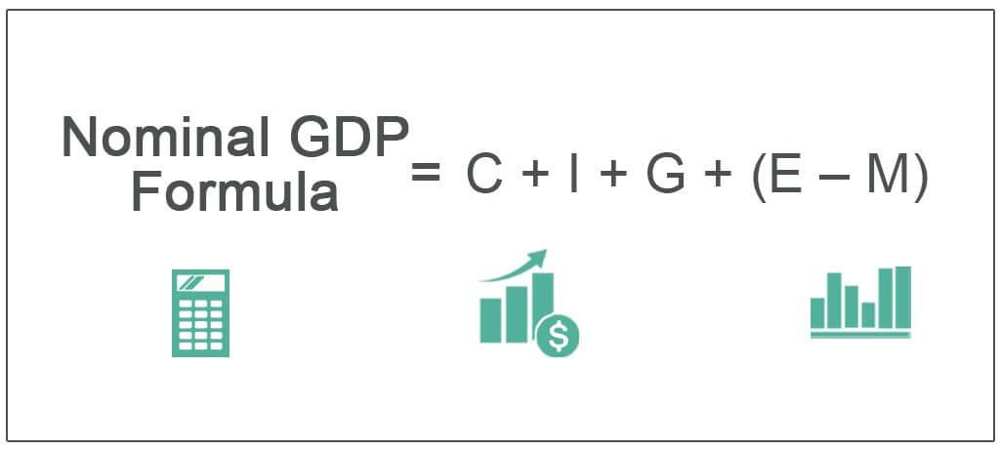

The economic landscape is a dynamic and intricate domain continuously shaped by numerous factors at both local and global levels. Key metrics such as Gross Domestic Product (GDP) play a pivotal role in shaping our understanding of economic performance, serving as vital tools for policymakers, investors, and businesses. GDP, the standard measure of the total value of all final goods and services produced within a country's borders over a specified period, offers crucial insights into the health and direction of an economy.

Among the various ways to quantify GDP, nominal GDP and real GDP stand out as indispensable indicators, each providing unique insights. Nominal GDP measures the value of economic output using current prices without adjusting for inflation, making it a quick indicator of current economic activity. However, it can be misleading during periods of inflation or deflation, as it does not differentiate between changes in quantities and changes in price levels. Conversely, real GDP adjusts for inflation, reflecting a more accurate measure of an economy's size and growth over time by holding prices constant. This adjustment enables a more thorough comparison of economic performance across different periods, isolating true growth from inflationary effects.



In the fast-paced world of finance, algorithmic trading has become a cornerstone in executing transactions and maximizing returns. It relies heavily on precise and timely economic data to forecast trends and make informed trading decisions. GDP data, both nominal and real, are integral to this process as they offer insights into economic cycles, potential investment opportunities, and risks. Understanding the nuances between nominal and real GDP is therefore crucial for developing robust algorithmic trading strategies that can adapt to the continuous shifts in economic conditions.

This article will explore the distinctions between nominal and real GDP, their significance for economic analysis, and how they are applied within the context of algorithmic trading to inform strategic investment decisions.

## Table of Contents

## Understanding Nominal GDP

Nominal GDP refers to the total market value of all final goods and services produced within a country's borders, calculated using the prices that are current in the year the output is produced. This measure encompasses the value of goods and services at current market prices without accounting for changes in price levels over time, which makes it susceptible to distortions due to inflation or deflation.

The computation of nominal GDP can be mathematically expressed as:

$$
\text{Nominal GDP} = \sum(\text{Price}_{t} \times \text{Quantity}_{t})
$$

where $\text{Price}_{t}$ and $\text{Quantity}_{t}$ are the price and the quantity of goods and services in the current year, respectively.

Key components of nominal GDP include:

1. **Consumption (C):** Expenditures by households on goods and services, which typically account for a large portion of GDP.
2. **Investment (I):** Spending on business capital goods, residential housing, and inventories.
3. **Government Spending (G):** Expenditures by government on goods and services intended for public use.
4. **Net Exports (NX):** The value of a country's exports minus its imports.

$$
\text{Nominal GDP} = C + I + G + (X - M)
$$

where $X$ represents exports and $M$ represents imports.

While nominal GDP is useful for a snapshot of economic activity, it can be misleading when comparing economic performance over different periods because it does not adjust for changes in the price level. This means that during periods of inflation, nominal GDP may indicate a higher economic growth rate even though the actual physical output may not have increased. For this reason, nominal GDP needs to be evaluated alongside other measures, like real GDP, to provide a holistic view of economic health.

## Exploring Real GDP

Real GDP serves as a vital metric for assessing an economy's true size and growth by factoring out the effects of inflation. Unlike nominal GDP, which measures economic output based on current market prices, real GDP adjusts these values to reflect a constant set of prices from a base year. This adjustment is achieved by dividing nominal GDP by the GDP deflator, a price index representing inflation or deflation within the economy. The formula for calculating real GDP is:

$$
\text{Real GDP} = \frac{\text{Nominal GDP}}{\text{GDP Deflator}}
$$

By holding prices constant, real GDP enables meaningful comparisons over different time periods, offering a clearer picture of economic performance and growth trends. This is particularly important for policymakers, economists, and analysts seeking to understand an economy's health without the distorting effects of inflation.

Real GDP is often preferred over nominal GDP for evaluating economic growth as it provides insights into the actual increase in economic output. Such insights allow for an accurate assessment of whether an economy is genuinely expanding or simply appearing to grow due to rising prices. This accuracy is crucial for policy formulation, as it guides decisions on interest rates, fiscal policies, and other economic interventions.

For example, if nominal GDP increases from one year to the next, it might simply reflect higher prices rather than an increase in the [volume](/wiki/volume-trading-strategy) of goods and services produced. In contrast, an increase in real GDP indicates a genuine expansion of economic activities, providing a more dependable measure for long-term economic planning and comparison. By eliminating inflationary distortions, real GDP serves as a reliable indicator of economic health and progress.

## Nominal vs. Real GDP: Key Differences

Nominal GDP and real GDP serve as complementary measures in evaluating economic performance but differ fundamentally in how they account for price changes over time. Nominal GDP is calculated using current market prices, providing a direct snapshot of economic output without adjusting for inflation or deflation. This can result in figures that reflect both changes in quantity and price, potentially overstating growth when inflation rises. Conversely, real GDP is an inflation-adjusted measure, utilizing base-year prices to isolate pure economic growth from price level changes. By applying a GDP deflator, real GDP translates nominal GDP into a constant price level, offering a clearer picture of an economy's trajectory.

Mathematically, real GDP is determined by the formula:

$$
\text{Real GDP} = \frac{\text{Nominal GDP}}{\text{GDP Deflator}} \times 100
$$

Where the GDP deflator represents the ratio of current prices to base-year prices, capturing overall price level changes.

The distinction between nominal and real GDP becomes particularly evident during inflationary periods. As prices rise, nominal GDP may show significant increases even if actual economic production remains stagnant. Real GDP, on the other hand, factors out these price changes, often resulting in a lower value compared to nominal GDP during such periods.

In [algorithmic trading](/wiki/algorithmic-trading), distinguishing between nominal and real GDP is essential. Traders depend on accurate depictions of economic health to develop robust investment strategies. Real GDP provides insights into genuine growth patterns, while nominal GDP can signal short-term market dynamics driven by price fluctuations. By integrating these metrics, algorithmic trading platforms can enhance their predictive models, allowing for strategies that effectively adapt to economic cycles and inflationary trends.

## Calculating GDP in Algorithmic Trading

Algorithmic trading systems have revolutionized the financial markets by enabling rapid and strategic decision-making based on complex datasets, including Gross Domestic Product (GDP) figures. These systems utilize both nominal and real GDP data to forecast economic trends and develop robust investment strategies. By processing this data, traders can identify potential opportunities and risks across various sectors, offering a competitive advantage.

Nominal GDP provides insights into the current economic conditions without accounting for inflation, making it useful for assessing short-term market dynamics. In contrast, real GDP, adjusted for inflation, offers a clearer picture of long-term economic growth. By integrating both nominal and real GDP data, algorithmic trading systems improve the accuracy of their predictions and strategize accordingly.

Automated trading platforms use historical data of GDP to recognize patterns that might indicate upcoming economic trends. For example, a Python-based trading algorithm can incorporate time series analysis to track GDP growth over several quarters. Here's a basic example of how GDP data might be used in Python to anticipate trends:

```python
import pandas as pd
import numpy as np
from sklearn.linear_model import LinearRegression

# Sample GDP data
gdp_data = {'Quarter': ['Q1-2020', 'Q2-2020', 'Q3-2020', 'Q4-2020', 'Q1-2021', 'Q2-2021'],
            'Nominal GDP': [21.5, 19.0, 21.7, 22.0, 23.5, 24.0],
            'Real GDP': [21.2, 19.2, 21.5, 21.8, 23.1, 23.7]}

# Convert to DataFrame
df = pd.DataFrame(gdp_data)

# Feature matrix (X) and target vector (y)
X = np.array(range(len(df))).reshape(-1, 1)  # Quarterly index
y_nominal = df['Nominal GDP'].values
y_real = df['Real GDP'].values

# Linear regression model for prediction
model_nominal = LinearRegression().fit(X, y_nominal)
model_real = LinearRegression().fit(X, y_real)

# Predict future GDP
future_quarters = np.array([[6], [7], [8]])  # Q3-2021, Q4-2021, Q1-2022
nominal_gdp_forecast = model_nominal.predict(future_quarters)
real_gdp_forecast = model_real.predict(future_quarters)

print("Nominal GDP Forecast:", nominal_gdp_forecast)
print("Real GDP Forecast:", real_gdp_forecast)
```

By incorporating GDP forecasts into algorithmic trading strategies, traders can adjust their portfolios to align with expected economic growth or contraction. This could involve shifting investments towards more resilient sectors during times of economic downturn, or capitalizing on booming industries during periods of robust GDP growth.

Moreover, the integration of GDP data into trading algorithms allows for enhanced decision-making by aligning investment moves with prevailing economic conditions. These systems can also adapt to unexpected economic shifts by recalibrating their strategies based on real-time GDP data updates, thus maintaining an edge in the highly competitive market environment.

## The Economic Significance of GDP in Trading

GDP figures contribute significantly to economic assessments and the strategies employed in trading. They are pivotal for understanding national economic health, influencing policy decisions, interest rates, inflation, and market [volatility](/wiki/volatility-trading-strategies). These economic indicators provide essential insights that directly affect investor sentiment and financial markets.

Nominal GDP is used to gauge current economic activity. By reflecting the market value of goods and services produced using current prices, it allows traders to understand short-term economic dynamics. In inflationary periods, nominal GDP may overstate economic growth, but it provides immediate insights into the overall economic activity. This information can be critical for making short-term trading decisions, particularly when reacting to sudden economic shifts or policy announcements. Traders often analyze nominal GDP for its capacity to reveal consumer spending trends, business investment levels, and government expenditure, which are crucial for sector-specific investment strategies.

Conversely, real GDP is adjusted for inflation, providing a clearer view of an economy's actual growth over time. By using constant prices, real GDP allows traders to compare economic output from year to year without the distorting effects of inflation. This measure is critical for long-term trend analysis. Understanding real GDP helps traders anticipate longer-term economic cycles, enabling them to develop strategies that align with expected economic growth patterns. Real GDP is particularly valuable for assessing the sustainable growth of an economy, aiding in the prediction of future [interest rate](/wiki/interest-rate-trading-strategies) changes and inflation trends.

Traders utilize GDP metrics to formulate responses to economic cycles, policy changes, and fluctuating market conditions. By interpreting GDP data, traders can make informed predictions on how a country's economic policies might shift, affecting currency valuations, stock market performance, and bond yields. For instance, a rising real GDP suggests economic growth, potentially leading central banks to raise interest rates as a control for inflation, which can influence trading strategies across various asset classes.

In summary, both nominal and real GDP are indispensable for developing robust trading strategies. They offer distinct yet complementary insights—nominal GDP provides a snapshot of immediate economic conditions, while real GDP delivers a more accurate measure of sustained economic performance. Understanding these measures enables traders to navigate financial markets effectively, aligning their strategies with both current and anticipated economic conditions.

## Conclusion

Both nominal and real GDP serve as essential metrics for assessing economic performance and shaping trading strategies. Nominal GDP offers an immediate view of current economic conditions by accounting for the market value of all finalized goods and services without adjusting for inflation. This characteristic makes it instrumental for analyzing the short-term economic landscape and gauging immediate market dynamics.

Conversely, real GDP adjusts for inflation by utilizing constant base-year prices, thereby providing a more accurate reflection of an economy's sustainable growth. This inflation-adjustment offers a true picture of an economy's expansion over time, making real GDP a preferred metric for evaluating long-term economic performance. Its capacity to account for price level changes ensures that economic growth is not overstated, particularly in periods marked by significant inflation or deflation.

Algorithmic trading leverages the distinct insights offered by both nominal and real GDP. By integrating these indicators into trading models, automated systems can create adaptable and sophisticated investment strategies. The combination allows traders to dynamically respond to various economic conditions, aligning their moves with the true state of the economy. Economic metrics such as these support algorithms in recognizing growth patterns, identifying sectorial opportunities, and mitigating risks tied to economic fluctuations.

Understanding nominal and real GDP is crucial for navigating the complexities of the financial markets. Their application facilitates informed decision-making by investors and policymakers alike, enabling them to anticipate economic trends and craft strategies that are resilient to the ever-changing economic environment. As financial markets and economies continue to evolve, these GDP indicators remain indispensable in illuminating the path toward effective and sustainable economic analysis.

## Further Reading

For deeper insights into economic indicators and their applications, sources such as Investopedia offer comprehensive guides on GDP and economic analysis. These resources cover fundamental concepts and practical applications, aiding in understanding how these indicators reflect economic health and inform financial decisions.

Additionally, algorithmic trading platforms and academic publications are valuable for exploring how GDP metrics are utilized within trading strategies. These resources often discuss the integration of economic data in automated trading systems, demonstrating how historical GDP information can be used to model market trends and predict future economic movements.

Governmental sources, like the Bureau of Economic Analysis (BEA), are indispensable for accessing reliable and up-to-date GDP data. The BEA provides detailed economic reports and datasets, essential for calculating and understanding GDP trends. Their database enables users to examine both nominal and real GDP figures, making it easier for analysts, policymakers, and traders to derive meaningful insights.

For those interested in practical applications, the following Python snippet demonstrates how to calculate real GDP using nominal GDP and a GDP deflator:

```python
def calculate_real_gdp(nominal_gdp, gdp_deflator):
    if gdp_deflator == 0:
        raise ValueError("GDP deflator cannot be zero.")
    return nominal_gdp / gdp_deflator

# Example usage
nominal_gdp = 20000  # in billions of dollars
gdp_deflator = 1.2   # representing a 20% increase in prices since the base year

real_gdp = calculate_real_gdp(nominal_gdp, gdp_deflator)
print(f"Real GDP: {real_gdp} billion dollars")
```

This code snippet illustrates how real GDP adjusts for inflation by dividing nominal GDP by the GDP deflator. Using such computational tools, traders and analysts can integrate economic calculations within their investment strategies effectively.

## References & Further Reading

[1]: Bureau of Economic Analysis. ["Gross Domestic Product (GDP)."](https://www.bea.gov/data/gdp/gross-domestic-product) Access up-to-date and detailed GDP data from a government source.

[2]: Investopedia. ["Nominal vs. Real GDP: What's the Difference?"](https://www.investopedia.com/ask/answers/030515/real-gdp-better-index-economic-performance-gdp.asp) A comprehensive guide on the distinction between nominal and real GDP.

[3]: ["Advances in Financial Machine Learning"](https://www.amazon.com/Advances-Financial-Machine-Learning-Marcos/dp/1119482089) by Marcos Lopez de Prado. This book offers insights into how economic data like GDP is utilized in algorithmic trading strategies.

[4]: ["Quantitative Trading: How to Build Your Own Algorithmic Trading Business"](https://www.amazon.com/Quantitative-Trading-Build-Algorithmic-Business/dp/0470284889) by Ernest P. Chan. Provides foundational knowledge for creating algorithmic trading systems that incorporate economic indicators such as GDP.

[5]: The Balance. ["How GDP Affects You and the Economy."](https://smallbusiness.chron.com/how-does-gdp-affect-economy-8750996.html) An article explaining the impact of GDP on economic conditions and its significance in policy-making and trading.