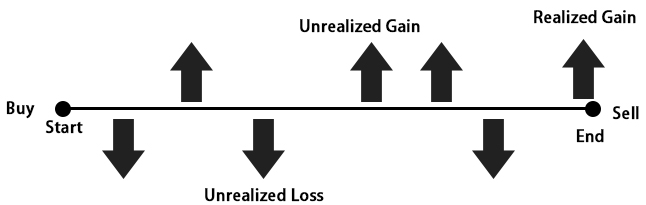

## Table of Contents

## What is a realized gain?

A realized gain is the profit you make when you sell something for more than what you paid for it. Imagine you bought a toy for $10 and later sold it for $15. The $5 difference is your realized gain. This term is often used in investing, where it refers to the profit made from selling stocks, bonds, or other assets at a higher price than their purchase cost.

Realized gains are important because they represent actual money you can use, unlike unrealized gains, which are just increases in value on paper. For example, if you own a stock that goes up in value but you haven't sold it yet, you have an unrealized gain. Only when you sell the stock and pocket the profit does it become a realized gain. This distinction matters for taxes too, as you usually only pay taxes on gains that are realized.

## What is an unrealized gain?

An unrealized gain is when something you own, like a stock or a piece of art, goes up in value but you haven't sold it yet. Imagine you bought a comic book for $20 and now it's worth $50. You haven't sold it, so you don't have the extra $30 in your pocket. That $30 is your unrealized gain because it's not real money you can spend yet.

Unrealized gains are important to keep track of because they show how well your investments are doing. But remember, they can change. If the value of your comic book drops back to $20 before you sell it, your unrealized gain disappears. It's only when you sell and actually get the money that the gain becomes real, or "realized."

## How do you calculate a realized gain?

To calculate a realized gain, you need to know two things: the price you paid for something and the price you sold it for. Let's say you bought a bike for $100 and later sold it for $150. To find your realized gain, you subtract the purchase price from the selling price. In this case, $150 minus $100 equals $50. That $50 is your realized gain because it's the actual profit you made from selling the bike.

Realized gains are important because they show how much money you've actually made from an investment. They are different from unrealized gains, which are just increases in value on paper. For example, if you own a stock that goes up in value but you haven't sold it yet, you have an unrealized gain. Only when you sell the stock and get the money does it become a realized gain. This is why realized gains matter for things like taxes, as you usually only pay taxes on the money you've actually received.

## How do you calculate an unrealized gain?

To calculate an unrealized gain, you need to know the price you paid for something and its current value, even if you haven't sold it yet. Imagine you bought a painting for $500 and now it's worth $700. To find your unrealized gain, subtract the price you paid from the current value. In this case, $700 minus $500 equals $200. That $200 is your unrealized gain because it's the increase in value that you haven't turned into actual money yet.

Unrealized gains are important because they show how your investments are doing, but they can change. If the value of your painting drops back to $500 before you sell it, your unrealized gain goes away. It's only when you sell and actually get the money that the gain becomes real, or "realized." This is why unrealized gains are just on paper and don't affect your taxes until you sell and realize the gain.

## Can you provide an example of a realized gain?

Imagine you bought a skateboard for $80 at a garage sale. After a few months, you decided to sell it online because you saw that similar skateboards were selling for $120. You listed your skateboard and someone bought it for $120. The difference between what you paid for the skateboard ($80) and what you sold it for ($120) is your realized gain. In this case, your realized gain is $40 because that's the actual money you made from selling the skateboard.

Realized gains are important because they show how much money you've actually made from something you've sold. They are different from unrealized gains, which are just increases in value on paper. For example, if you own a stock that goes up in value but you haven't sold it yet, you have an unrealized gain. Only when you sell the stock and get the money does it become a realized gain. This is why realized gains matter for things like taxes, as you usually only pay taxes on the money you've actually received.

## Can you provide an example of an unrealized gain?

Imagine you bought a video game for $30 last year. You check online and see that the same game is now selling for $50. You haven't sold your copy yet, but if you did, you would make a profit. The difference between what you paid ($30) and what it's worth now ($50) is your unrealized gain. In this case, your unrealized gain is $20 because that's how much more the game is worth now than when you bought it.

Unrealized gains are important because they show how your things are doing in value, but they can change. If the price of the video game drops back to $30 before you sell it, your unrealized gain goes away. It's only when you actually sell the game and get the money that the gain becomes real, or "realized." This is why unrealized gains are just on paper and don't affect your taxes until you sell and realize the gain.

## What are the tax implications of realized gains?

When you have a realized gain, it means you've made money by selling something for more than you paid for it. This money is called a capital gain, and you usually have to pay taxes on it. The tax you pay depends on how long you owned the thing before you sold it. If you owned it for a year or less, it's called a short-term capital gain, and you pay regular income tax on it. If you owned it for more than a year, it's a long-term capital gain, and the tax rate is usually lower.

The tax rate for long-term capital gains can be 0%, 15%, or 20%, depending on your income. For example, if you're in a lower income bracket, you might not have to pay any tax on your long-term capital gains. But if you're in a higher income bracket, you could pay up to 20%. It's important to keep track of your realized gains because you need to report them on your tax return. If you don't report them, you could get in trouble with the tax authorities.

## How do unrealized gains affect financial statements?

Unrealized gains show up on financial statements as increases in the value of things a company owns, like investments or property. These gains are listed under assets on the balance sheet, but they don't count as actual money the company can spend yet. They are important because they show how well the company's investments are doing, but they can change if the value of the assets goes down before the company sells them.

For example, if a company owns stock that goes up in value, that increase is an unrealized gain. It's added to the company's total assets on the balance sheet. But because it's not real money yet, it doesn't affect the company's cash flow statement or income statement until the stock is sold. This means unrealized gains help give a fuller picture of a company's financial health, but they don't change the money the company has to spend right now.

## What strategies can investors use to manage realized and unrealized gains?

Investors can manage realized and unrealized gains by carefully timing when they buy and sell their investments. If they want to avoid paying taxes on realized gains, they might hold onto their investments for more than a year to qualify for lower long-term capital gains tax rates. They can also use a strategy called tax-loss harvesting, where they sell investments that have lost value to offset the taxes they owe on their gains. By doing this, they can reduce their tax bill and keep more of their profits.

Another strategy is to keep an eye on unrealized gains and decide when to turn them into realized gains. If an investment's value goes up a lot, investors might choose to sell it to lock in the profit. But if they think the value will keep going up, they might wait. It's a balancing act between wanting to make money now and hoping to make even more money later. Keeping track of both realized and unrealized gains helps investors make smart choices about when to buy and sell to grow their money over time.

## How do market conditions impact the decision to realize or hold onto gains?

Market conditions play a big role in deciding whether to realize or hold onto gains. When the market is doing well and prices are going up, investors might be tempted to hold onto their investments longer to see if they can make even more money. They might think the value will keep going up, so they wait to sell and turn their unrealized gains into realized gains. But if they think the market is at its peak, they might decide to sell now and lock in their profits, turning their unrealized gains into realized gains before the market goes down.

On the other hand, if the market is doing poorly and prices are dropping, investors might choose to sell their investments quickly to realize their gains before the value goes down even more. They might want to get the money they've made so far and not risk losing it. Or, if they believe the market will recover, they might hold onto their investments, hoping the value will go back up and their unrealized gains will grow again. It's all about trying to guess what the market will do next and making the best decision based on that guess.

## What are the psychological factors influencing the decision to realize gains?

One big psychological [factor](/wiki/factor-investing) that influences whether people decide to realize their gains is something called loss aversion. This means that people feel the pain of losing money much more strongly than the joy of gaining money. So, even if an investment has gone up in value, people might be scared to sell it because they worry it might go up even more after they sell. They don't want to feel like they missed out on extra money, so they hold onto the investment and keep their gains unrealized.

Another factor is the fear of regret. People often think about what could have been if they had made a different choice. If they sell an investment and the price keeps going up, they might feel regret for not waiting longer. On the other hand, if they hold onto an investment and the price goes down, they might also feel regret for not selling when they had the chance. These feelings of regret can make it hard for people to decide whether to realize their gains or keep waiting, hoping for even better results.

## How do realized and unrealized gains affect long-term investment planning?

Realized and unrealized gains are important for long-term investment planning because they help investors see how their investments are doing over time. When you have unrealized gains, it means your investments are worth more than what you paid for them, but you haven't sold them yet. This can be good because it shows your investments are growing, but it also means you need to keep an eye on the market to decide when to sell and turn those gains into real money. If you think the market will keep going up, you might want to wait. But if you think it might go down, you might want to sell and realize your gains before they disappear.

Realized gains are the actual money you make when you sell your investments for more than you paid for them. These gains are important for long-term planning because they show how much money you've actually made. You can use this money to buy new investments or spend it on other things. But you also need to think about taxes. When you realize gains, you usually have to pay taxes on them, so you need to plan for that too. Balancing unrealized and realized gains helps you make smart choices about when to buy and sell to grow your money over time.

## References & Further Reading

For those interested in expanding their understanding of [algorithmic trading](/wiki/algorithmic-trading), unrealized and realized gains, and investment strategies, a wealth of literature and resources is available. These materials are crucial for professionals and investors aiming to deepen their knowledge and enhance their trading practices.

1. **Algorithmic Trading**: 
    - "Algorithmic Trading and DMA: An Introduction to Direct Access Trading Strategies" by Barry Johnson provides a comprehensive overview of the algorithms used in trading and their impact on market conditions. 
    - "Quantitative Trading: How to Build Your Own Algorithmic Trading Business" by Ernie Chan explores the details of developing and implementing trading strategies and can serve as a practical guide for those interested in building algorithmic trading systems.

2. **Unrealized and Realized Gains**:
    - For understanding the principles of unrealized and realized gains, "Investments" by Bodie, Kane, and Marcus offers foundational knowledge and insights into how these gains are represented in financial markets.
    - Articles from established financial websites like Investopedia and the IRS website provide clear explanations of the tax implications and reporting standards associated with these gains.

3. **Investment Strategies**:
    - "The Intelligent Investor" by Benjamin Graham, considered a classic, educates on value investing, which can be essential for understanding the broader context of managing unrealized and realized gains.
    - "A Random Walk Down Wall Street" by Burton G. Malkiel argues for the efficiency of the markets and can introduce readers to different investment strategies that align with modern algorithmic trading practices.

4. **Further Exploration in Financial Markets and Trading Techniques**:
    - Journals such as the "Journal of Finance" and the "Journal of Financial Economics" regularly publish research on advanced investment strategies and market behaviors.
    - Websites like the CFA Institute provide articles, webinars, and courses to stay updated on cutting-edge academic and practical developments in financial markets.

5. **Practical Applications and Case Studies**:
    - Platforms like QuantConnect and Alpaca offer users the ability to implement algorithmic trading in simulated environments, along with community discussion and case studies on effective strategies.
    - The use of Python in developing trading algorithms is well-documented in online courses and tutorials. For instance, learning resources from sites like Coursera or Udemy can offer practical coding exercises and projects to start creating algorithms.

By examining these resources, investors and traders can gain comprehensive insights into the nuances of financial markets and the strategic use of data-driven trading techniques. Whether for academic, professional, or personal growth, these readings and platforms present valuable information for optimizing investment decisions.

