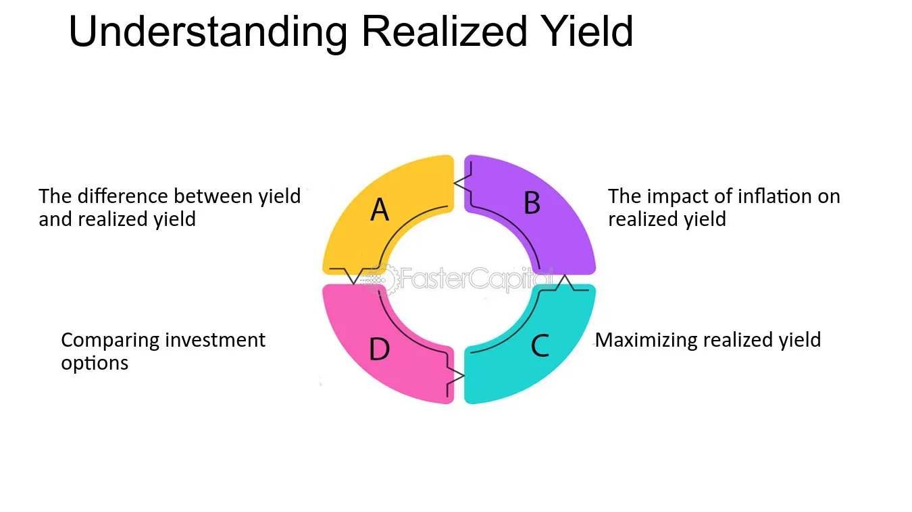

## Table of Contents

## What is realized yield?

Realized yield is the actual return you get from an investment over a certain period of time. It takes into account the income you earn, like interest or dividends, and any changes in the price of the investment. For example, if you buy a bond and hold it until it matures, the realized yield would include all the interest payments you received plus any gain or loss when you sell the bond.

Understanding realized yield is important because it shows you the real performance of your investment. It's different from the expected or promised yield because it reflects what actually happened, not just what was supposed to happen. This can help you make better decisions about whether to keep, sell, or buy more of an investment.

## How is realized yield different from yield to maturity?

Realized yield and yield to maturity are two ways to measure how much money you might make from a bond, but they look at things differently. Yield to maturity is what you expect to earn if you buy a bond and keep it until it matures. It's like a prediction based on the bond's price today, the interest it pays, and how long you have to wait until it matures. This number assumes you will get all the interest payments and the bond's face value at the end.

Realized yield, on the other hand, is what you actually earn from the bond. It's the real deal, not just a guess. Realized yield includes the interest payments you get and any profit or loss you make when you sell the bond, whether you hold it until it matures or sell it earlier. So, while yield to maturity is useful for planning, realized yield tells you the true story of what happened with your investment.

## Can you explain the calculation of realized yield?

To calculate the realized yield, you need to know the total income you got from the investment and any changes in its price. Let's say you bought a bond for $1,000 and it pays you $50 in interest every year. If you hold the bond for 5 years and then sell it for $1,100, you need to add up all the interest you received, which is $250 (5 years times $50 per year), and the profit you made when you sold the bond, which is $100 ($1,100 minus $1,000). So, your total return is $350.

To find the realized yield, you then need to figure out what percentage this total return is of the original price you paid for the bond. In this case, you divide the total return ($350) by the original price ($1,000), which gives you 0.35. To turn this into a percentage, you multiply by 100, so the realized yield is 35%. This means that over the 5 years you held the bond, you earned an average of 35% on your initial investment.

## What factors influence realized yield?

Realized yield can change because of many things. One big thing is how much the price of the investment goes up or down. If you buy a bond and its price goes up before you sell it, your realized yield will be higher. But if the price goes down, your realized yield will be lower. Another thing that can change realized yield is the interest payments you get. If you get more interest than you expected, your realized yield will go up. If you get less, it will go down.

Also, how long you keep the investment can make a difference. If you hold onto a bond for a long time, the interest payments can add up and make your realized yield higher. But if you sell it quickly, you might not get as much interest, and your realized yield could be lower. Things like taxes and fees can also affect your realized yield. If you have to pay a lot in taxes or fees, it can take away from the money you make, and your realized yield will be less.

## How does reinvestment risk affect realized yield?

Reinvestment risk can change how much money you actually make from an investment, like a bond. This risk happens when you get money from the bond, like interest payments, and you want to put that money back into something else. If the interest rates go down after you buy your bond, you might have to put your money into new investments that don't pay as much. This means the total amount of money you make from your original investment could be less than you hoped for, because the money you reinvest doesn't grow as much.

For example, if you bought a bond that pays 5% interest and then interest rates drop to 3%, the money you get from the bond and want to reinvest will only earn 3%. So, even though your bond still pays 5%, the overall money you make from all your investments might be lower. This can make your realized yield, which is the real amount of money you earn, different from what you expected when you first bought the bond.

## What are the different varieties of realized yield?

Realized yield can be looked at in different ways depending on what you want to know about your investment. One way is the realized holding period yield, which is the total return you get from holding an investment for a certain time. This includes all the money you made from interest or dividends and any profit or loss from selling the investment. It's like looking at the whole picture of what you earned during the time you owned the investment.

Another way to think about realized yield is the realized compound yield, which takes into account the effect of reinvesting the money you get from the investment. This type of yield shows what happens if you take the interest or dividends you receive and put them back into more investments. It's important because it can show you how your money can grow over time if you keep reinvesting it, but it also depends on what interest rates are like when you reinvest.

## How does realized yield apply to bonds?

Realized yield is important for bonds because it tells you how much money you actually made from the bond. When you buy a bond, you get interest payments over time, and if you sell the bond before it matures, you might make more or less money depending on what the bond is worth when you sell it. The realized yield adds up all the interest you got and any profit or loss from selling the bond. This number shows the real return on your investment, which can be different from what you expected when you bought the bond.

For example, if you buy a bond for $1,000 that pays $50 a year in interest, and you hold it for 5 years before selling it for $1,100, your realized yield would include the $250 in interest you received plus the $100 profit from selling the bond. So, you would calculate the total return as $350, and then figure out what percentage that is of the $1,000 you originally paid. This helps you see how well your bond investment did over the time you owned it.

## What role does realized yield play in investment strategies?

Realized yield is important for making smart choices about investments. It shows you how much money you actually made from an investment, like a bond or a stock. When you know the realized yield, you can see if the investment did better or worse than you thought it would. This helps you decide if you should keep the investment, sell it, or buy more of it. For example, if a bond's realized yield is higher than what you expected, you might want to keep it or buy more bonds like it.

Realized yield also helps you compare different investments. If you have money in different places, like stocks, bonds, and savings accounts, you can look at the realized yield to see which one is doing the best. This can guide you in moving your money around to get the best return. Knowing the realized yield can also make you think about things like reinvestment risk, where the money you get from an investment might not grow as much if you put it back into something else. So, realized yield is a key part of planning and managing your investments to make the most money.

## How can realized yield be used to compare different investment options?

Realized yield is a great way to compare different investments because it shows you how much money you actually made from each one. If you have money in different places, like stocks, bonds, and savings accounts, you can look at the realized yield to see which one gave you the best return. For example, if a bond had a realized yield of 5% and a stock had a realized yield of 3%, you might decide to put more money into bonds because they did better for you.

Using realized yield to compare investments also helps you see if your investments are doing what you hoped they would. If an investment's realized yield is lower than what you expected, you might want to sell it and put your money somewhere else. On the other hand, if an investment's realized yield is higher than expected, you might want to keep it or buy more of it. This way, you can make smarter choices about where to put your money to make the most of it.

## What are the limitations of using realized yield as a performance metric?

Realized yield is a good way to see how much money you actually made from an investment, but it has some problems. One big problem is that it only tells you about the past, not the future. Just because an investment did well before doesn't mean it will do well again. Also, realized yield can be different depending on how long you keep the investment. If you sell it quickly, you might not get as much money as if you held onto it for a long time.

Another issue with realized yield is that it doesn't take into account things like taxes and fees. These can take away from the money you make, so the realized yield might look better than it really is. Also, realized yield can be hard to compare across different types of investments. For example, a bond's realized yield might look good, but if you compare it to a stock's realized yield, you might not be comparing apples to apples because stocks and bonds are different kinds of investments.

## How does tax treatment impact the realized yield of an investment?

Taxes can change how much money you actually make from an investment, which is what realized yield is all about. When you get money from an investment, like interest from a bond or dividends from a stock, you might have to pay taxes on that money. If you have to pay a lot in taxes, it means you keep less of the money you made, so your realized yield goes down. For example, if you made $100 from interest but had to pay $20 in taxes, your realized yield would be based on the $80 you got to keep, not the full $100.

Also, taxes can affect realized yield when you sell an investment. If you sell something for more than you paid for it, you might have to pay capital gains tax on the profit. This tax can take away from the money you made, making your realized yield lower than if you didn't have to pay it. So, when you're figuring out how well an investment did, you need to think about taxes because they can make a big difference in the real amount of money you get to keep.

## Can you discuss advanced strategies for optimizing realized yield in a portfolio?

To optimize the realized yield in a portfolio, one strategy is to carefully manage the timing of when you buy and sell your investments. If you think interest rates are going to go down, you might want to buy bonds now to lock in higher interest payments. But if you think rates are going up, you might sell your bonds and wait to buy new ones later when they'll pay more. Another part of this strategy is to keep an eye on how long you hold each investment. If you hold a bond until it matures, you might get a different realized yield than if you sell it early. So, think about when it makes sense to sell and when to hold on.

Another strategy is to pay attention to reinvestment. When you get money from your investments, like interest or dividends, you can put that money back into more investments. If you can reinvest at a good rate, your realized yield can go up over time. But if rates are low, you might want to hold onto the cash until rates go up. Also, think about taxes. If you can put your money into investments that have lower taxes, like municipal bonds, you can keep more of your earnings, which can boost your realized yield. So, managing reinvestment and taxes can really help you make the most of your portfolio's realized yield.

## What is Understanding Realized Yield?

Realized yield represents the actual return that an investor gains from an investment, inclusive of all cash flows such as dividends, interest payments, or other distributions that occur during the holding period. This measure is instrumental for investors aiming to assess the true performance of their investments, as it accounts for actual cash flows rather than merely anticipated returns. Distinguishing between realized yield and expected returns is especially vital in scenarios involving bonds and fixed-income securities, where cash flow expectations and market conditions might lead to discrepancies.

To calculate realized yield, one must consider all income and capital gains received over the investment period. For bonds, which are the typical context for realized yield analysis, the formula can be illustrated as follows:

$$
\text{Realized Yield} = \frac{C + (\text{P}_\text{end} - \text{P}_\text{start})}{\text{P}_\text{start} \times n}
$$

Where:
- $C$ is the total coupon payments received,
- $\text{P}_\text{end}$ is the selling price of the bond,
- $\text{P}_\text{start}$ is the purchase price of the bond,
- $n$ is the number of years the bond was held.

This formula quantitatively illustrates the total income generated from the bond relative to its purchase price, spread over the years it was held. 

In practice, realized yield serves as a benchmark to compare the performance of various investment options and to analyze past investment decisions. Factors that influence realized yield include market interest rates, the credit quality of the issuer, and the broader economic environment. Market interest rates can affect the bond's price, thereby impacting both capital gains or losses when the security is sold. Similarly, the credit quality of the issuer could impact the actual cash flows received, particularly in cases of default risk or ratings downgrades.

Realized yield is also pivotal for portfolio management, assisting investors and fund managers in appraising which securities are meeting expected performance objectives and which aren't. This is crucial in the fixed-income segment, where subtle fluctuations in yield due to [interest rate](/wiki/interest-rate-trading-strategies) movements or issuer stability can significantly affect investment outcomes.

Moreover, understanding realized yield equips investors with insights necessary for more accurate forecasting and strategy formulation, as it provides a clear picture of how investments perform in real-world conditions as opposed to theoretical or projected scenarios.

## What are the types of realized yields?

Different financial instruments provide varying yield types, which play critical roles in evaluating profitability and assessing risk. Each type of yield offers unique insights necessary for strategic financial planning and risk management.

**Bond Yield**: Bond yield represents the return an investor can expect from a bond, contingent on the bond's price and interest payments. It encompasses different yield measures, such as the current yield and yield to maturity. The current yield is calculated as the bond's annual coupon payments divided by its current market price: 

$$
\text{Current Yield} = \frac{\text{Annual Coupon Payment}}{\text{Current Market Price}}
$$

This metric enables investors to assess the annual return relative to the bond's current price.

**Yield to Maturity (YTM)**: YTM is a more comprehensive measure, estimating the total return an investor will receive if the bond is held until maturity. It considers the present value of all future cash flows, including coupon payments and the return of principal, adjusted for the bond's current price. YTM is solved iteratively or through financial calculators and software. The formula for YTM reflects the complexity of considering time value and is typically expressed as:

$$
\text{YTM} = \text{solved value in } P = \sum \frac{C}{(1+ \text{YTM})^t} + \frac{F}{(1+ \text{YTM})^n}
$$

where $P$ is the current price, $C$ is the coupon payment, $F$ is the face value, and $n$ is the number of years until maturity.

**Dividend Yield**: This metric pertains to stocks, defined as the annual dividend payments divided by the stock’s current market price. It indicates the cash flow an investor receives for every dollar invested in the company's equity. The formula for dividend yield is:

$$
\text{Dividend Yield} = \frac{\text{Annual Dividends per Share}}{\text{Price per Share}}
$$

This yield type provides insights into the income-generating ability of a stock, which is vital for income-focused investment strategies.

Understanding these yield types enables investors to make well-informed decisions, optimizing their portfolio strategies by balancing risk and return. For example, higher bond yields might indicate higher risk, while high dividend yields could reflect a company's strong financial health or potential financial distress. By analyzing these yields, investors can tailor their investment approaches to better align with their financial goals and risk tolerance.

## What is Algorithmic Trading and how does it relate to Yield Analysis?

Algorithmic trading employs sophisticated computer algorithms to automate the process of buying and selling securities, aiming for swift and accurate trade execution. Central to these algorithms is the utilization of yield metrics, which provide vital data-driven insights necessary for optimizing transaction precision and efficiency. Yield metrics are not just retrospective measures; they offer predictive insights that enhance real-time decision-making processes.

Yield analysis in [algorithmic trading](/wiki/algorithmic-trading) involves scrutinizing various types of yield data to assess the potential profitability and risk of investment opportunities. For instance, analyzing the realized yield of bonds or dividend yields of equities allows algorithms to estimate future cash flows and adjust strategies accordingly. This adaptability is essential in dynamic trading environments where market conditions can shift rapidly.

To enhance accuracy and outcomes, algorithmic trading strategies integrate financial formulas and yield data. For example, an algorithm might use the yield to maturity (YTM) of a bond as a benchmark for deciding whether to hold or sell a bond. The YTM is calculated using the formula:

$$
YTM \approx \frac{C + \frac{F - P}{n}}{\frac{F + P}{2}}
$$

where $C$ is the annual coupon payment, $F$ is the face value of the bond, $P$ is the price of the bond, and $n$ is the number of years to maturity. By incorporating such formulas into trading algorithms, traders can improve their decision-making capabilities in line with market assessments and yield predictions.

Moreover, algorithmic trading systems benefit from advances in programming languages and data analytics tools, such as Python. Python offers extensive libraries like NumPy and Pandas for mathematical operations and data manipulation, which are crucial for yield analysis. A simple Python script to calculate yield metrics might look like this:

```python
import numpy as np

# Example function to calculate YTM
def compute_ytm(face_value, market_price, coupon_rate, years_to_maturity):
    ytm = (coupon_rate * face_value + (face_value - market_price) / years_to_maturity) / ((face_value + market_price) / 2)
    return ytm

face_value = 1000
market_price = 950
coupon_rate = 0.05
years_to_maturity = 5

ytm = compute_ytm(face_value, market_price, coupon_rate, years_to_maturity)
print(f"Yield to Maturity: {ytm:.2%}")
```

This function exemplifies how financial calculations can be encapsulated in code to produce real-time yield metrics, informing automated trading decisions.

In summary, the integration of yield analysis within algorithmic trading substantially refines trading strategies. By leveraging precise financial metrics and computational efficiency, traders can achieve higher accuracy in predictions and outcomes, staying competitive in fast-paced financial markets.

## How can financial concepts be integrated into algo trading?

Integrating financial concepts such as Net Present Value (NPV), Internal Rate of Return (IRR), and Return on Investment (ROI) with yield analysis can significantly enhance algorithmic trading strategies. These financial formulas provide a robust framework for evaluating the profitability and efficiency of investments, making them integral to developing sophisticated quantitative models aimed at maximizing returns and managing risks in volatile markets.

Net Present Value (NPV) is widely applied to assess the value of future cash flows compared to initial investments. The formula for NPV is given by:

$$
\text{NPV} = \sum_{t=1}^{T} \frac{C_t}{(1 + r)^t} - C_0
$$

where $C_t$ represents the cash inflow during period $t$, $r$ is the discount rate, and $C_0$ is the initial investment. By integrating NPV into algorithmic trading, traders can evaluate the expected profitability of trades over time, adjusting strategies based on anticipated cash inflows.

Internal Rate of Return (IRR) provides a measure of an investment's expected profitability. It is the discount rate that makes the NPV of all cash flows from an investment equal to zero. Algorithmic traders can input different scenarios into their models to determine IRR, helping them to identify which strategies promise the highest returns.

Return on Investment (ROI) is another crucial metric that measures the gain or loss generated relative to the investment's cost. The formula for ROI is:

$$
\text{ROI} = \frac{\text{Gain from Investment} - \text{Cost of Investment}}{\text{Cost of Investment}}
$$

ROI aids in comparing the potential returns of different trading strategies, allowing for more informed decision-making.

Advanced technologies and programming languages like Python provide powerful tools for implementing these financial concepts into algorithmic strategies. Python's ecosystem, rich with libraries such as NumPy, Pandas, and SciPy, enables the efficient handling of large datasets, statistical analysis, and modeling. For instance, the `numpy.irr()` function can quickly compute the internal rate of return for a series of cash flows, while `numpy.npv()` can determine the net present value.

Here's an example of a simple Python function utilizing these functions:

```python
import numpy as np

# cash_flows represent the cash inflow of each period (+) or outflows (-)
cash_flows = [-1000, 100, 200, 300, 400, 500]

# Calculate IRR
irr = np.irr(cash_flows)

# Calculate NPV with a discount rate of 5%
discount_rate = 0.05
npv = np.npv(discount_rate, cash_flows)

print(f"Internal Rate of Return: {irr:.2%}")
print(f"Net Present Value: ${npv:.2f}")
```

By incorporating these financial metrics and leveraging the computational power of programming languages, traders can develop more dynamic and effective algorithmic trading strategies. This comprehensive approach facilitates the real-time evaluation of investment opportunities, enhances market trend analysis, and allows for the strategic allocation of resources to improve investment outcomes.

## References & Further Reading

1. **Books:**
   - "Quantitative Finance for Dummies" by Steve Bell: This book provides an accessible introduction to key financial concepts, including yield analysis and algorithmic trading strategies, making it ideal for both beginners and experienced practitioners.
   - "Algorithmic Trading: Winning Strategies and Their Rationale" by Ernie Chan: A comprehensive guide to the development of algorithmic trading systems, this book covers various strategies, tools, and techniques, highlighting the role of yield metrics in optimizing performance.
   - "Fixed Income Securities: Tools for Today’s Markets" by Bruce Tuckman and Angel Serrat: An essential resource for understanding the nuances of yield types in fixed-income securities, this book offers insights into the valuation and risk management of bonds, crucial for realizing actual yields.

2. **Articles:**
   - "Understanding Yield Types in the Context of Fixed Income and Equity Markets" by Michael Singh, published in the Journal of Financial Economics. This article offers an in-depth exploration of yield types and their implications for investors.
   - "Algorithmic Trading and Its Role in Modern Financial Markets" by Sarah Thompson in the Financial Times. This article analyzes how algorithmic trading heavily relies on yield metrics to enhance decision-making and execution efficiency.

3. **Tools and Resources:**
   - Python Libraries:
      - **Pandas**: For handling data structures and data analysis.
      - **NumPy**: For numerical computations, including yield calculations.
      - **TA-Lib**: Specialized in technical analysis, it provides tools for algorithmic strategy development.
   - Online Courses:
      - “Algorithmic Trading and Finance Models with Python, R, and Stata Essential Training” on LinkedIn Learning, which provides a practical outlook on integrating financial concepts into algorithmic strategies.
      - Coursera’s “Introduction to Finance: [Financial Markets](https://www.coursera.org/learn/financial-markets)” by Yale University. This course offers foundational knowledge necessary for understanding yields and financial market dynamics.

These resources provide extensive knowledge and practical insights into realized yield, different yield types, and their application in algorithmic trading, equipping readers with the necessary tools to navigate and succeed in modern financial markets.

