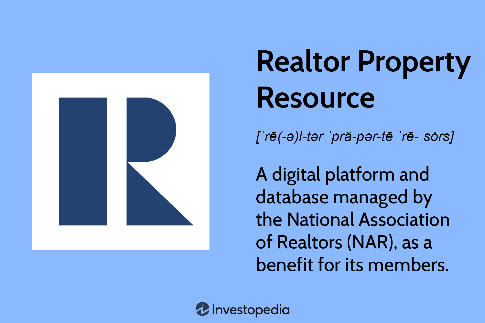

The real estate industry is undergoing a significant transformation with the increasing adoption of digital platforms that furnish comprehensive property data and analytics. These digital tools are reshaping how real estate professionals and investors conduct business. Among these platforms, the Realtors Property Resource (RPR) stands out for its potential to revolutionize access to and utilization of property information. Developed by the National Association of Realtors, RPR provides real estate professionals with detailed, accurate, and expansive data necessary for informed decision-making.

The integration of RPR into real estate practices offers numerous benefits for realtors. By facilitating access to over 147 million property listings, the platform empowers real estate professionals to offer enhanced services to clients, optimize pricing strategies, and understand market dynamics in more detail. RPR not only boosts operational efficiency for realtors but also equips them with the tools required to maintain a competitive edge in today's digital age.



Moreover, the interplay between real estate data and algorithmic trading represents a forward-thinking approach within the industry. Algorithmic trading involves the use of automated, rule-based systems to analyze market data and execute trades. Combining this methodology with comprehensive data from RPR can significantly enhance investment strategies. This intersection of data and trading allows investors to identify trends, predict market fluctuations, and capture emerging investment opportunities in real estate with increased accuracy.

This guide seeks to provide real estate professionals and investors with insights into leveraging the capabilities of the RPR platform, detailing its functionalities and exploring the potential impacts of integrating RPR data with algorithmic trading systems. By doing so, real estate stakeholders can not only enhance their decision-making processes but also position themselves strategically in an ever-evolving market landscape.

## Table of Contents

## Understanding the Realtors Property Resource (RPR) Platform

The Realtors Property Resource (RPR) is an innovative digital platform managed by the National Association of Realtors. It is specifically designed to cater to real estate professionals who are members of this association. RPR serves as a comprehensive resource, offering access to a vast database of over 147 million residential and commercial property listings across the United States. This extensive repository encompasses detailed information that is crucial for realtors, including zoning regulations, permits, mortgage details, liens, neighborhood data, school ratings, and foreclosure statuses.

To provide these insights, RPR leverages a combination of public and private data sources. This approach enables users to access comprehensive analytics, evaluate comparable property values, and gain insight into neighborhood [statistics](/wiki/bayesian-statistics). Such a wealth of information assists realtors in making better-informed decisions while catering to their clients' needs more accurately.

One of the standout features of the RPR platform is its accessibility across multiple devices. Whether on a desktop, iOS, or Android device, realtors can reach real-time data anytime, anywhere. This flexibility ensures that real estate professionals can maintain productivity and market responsiveness, whether they are in the office or out in the field.

What further enhances the platform's appeal to realtors is its user-friendly interface. The intuitive design of RPR ensures ease of navigation and usability, allowing professionals to focus on client interactions and property analysis rather than grappling with complex software operations. This functionality makes RPR an invaluable tool for those looking to improve their service offerings and maintain a competitive edge in the fast-paced real estate industry.

## Key Features and Benefits of RPR for Realtors

Realtors Property Resource (RPR) offers a suite of features specifically designed to enhance the capabilities of real estate professionals. One of the core functionalities is the generation of customized property reports. These reports allow realtors to present detailed, professional, and branded information to their clients, thereby enhancing the quality of their service and improving client satisfaction. Each report can include a variety of real estate metrics, comparative market analyses, and visual elements like maps and charts that facilitate better understanding.

A standout feature of RPR is the Realtor Valuation Model (RVM), which provides precise property valuations. Unlike traditional valuation models, RVM uses a proprietary algorithm that considers local market conditions, MLS (Multiple Listing Service) data, and local trends to deliver highly accurate property valuations. This assists realtors in setting competitive listing prices and making informed recommendations to their clients.

Realtors can also leverage RPR's ability to analyze hyperlocal market trends. This includes data like walkability scores, average commute times, and school ratings—critical factors that clients often consider when purchasing property. By positioning themselves as experts on neighborhood specifics, realtors can offer tailored guidance to clients, enhancing their trust and decision-making confidence.

Efficiency is further boosted as RPR consolidates multiple data sources into a single, easy-to-navigate interface. By integrating public records, private vendor data, and MLS information, RPR saves users the time and effort usually spent accessing various platforms, thus enabling more streamlined workflows and faster access to critical information.

To support continuous professional development, RPR offers an array of training sessions and webinars. These resources keep realtors informed about the latest market trends and features of the platform. This continuous education ensures that realtors can maximize the platform's potential and remain competitive in an ever-evolving market landscape.

Importantly, for members of the National Association of Realtors (NAR), RPR is included as part of their membership at no additional cost. This cost-effective aspect provides all NAR members with equal access to this robust resource, equipping them with the tools needed to enhance their business operations without financial strain. 

Overall, RPR's customized reporting, advanced valuation models, comprehensive data integration, and ongoing educational resources collectively empower realtors, enabling them to provide superior service and maintain a competitive edge in the real estate industry.

## Algorithmic Trading and Real Estate Data Integration

Algorithmic trading in real estate is becoming increasingly prevalent, characterized by the use of sophisticated algorithms to process market data and execute trades based on set criteria. This approach to trading is prevalent in financial markets and is gaining traction in real estate, leveraging data to make swift and informed investment decisions. 

Realtors Property Resource (RPR) emerges as a valuable data source in this context, supplying comprehensive and precise real estate information necessary for [algorithmic trading](/wiki/algorithmic-trading) systems. RPR provides access to extensive property data coupled with analytics, which are essential for developing robust trading models. This integration can significantly improve investment decision-making by aiding investors in identifying lucrative opportunities within the market.

Investors leveraging RPR's rich dataset can craft algorithmic models that predict market trends and fluctuations in property values. The platform provides details like zoning regulations, mortgage data, and property transaction histories, which are vital inputs for such models. Algorithmic models can analyze these data points to identify patterns, forecast future price movements, and assess risk, thus refining investment strategies.

For example, Python can be used to construct an algorithmic model that forecasts changes in property prices based on historical data trends available through RPR:

```python
import pandas as pd
from sklearn.model_selection import train_test_split
from sklearn.linear_model import LinearRegression

# Load dataset
data = pd.read_csv('real_estate_data.csv')

# Assuming 'price' as target variable and others as features
X = data.drop('price', axis=1)
y = data['price']

# Split data into training and test sets
X_train, X_test, y_train, y_test = train_test_split(X, y, test_size=0.2, random_state=42)

# Create and train model
model = LinearRegression()
model.fit(X_train, y_train)

# Predict on test data
predictions = model.predict(X_test)
```

In this script, a linear regression model is created and trained on historical real estate data to predict future price changes, showcasing the practicality of using RPR data in algorithmic trading.

The marriage of RPR data and algorithmic trading marks a significant shift in how real estate investments are strategized and executed. By enabling the systematic and rapid analysis of market data, it allows investors to capitalize on emerging opportunities and mitigate risks more effectively.

To maximize the potential of this integration, real estate professionals are advised to collaborate with data scientists and developers skilled in algorithm creation. Such collaborations can result in more sophisticated trading models that fine-tune investment decisions, increase efficiency, and enhance returns.

As the real estate industry becomes increasingly data-centric, the integration of platforms like RPR with algorithmic trading tools is poised to redefine investment strategies, offering a competitive edge to those who adeptly utilize these technologies.

## Case Studies and Real-World Applications

Several real estate firms have successfully merged the Realtors Property Resource (RPR) data with algorithmic trading strategies to enhance investment performance. This integration facilitates a data-driven approach to real estate investment, offering insights into property value trends and market dynamics and allowing investors to make informed decisions.

Case studies underscore the utility of RPR in analyzing neighborhood trends, enabling investors to make timely property acquisitions. For instance, a real estate firm leveraged RPR's comprehensive database to examine shifts in neighborhood demographics and economic indicators, leading to strategic property acquisitions that aligned with forecasted growth areas. As a result, this firm could acquire undervalued properties poised for appreciation, thereby maximizing its return on investment.

Real-world applications of RPR data in algorithmic trading demonstrate the platform's effectiveness in capitalizing on emerging market opportunities. By integrating RPR data into algorithmic models, investors can identify patterns and predict fluctuations in property values with higher accuracy. For example, an algorithm could be designed to parse RPR's extensive datasets to detect early signs of neighborhood gentrification, allowing real estate professionals to invest in properties before prices surge.

The integration of RPR within these case studies highlights its critical role in improving the accuracy and efficiency of investment decisions. Realtors who adopt RPR in their trading models gain a competitive edge, as they utilize data-driven insights to preempt market movements and optimize their investment portfolios. By assessing variables such as zoning changes, school ratings, and recent sales data, professionals can construct robust models that discern lucrative investment opportunities.

These practical examples illustrate the versatility and transformative potential of RPR in shaping real estate data and trading strategies. The platform's expansive data sources and analytical tools empower realtors and investors to make strategic decisions underpinned by solid empirical evidence. As the real estate industry continues to lean towards technology and data analysis, the integration of platforms like RPR with algorithmic trading models holds significant promise for market participants.

## The Future of RPR and Algorithmic Trading in Real Estate

The integration of advanced data platforms such as Realtors Property Resource (RPR) with algorithmic trading is poised to redefine the real estate investment landscape. The maturation of data analytics and [machine learning](/wiki/machine-learning) technologies is expected to augment the capabilities of RPR, allowing for increasingly sophisticated analysis and forecasting. As these technologies become more entrenched within the practices of realtors and investors, the industry is likely to benefit from heightened levels of efficiency, transparency, and innovation.

The confluence of real estate data and algorithmic trading is driven by the growing necessity for data-driven decision-making in the market. Tools like RPR become pivotal in this context, providing comprehensive datasets and analytics tools necessary for crafting effective trading algorithms. This reliance on data has a profound impact: it demands continuous improvements and adaptability from real estate professionals to capitalize on emerging opportunities.

Collaboration between real estate professionals and technology developers is essential for creating advanced trading models. Such partnerships can yield sophisticated models capable of predicting market trends and optimizing investment strategies. For instance, machine learning algorithms can analyze vast datasets from RPR to identify subtle patterns and correlations that might escape human analysts. These patterns can then be utilized to inform trading decisions, reduce risks, and enhance returns.

To ensure sustained competitiveness, realtors and investors must proactively embrace these technological advancements. By integrating RPR data with algorithmic trading methods, stakeholders can leverage predictive analytics to optimize their portfolios and respond agilely to market changes. Furthermore, the use of advanced data platforms catalyzes the development of a more transparent and efficient market, benefiting not just individual players but the broader industry as a whole.

Staying informed of emerging technologies and continuously upgrading one's skill set will be crucial for stakeholders wishing to retain a competitive edge. As data analytics capabilities evolve, so too will the potential of platforms like RPR to transform real estate investment strategies. Embracing these changes will enable stakeholders to unlock new opportunities and thrive in a dynamic marketplace.

## Conclusion

The Realtors Property Resource (RPR) platform is a transformative tool for real estate professionals, offering unparalleled access to data-driven insights. By integrating RPR with algorithmic trading strategies, both realtors and investors can harness the full potential of comprehensive and accurate real estate data to uncover new market opportunities. This symbiosis of data and technology not only empowers users to make informed decisions but also enhances client services by providing precise property valuations and market trends.

As technological advancements continue to reshape the industry landscape, the convergence of RPR with algorithmic trading is poised to become a cornerstone of modern real estate practice. This integration facilitates the development of sophisticated investment models that can predict market movements and optimize asset acquisitions, providing a substantial competitive edge.

Real estate professionals are strongly encouraged to actively engage with the RPR platform to explore its vast potential for operational transformation. The ability to leverage such innovative tools ensures that realtors can remain agile and competitive, bringing about significant improvements in service quality and investment performance.

In summary, the adoption of RPR alongside algorithmic trading methodologies is not merely beneficial but essential for those wishing to thrive in the ever-evolving real estate market. Embracing these technological advancements enables real estate professionals to stay ahead of the curve and succeed in a dynamic and competitive industry environment.

## References & Further Reading

[1]: ["Realtors Property Resource® (RPR)"](https://www.narrpr.com/) - National Association of Realtors

[2]: Lopez de Prado, M. (2018). ["Advances in Financial Machine Learning"](https://www.amazon.com/Advances-Financial-Machine-Learning-Marcos/dp/1119482089). Wiley.

[3]: Chan, E. P. (2008). ["Quantitative Trading: How to Build Your Own Algorithmic Trading Business"](https://github.com/ftvision/quant_trading_echan_book). Wiley.

[4]: Jansen, S. (2018). ["Machine Learning for Algorithmic Trading"](https://github.com/stefan-jansen/machine-learning-for-trading). Packt Publishing.

[5]: Aronson, D. R. (2007). ["Evidence-Based Technical Analysis: Applying the Scientific Method and Statistical Inference to Trading Signals"](https://onlinelibrary.wiley.com/doi/book/10.1002/9781118268315). Wiley.