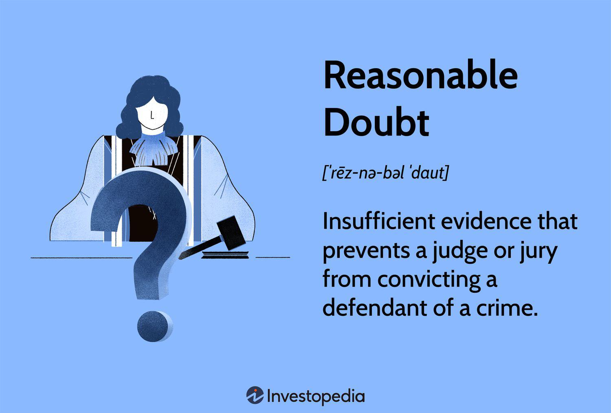

In the complex world of law and finance, understanding the concept of reasonable doubt and the burden of proof is crucial, especially in contexts like algorithmic trading. These foundational legal principles play a significant role in shaping how trading activities are conducted and regulated, ensuring integrity within financial markets. As algorithmic trading relies on intricate algorithms and high-speed executions, applying legal standards ensures that such practices remain transparent and within the bounds of law.

This article explores how these legal principles intersect and their implications for the financial industry, emphasizing the importance of compliance with regulatory standards. The complexities of algorithmic trading require traders and financial institutions to adhere to strict regulatory guidelines to prevent market abuse and maintain fair trading environments. Legal constructs like reasonable doubt and the burden of proof help delineate responsibilities and liabilities, providing a framework for evaluating compliance and enforcement of regulations.

The relationship between reasonable doubt, legal burden, and algorithmic trading is not just theoretical; it has real-life implications for traders and legal professionals. For industry participants, grasping these concepts is crucial for navigating compliance challenges and minimizing legal risk. Legal professionals, on the other hand, need a deep understanding to effectively address disputes and challenges arising from trading activities.

Understanding these concepts is essential to navigate the ever-evolving regulatory landscapes in digital trading environments. With advancements in trading technologies and increasing regulatory scrutiny, both traders and legal advisers must stay informed and adaptable to emerging legal standards and regulatory expectations. By investigating these topics, the article aims to enlighten readers on how these legal standards are applied and enforced in various trading scenarios, providing insights that are essential for ensuring compliance and fostering a transparent financial system.

## Table of Contents

## What is Reasonable Doubt?

Reasonable doubt is a fundamental legal standard in criminal law that obliges the prosecution to establish the guilt of the defendant so compellingly that no other logical explanation remains possible. This threshold is designed to ensure the protection of innocent individuals from wrongful conviction, embodying the principle of 'innocent until proven guilty.' By mandating such a high degree of certainty for convictions, the reasonable doubt standard mitigates the risk of error in judicial processes.

The reasonable doubt doctrine serves as both a procedural safeguard and a core element of justice systems globally, reinforcing public trust in legal outcomes. It demands that evidence presented in court is overwhelming and leaves little room for alternative interpretations, thereby limiting the possibility of miscarriages of justice.

This standard is not merely theoretical but practical, aiming to uphold individual rights against potential state overreach. By maintaining a high evidential bar, the reasonable doubt threshold underscores the commitment to fairness and justice, ensuring that legal determinations are reliable and devoid of significant uncertainty. Such stringent criteria are pivotal in aligning legal proceedings with ethical and moral constructs, offering a robust framework for adjudicating criminal cases.

## The Legal Burden of Proof

The burden of proof is a fundamental concept in legal proceedings, serving as the obligation placed upon a party to prove or disprove a disputed fact. It determines which party is responsible for presenting evidence and plays a critical role in ensuring fairness during trials. This principle ensures that decisions are made based on evidence rather than assumptions or biases, maintaining the integrity of the judicial process.

In criminal cases, the burden of proof lies with the prosecution. The prosecution must establish the defendant's guilt beyond a reasonable doubt, a high standard that requires evidence to be so convincing that no other logical explanation can refute the defendant's guilt. This high threshold is designed to protect individuals from wrongful convictions and uphold the foundational legal principle of 'innocent until proven guilty.'

Conversely, in civil cases, the burden of proof typically rests with the plaintiff. The standard employed here is the 'preponderance of the evidence,' which is significantly lower than the standard required in criminal cases. It requires the plaintiff to demonstrate that the claim is more likely true than not. In mathematical terms, this can be expressed as a probability greater than 50%. The lower standard in civil cases reflects the different stakes involved, as these cases often pertain to disputes over rights, obligations, or compensation rather than criminal liability.

The different standards of proof underscore the varying levels of certainty required to establish facts in legal proceedings, depending on the nature and consequences of the case. Understanding the nuances of this burden is crucial for legal professionals as they navigate the complexities of the law to achieve just outcomes.

## The Nexus of Legal Standards and Algorithmic Trading

Algorithmic trading, characterized by the use of sophisticated algorithms to execute trades at speeds that far surpass human capabilities, presents unique challenges and opportunities in the financial markets. The application of legal standards of proof such as reasonable doubt and preponderance of evidence becomes particularly significant in evaluating compliance with financial regulations.

Regulatory authorities like the U.S. Securities and Exchange Commission (SEC) and the Commodity Futures Trading Commission (CFTC) play a pivotal role in ensuring that [algorithmic trading](/wiki/algorithmic-trading) adheres to established guidelines. These bodies are tasked with the continued oversight and formulation of rules to curb market manipulation and ensure fair trading practices. As part of this regulatory framework, firms engaging in algorithmic trading strategies are required to maintain rigorous compliance protocols.

The concept of reasonable doubt, although primarily a criminal law standard, underscores the necessity for trading firms to unequivocally demonstrate that their trading algorithms comply with all relevant regulations. This requirement translates into a burden similar to that of establishing a legal case, where firms must provide sufficient evidence to show their adherence to trading standards. Such evidence commonly includes detailed algorithm logs, trade execution reports, and compliance certifications.

Preponderance of evidence, a standard more typically applied in civil cases, may also be invoked during regulatory investigations to assess whether a firm has engaged in practices that breach trading rules. This standard requires that the evidence presented must simply outweigh any counterclaims, making it a more flexible yet critical aspect of regulatory compliance.

Algorithmic trading firms must ensure that they have a robust compliance infrastructure to meet these standards. This includes the development and maintenance of comprehensive audit trails and risk management systems. The ability to trace the decision-making process of an algorithm and provide a transparent account of its activities is essential not only for regulatory compliance but also for safeguarding market integrity.

In summary, the integration of legal proof standards within algorithmic trading is crucial for aligning fast-paced technological advancements with the existing legal and regulatory frameworks. This ensures a level playing field in the financial markets, protecting both traders and the broader economy from the risks associated with manipulative and non-compliant trading activities.

## Compliance and Regulatory Challenges in Algo Trading

Ensuring compliance in algorithmic trading is a multifaceted challenge largely due to the intricate nature of the algorithms and the sheer [volume](/wiki/volume-trading-strategy) of transactions they process. Algorithmic trading involves the use of sophisticated mathematical models and extensive data analysis, executed at speeds far beyond human capability. This complexity can often make it difficult for regulatory bodies to fully understand and scrutinize the algorithms’ functions and their implications on market behavior.

Trading firms are required to maintain comprehensive records that clearly demonstrate their compliance with financial regulations. These records serve as evidence of their adherence to established rules, effectively acting as proof of their 'innocence' in any potential investigation or inquiry. The transparency of trading strategies and algorithms is paramount, as it allows regulatory authorities to assess whether the systems align with legal and ethical standards.

Failure to meet these compliance standards can lead to severe penalties. Financial penalties can vary significantly, and in serious cases, regulators like the U.S. Securities and Exchange Commission (SEC) or the Commodity Futures Trading Commission (CFTC) might impose sanctions or outright bans on trading activities. These consequences underscore the critical importance of adherence to regulatory guidelines, emphasizing the need for firms to invest in compliance technologies and practices.

An effective compliance strategy not only involves keeping detailed records but also implementing robust systems for monitoring and auditing algorithm performance and their outcomes. This includes back-testing methodologies, performing regular stress testing, and adapting to new regulatory changes promptly. These practices are essential to ensure that trading algorithms are not only performing efficiently but are also aligned with regulatory requirements.

Maintaining market integrity and public trust is crucial for the financial system. Assurance of compliance through detailed documentation and transparent operations helps safeguard against potential market manipulation or systemic risk posed by unethical or illegal trading activities. Only through rigorous compliance processes and constant vigilance can the financial industry assure stakeholders of the security and fairness of the trading environment. 

To navigate these challenges effectively, firms often employ compliance officers and legal experts with specialized knowledge in algorithmic trading and financial regulations, ensuring that the trading operations remain within the legal framework. As the technology behind algorithmic trading continues to evolve, the necessity for robust compliance frameworks and adaptive strategies remains incessant, underpinning the stability and integrity of modern financial markets.

## Conclusion

The interplay between legal standards of reasonable doubt and the burden of proof is critical in both legal and financial sectors. This intersection is particularly evident in the domain of algorithmic trading, where rigorous compliance standards are paramount. Legal principles, applied within the trading sphere, play a crucial role in ensuring that trading firms adhere to strict regulatory guidelines, thus safeguarding both traders and market integrity from fraudulent practices. Such adherence is not merely a theoretical exercise but a practical necessity, given the potential for significant financial and reputational damage arising from non-compliance.

As technology continues to advance, the ways in which these legal principles are understood and applied must also evolve. Algorithmic trading environments are marked by rapid innovation and increasing complexity, necessitating a dynamic approach to legal compliance and oversight. New technological developments, such as [machine learning](/wiki/machine-learning) algorithms and high-frequency trading, present unique challenges that must be met with proportional advances in the application of legal standards. Therefore, the frameworks that govern these practices must be continually reassessed and revised to remain effective.

Continuous education and adaptation are essential for professionals navigating the converging fields of law and finance. Staying abreast of regulatory updates, legal standards, and technological advancements equips professionals to manage the challenges posed by the evolving landscape of digital trading. This commitment to lifelong learning not only enhances individual expertise but also contributes to the broader goal of maintaining a robust and trustworthy financial system.

## References & Further Reading

For individuals seeking to enhance their understanding of the intersection between legal standards, algorithmic trading, and compliance, several resources are invaluable. 

Legal journals often provide comprehensive analyses of recent case law, judicial interpretations, and emerging trends related to reasonable doubt and the burden of proof. Some notable journals include the Harvard Law Review, Stanford Law Review, and the Journal of Financial Regulation. These publications frequently address how traditional legal concepts are applied within the context of modern financial systems.

Texts on financial regulations, such as "Financial Regulations: A Guide to From Principles to Practices" by Charles Goodhart and "The Law of Financial Services Groups" by Charles Proctor, offer insights on regulatory standards and governance. They discuss how regulators, like the Securities and Exchange Commission (SEC) and the Commodity Futures Trading Commission (CFTC), enforce compliance in sectors heavily reliant on technology, such as algorithmic trading.

To understand algorithmic trading methodologies more thoroughly, [books](/wiki/algo-trading-books) such as "Algorithmic Trading and DMA: An Introduction to Direct Access Trading Strategies" by Barry Johnson and "Algorithmic Trading: Winning Strategies and Their Rationale" by Ernest P. Chan detail the technical and strategic aspects of high-frequency trading. These works explain the algorithms behind trade execution and the implications for compliance and regulation.

Regulatory guidelines from agencies like the SEC and CFTC provide a framework for understanding current compliance expectations and future regulatory directions. These documents are critical for professionals who need to ensure that their trading practices and technologies meet legal and ethical standards.

Industry analyses, compiled by research institutions and consulting firms, frequently offer a broader perspective on how technology reshapes law and finance. Reports by firms such as Deloitte, McKinsey, and the International Monetary Fund (IMF) can help one anticipate changes, prepare for compliance requirements, and comprehend the global impact of financial regulation.

Continued learning through courses and seminars by organizations such as the American Bar Association (ABA) and the Chartered Institute for Securities & Investment (CISI) can also keep professionals updated on legal and financial advancements. As innovations in technology continue to influence these fields, staying informed ensures adept navigation of the complex landscapes of law and finance.

