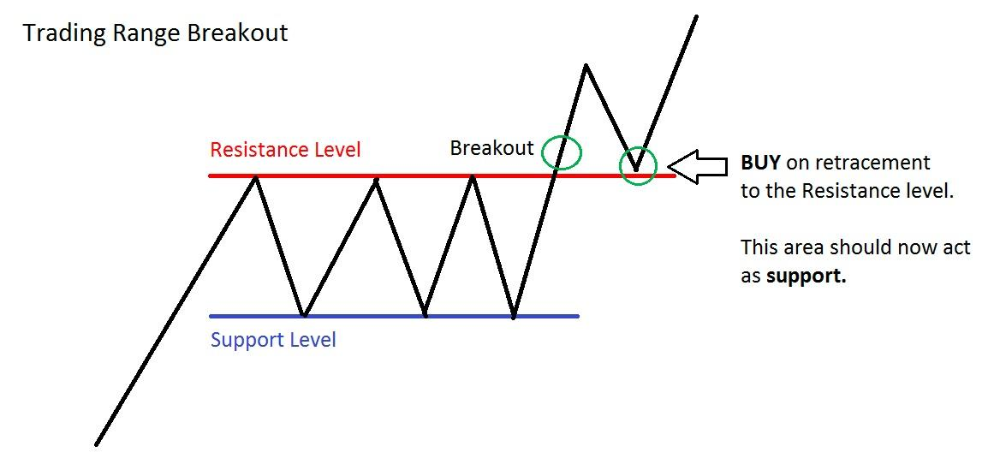

In the ever-evolving landscape of financial markets, understanding the intricacies of investment risks and trading strategies is more crucial than ever. This article examines the intersection of investment risks, trading strategies, range breakouts, and algorithmic trading, offering a comprehensive overview of how these elements interact and influence trading success.

A range breakout is a trading strategy that focuses on identifying price levels beyond which a significant movement is likely to occur. Traders often employ this technique to exploit large price movements after a period of market consolidation, aiming for substantial profits. However, the efficacy of range breakout strategies heavily relies on accurate identification of breakout points and market conditions, making it susceptible to various risks.



Algorithmic trading, on the other hand, uses computer programs to execute trades at speeds and frequencies that humans cannot match. These algorithms base their decisions on pre-set criteria and real-time market data, allowing for efficient and accurate trading operations. As algorithmic trading grows more prevalent, its integration with traditional strategies, such as range breakouts, provides a novel approach to mitigating risks and enhancing decision-making capabilities.

As financial environments become increasingly complex, the importance of comprehending and managing risks cannot be overstated. This complexity demands a balanced approach, combining the analytical rigor of algorithmic trading with the intuitive insights of traditional strategies. By doing so, traders can better navigate challenges and optimize their performance.

This article's primary objective is to analyze the risks associated with range breakout strategies and explore how algorithmic trading can serve as a tool for risk mitigation. By examining the synergy between these methodologies, the article aims to offer insights into creating more robust trading strategies that can adapt to market volatility. Through this exploration, traders and investors can refine their approaches, turning potential risks into opportunities for growth and innovation.

## Table of Contents

## Understanding Investment Risks in Trading

In trading, understanding investment risks is crucial for success, especially when employing strategies like range breakouts. Various types of risks impact traders, each requiring distinct management strategies to mitigate potential losses.

**Types of Investment Risks:**

1. **Market Risk:** This is the possibility of an investor experiencing losses due to factors that affect the overall performance of the financial markets. For traders using range breakout strategies, market risk might manifest through sudden price movements outside expected ranges, which can lead to significant losses if trades are not executed promptly. An example is during market events such as economic announcements or geopolitical developments, where previously observed price ranges may no longer apply.

2. **Credit Risk:** This type of risk refers to the potential that a counterparty fails to meet its obligations. In the context of trading, particularly for those engaged in trades where margin or leverage is involved, the inability of a broker or another counterparty to fulfill a trade can result in financial losses.

3. **Operational Risk:** These are risks arising from failures in internal processes, systems, or policies. For example, a technical glitch in the trading platform or errors in algorithmic models can lead to incorrect trade executions, thus affecting traders relying on range breakout strategies.

**Impact on Range Breakout Strategies:**

Range [breakout](/wiki/breakout-trading) strategies depend on identifying points where the price breaks out of a defined range, suggesting a new trend. Traders face specific risks such as false breakouts, where the price does not sustain its movement beyond the breakout level. This can diminish the efficacy of a trade, leading to losses. 

Sudden market changes, which are unpredictable, can severely affect the outcome of a well-planned breakout strategy. For example, during a sudden economic downturn, historical price data used to predict breakouts may become irrelevant, resulting in substantial losses for traders who fail to adapt their strategies swiftly.

**Statistics and Case Studies:**

Consider the 2015 Swiss Franc Shock, where the Swiss National Bank removed its currency peg to the Euro. This unforeseen event resulted in significant market upheaval and traders employing range breakout strategies without adequate risk management faced substantial losses. According to reports, several [forex](/wiki/forex-system) brokers experienced insolvency due to clients' inability to meet margin calls, underscoring the importance of assessing market risk adequately.

**Necessity of Risk Assessment and Management:**

Effective risk management in trading involves continuous assessment and adaptation of strategies. Tools like stop-loss orders and diversification can mitigate potential losses. Diversification ensures that not all investments are exposed to the same type of risk, while stop-loss orders automatically close positions at a predefined loss level, cutting down potential losses in volatile markets.

In summary, traders utilizing range breakout strategies must prioritize comprehensive risk assessment and management. By considering market, credit, and operational risks, and employing appropriate risk mitigation tools, traders can enhance their chances of success and safeguard their investments against unforeseen market changes.

## Overview of Trading Strategies: Focus on Range Breakouts

Range breakout strategies are a popular trading method used to capitalize on price movements that occur when an asset's price breaks out from a defined trading range. A trading range is typically established when the price consolidates between a resistance (upper) level and a support (lower) level, suggesting a temporary equilibrium between buyers and sellers. When a breakout occurs, it signifies that this balance has shifted, indicating a potential for significant price movement. 

### Psychology and Technical Analysis Behind Range Breakouts

The psychology underpinning range breakouts revolves around trader expectations and supply-demand dynamics. Traders monitor an asset stuck in a range, waiting for a potential breakout as a signal for increased [volatility](/wiki/volatility-trading-strategies) and directional movement. The anticipation of such a move can result in a self-fulfilling prophecy, where traders execute buy or sell orders once the price breaches known support or resistance levels. Technical analysis plays a critical role, with traders employing tools like moving averages, Bollinger Bands, and relative strength indices to confirm breakouts and the strength of the resulting trend.

### Advantages and Disadvantages

Range breakout strategies offer the advantage of harnessing clear entry and [exit](/wiki/exit-strategy) points, which helps in minimizing ambiguities in decision-making. They also exploit heightened volatility, allowing for potentially significant gains in a short period. However, the approach is not without its disadvantages. False breakouts, where the price briefly moves beyond a support or resistance level but then returns to the range, can result in losses. This highlights another limitation: the strategy's reliance on precise timing and the need for effective risk management to avoid these pitfalls.

### Examples and Common Pitfalls

Successful range breakout trades often occur in markets experiencing high levels of volatility or significant news events that provide the [momentum](/wiki/momentum) necessary for a sustained price movement. For example, a stock trading between $50 and $55 that breaks above $55 can indicate the start of a new upward trend. Conversely, a common pitfall is the occurrence of false signals, such as a price breaking out only to revert quickly, misleading traders.

One effective way to mitigate the risks of false breakouts is by confirming trends with [volume](/wiki/volume-trading-strategy) analysis. A true breakout is often accompanied by above-average trading volume, signaling strong market interest and potentially validating the breakout's strength.

### Influence of Market Conditions

The efficacy of range breakout strategies is closely tied to market conditions. In trendless or low-volatility markets, breakouts may be rare or lack follow-through, leading to false signals. Conversely, in volatile or news-driven environments, breakouts can reflect genuine shifts in market sentiment, presenting lucrative opportunities. Additionally, macroeconomic factors, earnings reports, and geopolitical events can all spur breakouts by influencing investor behavior and market direction.

In conclusion, while range breakout strategies offer distinct advantages by capitalizing on anticipated market moves, they require meticulous technical analysis and risk management due to potential pitfalls like false breakouts. The overall success of these strategies can vary significantly with market conditions, making adaptive approaches essential for consistent profitability.

## Algo Trading: An Emerging Force in Trading Strategies

Algorithmic trading, often referred to as algo trading, is a method of executing orders using pre-programmed trading instructions, which can consider variables such as time, price, and volume. This approach to trading is increasingly prevalent in financial markets, significantly enhancing how trades are conducted compared to traditional human-based methods.

**Benefits of Algorithmic Trading**

The primary advantages of [algorithmic trading](/wiki/algorithmic-trading) include speed, accuracy, and the capacity to process immense volumes of data. Algorithms can scan multiple markets and exchanges within seconds, identifying potential opportunities and executing trades far faster than a human could. The precision of algorithmic trading eliminates human error in calculating and placing trades, which improves the overall execution quality. Moreover, algorithms can analyze complex datasets and identify trading signals that might be impossible to detect manually.

**Enhancing Traditional Trading Strategies**

Algo trading significantly empowers traditional trading strategies, including range breakout strategies. A range breakout occurs when a security's price moves outside a defined support or resistance level with increased volume. Algorithms efficiently monitor market conditions and execute trades when a breakout is detected, ensuring that orders are placed at optimal times and prices. This ability to respond in real-time with minimal latency allows traders to capitalize on brief market opportunities that might otherwise be missed.

**Examples of Algorithmic Tools for Range Breakout Strategies**

Several algorithmic tools have been developed to exploit range breakouts effectively. Tools such as Moving Average Crossovers and Bollinger Bands can be automated to identify potential breakout scenarios. Python, with libraries like pandas and NumPy, allows traders to create bespoke algorithms for analyzing historical data, [backtesting](/wiki/backtesting) strategies, and automating trades. For instance:

```python
import pandas as pd
import numpy as np

# Example of calculating moving average
def moving_average(data, window_size):
    return data.rolling(window=window_size).mean()

# Example of a simple breakout strategy based on moving averages
def breakout_strategy(data):
    short_window = 40
    long_window = 100

    data['Short_Moving_Avg'] = moving_average(data['Price'], short_window)
    data['Long_Moving_Avg'] = moving_average(data['Price'], long_window)

    data['Signal'] = 0
    data['Signal'][short_window:] = np.where(data['Short_Moving_Avg'][short_window:] 
                                             > data['Long_Moving_Avg'][short_window:], 1, 0)
    data['Position'] = data['Signal'].diff()

    return data
```

**Risks and Challenges of Algorithmic Trading**

Despite its advantages, algorithmic trading is not without risks and challenges. The reliance on technology means technical failures or glitches can result in significant financial losses. Algorithms also require continuous monitoring and updating to adapt to changing market conditions, which can be resource-intensive. Additionally, the complexity of algorithms and the data they process necessitate robust data management and cybersecurity measures to prevent exploitation or errors.

The increased sophistication and speed of algorithmic trading have also led to concerns about market stability and fairness. High-frequency trading, a form of algorithmic trading characterized by executing thousands of trades per second, can potentially distort markets. Such activities have prompted regulatory scrutiny and discussions around implementing measures to ensure a fair and stable trading environment.

Algorithmic trading, with its speed and precision, represents a transformative force in financial markets, offering unparalleled opportunities for improving traditional trading strategies. However, traders must remain vigilant to balance leveraging these technologies and managing the accompanying risks.

## Integrating Algo Trading with Range Breakout Strategies

The integration of algorithmic trading with range breakout strategies represents a sophisticated fusion of traditional and modern trading techniques. This synthesis capitalizes on the computational power and speed of algorithms to handle the complexities inherent in identifying and exploiting breakout opportunities.

Algorithms enhance range breakout strategies by analyzing massive datasets and making real-time decisions, an undertaking almost impossible for human traders given the speed required. Algorithms utilize technical indicators to pinpoint potential breakout zones; for instance, Bollinger Bands can signal volatility contractions, and a subsequent breakout indicates a trading opportunity. These indicators allow algorithms to systematically scan multiple market instruments, identifying setups that meet predefined criteria.

Moreover, automation plays a pivotal role in backtesting and risk assessment of breakout strategies. Algorithms can test a strategy against historical data to evaluate its performance, adjusting parameters to optimize the strategy. This allows traders to refine their approach by understanding how various conditions affect outcomes. Backtesting also contributes to risk assessment, as it provides insights into possible drawdowns and helps define risk thresholds.

Real-world scenarios illustrate the enhancement of breakout strategies through algorithms. For instance, quant funds often deploy algorithms to detect price patterns in various financial markets. When Apple Inc.'s stock price was experiencing minimal volatility in early 2020, sophisticated algorithms identified a breakout triggered by earnings reports and capitalized on the ensuing price surge. Such scenarios underscore how algorithmic trading can translate theoretical models into profitable practices.

Machine learning and AI further augment decision-making processes in trading. These technologies enable the development of adaptive models that learn from new data inputs, refining their predictions about breakout events. For example, [reinforcement learning](/wiki/reinforcement-learning) algorithms can understand trading environments dynamically, choosing actions that maximize the cumulative gain based on historical performance. They adapt to changing market conditions, ensuring that strategies remain relevant.

Incorporating [machine learning](/wiki/machine-learning) algorithms involves training a model on historical price data to predict potential breakouts. A simple example is using Python's scikit-learn library to implement a logistic regression that predicts breakout likelihood:

```python
from sklearn.model_selection import train_test_split
from sklearn.linear_model import LogisticRegression
from sklearn.preprocessing import StandardScaler
import pandas as pd

# Load dataset
data = pd.read_csv('price_data.csv')

# Features and target variable
X = data[['volatility_index', 'moving_average', 'volume']]
y = data['breakout_occurred']

# Train-test split
X_train, X_test, y_train, y_test = train_test_split(X, y, test_size=0.2, random_state=42)

# Data scaling
scaler = StandardScaler()
X_train_scaled = scaler.fit_transform(X_train)
X_test_scaled = scaler.transform(X_test)

# Logistic Regression Model
model = LogisticRegression()
model.fit(X_train_scaled, y_train)

# Predict breakout probabilities
breakout_predictions = model.predict_proba(X_test_scaled)[:, 1]

# Output predictions
print("Breakout probabilities:", breakout_predictions)
```

This code provides a framework for using machine learning to inform trading strategy decisions by estimating the probability of a breakout, thus allowing traders to make data-driven decisions.

Through the integration of algorithmic tools and range breakout strategies, traders harness technology to gain a competitive edge. By automating decision-making processes, optimizing strategies via backtesting, and employing AI to enhance adaptability, they not only improve efficiency but also increase the likelihood of outperforming traditional manual trading approaches.

## Risk Mitigation in Algo Trading and Range Breakouts

Effective risk mitigation in algorithmic trading and range breakouts involves a multifaceted approach to ensure that trading strategies are both profitable and resilient. One of the primary methods of risk management is diversification, which involves spreading investments across various financial instruments or asset classes to reduce exposure to any single market event. By diversifying, traders can mitigate the impact of adverse price movements in one asset, contributing to more stable overall portfolio returns.

Stop-loss orders are another critical component in risk mitigation. These orders automatically sell a security when its price reaches a predefined level, protecting traders from significant losses during volatile market conditions. For example, if a trader sets a stop-loss order at 5% below the purchase price of a stock, the system will automatically sell the stock if its price falls to that level, limiting potential losses.

Automated risk management tools play a crucial role in modern trading environments by executing risk strategies without manual intervention. These tools can manage complex algorithms, adapt to market changes, and ensure that risk parameters are adhered to consistently. Continuous monitoring and adjustment of algorithmic models are vital for risk mitigation. This involves regularly reviewing and updating models to reflect current market conditions and dynamics. By closely monitoring these models, traders can identify signs of model degradation or inaccuracies and make necessary adjustments to maintain their effectiveness.

Choosing the right algorithms involves considering the specific risk profiles of traders or investors. Algorithms should be customized to reflect individual risk tolerance and market insights. For instance, a volatility-sensitive algorithm might incorporate metrics like the standard deviation or beta to adjust trading positions dynamically in response to market conditions. Customization ensures that strategies align with each trader's unique objectives and risk tolerance.

Simulation and scenario analysis are crucial for evaluating strategy risks before deploying them in live markets. By simulating various market conditions, traders can assess how strategies perform under different scenarios, such as market crashes or sudden volatility spikes. This process helps in understanding potential risks and crafting contingency plans. Scenario analysis involves constructing hypothetical situations and observing how strategies perform, allowing for proactive adjustments to minimize risks.

In summary, risk mitigation in algorithmic trading and range breakouts is achieved through a blend of diversification, the use of stop-loss orders, automated tools, continuous monitoring, and careful selection and customization of algorithms. Incorporating simulation and scenario analysis further ensures that strategies are robust and adaptable to changing market dynamics.

## Future Trends and Considerations

Algorithmic trading and range breakout strategies continue to evolve with advancements in technology and data analytics, suggesting several future trends. One significant trend is the integration of [artificial intelligence](/wiki/ai-artificial-intelligence) (AI) and machine learning (ML) into trading systems. These technologies enable the development of more robust and adaptive algorithms capable of learning from large datasets. This learning potential enhances the prediction of market movements and the identification of range breakout opportunities. AI and ML algorithms can process and analyze real-time data efficiently, leading to improved decision-making and execution accuracy.

The regulatory and ethical landscape of algorithmic trading is also likely to shift. As algorithms become more prevalent, regulators worldwide are examining their potential impact on market stability and fairness. Ensuring transparency and accountability in algorithm deployment will be crucial. Initiatives may include mandating extensive testing of algorithms before deployment, continuous monitoring for compliance, and setting ethical guidelines to avoid market manipulation and the exploitation of informational asymmetries.

Technology is not static, and several emerging tools could imminently reshape trading strategies. Quantum computing, for instance, holds the promise of exponentially faster data processing, solving complex problems that are infeasible for current systems. Moreover, the integration of blockchain technology for secure and transparent transaction methodologies could commence, enhancing the integrity of trading frameworks.

Trading professionals must embrace continuous learning and adaptive strategies to remain competitive amid these changes. As new methodologies and analytical tools emerge, familiarity with cutting-edge technologies and data science techniques becomes essential. Education programs and professional development courses in algorithmic trading, AI, and ML are valuable investments for traders aiming to refine strategies and optimize performance in an increasingly automated landscape.

Traders and investors should view these advancements not as threats but as opportunities for innovation and efficiency. By staying informed about technological and regulatory changes, they can leverage emerging tools to refine their strategies and improve overall market performance. Encouraging ongoing research and thoughtful risk assessment will be key to thriving in the dynamic world of trading.

## Conclusion

The intersection of algorithmic trading and range breakout strategies offers a sophisticated approach that balances leveraging technology with managing inherent trading risks. Throughout this article, we have explored how these strategies can enhance trading precision and effectiveness, but also the potential pitfalls if risks are not adequately addressed. The integration of algorithmic tools enables traders to capitalize on breakout opportunities with greater speed and accuracy. However, this sophisticated approach demands a robust framework for risk management and continuous monitoring to adapt to an ever-changing market.

Staying informed and adaptable is paramount for success in today's trading environments. As technological advancements continue to reshape financial markets, traders must remain vigilant to not only capitalize on new opportunities but also to mitigate emerging risks. By remaining informed and adjusting strategies based on market feedback and new insights, traders can refine their approaches and enhance performance.

Moreover, risks should not solely be viewed as challenges; they provide opportunities for refining trading strategies. By understanding and analyzing risks, traders can identify weaknesses and optimize their strategies for better outcomes. The continuous evolution of trading technologies, such as AI and machine learning, demands ongoing research and informed decision-making. 

The call to action is clear: traders and investors must engage in further research and remain proactive in decision-making to stay ahead. By leveraging algorithmic tools while diligently managing associated risks, traders can enhance their strategies and achieve robust trading performance.

## References & Further Reading

[1]: Bergstra, J., Bardenet, R., Bengio, Y., & Kégl, B. (2011). ["Algorithms for Hyper-Parameter Optimization."](https://proceedings.neurips.cc/paper/2011/file/86e8f7ab32cfd12577bc2619bc635690-Paper.pdf) Advances in Neural Information Processing Systems 24.

[2]: ["Advances in Financial Machine Learning"](https://www.amazon.com/Advances-Financial-Machine-Learning-Marcos/dp/1119482089) by Marcos Lopez de Prado

[3]: ["Evidence-Based Technical Analysis: Applying the Scientific Method and Statistical Inference to Trading Signals"](https://www.amazon.com/Evidence-Based-Technical-Analysis-Scientific-Statistical/dp/0470008741) by David Aronson

[4]: ["Machine Learning for Algorithmic Trading"](https://github.com/stefan-jansen/machine-learning-for-trading) by Stefan Jansen

[5]: ["Quantitative Trading: How to Build Your Own Algorithmic Trading Business"](https://www.amazon.com/Quantitative-Trading-Build-Algorithmic-Business-ebook/dp/B097QGPVND) by Ernest P. Chan