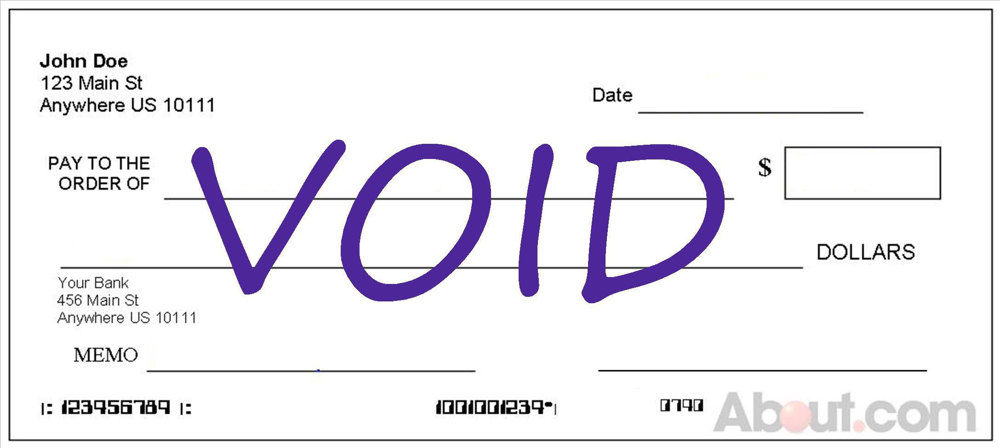

## Table of Contents

## What is a broker and why do they need personal information?

A broker is someone who helps you buy or sell things like stocks, insurance, or real estate. They work as a middle person between you and the market or the company you're dealing with. Brokers need to know a lot about what you want and what you can afford so they can help you make good choices.

Brokers ask for personal information to make sure they can serve you better. They need things like your name, address, and sometimes your financial details to complete transactions and follow the rules. This information helps them keep your account safe and make sure everything is done correctly.

## What types of personal information do brokers typically request?

Brokers usually ask for your name, address, and phone number. They need this to set up your account and to contact you. They might also ask for your email address so they can send you important updates and documents.

Sometimes, brokers need to know more about your money situation. They might ask for your social security number, your job, how much money you make, and what you own. This helps them make sure you can afford what you're buying and to follow the law.

In some cases, brokers might also ask for things like your driver's license or passport number. This is to check who you are and to keep your account safe from fraud. They use this information to make sure everything is done right and to protect you.

## How is personal information used in the account opening process?

When you open an account with a broker, they use your personal information to set everything up. They need your name, address, and phone number to create your account and to be able to talk to you about your investments or purchases. Your email address is also important because they will send you important papers and updates through it. All this information helps them make sure that the account is really yours and that they can reach you when they need to.

Brokers also need to know about your money situation. They might ask for your social security number, what you do for a job, how much you earn, and what you own. This helps them check if you can afford what you want to buy and to make sure they are following the rules. Sometimes, they will ask for your driver's license or passport number to make sure you are who you say you are. This helps keep your account safe and prevents other people from using it.

## What are the legal requirements for brokers to collect personal information?

Brokers have to follow rules from the government about collecting personal information. These rules are there to protect you and to stop bad things like money laundering or fraud. When you open an account, brokers need to know who you are and where your money comes from. This is called "Know Your Customer" or KYC rules. They have to check your identity with things like your social security number or driver's license to make sure you are who you say you are.

There are also laws like the Gramm-Leach-Bliley Act in the United States that tell brokers how they can use and protect your personal information. These laws say that brokers must keep your information safe and tell you how they will use it. They can't share your information with others without your okay, except in certain situations like when the law says they have to. These rules help make sure your information stays private and is used the right way.

## How does providing personal information help in complying with anti-money laundering (AML) laws?

When you give your personal information to a broker, it helps them follow the rules about stopping money laundering. These rules are called anti-money laundering (AML) laws. Brokers need to know who you are and where your money comes from to make sure no one is using their services to hide dirty money. By checking your identity with things like your social security number or driver's license, brokers can make sure you are who you say you are and that your money is coming from a good place.

This process is important because it helps keep the financial system safe and stops bad people from using it to do illegal things. If brokers did not collect and check your personal information, it would be easier for criminals to move money around without getting caught. So, by sharing your details, you are helping brokers do their job and keep the system honest and safe for everyone.

## What role does personal information play in Know Your Customer (KYC) procedures?

Personal information is very important in Know Your Customer (KYC) procedures. When you want to open an account with a broker, they need to know who you are. They use your name, address, and other details to check your identity. This helps them make sure you are not pretending to be someone else. They might ask for things like your social security number or driver's license to do this check.

KYC procedures are there to protect you and the financial system. By collecting and checking your personal information, brokers can make sure they are not helping bad people do illegal things. It's all about keeping things safe and honest. When brokers know who their customers are, they can stop problems like money laundering and fraud. So, giving your personal information helps brokers follow the rules and keep everyone's money safe.

## How is personal information used to assess a client's risk profile?

When you open an account with a broker, they use your personal information to figure out how much risk you might take with your money. They look at things like how much money you make, what you do for a job, and how much money you have saved. This helps them understand if you can handle big ups and downs in the market or if you need to be more careful with your investments. They might ask about your age and how long you plan to keep your money invested, because these things can change how much risk you're willing to take.

Brokers use this information to make a risk profile for you. This profile helps them suggest investments that fit with how much risk you can handle. For example, if you have a lot of money and can afford to lose some, they might suggest riskier investments that could give you bigger rewards. But if you don't have much money or need it soon, they will suggest safer investments. By knowing your risk profile, brokers can help you make better choices with your money and keep it safe.

## What are the security measures brokers implement to protect personal information?

Brokers take many steps to keep your personal information safe. They use strong computer systems and special software to protect your data from hackers. They also make sure that only certain people in their company can see your information. These people have to follow strict rules about how they handle your data. Brokers also use something called encryption, which is like putting your information in a secret code that only they can read.

Another way brokers protect your information is by following the law. They have to meet rules set by the government about keeping your data safe. This means they have to check their security systems often to make sure they are working well. They also have to tell you if there is ever a problem with your data, so you can take steps to protect yourself. By doing all these things, brokers work hard to make sure your personal information stays private and secure.

## How can personal information impact a broker's ability to offer certain financial products?

When you give your personal information to a broker, it helps them decide what financial products they can offer you. They look at things like how much money you make, what you do for a job, and how much you have saved. This information tells them if you can handle certain investments or if you need something safer. For example, if you have a lot of money and can take risks, they might suggest stocks or other high-risk investments. But if you don't have much money or need it soon, they will offer safer options like bonds or savings accounts.

Brokers also need to follow rules about what they can sell to you. Some financial products have rules about who can buy them. For example, some investments might only be for people who make a certain amount of money or have a lot of experience with investing. By knowing your personal details, brokers can make sure they are offering you products that you are allowed to buy and that fit with your money situation. This helps them give you the best advice and keep you safe from making bad choices with your money.

## What are the consequences of not providing personal information to a broker?

If you don't give your personal information to a broker, they might not be able to open an account for you. Brokers need to know who you are and where your money comes from to follow the law. If they can't check your identity and your money situation, they can't let you start investing or buying things through them. This is because they have to stop bad things like money laundering and fraud, and they can't do that without your information.

Not giving your personal information can also mean you won't get the best advice from your broker. They use your details to understand how much risk you can take with your money. Without this information, they can't suggest the right investments for you. They might give you options that are too risky or too safe for your needs, which could lead to problems with your money. So, sharing your personal information helps brokers help you better.

## How do international regulations affect the collection and use of personal information by brokers?

International regulations make it important for brokers to be very careful with your personal information. Different countries have different rules about what information brokers can collect and how they can use it. For example, in the European Union, there is a law called the General Data Protection Regulation (GDPR) that says brokers must protect your data and ask for your permission before they use it. In the United States, there are laws like the Gramm-Leach-Bliley Act that tell brokers to keep your information safe and to tell you how they will use it. These rules help make sure your information is used in a fair and safe way, no matter where you are.

Because of these different international rules, brokers have to be ready to follow many laws at once. If a broker works with people from different countries, they need to know and follow the rules of each country. This can make things more complicated, but it's important for keeping your information safe. By following these international regulations, brokers can make sure they are doing the right thing and protecting your privacy, no matter where you live.

## What are the best practices for brokers in handling and storing personal information?

Brokers should always use strong security to keep your personal information safe. They need to use special computer systems and software that protect your data from hackers. They should also make sure that only certain people in their company can see your information, and these people must follow strict rules about how they handle your data. Another important thing is encryption, which is like putting your information in a secret code that only the broker can read. By doing all these things, brokers can keep your personal information private and secure.

Brokers also need to follow the law when they handle and store your information. They have to check their security systems often to make sure they are working well. If there's ever a problem with your data, they have to tell you right away so you can protect yourself. They should also tell you how they will use your information and get your permission before they share it with anyone else. By following these best practices, brokers can make sure they are doing the right thing and keeping your information safe.

## References & Further Reading

[1]: ["The Role of Data Brokers in Financial Markets and Trading"](https://www.forbes.com/councils/forbesbusinesscouncil/2022/10/19/data-toxicity-and-the-role-of-financial-data-brokers/) - ScienceDirect

[2]: ["Advances in Financial Machine Learning"](https://www.amazon.com/Advances-Financial-Machine-Learning-Marcos/dp/1119482089) by Marcos Lopez de Prado

[3]: ["Data Security in Finance: Protecting Personal Information"](https://www.consumerfinance.gov/about-us/newsroom/cfpb-finalizes-personal-financial-data-rights-rule-to-boost-competition-protect-privacy-and-give-families-more-choice-in-financial-services/) - Finance Innovation

[4]: ["Quantitative Trading: How to Build Your Own Algorithmic Trading Business"](https://www.amazon.com/Quantitative-Trading-Build-Algorithmic-Business/dp/1119800064) by Ernest P. Chan

[5]: ["Cybersecurity in Finance: Addressing Emerging Threats"](https://carnegieendowment.org/2020/11/18/enduring-cyber-threats-and-emerging-challenges-to-financial-sector-pub-83239) - Federal Reserve Board

[6]: ["The Impact of Regulation on Algorithmic Trading"](https://greenbirch.net/the-impact-of-regulation-on-algorithmic-trading/) - Emerald Insight