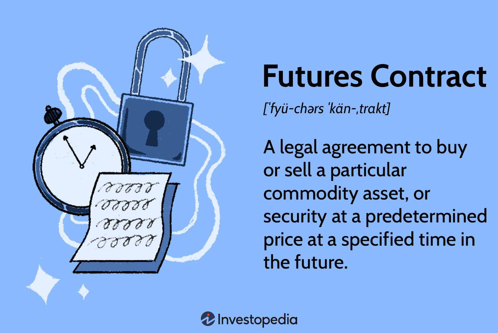

Risk management in corporate finance is an essential discipline aimed at identifying, assessing, and mitigating financial risks. By implementing effective risk management strategies, corporations can protect their financial health and ensure sustainable growth. Among the various tools employed in risk management, futures contracts hold a significant place. Futures contracts are standardized financial derivatives that allow corporations to agree on the future purchase or sale of an asset at a predetermined price. This mechanism enables companies to hedge against fluctuations in asset prices, thereby reducing uncertainty and potential losses.

These contracts are a cornerstone of financial markets, providing liquidity, transparency, and reduced credit risk. They are instrumental for corporations looking to mitigate price volatility and maintain stability in their financial operations. Furthermore, futures contracts support speculative activities, allowing companies to potentially profit from expected future price movements.



Algorithmic trading complements futures contracts by enhancing the efficiency and precision of executing trades. This form of trading involves the use of complex algorithms and advanced technology to automatically execute trades, often without human intervention. By leveraging algorithmic trading, corporations can benefit from rapid trade execution, reduced latency, and increased market accuracy when managing futures contracts. This seamless integration of technology not only optimizes the management of financial risks but also allows firms to respond swiftly to market changes.

This article explores the intricate relationship between futures contracts, risk management, corporate finance, and algorithmic trading. By understanding and integrating these elements, corporations can effectively shield themselves from potential financial threats and shape robust financial strategies for the future.

## Table of Contents

## Understanding Futures Contracts

Futures contracts are standardized financial instruments that obligate the parties involved to transact a specified quantity of an asset, be it a commodity, currency, or financial instrument, at a predetermined price on a set future date. The standardization of these contracts occurs on regulated exchanges, whose role is to ensure transparency and liquidity in the market. This structure significantly diminishes the credit risk typically associated with over-the-counter (OTC) transactions, as the exchange itself assumes the counterparty risk.

Trading futures contracts on exchanges such as the Chicago Mercantile Exchange (CME) or the Intercontinental Exchange (ICE) provides market participants with access to robust price discovery mechanisms. These platforms facilitate a continuous flow of information regarding supply and demand dynamics, contributing to the formation of a transparent market price. Consequently, futures markets are often seen as barometers for the underlying spot markets, reflecting real-time sentiment and conditions.

Corporations leverage futures contracts primarily for hedging and speculative purposes. Hedging involves the use of futures to mitigate exposure to adverse price movements in the underlying asset. For example, an agricultural producer might use wheat futures to lock in a sale price for their crop, protecting against the risk of falling prices before harvest. This kind of protective measure stabilizes revenue streams and cost structures, allowing for improved financial forecasting and planning.

Conversely, futures contracts also attract entities seeking to capitalize on anticipated price movements. Speculators assume the risk of price variability in hopes of achieving financial gain. This activity, while risky, enhances market [liquidity](/wiki/liquidity-risk-premium) and allows for more efficient risk sharing among market participants.

In sum, futures contracts serve as vital instruments in financial markets, offering both hedging capabilities and speculative opportunities. They empower companies to proactively manage financial risks and harness the inherent [volatility](/wiki/volatility-trading-strategies) in asset prices to their strategic advantage.

## Hedging with Futures Contracts

Hedging is a fundamental risk management technique that enables businesses to protect themselves against unfavorable price movements in various assets, such as commodities and currencies. In the context of futures contracts, hedging helps companies manage price volatility by locking in prices for future transactions. This approach reduces uncertainty in revenue and cost structures, thereby providing a more predictable financial outlook.

For instance, oil companies often face significant risk due to fluctuations in [crude oil](/wiki/crude-oil) prices. By engaging in futures contracts, these companies can hedge against potential price increases or decreases. If an oil company anticipates that crude oil prices will rise, it might enter into a futures contract to purchase crude at a predetermined price, ensuring cost stability despite market volatility. Conversely, if prices are expected to fall, the company could sell futures to lock in higher prices for its production, thereby protecting its margins.

Similarly, airlines are heavily impacted by volatile fuel costs, which constitute a substantial portion of their operating expenses. By using futures contracts, airlines can hedge against potential increases in fuel prices. For example, an airline may enter into futures contracts to purchase jet fuel at a fixed price, thus safeguarding its financial performance against price spikes.

The mathematical foundation of hedging with futures can be represented by the hedge ratio, which measures the proportion of exposure covered by futures contracts. The hedge ratio is typically calculated as:

$$
\text{Hedge Ratio} = \frac{\text{Value of Position to be Hedged}}{\text{Value of Futures Position}}
$$

A hedge ratio of 1 implies a perfect hedge, where the futures position precisely offsets the risk.

Python code can be used to simulate hedging strategies and assess their effectiveness. Consider the following example, which calculates the potential savings from hedging fuel costs:

```python
# Example simulation of cost savings from hedging
def calculate_hedge_savings(future_price, spot_price, quantity):
    # future_price: price agreed upon in futures contract
    # spot_price: market price at the time of purchase
    # quantity: amount of fuel hedged in barrels
    return (spot_price - future_price) * quantity

# Parameters
future_price = 70  # per barrel
spot_price = 80    # per barrel
quantity = 1000    # barrels

savings = calculate_hedge_savings(future_price, spot_price, quantity)
print(f"Cost savings from hedging: ${savings}")
```

This code snippet demonstrates calculating cost savings when the market price exceeds the futures price, illustrating the financial benefits of a strategic hedging approach. By using futures contracts, businesses like oil companies and airlines can effectively mitigate their exposure to price volatility, ensuring financial stability and improved planning for future operations.

## The Role of Futures in Corporate Finance

Futures contracts are essential financial instruments that allow corporations to manage financial risk effectively, stabilize costs, and protect their profit margins. By locking in prices or rates for future transactions, companies can minimize the uncertainty associated with market volatility and enhance their ability to plan future financial commitments more accurately.

For example, by engaging in futures contracts, a corporation can hedge against adverse price movements in commodities, currencies, or interest rates. This hedging capability is critical for industries such as manufacturing or agriculture, where the cost of raw materials can significantly impact the bottom line. By securing a fixed price for raw materials through futures, businesses can prevent unexpected cost increases from eroding their profit margins.

Incorporating futures into a corporate financial strategy also helps ensure financial health and stability. For instance, consider a company that relies heavily on copper. By entering into a futures contract to purchase copper at a set price, the company can protect itself from potential price spikes in the copper market. This proactive approach not only stabilizes production costs but also aids in maintaining predictable profit margins.

The financial predictability afforded by futures contracts enables corporations to allocate resources more efficiently. With greater certainty over future costs and revenues, companies can make more informed decisions regarding investments, expansions, or other strategic initiatives. This calculated approach reduces the risk of unforeseen expenses compromising business objectives or financial performance.

Mathematically, a futures contract allows a company to neutralize price risk by taking an opposing position in the futures market. For example, if a firm expects to purchase a certain amount of a commodity in the future, it can buy a futures contract for that commodity. If the market price rises, the losses incurred by paying a higher price for the commodity are offset by gains in the futures position. Conversely, if the market price falls, the advantages of purchasing the commodity at a lower price compensate for losses in the futures position.

Furthermore, the use of futures helps align a corporation's financial strategy with its market exposure and risk management goals. By systematically integrating futures into these strategies, corporations can achieve a more balanced and resilient approach to financial management.

## Algorithmic Trading and Its Impact

Algorithmic trading employs advanced computational algorithms to execute trades in financial markets with high speed and accuracy, minimizing the necessity for human intervention. The use of these algorithms has significantly impacted the execution of futures contracts, particularly in implementing hedging strategies. By automating the trading process, [algorithmic trading](/wiki/algorithmic-trading) facilitates rapid decision-making and execution in response to market conditions, thereby enhancing the precision with which futures contracts can be utilized for risk management.

One of the key benefits of algorithmic trading is its ability to respond swiftly to market changes, thereby reducing latency—the time delay between the occurrence of a market opportunity and the execution of a trade. This reduction in latency allows traders to capitalize on transient price fluctuations, increasing the accuracy and timeliness of trade executions. For example, latency measures in algorithmic trading can be as low as microseconds, enabling traders to react almost instantaneously to market developments.

The algorithms employed in this kind of trading are designed to interpret vast amounts of data, recognize patterns, and execute trades based on predefined criteria. A simple example could be a moving average crossover strategy, where an algorithm buys or sells a futures contract when a shorter-term moving average crosses a longer-term moving average. In Python, this might look something like:

```python
import pandas as pd

def moving_average_crossover_strategy(data, short_window=40, long_window=100):
    signals = pd.DataFrame(index=data.index)
    signals['price'] = data['close']
    signals['short_mavg'] = data['close'].rolling(window=short_window, min_periods=1, center=False).mean()
    signals['long_mavg'] = data['close'].rolling(window=long_window, min_periods=1, center=False).mean()

    signals['signal'] = 0.0
    signals['signal'][short_window:] = np.where(signals['short_mavg'][short_window:] > signals['long_mavg'][short_window:], 1.0, 0.0)
    signals['positions'] = signals['signal'].diff()

    return signals
```

In the above code, an algorithm would generate buy signals when the short-term average price exceeds the long-term average, indicating a potential upward trend. Conversely, it could generate sell signals when the opposite occurs.

Algorithmic trading also facilitates improved risk management by allowing for the execution of complex hedging strategies that involve multiple asset classes and intricate financial instruments. The algorithms can assess ongoing risk exposures in real time and make rapid adjustments to hedge positions, thereby optimizing the hedging effectiveness.

A major advantage of algorithmic trading is the elimination of emotional decision-making, which can negatively impact trading outcomes. Instead, decisions are data-driven and executed based on a systematic framework that ensures consistency.

While algorithmic trading offers significant benefits, it also requires substantial technological infrastructure and expertise. Companies must ensure robust systems capable of handling large trade volumes and managing the complexities of trading algorithms. Furthermore, the efficacy of these systems depends on precise calibration and continuous monitoring to adapt to changing market conditions and to avoid unintended consequences such as over-leveraging or market disruptions.

## Integrating Futures and Algorithmic Trading in Risk Management

Integrating futures contracts and algorithmic trading within corporate risk management strategies offers a comprehensive approach to managing financial risks. Futures contracts allow businesses to hedge against potential price fluctuations by locking in prices or rates for assets. This predictability in pricing is crucial for financial planning and budgeting. However, the manual handling of such contracts might not be sufficient to cope with the fast-paced nature of financial markets. This is where algorithmic trading becomes instrumental.

Algorithmic trading employs sophisticated algorithms and high-speed computing to execute trades automatically, without human intervention. By using historical data and market patterns, algorithms can identify optimal times to initiate trades, determine the most advantageous prices, and manage large volumes of transactions efficiently. This rapid execution minimizes latency, ensuring that trades align closely with predetermined risk management strategies.

When combined, futures contracts and algorithmic trading bolster corporate risk management frameworks. This integration creates a dual-layered strategy: futures contracts provide the hedge against potential adverse price movements, while algorithmic trading ensures that these contracts are executed with precision, speed, and reduced human error.

For example, a corporation that is exposed to currency risk due to international operations might enter into futures contracts to hedge against foreign exchange fluctuations. By utilizing algorithmic trading, the execution of these futures contracts can be optimized to occur at critical market junctures, further aligning hedging activities with the corporation's financial objectives. This strategic synergy leads to enhanced hedging effectiveness, optimized financial outcomes, and ultimately, improved financial resilience.

Corporations leveraging this integrated approach benefit by aligning their risk management strategies with their market exposure and business goals. This not only stabilizes financial performance but also provides a competitive advantage by enhancing decision-making speed and accuracy. As technology and trading methodologies continue to advance, the potential for even more refined risk management strategies will expand.

## Challenges and Considerations

While futures contracts and algorithmic trading present substantial advantages for managing risks in corporate finance, they also introduce certain challenges that must be addressed to optimize their use.

One significant challenge is the potential for over-leveraging. Futures contracts often involve substantial leverage, which can amplify both gains and losses. While leverage provides the opportunity for impressive returns, it also increases the risk of significant losses if the market moves unfavorably. This is particularly concerning in volatile market conditions, where price fluctuations can be rapid and unpredictable. Consequently, companies must establish robust risk management frameworks to monitor and control leverage levels effectively. This ensures that the potential benefits of leverage do not lead to unsustainable financial exposure.

Another concern is market misjudgment, which can occur due to incorrect assumptions or forecasts in the algorithmic trading models. Algorithms are designed based on historical data and market patterns, but they may not always account for unprecedented events or changes in market dynamics. Errors in algorithmic predictions can lead to substantial financial risks, including incorrect hedging positions or excessive trading, which can distort market prices and increase transaction costs. It is essential for companies to continuously validate and update their algorithms to reflect current market conditions and incorporate risk mitigation mechanisms to address this challenge.

Adapting to the dynamic market environment and regulatory framework is another critical consideration. Financial markets and regulations are continuously evolving, influenced by technological advancements, economic shifts, and changes in policy. Companies engaged in futures trading and algorithmic trading need to stay abreast of regulatory changes to ensure compliance and avoid penalties. This requires maintaining a close watch on the regulatory environment and being prepared to adjust trading strategies in response to new rules or guidelines.

Furthermore, the successful implementation of futures contracts and algorithmic trading relies on a robust technological infrastructure. High-speed data processing, advanced computing capabilities, and reliable network systems are essential for executing trades accurately and efficiently. Ensuring adequate technological resources is crucial to minimize latency and avoid execution errors that could lead to financial losses. Moreover, retaining expertise in both the technical and financial aspects of these strategies is vital. This includes hiring skilled personnel who can design, optimize, and manage complex trading algorithms, as well as individuals with deep understanding of the financial markets.

In summary, while futures and algorithmic trading offer powerful tools for corporate risk management, they also require careful consideration of leveraging strategies, market analysis accuracy, regulatory compliance, and technological robustness to fully harness their benefits while mitigating potential pitfalls.

## Conclusion and Future Outlook

Futures contracts and algorithmic trading represent indispensable elements in modern risk management strategies. These instruments empower corporations by providing robust methods to mitigate risks associated with market volatility and enhance their overall financial resilience. Futures contracts enable organizations to lock in prices, thus ensuring greater predictability in their financial planning and helping to stabilize costs. This predictability is crucial in safeguarding profit margins and securing long-term sustainability.

Algorithmic trading, on the other hand, leverages technology to enhance the speed and precision of executing trades. By automating the trading process, companies can respond rapidly to market changes, thereby minimizing latency and increasing the accuracy of their trading strategies. This efficiency is particularly beneficial when deploying futures contracts as part of a comprehensive hedging strategy, offering corporations the agility required to adapt to fluctuating market conditions.

As technological advancements continue to evolve, the integration of [artificial intelligence](/wiki/ai-artificial-intelligence) (AI) and [machine learning](/wiki/machine-learning) is poised to further transform the landscape of futures trading and risk management. These technologies can enhance traditional algorithmic trading strategies by incorporating predictive analytics and automated decision-making processes, potentially improving both the accuracy and efficiency of trade executions. Machine learning models can analyze vast amounts of data to identify patterns and forecast future market trends, enabling more informed and strategic decision-making.

Such advancements may simplify complex financial landscapes, reducing the risk of human error and ensuring more consistent and reliable outcomes. As a result, corporations that effectively integrate AI-enhanced algorithmic trading with futures contracts stand to benefit from a more agile and resilient financial strategy, capable of navigating the uncertainties of global markets. The continual refinement and adoption of these technologies will shape the future of corporate finance, providing sophisticated tools for risk mitigation and financial optimization.

## References & Further Reading

[1]: Hull, J. C. (2017). ["Options, Futures, and Other Derivatives."](https://www.semanticscholar.org/paper/Options%2C-Futures%2C-and-Other-Derivatives-Hull/89bdee500c8623864fc9eb7a471546aa713acc44) Pearson Education.

[2]: Geman, H. (2005). ["Commodities and Commodity Derivatives: Modeling and Pricing for Agriculturals, Metals, and Energy."](https://download.e-bookshelf.de/download/0000/5675/90/L-G-0000567590-0015270354.pdf) Wiley Finance.

[3]: Aldridge, I. (2013). ["High-Frequency Trading: A Practical Guide to Algorithmic Strategies and Trading Systems."](https://www.amazon.com/High-Frequency-Trading-Practical-Algorithmic-Strategies/dp/1118343506) Wiley.

[4]: Murphy, J. J. (1999). ["Technical Analysis of the Financial Markets: A Comprehensive Guide to Trading Methods and Applications."](https://archive.org/details/technicalanalysi0000murp) New York Institute of Finance.

[5]: Kaminski, V. (2016). ["Energy Modelling: Advances in the Management of Uncertainty."](https://www.semanticscholar.org/paper/Energy-Modelling%3A-Advances-in-the-Management-of-Kaminski/0877af13258856a211df37f417a2fdef52833498) Palgrave Macmillan.