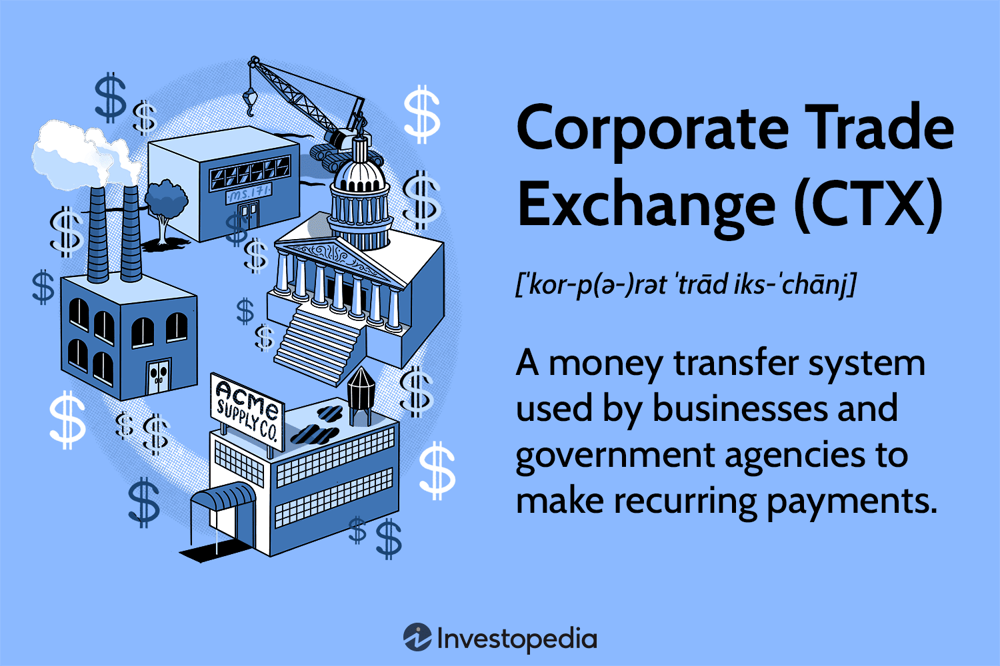

The global financial landscape is characterized by constant change and adaptation, prompting companies to make strategic decisions to align more closely with their evolving business objectives. One notable strategy involves altering stock exchange listings. This decision is influenced by factors such as liquidity, cost, prestige, and regulatory concerns. Corporations may choose to transfer between exchanges, like moving from the New York Stock Exchange (NYSE) to Nasdaq, or initiate cross-listing on multiple platforms to enhance their visibility and investor reach.

The intricacies of stock exchange corporate listings are numerous, often requiring a keen understanding of the varied requirements and implications associated with each exchange. Factors driving these decisions include the pursuit of increased liquidity, reduced fees, intensified market presence, or compliance with favorable regulatory environments. For instance, larger exchanges may offer the allure of enhanced prestige and a broader investor base, while others may present opportunities for cost efficiency and reduced regulatory burdens.



Moreover, the intersection of financial strategy with technological advancements such as algorithmic trading has further complicated the landscape. Algorithmic trading, or algo trading, utilizes computer algorithms to automate and optimize trading decisions, significantly influencing the dynamics of stock exchange attractiveness. Its ability to improve market speed, accuracy, and liquidity underlines its importance in modern trading environments.

Understanding the complex interplay among these elements—stock exchange requirements, strategic transfers, and technological innovations like algorithmic trading—is essential for companies looking to enhance their market positioning and optimize shareholder value. This guide aims to provide a comprehensive overview of these processes and their implications, documenting how businesses navigate these changes to better align with their strategic goals.

## Table of Contents

## Stock Exchange Requirements

Understanding the requirements for listing on a stock exchange is fundamental for companies aiming to enhance their visibility and access to capital markets. Each stock exchange has distinct criteria, primarily revolving around financial metrics like market capitalization, the number of publicly held shares, financial health, and corporate governance standards.

Market capitalization serves as a crucial benchmark in the listing process. It is typically calculated as the product of the company's outstanding shares and its current share price. Many exchanges stipulate a minimum market capitalization as a prerequisite for listing, ensuring that only companies of a certain scale can gain entry.

In addition to market capitalization, the number of publicly held shares is another pivotal requirement. Exchanges may specify a minimum number of shares that must be available for public trading to ensure sufficient [liquidity](/wiki/liquidity-risk-premium) and investor interest. This requirement, alongside average trading [volume](/wiki/volume-trading-strategy) metrics, aids in maintaining active and vibrant trading activities on the exchange.

Financial performance is scrutinized, with exchanges often demanding a history of profitability or specific revenue thresholds. These financial prerequisites serve to establish the economic viability and sustainability of the company, reducing the risk for investors.

Corporate governance is another focal point in listing requirements. Regulatory authorities often require companies to adhere to stringent governance standards, ensuring transparent and accountable management practices. This includes having a board of directors, independent audits, and regular financial disclosures.

Failure to comply with these exchange requirements can result in delisting, a process where a company’s shares are removed from the exchange. Delisting can have adverse consequences, impacting a company’s financial reputation and reducing stock liquidity, potentially diminishing investor confidence and limiting access to capital markets. Companies are thus obliged to maintain these standards actively to remain listed and benefit from the advantages of being part of a reputable stock exchange.

## Reasons for Exchange Transfer

Corporate strategy often dictates a move from one stock exchange to another, such as from the New York Stock Exchange (NYSE) to the Nasdaq. This strategic decision is driven by several key factors that can significantly impact a company's financial and operational standing.

One of the primary reasons companies opt to transfer their exchange listing is to reduce listing fees. These fees, which can be substantial, vary between exchanges. For instance, Nasdaq is often more cost-effective compared to NYSE, particularly for smaller or newer companies. The savings from reduced listing fees can then be redirected toward other strategic initiatives, enhancing overall corporate efficiency.

Increasing access to investors is another critical [factor](/wiki/factor-investing). Different exchanges have distinct investor bases, and companies may switch exchanges to tap into a more favorable or aligned investor demographic. For example, Nasdaq's reputation as a technology hub can attract technology-focused investors, which is advantageous for tech companies seeking targeted investment.

Improving stock liquidity is also a significant consideration. Liquidity is vital for ensuring smooth trading operations, and some exchanges provide better liquidity environments, which can lead to tighter bid-ask spreads and improved [capital raising](/wiki/hedge-fund-capital-raising) capabilities. This can ultimately lead to a more accurate reflection of the company's market valuation.

The regulatory frameworks of exchanges also play a crucial role in the decision to transfer. Companies may find the regulatory requirements of one exchange more conducive to their operational structure and strategic goals than another. Favorable regulations can reduce compliance costs and bureaucratic hurdles, thereby streamlining operations.

Examples from the corporate world illustrate these strategic benefits. Kraft Foods and PepsiCo, for instance, have successfully realized the advantages of transferring exchanges. Kraft Foods moved from NYSE to Nasdaq in pursuit of a better-aligned investor base and cost efficiencies. Similarly, PepsiCo's exchange transfer aimed at optimizing their market positioning and increasing investor accessibility, thus aligning with their long-term corporate strategy.

In summary, the transfer of stock exchange listings is a strategic move dictated by multiple factors, including the reduction of costs, access to new investor types, enhanced stock liquidity, and alignment with favorable regulatory frameworks. These factors collectively contribute to a company's ability to meet its strategic objectives and improve shareholder value.

## Algorithmic Trading and Its Role

Algorithmic trading, commonly known as algo trading, involves the utilization of advanced computational algorithms to execute trading decisions in financial markets. These algorithms are designed to follow a set of defined instructions aimed at placing trades to generate profits at speeds and frequencies that are impossible for a human trader. The primary advantages of [algorithmic trading](/wiki/algorithmic-trading) are its ability to enhance speed, accuracy, and market liquidity, factors which can attract companies to list their stocks on exchanges that support these features.

Algo trading contributes to market efficiency by increasing the speed of transactions and ensuring that trades are executed at the most favorable prices available. This automated process minimizes human error, reduces transaction costs, and allows for the processing of high volumes of data, leading to more informed trading decisions. As a result, exchanges that offer robust support for algorithmic trading become more appealing to companies looking to list their securities.

Several strategies are employed in algorithmic trading to capitalize on market opportunities:

1. **Momentum-Based Strategies**: These strategies exploit the momentum of existing market trends. An algorithm might, for example, identify a trend where prices are consistently rising and make trades that capitalize on that trend until indicators suggest a reversal. The mathematical model for a momentum-based strategy might look something like this: 
$$
   \text{Signal} = \frac{P_t - P_{t-n}}{P_{t-n}}

$$

   where $P_t$ is the current price and $P_{t-n}$ is the price $n$ time periods ago. The signal triggers buys and sells based on pre-defined thresholds.

2. **Statistical Arbitrage**: This method involves trading strategies that are based on statistical and technical analysis. Algorithms identify mispricings in securities relative to each other based on statistical models. Traders can then execute trades that exploit these discrepancies. The goal is to make risk-free profits by simultaneously buying and selling correlated securities that have deviated from their expected relationship.

   A simple example in Python could involve identifying pairs of stocks with historically correlated prices and executing trades when their prices diverge from the historical ratio:

   ```python
   import numpy as np

   def identify_pairs(stock1, stock2, historical_data):
       # Calculate the correlation between the two stocks
       correlation = np.corrcoef(historical_data[stock1], historical_data[stock2])[0, 1]
       return correlation

   def arbitrage_opportunity(stock1_price, stock2_price, historical_ratio):
       current_ratio = stock1_price / stock2_price
       if current_ratio > historical_ratio:
           # Sell stock1, buy stock2
           return "Sell stock1, buy stock2"
       elif current_ratio < historical_ratio:
           # Buy stock1, sell stock2
           return "Buy stock1, sell stock2"
       else:
           return "No arbitrage opportunity"
   ```

Algorithmic trading enhances liquidity as it allows for more continuous trading and narrows the bid-ask spread, which can lead to more favorable conditions for listing. These capabilities allow exchanges to handle large volumes of orders efficiently, maintaining market stability and attracting more listings. Understanding algo trading and its underlying strategies is crucial for interpreting market dynamics and making informed decisions on trading and stock exchange listings.

## Impact on Shareholders

Switching stock exchanges can significantly impact shareholders, primarily through changes in stock liquidity and trading volume. Liquidity refers to the ease with which shares can be bought or sold without causing a significant impact on the stock price. When a company moves to an exchange with greater liquidity, shares generally become easier to trade, which can benefit shareholders by providing them with more flexibility and potentially better pricing.

Trading volume is another crucial factor that can affect shareholders. A higher trading volume often indicates a more actively traded stock, which can lead to more efficient price discovery and reduced bid-ask spreads. This change can be particularly beneficial for shareholders who are looking to buy or sell large quantities of stock, as increased trading volume can accommodate these trades without as much impact on the stock's market price.

It's important to note that while the market mechanisms and trading conditions might improve with a change in stock exchange, the actual ownership of shares remains unaffected. Shareholders retain their equity interest in the company regardless of the exchange on which it is listed. However, the improved market conditions can lead to a more favorable environment for share price appreciation. On exchanges with higher visibility and greater analyst coverage, stocks might attract more investor interest, potentially driving up the stock price.

Moreover, the improved trading conditions and potentially enhanced stock performance resulting from an exchange transfer can strengthen investor confidence. This confidence could translate into a more loyal shareholder base and increased investor engagement, which are advantageous for the company's long-term growth and financial stability.

In summary, while the fundamental ownership position of shareholders remains unchanged during an exchange transfer, the enhanced trading environment and greater market visibility can positively impact stock prices and liquidity, offering potential benefits to shareholders in terms of trading conditions and investment value.

## Cross-Listing on Multiple Exchanges

Cross-listing is a strategic financial maneuver whereby a company lists its shares on more than one stock exchange. This practice is primarily aimed at augmenting visibility, broadening the investor base, and increasing liquidity. By having shares traded on multiple exchanges, a company can access diverse pools of capital and mitigate the risks associated with being dependent on a single market.

The benefits of cross-listing are multifaceted. Enhanced liquidity is one of the most significant advantages, as it can lead to lower [volatility](/wiki/volatility-trading-strategies) and tighter bid-ask spreads, improving the overall efficiency of price discovery. This improved liquidity is particularly beneficial for investors, as it allows easier buying and selling of shares without significant price concessions.

Cross-listing can also provide companies with greater access to capital. By tapping into international markets, firms can attract a wider array of investors, including institutional and retail investors who might otherwise be constrained from investing in foreign stocks. This accessibility can lead to increased demand for the company's shares, potentially boosting stock prices.

Diverse shareholder composition is another advantageous outcome of cross-listing. A more varied investor profile can lead to a broader set of expectations and analyses, which may stabilize stock performance. Moreover, in times of financial distress or economic downturns in one region, having a geographically diverse shareholder base can provide a buffer against localized market volatility.

Companies often undertake cross-listing to enter new markets and leverage regional advantages. For instance, a company based in Europe might list on a U.S. exchange to capitalize on America's larger and more liquid capital markets. Additionally, by being present in multiple regulatory environments, firms can align themselves with regional growth opportunities and economic policies that match their strategic goals.

Overall, cross-listing serves as a powerful tool for companies aiming to enhance their market presence and financial flexibility. While it requires navigating complex regulatory and operational challenges, the strategic benefits often outweigh these hurdles, making cross-listing a valuable consideration for globally ambitious enterprises.

## Delisting: Causes and Consequences

Delisting refers to the removal of a company's stock from being publicly traded on a stock exchange. This process can occur voluntarily or involuntarily. Voluntary delisting happens when a company decides, for strategic reasons, to withdraw its stock, possibly to go private, merge, or restructure. In contrast, involuntary delisting mainly occurs when a company fails to meet the exchange's continuous listing requirements.

Involuntary delisting can be triggered by various factors, such as not maintaining the minimum market capitalization, failing to file timely financial statements, or not meeting the minimum share price threshold for a prolonged period. For instance, an exchange may require a stock to maintain an average closing price above $1 over a consecutive 30-trading-day period. Failure to comply can start the delisting process.

The consequences of delisting are significant. It typically results in reduced visibility as the stock no longer appears on a major stock exchange, which can decrease the attention it receives from analysts and investors. This diminished visibility can lead to decreased investor confidence, as being listed on an exchange is often viewed as a mark of legitimacy and financial health.

Delisting also poses challenges in raising capital. Without access to the exchange, the company might find it harder to attract institutional investors and might face increased costs when attempting to issue new stock. Additionally, delisting can impact stock liquidity drastically, as shares may only be traded over-the-counter (OTC), which typically have less stringent regulations and lower trading volumes.

Despite these challenges, stock exchanges often collaborate with companies to prevent delisting. Exchanges may notify companies well in advance about potential non-compliance, providing time to rectify issues. Options might include reverse stock splits to boost share prices or the submission of compliance plans to address financial discrepancies.

Overall, maintaining exchange listing standards is crucial for companies to avoid the adverse effects of delisting.

## The Bottom Line

Switching stock exchanges is a strategic decision that is both complex and multifaceted, driven by various factors such as costs, regulatory environments, and market strategy. Companies often weigh these factors to align better with their long-term objectives and enhance relations with investors.

Cost considerations play a crucial role, as listing fees and associated expenses can vary significantly between exchanges. By transferring to an exchange with lower fees, companies can optimize their financial resources, potentially leading to increased profitability. However, cost should not be the sole consideration; regulatory environments also significantly influence the decision. Different exchanges operate under varying regulatory frameworks, which can affect how a company conducts its business activities. A move to an exchange with regulations that are more favorable to a company's operations can facilitate smoother regulatory compliance and reduce associated risks.

Market strategy heavily influences the decision to transfer. Companies might choose an exchange that offers greater liquidity and access to a broader pool of investors. Enhanced visibility and trading conditions can lead to better market positioning, attracting more investors and improving the perceived value of the company. Additionally, strategic alignment with market trends and investor expectations is often a critical motivator for such transfers.

Despite the inherent challenges of an exchange transfer, including the potential for short-term disruptions, the long-term benefits can be significant. Companies achieving better alignment with their strategic goals often realize enhanced market positioning. This process not only supports corporate growth but also adds value to shareholders by potentially improving stock prices and securities trading conditions.

In understanding these dynamics, companies can strategically position themselves to benefit from improved market conditions and enhanced shareholder value. Such decisions, informed by a comprehensive analysis of costs, regulatory requirements, and market strategies, can play a pivotal role in achieving long-term corporate objectives.

## References & Further Reading

[1]: Malkiel, B. G. (2015). ["The Elements of Investing."](https://www.semanticscholar.org/paper/The-Elements-of-Investing-Malkiel-Ellis/b2fab59a01cabae6002063d87f8f4773d201ff11) John Wiley & Sons.

[2]: Easley, D., López de Prado, M. M., & O'Hara, M. (2011). ["The Microstructure of the 'Flash Crash': Flow Toxicity, Liquidity Crashes, and the Probability of Informed Trading."](https://papers.ssrn.com/sol3/papers.cfm?abstract_id=1695041) Journal of Portfolio Management, 37(2), 118-128.

[3]: Pagano, M., Randl, O., Röell, A. A., & Zechner, J. (2001). ["What Makes Stock Exchanges Succeed? Evidence from Cross-Listing Decisions."](https://www.sciencedirect.com/science/article/pii/S0014292101001325) The Review of Financial Studies, 14(2), 443-477.

[4]: Gomber, P., Arndt, B., Lutat, M., & Uhle, T. (2011). ["High-Frequency Trading."](https://papers.ssrn.com/sol3/papers.cfm?abstract_id=1858626) SSRN Electronic Journal.

[5]: Amihud, Y., & Mendelson, H. (1986). ["Asset Pricing and the Bid-Ask Spread."](https://www.sciencedirect.com/science/article/pii/0304405X86900656) Journal of Financial Economics, 17(2), 223-249. 

[6]: Harris, L. (2003). ["Trading and Exchanges: Market Microstructure for Practitioners."](https://academic.oup.com/book/52292) Oxford University Press.

[7]: Foucault, T., Pagano, M., & Röell, A. (2013). ["Market Liquidity: Theory, Evidence, and Policy."](https://academic.oup.com/book/55158) Oxford University Press.