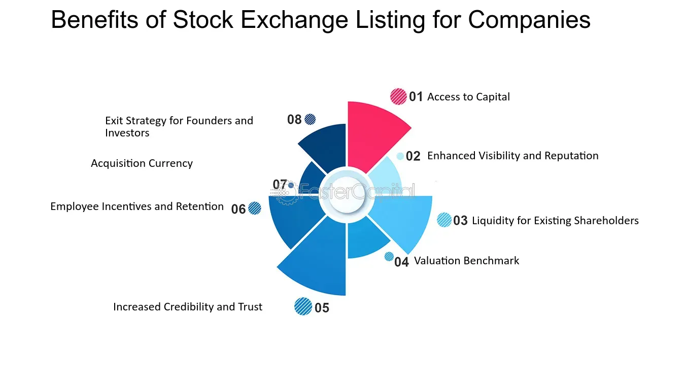

## Table of Contents

## What is a corporate exchange listing?

A corporate exchange listing is when a company's stock is added to a stock exchange, like the New York Stock Exchange or NASDAQ. This means that people can buy and sell the company's stock on that exchange. It's a big step for a company because it can help them raise money and become better known.

When a company wants to be listed on an exchange, it has to meet certain rules set by the exchange. These rules can include things like how much money the company makes, how many shares it has, and how it shares information with the public. Once a company is listed, it has to keep following these rules to stay on the exchange.

## Why do companies choose to list on a stock exchange?

Companies choose to list on a stock exchange mainly to raise money. When a company goes public and lists its shares, it can sell those shares to investors. This gives the company cash that it can use to grow, invest in new projects, or pay off debts. It's like getting a big loan, but instead of paying it back, the company gives part of itself to the investors.

Another reason is to increase the company's visibility and credibility. Being listed on a well-known exchange like the New York Stock Exchange or NASDAQ can make a company more famous and trusted. This can attract more customers, partners, and even better employees. It also makes it easier for the company to do business because people see it as more stable and reliable.

## What are the benefits of listing on a major stock exchange like the NYSE or NASDAQ?

When a company lists on a big stock exchange like the NYSE or NASDAQ, it can raise a lot of money. This is because more people can buy the company's stock. The money raised can help the company grow bigger, start new projects, or pay off debts. It's like getting money from a lot of people at once, and the company doesn't have to pay it back. Instead, it gives a part of the company to the people who buy the stock.

Listing on a major exchange also makes the company more well-known and trusted. People see the company as more important and stable because it's on a big exchange. This can help the company attract more customers, partners, and good employees. It's like getting a stamp of approval that says the company is doing well and is a good place to invest money or do business with.

## How does a listing affect a company's visibility and credibility?

When a company lists on a big stock exchange like the NYSE or NASDAQ, it becomes more visible to the public. More people know about the company because its name and stock symbol are shown on the exchange. This can help the company get more customers and partners because people see it as a big and important business. It's like being on a big stage where everyone can see you.

Listing on a major exchange also makes the company seem more credible. People trust the company more because it has to follow strict rules set by the exchange. These rules make sure the company is honest and well-managed. When people see that a company is on a big exchange, they think it's stable and reliable. This can help the company attract better employees and more investors who want to put their money into a trustworthy business.

## What are the financial implications of listing on an exchange?

When a company lists on a stock exchange, it can raise a lot of money by selling its shares to the public. This money can be used to grow the business, start new projects, or pay off debts. It's like getting a big loan, but instead of paying it back, the company gives part of itself to the people who buy the shares. This can help the company become bigger and more successful.

Listing on an exchange also comes with costs. The company has to pay fees to the exchange for being listed. It also has to spend money on things like legal and accounting services to make sure it follows all the rules. These costs can add up, but many companies think it's worth it because of the money they can raise and the benefits of being on a big exchange.

## Can listing on an exchange help a company raise capital? How?

When a company lists on a stock exchange, it can raise capital by selling its shares to the public. This means that people can buy pieces of the company, and the money they pay goes directly to the company. It's a way for the company to get a lot of money quickly, which it can use to grow bigger, start new projects, or pay off debts. It's like getting a big loan, but instead of paying it back, the company gives part of itself to the people who buy the shares.

Listing on an exchange makes it easier for the company to raise money because more people can see and buy the company's stock. When a company is on a big exchange like the NYSE or NASDAQ, it's easier for investors to find and buy the shares. This means the company can raise more money than if it tried to sell shares privately. It's like having a big sale where lots of people can come and buy, instead of just a few.

## What are the regulatory requirements for listing on different exchanges?

When a company wants to list on a stock exchange, it has to follow certain rules set by that exchange. These rules can be different depending on which exchange the company wants to join. For example, the New York Stock Exchange (NYSE) might have different rules than the NASDAQ. Some common requirements include having a certain amount of money, a minimum number of shares, and being willing to share information with the public. The company also has to show that it's doing well and is a good place for people to invest their money.

Once a company is listed on an exchange, it has to keep following these rules to stay on the exchange. This means the company has to keep sharing information about how it's doing, like how much money it's making and how it's spending it. If the company doesn't follow the rules, it can be taken off the exchange. This is to make sure that people who buy the company's stock can trust that the company is honest and well-managed.

## How does the choice of exchange impact a company's global market strategy?

When a company chooses which stock exchange to list on, it can affect its global market strategy. If a company wants to be known and do business all over the world, it might choose a big exchange like the New York Stock Exchange (NYSE) or NASDAQ. These exchanges are famous and trusted around the world, so being listed on them can help the company attract investors from different countries. This can make it easier for the company to grow and do business in new places because more people will know about it and trust it.

On the other hand, if a company wants to focus on a specific region, it might choose a local or regional exchange. For example, a company that wants to grow in Europe might list on the London Stock Exchange or Euronext. This can help the company connect with investors and customers in that area. By choosing the right exchange, a company can make its global market strategy work better and reach the people it wants to reach.

## What are the differences between listing on a domestic versus an international exchange?

When a company lists on a domestic exchange, it's easier for them to connect with local investors and customers. They don't have to worry about different rules and languages because they're in their own country. This can help them grow in their home market and be more trusted by people who live there. But, listing on a domestic exchange might not help them become well-known around the world. It's like staying close to home and not traveling far.

Listing on an international exchange can help a company reach people all over the world. Big exchanges like the New York Stock Exchange or NASDAQ are famous and trusted everywhere, so being listed on them can make the company more visible and credible globally. This can attract investors from different countries and help the company grow in new markets. But, it can be harder because the company has to follow different rules and deal with different languages and cultures. It's like going on a big trip to a new place.

## How do liquidity and trading volume considerations influence the decision to list?

When a company decides where to list its stock, it thinks about how easy it will be for people to buy and sell the stock. This is called [liquidity](/wiki/liquidity-risk-premium). If a stock is very liquid, it means lots of people are buying and selling it all the time. Listing on a big exchange like the NYSE or NASDAQ can make a company's stock more liquid because more people can see and trade the stock. This is good for the company because it means they can raise money more easily and their stock price can be more stable.

Another thing companies look at is the trading [volume](/wiki/volume-trading-strategy), which is how many shares are bought and sold each day. If a stock has a high trading volume, it means there's a lot of interest in the company. Listing on an exchange with high trading volumes can help a company get more attention and attract more investors. But, if the trading volume is low, it might be harder for the company to raise money and their stock price might go up and down a lot. So, companies think about both liquidity and trading volume when deciding where to list their stock.

## What are the ongoing costs and responsibilities associated with maintaining a listing?

When a company lists on a stock exchange, it has to keep paying fees to stay listed. These fees can be for things like listing the stock, trading the stock, and making sure the company follows all the rules. The company also has to pay for legal and accounting help to make sure they're doing everything right. These costs can add up, but many companies think it's worth it because of the money they can raise and the benefits of being on a big exchange.

Besides the money, the company has to keep sharing information with the public. This means they have to tell everyone how much money they're making, how they're spending it, and if anything big happens in the company. This is to make sure that people who buy the company's stock can trust that the company is honest and well-managed. If the company doesn't follow these rules, it can be taken off the exchange, which can hurt the company a lot.

## How do companies evaluate the success of their listing decision over time?

Companies evaluate the success of their listing decision by looking at how much money they raised when they first listed their stock. They also check if the stock price has gone up or down over time. If the stock price is higher than when they first listed, it usually means the listing was a good choice. They also look at how easy it is for people to buy and sell their stock, which is called liquidity. If a lot of people are trading the stock, it's a sign that the listing was successful because it means there's a lot of interest in the company.

Another way companies evaluate their listing decision is by seeing if they've been able to grow and do new things with the money they raised. If the company has started new projects, bought other companies, or paid off debts, it's a good sign that the listing helped them. They also look at how well-known and trusted they've become since listing. If more people know about the company and see it as a good place to invest, it means the listing has helped their reputation and overall success.

## What is the role of algorithmic trading?

Algorithmic trading, commonly known as algo trading, involves the utilization of advanced computational algorithms to execute trading decisions in financial markets. These algorithms are designed to follow a set of defined instructions aimed at placing trades to generate profits at speeds and frequencies that are impossible for a human trader. The primary advantages of [algorithmic trading](/wiki/algorithmic-trading) are its ability to enhance speed, accuracy, and market liquidity, factors which can attract companies to list their stocks on exchanges that support these features.

Algo trading contributes to market efficiency by increasing the speed of transactions and ensuring that trades are executed at the most favorable prices available. This automated process minimizes human error, reduces transaction costs, and allows for the processing of high volumes of data, leading to more informed trading decisions. As a result, exchanges that offer robust support for algorithmic trading become more appealing to companies looking to list their securities.

Several strategies are employed in algorithmic trading to capitalize on market opportunities:

1. **Momentum-Based Strategies**: These strategies exploit the momentum of existing market trends. An algorithm might, for example, identify a trend where prices are consistently rising and make trades that capitalize on that trend until indicators suggest a reversal. The mathematical model for a momentum-based strategy might look something like this: 
$$
   \text{Signal} = \frac{P_t - P_{t-n}}{P_{t-n}}

$$

   where $P_t$ is the current price and $P_{t-n}$ is the price $n$ time periods ago. The signal triggers buys and sells based on pre-defined thresholds.

2. **Statistical Arbitrage**: This method involves trading strategies that are based on statistical and technical analysis. Algorithms identify mispricings in securities relative to each other based on statistical models. Traders can then execute trades that exploit these discrepancies. The goal is to make risk-free profits by simultaneously buying and selling correlated securities that have deviated from their expected relationship.

   A simple example in Python could involve identifying pairs of stocks with historically correlated prices and executing trades when their prices diverge from the historical ratio:

   ```python
   import numpy as np

   def identify_pairs(stock1, stock2, historical_data):
       # Calculate the correlation between the two stocks
       correlation = np.corrcoef(historical_data[stock1], historical_data[stock2])[0, 1]
       return correlation

   def arbitrage_opportunity(stock1_price, stock2_price, historical_ratio):
       current_ratio = stock1_price / stock2_price
       if current_ratio > historical_ratio:
           # Sell stock1, buy stock2
           return "Sell stock1, buy stock2"
       elif current_ratio < historical_ratio:
           # Buy stock1, sell stock2
           return "Buy stock1, sell stock2"
       else:
           return "No arbitrage opportunity"
   ```

Algorithmic trading enhances liquidity as it allows for more continuous trading and narrows the bid-ask spread, which can lead to more favorable conditions for listing. These capabilities allow exchanges to handle large volumes of orders efficiently, maintaining market stability and attracting more listings. Understanding algo trading and its underlying strategies is crucial for interpreting market dynamics and making informed decisions on trading and stock exchange listings.

## References & Further Reading

[1]: Malkiel, B. G. (2015). ["The Elements of Investing."](https://www.semanticscholar.org/paper/The-Elements-of-Investing-Malkiel-Ellis/b2fab59a01cabae6002063d87f8f4773d201ff11) John Wiley & Sons.

[2]: Easley, D., López de Prado, M. M., & O'Hara, M. (2011). ["The Microstructure of the 'Flash Crash': Flow Toxicity, Liquidity Crashes, and the Probability of Informed Trading."](https://papers.ssrn.com/sol3/papers.cfm?abstract_id=1695041) Journal of Portfolio Management, 37(2), 118-128.

[3]: Pagano, M., Randl, O., Röell, A. A., & Zechner, J. (2001). ["What Makes Stock Exchanges Succeed? Evidence from Cross-Listing Decisions."](https://www.sciencedirect.com/science/article/pii/S0014292101001325) The Review of Financial Studies, 14(2), 443-477.

[4]: Gomber, P., Arndt, B., Lutat, M., & Uhle, T. (2011). ["High-Frequency Trading."](https://papers.ssrn.com/sol3/papers.cfm?abstract_id=1858626) SSRN Electronic Journal.

[5]: Amihud, Y., & Mendelson, H. (1986). ["Asset Pricing and the Bid-Ask Spread."](https://www.sciencedirect.com/science/article/pii/0304405X86900656) Journal of Financial Economics, 17(2), 223-249. 

[6]: Harris, L. (2003). ["Trading and Exchanges: Market Microstructure for Practitioners."](https://academic.oup.com/book/52292) Oxford University Press.

[7]: Foucault, T., Pagano, M., & Röell, A. (2013). ["Market Liquidity: Theory, Evidence, and Policy."](https://academic.oup.com/book/55158) Oxford University Press.